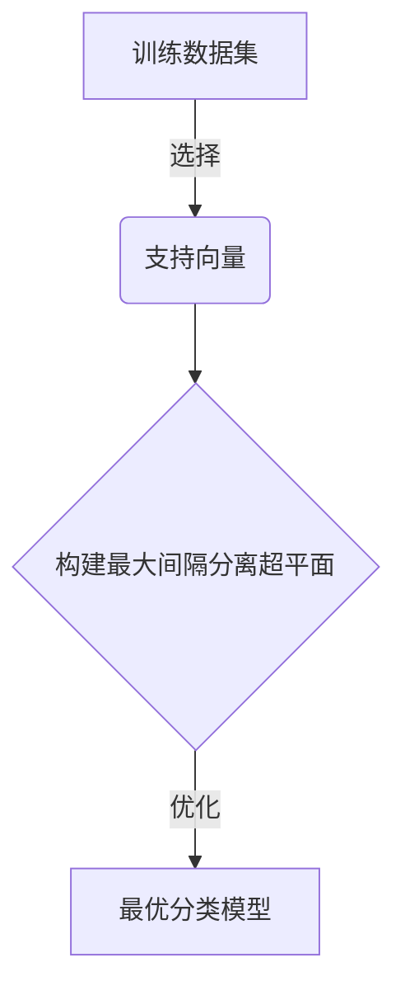
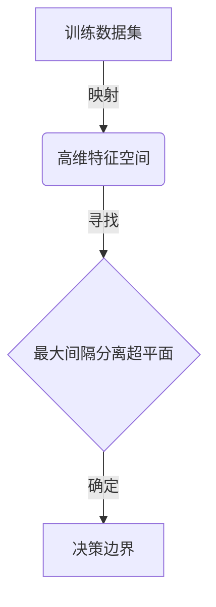
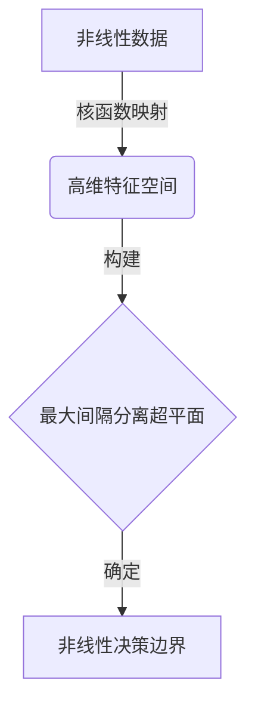
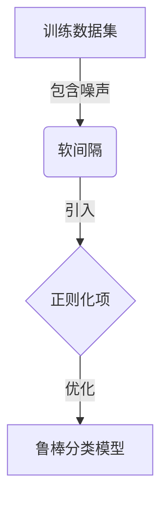

# Support Vector Machines 原理与代码实战案例讲解

## 1.背景介绍

在机器学习和数据挖掘领域中,支持向量机(Support Vector Machines,SVM)是一种有监督学习模型,用于解决分类和回归问题。它是一种基于统计学习理论的机器学习算法,由Vladimir Vapnik和Alexey Chervonenkis在20世纪90年代初期提出。

SVM的主要思想是在高维空间中构造一个超平面,将不同类别的数据样本分开,使得每一类样本到超平面的距离都尽可能大。这个超平面就是我们所要求的决策边界。SVM的优势在于它可以很好地处理高维数据,并且具有良好的泛化能力。

### 1.1 SVM发展历程

- 1963年:在模式识别领域,最小体积分离超平面的概念首次被提出。
- 1965年:Vapnik提出了最小体积分离超平面的概念,并将其应用于模式识别。
- 1992年:Boser等人提出了非线性SVM,引入了核函数的概念。
- 1995年:Cortes和Vapnik发表了统计学习理论的论文,为SVM提供了坚实的理论基础。
- 1997年:SVM被广泛应用于文本分类、手写数字识别、图像分类等领域。

### 1.2 SVM与其他算法的比较

相比于其他经典的机器学习算法,SVM具有以下优势:

- 泛化能力强:SVM可以在高维空间中找到最优分离超平面,使得分类精度较高。
- 避免过拟合:SVM通过引入正则化参数,可以有效控制模型的复杂度,避免过拟合问题。
- 可解释性好:SVM的决策边界由支持向量确定,具有一定的可解释性。
- 适用于非线性问题:通过核函数技巧,SVM可以有效处理非线性问题。

## 2.核心概念与联系

### 2.1 支持向量(Support Vectors)

支持向量是指那些最接近分离超平面的几个训练样本点。这些点决定了分离超平面的位置和方向,因此被称为支持向量。SVM的目标就是最大化支持向量到分离超平面的距离,从而获得最优的分类边界。



### 2.2 最大间隔分离超平面(Maximum Margin Hyperplane)

SVM的核心思想是在高维特征空间中寻找一个最优分离超平面,使得不同类别的样本点到超平面的距离最大化。这个最大间隔超平面就是我们所需要的决策边界。

间隔是指样本点到分离超平面的距离。SVM的目标是最大化间隔,从而提高分类的鲁棒性和泛化能力。



### 2.3 核函数(Kernel Function)

对于非线性可分的数据,我们可以通过核函数技巧将数据映射到更高维的特征空间,使得数据在高维空间中变得线性可分。常用的核函数包括线性核、多项式核、高斯核等。

核函数的作用是计算两个向量在高维特征空间中的内积,而无需显式计算映射函数。这种"核技巧"大大简化了计算过程,使得SVM可以高效地处理非线性问题。



### 2.4 软间隔与正则化

在现实数据中,往往存在一些噪声点或异常值,导致数据不完全线性可分。为了解决这个问题,SVM引入了软间隔和正则化的概念。

软间隔允许一些样本点位于分离超平面的错误一侧,但需要付出一定的代价。正则化则是通过引入惩罚参数,控制模型的复杂度,避免过拟合。



## 3.核心算法原理具体操作步骤

SVM算法的核心步骤如下:

1. **数据预处理**:对训练数据进行归一化或标准化处理,确保特征在相同的量级。
2. **选择核函数**:根据数据的特征,选择合适的核函数,如线性核、多项式核或高斯核。
3. **构建拉格朗日函数**:将SVM的优化问题转化为拉格朗日函数的极值问题。
4. **求解对偶问题**:通过求解对偶问题,得到支持向量及其对应的系数。
5. **确定分离超平面**:利用支持向量和对应的系数,确定最优分离超平面。
6. **预测新样本**:对于新的测试样本,计算其到分离超平面的距离,根据距离的正负号进行分类。

以下是SVM算法的伪代码:

```python
# 输入:训练数据集D,核函数K,正则化参数C
# 输出:分类模型f

# 1.数据预处理
D = 归一化或标准化(D)

# 2.选择核函数
K = 线性核或多项式核或高斯核

# 3.构建拉格朗日函数
L = 构建拉格朗日函数(D, K, C)

# 4.求解对偶问题
alpha = 求解对偶问题(L)
支持向量 = 选择支持向量(D, alpha)

# 5.确定分离超平面
w = 计算权重向量(支持向量, alpha)
b = 计算偏置项(支持向量, alpha)

# 6.构建分类模型
f = 构建分类器(w, b, K)

return f
```

## 4.数学模型和公式详细讲解举例说明

### 4.1 线性可分SVM

对于线性可分的数据,SVM的目标是找到一个最优分离超平面,使得不同类别的样本点到超平面的距离最大化。

设训练数据集为 $D = \{(\mathbf{x}_i, y_i)\}_{i=1}^N$,其中 $\mathbf{x}_i \in \mathbb{R}^d$ 是 $d$ 维特征向量, $y_i \in \{-1, 1\}$ 是类别标记。

分离超平面可以表示为:

$$
\mathbf{w}^T \mathbf{x} + b = 0
$$

其中 $\mathbf{w}$ 是权重向量, $b$ 是偏置项。

对于任意一个样本点 $(\mathbf{x}_i, y_i)$,我们要求:

$$
y_i(\mathbf{w}^T \mathbf{x}_i + b) \geq 1
$$

这就是函数间隔(functional margin)的概念,它表示样本点到分离超平面的距离。

SVM的目标是最大化函数间隔,即求解以下优化问题:

$$
\begin{align}
\min_{\mathbf{w}, b} &\quad \frac{1}{2} \|\mathbf{w}\|^2 \\
\text{s.t.} &\quad y_i(\mathbf{w}^T \mathbf{x}_i + b) \geq 1, \quad i = 1, 2, \dots, N
\end{align}
$$

这个优化问题可以通过构建拉格朗日函数并求解对偶问题来解决。

### 4.2 非线性SVM

对于非线性可分的数据,我们可以引入核函数 $K(\mathbf{x}_i, \mathbf{x}_j)$ 将数据映射到高维特征空间,使得数据在高维空间中变得线性可分。

在高维特征空间中,分离超平面可以表示为:

$$
\sum_{i=1}^N \alpha_i y_i K(\mathbf{x}_i, \mathbf{x}) + b = 0
$$

其中 $\alpha_i$ 是拉格朗日乘子,满足 $\sum_{i=1}^N \alpha_i y_i = 0$。

常用的核函数包括:

- 线性核: $K(\mathbf{x}_i, \mathbf{x}_j) = \mathbf{x}_i^T \mathbf{x}_j$
- 多项式核: $K(\mathbf{x}_i, \mathbf{x}_j) = (\gamma \mathbf{x}_i^T \mathbf{x}_j + r)^d$
- 高斯核: $K(\mathbf{x}_i, \mathbf{x}_j) = \exp(-\gamma \|\mathbf{x}_i - \mathbf{x}_j\|^2)$

通过核函数技巧,我们可以在高维特征空间中构建最优分离超平面,而无需显式计算映射函数。

### 4.3 软间隔与正则化

在现实数据中,往往存在一些噪声点或异常值,导致数据不完全线性可分。为了解决这个问题,SVM引入了软间隔和正则化的概念。

软间隔允许一些样本点位于分离超平面的错误一侧,但需要付出一定的代价。我们引入松弛变量 $\xi_i \geq 0$,使得约束条件变为:

$$
y_i(\mathbf{w}^T \mathbf{x}_i + b) \geq 1 - \xi_i, \quad i = 1, 2, \dots, N
$$

同时,我们在目标函数中加入正则化项 $C \sum_{i=1}^N \xi_i$,其中 $C$ 是正则化参数,用于控制模型的复杂度。

因此,软间隔SVM的优化问题变为:

$$
\begin{align}
\min_{\mathbf{w}, b, \boldsymbol{\xi}} &\quad \frac{1}{2} \|\mathbf{w}\|^2 + C \sum_{i=1}^N \xi_i \\
\text{s.t.} &\quad y_i(\mathbf{w}^T \mathbf{x}_i + b) \geq 1 - \xi_i, \quad i = 1, 2, \dots, N \\
&\quad \xi_i \geq 0, \quad i = 1, 2, \dots, N
\end{align}
$$

通过引入软间隔和正则化,SVM可以在一定程度上容忍噪声和异常值,从而获得更加鲁棒的分类模型。

### 4.4 示例:线性SVM分类

假设我们有一个二维数据集,其中正例和反例如下所示:

```python
import numpy as np
import matplotlib.pyplot as plt

# 生成训练数据
X_pos = np.array([[1, 3], [2, 4], [3, 2], [4, 1]])
X_neg = np.array([[5, 2], [6, 1], [7, 3], [8, 4]])
y_pos = np.ones(4)
y_neg = -np.ones(4)
X = np.concatenate((X_pos, X_neg), axis=0)
y = np.concatenate((y_pos, y_neg))

# 绘制数据点
plt.figure(figsize=(8, 6))
plt.scatter(X_pos[:, 0], X_pos[:, 1], color='r', marker='+', label='Positive')
plt.scatter(X_neg[:, 0], X_neg[:, 1], color='b', marker='o', label='Negative')
plt.legend()
plt.show()
```

我们可以使用scikit-learn库中的SVM模型进行训练和预测:

```python
from sklearn.svm import SVC

# 训练线性SVM模型
svm = SVC(kernel='linear', C=1.0)
svm.fit(X, y)

# 绘制决策边界
x_min, x_max = X[:, 0].min() - 1, X[:, 0].max() + 1
y_min, y_max = X[:, 1].min() - 1, X[:, 1].max() + 1
xx, yy = np.meshgrid(np.arange(x_min, x_max, 0.1),
                     np.arange(y_min, y_max, 0.1))
Z = svm.predict(np.c_[xx.ravel(), yy.ravel()])
Z = Z.reshape(xx.shape)
plt.contourf(xx, yy, Z, cmap=plt.cm.Paired, alpha=0.3)

# 绘制支持向量
support_vectors = X[svm.support_]
plt.scatter(support_vectors[:, 0], support_vectors[:, 1], color='k', marker='x', s=50, label='Support Vectors')

plt.legend()
plt.show()
```

在这个示例中,我们