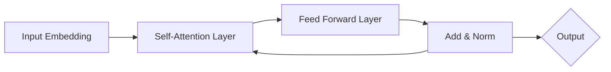

# Transformer大模型实战 BERT 的工作原理

## 1.背景介绍
### 1.1 大模型的发展历程
#### 1.1.1 早期的神经网络模型
#### 1.1.2 Word2Vec 和 GloVe 词向量模型 
#### 1.1.3 RNN 和 LSTM 模型的出现

### 1.2 Transformer 模型的诞生
#### 1.2.1 Attention 机制的提出
#### 1.2.2 Transformer 模型的创新之处
#### 1.2.3 Transformer 在 NLP 领域取得的成就

### 1.3 BERT 模型简介
#### 1.3.1 BERT 的全称与定位
#### 1.3.2 BERT 的预训练与微调
#### 1.3.3 BERT 在下游任务上的优异表现

## 2.核心概念与联系
### 2.1 Transformer 的核心组件
#### 2.1.1 Self-Attention 机制
#### 2.1.2 Multi-Head Attention
#### 2.1.3 Feed Forward 网络

### 2.2 BERT 的关键创新点
#### 2.2.1 Masked Language Model (MLM) 
#### 2.2.2 Next Sentence Prediction (NSP)
#### 2.2.3 WordPiece Embedding

### 2.3 Transformer 与 BERT 的关系
#### 2.3.1 BERT 是基于 Transformer 的预训练模型
#### 2.3.2 BERT 在 Transformer 基础上的改进
#### 2.3.3 BERT 开启了预训练语言模型的新时代

## 3.核心算法原理具体操作步骤
### 3.1 Transformer 的编码器结构
#### 3.1.1 输入编码
#### 3.1.2 Self-Attention 计算过程
#### 3.1.3 残差连接与 Layer Normalization

### 3.2 BERT 的预训练过程
#### 3.2.1 构建预训练数据集
#### 3.2.2 Masked Language Model 的实现
#### 3.2.3 Next Sentence Prediction 的实现

### 3.3 BERT 的微调过程
#### 3.3.1 针对下游任务修改模型结构
#### 3.3.2 加载预训练参数
#### 3.3.3 Fine-tuning 的训练过程

## 4.数学模型和公式详细讲解举例说明
### 4.1 Self-Attention 的数学表示
#### 4.1.1 Query, Key, Value 的计算
#### 4.1.2 Scaled Dot-Product Attention
#### 4.1.3 Multi-Head Attention 的拼接与线性变换

### 4.2 Transformer 的损失函数
#### 4.2.1 Masked Language Model 的损失函数
#### 4.2.2 Next Sentence Prediction 的损失函数
#### 4.2.3 两个任务的联合训练

### 4.3 BERT 微调中的数学细节
#### 4.3.1 微调时的损失函数设计
#### 4.3.2 微调时的优化算法选择
#### 4.3.3 微调时的学习率调度策略

## 5.项目实践：代码实例和详细解释说明
### 5.1 使用 PyTorch 实现 BERT 模型
#### 5.1.1 定义 BERT 模型结构
#### 5.1.2 加载预训练参数
#### 5.1.3 实现 MLM 和 NSP 的训练代码

### 5.2 使用 BERT 进行下游任务微调
#### 5.2.1 文本分类任务
#### 5.2.2 命名实体识别任务
#### 5.2.3 问答任务

### 5.3 实践中的调优技巧
#### 5.3.1 调整 Batch Size 和 Learning Rate
#### 5.3.2 使用梯度裁剪避免梯度爆炸
#### 5.3.3 设置合适的 Warmup 步数

## 6.实际应用场景
### 6.1 BERT 在搜索引擎中的应用
#### 6.1.1 Query-Document 相关性计算
#### 6.1.2 Query 理解与扩展
#### 6.1.3 搜索结果重排序

### 6.2 BERT 在对话系统中的应用
#### 6.2.1 意图识别与槽位填充
#### 6.2.2 对话状态追踪
#### 6.2.3 对话生成

### 6.3 BERT 在知识图谱中的应用
#### 6.3.1 实体链接
#### 6.3.2 关系抽取
#### 6.3.3 知识推理

## 7.工具和资源推荐
### 7.1 BERT 的开源实现
#### 7.1.1 Google 官方的 BERT 实现
#### 7.1.2 HuggingFace 的 Transformers 库
#### 7.1.3 微软的 NNI 工具包

### 7.2 BERT 的预训练模型
#### 7.2.1 BERT-Base 与 BERT-Large
#### 7.2.2 多语言版 BERT
#### 7.2.3 RoBERTa 与 ALBERT

### 7.3 相关论文与学习资源
#### 7.3.1 BERT 原论文解读
#### 7.3.2 Transformer 模型的视频教程
#### 7.3.3 NLP 领域顶会论文合集

## 8.总结：未来发展趋势与挑战
### 8.1 BERT 的局限性
#### 8.1.1 计算资源消耗大
#### 8.1.2 模型体积庞大
#### 8.1.3 对长文本建模能力有限

### 8.2 后 BERT 时代的发展方向
#### 8.2.1 模型压缩与蒸馏
#### 8.2.2 更大规模的预训练模型
#### 8.2.3 基于 BERT 的领域自适应

### 8.3 未来的研究挑战
#### 8.3.1 如何进一步提升模型性能
#### 8.3.2 如何降低预训练成本
#### 8.3.3 如何实现更高效的推理

## 9.附录：常见问题与解答
### 9.1 BERT 与 GPT 系列模型的区别
### 9.2 BERT 在实际部署中的注意事项
### 9.3 如何选择合适的 BERT 预训练模型
### 9.4 BERT 微调过程中的最佳实践
### 9.5 BERT 的可解释性研究进展

以上是 BERT 模型的核心架构 Transformer 的简化示意图。Transformer 通过堆叠多个 Self-Attention 层和 Feed Forward 层，实现了对输入序列的深度建模。其中 Self-Attention 机制能够捕捉序列中任意两个位置之间的依赖关系，而 Feed Forward 层则负责对特征进行非线性变换。通过残差连接和 Layer Normalization，使得模型训练更加稳定高效。

BERT 作为预训练语言模型，其预训练目标包括 Masked Language Model 和 Next Sentence Prediction 两个任务。前者通过随机 Mask 掉部分词元，预测被遮挡位置的真实词元，帮助模型学习到更加鲁棒的上下文表示。后者则判断两个句子在原文中是否相邻，使得模型能够建模句子间的逻辑关系。

在实际应用中，我们可以利用预训练好的 BERT 模型，通过简单的微调，就能在下游 NLP 任务上取得优异的表现。以文本分类任务为例，只需在 BERT 模型顶层添加一个全连接分类器，并使用任务相关的标注数据进行微调训练，即可得到一个性能卓越的文本分类模型。

BERT 的成功极大地推动了 NLP 领域的发展，催生了一系列基于 Transformer 的大规模预训练模型，如 RoBERTa、XLNet、ALBERT 等。这些模型在 BERT 的基础上进行了改进和创新，进一步提升了模型性能和效率。

展望未来，如何设计更加强大、高效的预训练模型，仍然是 NLP 领域的重要研究方向。同时，如何降低预训练成本，实现更轻量化的模型推理，也是工业界亟待解决的问题。随着 AI 芯片和分布式训练技术的发展，相信 BERT 等大模型必将在更广泛的应用场景中发挥重要作用，为人工智能的进步贡献力量。

作者：禅与计算机程序设计艺术 / Zen and the Art of Computer Programming