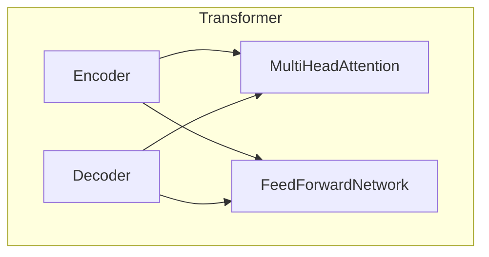
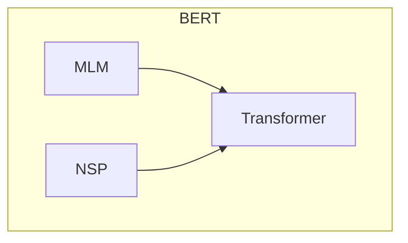

# Transformer大模型实战 从预训练的BERT模型中提取嵌入

## 1.背景介绍

在自然语言处理(NLP)领域,Transformer模型已经成为主流架构,尤其是在预训练语言模型(PLM)中的应用。BERT(Bidirectional Encoder Representations from Transformers)作为一种新型的预训练语言表示模型,在2018年被提出后,迅速成为NLP领域最受关注的技术之一。

BERT通过在大规模语料库上进行预训练,学习到了丰富的语义和上下文信息,可以有效地捕捉词与词之间的关系。预训练后的BERT模型可以直接用于下游NLP任务,如文本分类、阅读理解、语义相似度等,或者通过对预训练模型进行微调(fine-tuning),使其适应特定的任务。

除了直接将BERT用于下游任务外,我们还可以从预训练的BERT模型中提取出词嵌入(word embeddings)和句子嵌入(sentence embeddings),并将其应用于其他NLP任务中。这种方法的优势在于,我们可以充分利用BERT在大规模语料库上学习到的语义和上下文信息,而无需从头开始训练新的模型。

### 1.1 词嵌入与句子嵌入

- **词嵌入(Word Embeddings)**:词嵌入是将单词映射到一个连续的向量空间中,每个单词都被表示为一个固定长度的密集向量。这些向量能够捕捉单词之间的语义和语法关系,使得具有相似语义的单词在向量空间中彼此靠近。

- **句子嵌入(Sentence Embeddings)**:句子嵌入是将整个句子或段落映射到一个固定长度的向量表示。这种表示可以捕捉句子或段落的整体语义,并且可以用于各种NLP任务,如文本分类、语义相似度计算等。

从预训练的BERT模型中提取词嵌入和句子嵌入,可以充分利用BERT在大规模语料库上学习到的语义和上下文信息,从而获得高质量的向量表示。这种方法不仅可以节省训练时间和计算资源,而且还可以提高下游任务的性能。

## 2.核心概念与联系

### 2.1 Transformer模型

Transformer是一种基于注意力机制(Attention Mechanism)的序列到序列(Seq2Seq)模型,由Google的Vaswani等人在2017年提出。它不同于传统的基于RNN或CNN的模型,完全摒弃了循环和卷积结构,而是依赖于注意力机制来捕捉输入序列中任意两个位置之间的依赖关系。

Transformer的核心组件包括编码器(Encoder)和解码器(Decoder),两者都由多个相同的层组成。每一层都包含一个多头注意力子层(Multi-Head Attention Sublayer)和一个前馈神经网络子层(Feed-Forward Neural Network Sublayer)。

编码器的作用是将输入序列映射到一个连续的表示空间中,而解码器则负责根据编码器的输出生成目标序列。在机器翻译等序列生成任务中,编码器处理源语言序列,解码器生成目标语言序列。而在BERT等预训练语言模型中,只使用了Transformer的编码器部分。

### 2.2 BERT模型

BERT(Bidirectional Encoder Representations from Transformers)是一种基于Transformer编码器的预训练语言模型,由Google AI团队在2018年提出。它的主要创新点在于采用了双向编码器,即在训练时允许模型同时关注输入序列中每个位置的前后上下文信息。

BERT的预训练过程包括两个任务:

1. **Masked Language Modeling(MLM)**: 通过随机掩码输入序列中的部分词,并要求模型预测被掩码的词。这种方式可以让模型学习到双向的语义和上下文信息。

2. **Next Sentence Prediction(NSP)**: 判断两个句子是否相邻,从而让模型学习到句子之间的关系和表示。

通过在大规模语料库上进行预训练,BERT可以学习到丰富的语义和上下文信息,从而在下游NLP任务中表现出色。预训练后的BERT模型可以直接用于下游任务,或者通过微调(fine-tuning)来适应特定的任务。

### 2.3 从BERT中提取嵌入

虽然BERT主要被用于下游NLP任务,但我们也可以从预训练的BERT模型中提取出词嵌入和句子嵌入,并将其应用于其他任务中。

- **词嵌入(Word Embeddings)**: BERT中的每个词都被表示为一个向量,我们可以直接从BERT的输出中提取这些向量作为词嵌入。这些词嵌入包含了丰富的语义和上下文信息,可以用于各种NLP任务,如词义消歧、命名实体识别等。

- **句子嵌入(Sentence Embeddings)**: 我们可以将整个句子或段落输入到BERT中,并从最后一层编码器的输出中提取一个固定长度的向量作为句子嵌入。这种句子嵌入可以捕捉句子或段落的整体语义,可以用于文本分类、语义相似度计算等任务。

提取嵌入的过程通常包括以下步骤:

1. 将输入文本(单词或句子)转换为BERT所需的输入格式。
2. 将输入传递给BERT模型,并获取相应层的输出。
3. 根据需要提取词嵌入或句子嵌入。

通过从预训练的BERT模型中提取嵌入,我们可以充分利用BERT在大规模语料库上学习到的语义和上下文信息,从而获得高质量的向量表示,并将其应用于各种NLP任务中。

## 3.核心算法原理具体操作步骤

### 3.1 BERT模型结构

BERT模型的核心是Transformer编码器,它由多个相同的编码器层组成。每个编码器层包含两个主要子层:多头注意力子层(Multi-Head Attention Sublayer)和前馈神经网络子层(Feed-Forward Neural Network Sublayer)。

1. **多头注意力子层**:
   - 该子层的作用是捕捉输入序列中任意两个位置之间的依赖关系。
   - 它由多个注意力头(Attention Head)组成,每个注意力头都会学习不同的注意力模式。
   - 每个注意力头会计算输入序列中每个位置与所有其他位置之间的注意力权重,然后根据这些权重对输入进行加权求和,得到该位置的注意力表示。
   - 最后,将所有注意力头的输出拼接起来,经过一个线性变换,得到该子层的输出。

2. **前馈神经网络子层**:
   - 该子层包含两个全连接层,用于对每个位置的表示进行非线性变换。
   - 第一个全连接层会将输入映射到一个更高维的空间,然后经过ReLU激活函数。
   - 第二个全连接层会将高维空间映射回原始维度。
   - 这种结构可以为每个位置的表示引入非线性变换,从而增强模型的表示能力。

除了上述两个子层外,每个编码器层还包含残差连接(Residual Connection)和层归一化(Layer Normalization),以帮助模型训练和提高性能。

BERT模型的输入是一个序列,包括词嵌入(Word Embeddings)、位置嵌入(Position Embeddings)和段嵌入(Segment Embeddings)。这些嵌入被求和后作为初始表示,传递给Transformer编码器的底层。经过多个编码器层的处理,BERT模型可以学习到输入序列中每个位置的上下文表示。

### 3.2 从BERT中提取词嵌入

要从BERT中提取词嵌入,我们需要将输入文本转换为BERT所需的输入格式,然后获取相应层的输出。具体步骤如下:

1. **输入预处理**:
   - 将输入文本分词,得到一个词的列表。
   - 在分词列表的开头添加特殊token `[CLS]`,在结尾添加特殊token `[SEP]`。
   - 将每个词映射到BERT词表中的对应索引。
   - 创建段嵌入(Segment Embeddings),用于区分不同的句子。
   - 创建位置嵌入(Position Embeddings),表示每个词在序列中的位置。

2. **输入BERT模型**:
   - 将预处理后的输入(词嵌入、位置嵌入和段嵌入)传递给BERT模型。
   - 获取BERT模型最后一层编码器的输出。

3. **提取词嵌入**:
   - 从最后一层编码器的输出中,提取除去`[CLS]`和`[SEP]`token对应的向量。
   - 这些向量就是我们需要的词嵌入,每个向量对应输入序列中的一个词。

通过上述步骤,我们可以从预训练的BERT模型中提取出每个词的向量表示,即词嵌入。这些词嵌入包含了BERT在大规模语料库上学习到的丰富语义和上下文信息,可以用于各种NLP任务,如词义消歧、命名实体识别等。

### 3.3 从BERT中提取句子嵌入

要从BERT中提取句子嵌入,我们需要将整个句子或段落作为输入,然后从BERT的输出中提取一个固定长度的向量。具体步骤如下:

1. **输入预处理**:
   - 将输入句子分词,得到一个词的列表。
   - 在分词列表的开头添加特殊token `[CLS]`,在结尾添加特殊token `[SEP]`。
   - 将每个词映射到BERT词表中的对应索引。
   - 创建段嵌入(Segment Embeddings),用于区分不同的句子(如果输入只有一个句子,则全部设为0)。
   - 创建位置嵌入(Position Embeddings),表示每个词在序列中的位置。

2. **输入BERT模型**:
   - 将预处理后的输入(词嵌入、位置嵌入和段嵌入)传递给BERT模型。
   - 获取BERT模型最后一层编码器的输出。

3. **提取句子嵌入**:
   - 从最后一层编码器的输出中,提取`[CLS]`token对应的向量。
   - 这个向量就是我们需要的句子嵌入,它包含了整个句子或段落的语义表示。

通过上述步骤,我们可以从预训练的BERT模型中提取出一个固定长度的向量,作为整个句子或段落的语义表示,即句子嵌入。这种句子嵌入可以捕捉句子或段落的整体语义,可以用于文本分类、语义相似度计算等任务。

需要注意的是,在提取句子嵌入时,我们只使用了`[CLS]`token对应的向量。这是因为在BERT的预训练任务中,`[CLS]`token被用于表示整个输入序列的语义,因此它的输出向量可以作为句子或段落的语义表示。

## 4.数学模型和公式详细讲解举例说明

### 4.1 注意力机制(Attention Mechanism)

注意力机制是Transformer模型的核心,它允许模型在计算每个位置的表示时,关注输入序列中的任意其他位置。这种机制可以有效地捕捉长距离依赖关系,克服了RNN等序列模型在处理长序列时的困难。

在注意力机制中,我们需要计算查询向量(Query)与键向量(Key)之间的相似性分数,然后根据这些分数对值向量(Value)进行加权求和,得到注意力输出。具体计算过程如下:

$$
\begin{aligned}
\text{Attention}(Q, K, V) &= \text{softmax}\left(\frac{QK^T}{\sqrt{d_k}}\right)V \\
                          &= \sum_{i=1}^n \alpha_i v_i
\end{aligned}
$$

其中:

- $Q \in \mathbb{R}^{n \times d_q}$ 是查询向量矩阵,每行对应一个查询向量。
- $K \in \mathbb{R}^{n \times d_k}$ 是键向量矩阵,每行对应一个键向量。
- $V \in \math