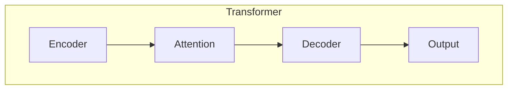
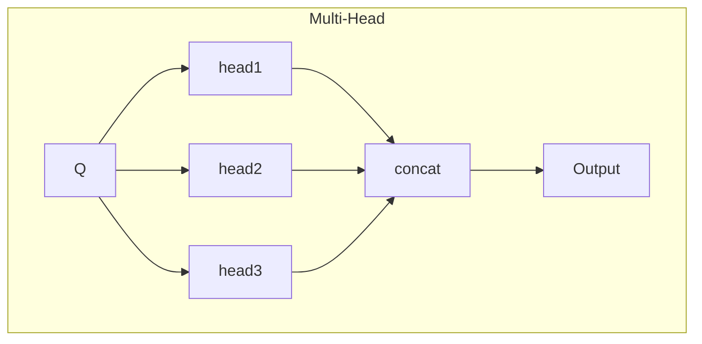

# Transformer大模型实战 跨文本书写的通用性

## 1.背景介绍

自然语言处理(NLP)是人工智能领域的一个重要分支,旨在使计算机能够理解和生成人类语言。近年来,Transformer模型凭借其出色的性能,成为NLP领域的主流模型架构。Transformer是一种基于注意力机制的序列到序列(Seq2Seq)模型,最初被设计用于机器翻译任务。然而,由于其强大的建模能力,Transformer很快被应用于各种NLP任务,包括文本生成、问答系统、文本摘要等。

其中,Transformer在文本生成任务上表现尤为出色。文本生成是指根据给定的上下文或提示,自动生成连贯、流畅的文本内容。这对于诸如新闻报道、小说写作、对话系统等应用场景都有着广泛的需求。传统的文本生成方法通常依赖于统计模型或基于规则的方法,难以生成高质量的长文本。而Transformer则能够基于大量文本数据进行有效学习,捕捉语言的深层次模式,从而生成更加自然流畅的文本。

## 2.核心概念与联系

### 2.1 Transformer架构

Transformer的核心架构包括编码器(Encoder)和解码器(Decoder)两个部分。编码器负责处理输入序列,将其映射为高维向量表示;解码器则根据编码器的输出,生成相应的目标序列。两者之间通过注意力机制(Attention Mechanism)建立联系,使模型能够关注输入序列中与当前生成token相关的部分。



### 2.2 自注意力机制

注意力机制是Transformer的核心创新点,它允许模型在编码和解码过程中,动态地关注输入序列的不同部分。具体来说,自注意力机制通过计算查询(Query)、键(Key)和值(Value)之间的相似性,为每个单词分配不同的注意力权重,从而捕捉序列中的长程依赖关系。

$$\mathrm{Attention}(Q, K, V) = \mathrm{softmax}(\frac{QK^T}{\sqrt{d_k}})V$$

其中,Q代表查询向量,K代表键向量,V代表值向量,$d_k$是缩放因子。

### 2.3 多头注意力机制

为了进一步提高模型的表现力,Transformer采用了多头注意力机制(Multi-Head Attention)。该机制将注意力分成多个子空间,每个子空间单独计算注意力,然后将所有子空间的结果进行拼接,捕捉不同的语义关系。



## 3.核心算法原理具体操作步骤

Transformer的核心算法可以分为以下几个步骤:

1. **输入嵌入(Input Embedding)**: 将输入序列的每个token映射为一个连续的向量表示。

2. **位置编码(Positional Encoding)**: 由于Transformer没有使用循环神经网络(RNN)或卷积神经网络(CNN),因此需要显式地编码序列中每个token的位置信息。常用的方法是将位置编码与输入嵌入相加。

3. **编码器(Encoder)**: 编码器由多个相同的层组成,每层包含两个子层:多头自注意力机制和前馈神经网络。自注意力机制捕捉输入序列中token之间的依赖关系,前馈神经网络对每个token的表示进行非线性转换。

4. **解码器(Decoder)**: 解码器的结构与编码器类似,但增加了一个额外的注意力子层,用于关注编码器的输出。该注意力机制被称为编码器-解码器注意力(Encoder-Decoder Attention)。

5. **生成(Generation)**: 在训练阶段,模型根据目标序列进行监督学习;在推理阶段,则通过贪婪搜索或beam search等策略,自回归地生成序列。

整个过程可以用以下伪代码表示:

```python
# 编码器
def encoder(x):
    x = embedding(x) + positional_encoding(x)
    for layer in encoder_layers:
        x = layer(x)
    return x

# 解码器
def decoder(x, encoder_output):
    x = embedding(x) + positional_encoding(x)
    for layer in decoder_layers:
        x = layer(x, encoder_output)
    return x

# 训练
for input_seq, output_seq in data:
    encoder_output = encoder(input_seq)
    decoder_output = decoder(output_seq, encoder_output)
    loss = compute_loss(decoder_output, output_seq)
    update_parameters(loss)

# 推理
for input_seq in data:
    encoder_output = encoder(input_seq)
    output_seq = []
    x = sos_token  # 起始标记
    while not eos_token:  # 终止标记
        decoder_output = decoder(x, encoder_output)
        x = sample_or_max(decoder_output)
        output_seq.append(x)
```

## 4.数学模型和公式详细讲解举例说明

在Transformer中,注意力机制扮演着关键角色。我们将详细介绍其数学原理和计算过程。

### 4.1 缩放点积注意力

Transformer使用了缩放点积注意力(Scaled Dot-Product Attention),它的计算公式如下:

$$\mathrm{Attention}(Q, K, V) = \mathrm{softmax}(\frac{QK^T}{\sqrt{d_k}})V$$

其中,$Q$是查询向量(Query),$K$是键向量(Key),$V$是值向量(Value),$d_k$是键向量的维度,用于缩放点积的结果。

我们以一个简单的例子来解释这个公式:

假设我们有一个输入序列"The dog chased the cat",我们希望生成"It"这个代词来指代"dog"。在这种情况下,$Q$代表当前需要生成的"It",$K$和$V$分别对应输入序列中每个单词的键向量和值向量。

1. 首先,我们计算$Q$与每个$K$之间的点积,得到一个未缩放的分数向量$e$:

   $$e = QK^T = \begin{bmatrix} q_1 \\ q_2 \\ \vdots \\ q_n \end{bmatrix}^T \begin{bmatrix} k_1 & k_2 & \cdots & k_m \end{bmatrix} = \begin{bmatrix} q_1k_1 & q_1k_2 & \cdots & q_1k_m \\ q_2k_1 & q_2k_2 & \cdots & q_2k_m \\ \vdots & \vdots & \ddots & \vdots \\ q_nk_1 & q_nk_2 & \cdots & q_nk_m \end{bmatrix}$$

   其中,$n$是$Q$的维度,$m$是$K$的维度。

2. 然后,我们对$e$进行缩放,除以$\sqrt{d_k}$,以避免点积的值过大或过小:

   $$\frac{e}{\sqrt{d_k}} = \begin{bmatrix} \frac{q_1k_1}{\sqrt{d_k}} & \frac{q_1k_2}{\sqrt{d_k}} & \cdots & \frac{q_1k_m}{\sqrt{d_k}} \\ \frac{q_2k_1}{\sqrt{d_k}} & \frac{q_2k_2}{\sqrt{d_k}} & \cdots & \frac{q_2k_m}{\sqrt{d_k}} \\ \vdots & \vdots & \ddots & \vdots \\ \frac{q_nk_1}{\sqrt{d_k}} & \frac{q_nk_2}{\sqrt{d_k}} & \cdots & \frac{q_nk_m}{\sqrt{d_k}} \end{bmatrix}$$

3. 接下来,我们对缩放后的分数向量应用softmax函数,得到注意力权重向量$\alpha$:

   $$\alpha = \mathrm{softmax}(\frac{e}{\sqrt{d_k}}) = \begin{bmatrix} \alpha_1 \\ \alpha_2 \\ \vdots \\ \alpha_m \end{bmatrix}, \quad \sum_{i=1}^m \alpha_i = 1$$

   其中,$\alpha_i$代表$Q$对输入序列中第$i$个单词的注意力权重。

4. 最后,我们将注意力权重$\alpha$与值向量$V$相乘,得到注意力输出向量$z$:

   $$z = \alpha V = \begin{bmatrix} \alpha_1 \\ \alpha_2 \\ \vdots \\ \alpha_m \end{bmatrix} \begin{bmatrix} v_1 \\ v_2 \\ \vdots \\ v_m \end{bmatrix} = \sum_{i=1}^m \alpha_i v_i$$

   $z$是一个加权和,它综合了输入序列中所有单词的值向量,权重由注意力权重$\alpha$决定。在我们的例子中,$z$应该主要关注"dog"这个单词,从而能够正确生成代词"It"。

通过这种方式,注意力机制能够动态地捕捉输入序列中与当前生成token相关的部分,从而提高了模型的性能。

### 4.2 多头注意力

为了进一步提高模型的表现力,Transformer采用了多头注意力机制。多头注意力将注意力分成多个子空间,每个子空间单独计算注意力,然后将所有子空间的结果进行拼接。具体来说,如果我们有$h$个注意力头,查询向量$Q$、键向量$K$和值向量$V$将被线性投影为$h$组向量:

$$\begin{aligned}
Q_i &= QW_i^Q, \quad i = 1, 2, \ldots, h \\
K_i &= KW_i^K, \quad i = 1, 2, \ldots, h \\
V_i &= VW_i^V, \quad i = 1, 2, \ldots, h
\end{aligned}$$

其中,$W_i^Q \in \mathbb{R}^{d_\text{model} \times d_k}$,$W_i^K \in \mathbb{R}^{d_\text{model} \times d_k}$和$W_i^V \in \mathbb{R}^{d_\text{model} \times d_v}$是可学习的线性投影矩阵,$d_\text{model}$是模型的隐藏维度,$d_k$和$d_v$分别是键向量和值向量的维度。

然后,对于每个注意力头$i$,我们计算缩放点积注意力:

$$\mathrm{head}_i = \mathrm{Attention}(Q_i, K_i, V_i) = \mathrm{softmax}(\frac{Q_iK_i^T}{\sqrt{d_k}})V_i$$

最后,我们将所有注意力头的输出拼接起来,并进行线性变换,得到多头注意力的最终输出:

$$\mathrm{MultiHead}(Q, K, V) = \mathrm{Concat}(\mathrm{head}_1, \ldots, \mathrm{head}_h)W^O$$

其中,$W^O \in \mathbb{R}^{hd_v \times d_\text{model}}$是另一个可学习的线性变换矩阵。

多头注意力机制允许模型从不同的子空间捕捉不同的语义关系,从而提高了模型的表现力。

## 5.项目实践:代码实例和详细解释说明

为了更好地理解Transformer模型,我们将提供一个基于PyTorch实现的简单示例。这个示例实现了一个基本的Transformer模型,用于英语到法语的机器翻译任务。

### 5.1 数据预处理

首先,我们需要对数据进行预处理,将文本序列转换为模型可以接受的形式。在这个示例中,我们使用了一个小型的英语-法语平行语料库。

```python
import torch
from torchtext.data import Field, BucketIterator
from torchtext.datasets import Multi30k

# 定义字段
SRC = Field(tokenize='spacy', init_token='<sos>', eos_token='<eos>', lower=True)
TRG = Field(tokenize='spacy', init_token='<sos>', eos_token='<eos>', lower=True)

# 加载数据集
train_data, valid_data, test_data = Multi30k.splits(exts=('.en', '.fr'), fields=(SRC, TRG))

# 构建词表
SRC.build_vocab(train_data, min_freq=2)
TRG.build_vocab(train_data, min_freq=2)

# 创建迭代器
train_iter, valid_iter, test_iter = BucketIterator.splits(
    (train_data, valid_data, test_data), 
    batch_size=32,
    device=device
)
```

### 5.2 模型定义

接下来,我们定义Transformer模型的各个组件,包括编码器、解码器、注意力机制