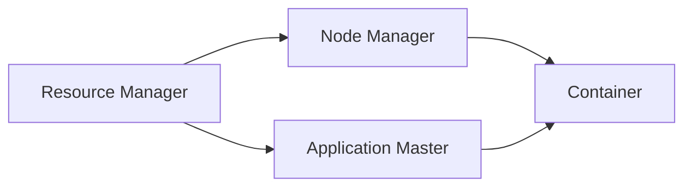

## 1.背景介绍

Yarn，全称Yet Another Resource Negotiator（另一种资源调度器），是Apache Hadoop的子项目，主要负责资源管理和调度。它是Hadoop 2.0中引入的一个重要组件，解决了Hadoop 1.0中MapReduce的一些缺陷，如资源利用率低，扩展性差等问题。通过Yarn，Hadoop能够支持更多种类的处理模型，而不仅仅是MapReduce。在本篇文章中，我们将深入探讨Yarn的工作原理，并通过代码示例展示其实际应用。

## 2.核心概念与联系

在Yarn中，有几个核心的概念：

- **资源管理器（Resource Manager）**：全局的资源管理和调度器，负责整个系统的资源管理和分配。

- **节点管理器（Node Manager）**：运行在所有的机器节点上，负责单个节点的资源和任务管理。

- **应用主管（Application Master）**：每个应用程序对应一个Application Master，它负责应用程序的运行和监控。

- **容器（Container）**：资源的抽象，包括CPU，内存等。任务运行在Container中。

这些组件之间的关系可以通过下面的Mermaid流程图进行描述：



## 3.核心算法原理具体操作步骤

Yarn的工作流程主要分为以下几个步骤：

1. 客户端提交应用程序到资源管理器。
2. 资源管理器为应用程序分配一个容器，并启动应用主管。
3. 应用主管向资源管理器申请运行任务所需的容器。
4. 资源管理器将容器分配给应用主管。
5. 应用主管将任务分配给容器运行。

## 4.数学模型和公式详细讲解举例说明

在Yarn中，资源调度的核心是一个基于优先级的公平调度算法。它的目标是最大化资源的利用率，同时保证公平性。公平性在这里的含义是，如果有两个应用程序，他们需要相同的资源，那么他们应该得到相同的资源。

假设我们有n个应用程序，每个应用程序i需要的资源量为$R_i$，并且他们的优先级为$P_i$。那么，我们可以定义一个公平的资源分配函数$f$如下：

$$f(i) = \frac{R_i}{P_i}$$

这个函数表示，资源的分配应该与应用程序的优先级成反比。也就是说，优先级高的应用程序应该得到更多的资源。

## 5.项目实践：代码实例和详细解释说明

下面是一个简单的Yarn应用程序的代码示例。这个程序使用Yarn API来提交一个MapReduce任务。

```java
public class SimpleYarnApp {
    public static void main(String[] args) throws Exception {
        // 创建一个Yarn客户端
        YarnClient yarnClient = YarnClient.createYarnClient();
        yarnClient.init(new Configuration());
        yarnClient.start();

        // 创建应用程序上下文
        ApplicationSubmissionContext appContext = yarnClient.createApplication().getApplicationSubmissionContext();
        appContext.setApplicationName("simple-yarn-app");

        // 设置应用主管
        ContainerLaunchContext amContainer = Records.newRecord(ContainerLaunchContext.class);
        amContainer.setCommands(Collections.singletonList(
                "$JAVA_HOME/bin/java" +
                " -Xmx256M" +
                " com.example.yarnapp.ApplicationMaster" +
                " 1>" + ApplicationConstants.LOG_DIR_EXPANSION_VAR + "/stdout" +
                " 2>" + ApplicationConstants.LOG_DIR_EXPANSION_VAR + "/stderr"
        ));
        appContext.setAMContainerSpec(amContainer);

        // 提交应用程序
        yarnClient.submitApplication(appContext);
    }
}
```

## 6.实际应用场景

Yarn被广泛应用在大数据处理领域。例如，Apache Hadoop、Apache Flink、Apache Spark等大数据处理框架都使用Yarn作为其资源管理和调度的基础。通过Yarn，这些框架可以在一个大规模的集群中高效地运行和调度任务。

## 7.工具和资源推荐

- Apache Hadoop：Yarn的母项目，是一个用于存储和处理大数据的开源框架。

- Apache Flink：一个用于流处理和批处理的开源框架，支持Yarn。

- Apache Spark：一个用于大数据处理的开源框架，支持Yarn。

## 8.总结：未来发展趋势与挑战

随着大数据和云计算的发展，Yarn的重要性也在不断提高。未来，Yarn将面临如何更好地支持多种处理模型，如流处理，图处理等的挑战。同时，如何提高资源利用率，如何支持更大规模的集群，也是Yarn需要解决的问题。

## 9.附录：常见问题与解答

1. **问题：Yarn和MapReduce有什么区别？**

答：Yarn是一个资源管理和调度的框架，而MapReduce是一种计算模型。在Hadoop 1.0中，MapReduce同时承担了计算和资源管理的任务，这导致了一些问题，如资源利用率低，扩展性差。在Hadoop 2.0中，引入了Yarn，将资源管理和调度的任务从MapReduce中分离出来，使得Hadoop可以支持更多种类的处理模型。

2. **问题：Yarn如何保证公平性？**

答：Yarn通过一个基于优先级的公平调度算法来保证公平性。这个算法的目标是最大化资源的利用率，同时保证公平性。公平性在这里的含义是，如果有两个应用程序，他们需要相同的资源，那么他们应该得到相同的资源。

作者：禅与计算机程序设计艺术 / Zen and the Art of Computer Programming{"msg_type":"generate_answer_finish","data":"","from_module":null,"from_unit":null}