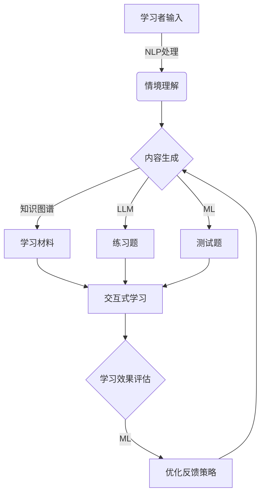
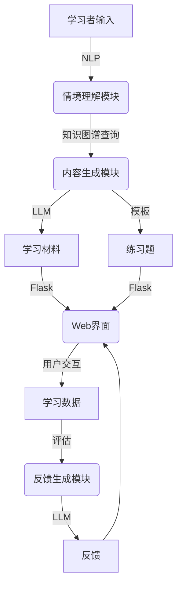

# in-context学习在教育领域中的应用

## 1.背景介绍

### 1.1 教育领域的挑战

在当今快节奏的数字时代,教育领域面临着前所未有的挑战。学生需要掌握大量知识和技能来适应不断变化的就业市场。然而,传统的教学方法往往无法满足学生个性化的学习需求,导致学习效率低下。此外,教师也面临着沉重的工作负担,需要为每个学生量身定制教学内容和方法。

### 1.2 in-context学习的兴起

为了解决这些挑战,in-context学习(In-context Learning)应运而生。in-context学习是一种新兴的人工智能驱动的学习范式,它利用大型语言模型(LLM)根据学习者的具体情境动态生成个性化的学习内容和交互式反馈。与传统的一刀切教学方式不同,in-context学习可以为每个学生提供量身定制的学习体验,提高学习效率和效果。

## 2.核心概念与联系

### 2.1 in-context学习的核心概念

in-context学习的核心概念包括:

1. **情境理解(Context Understanding)**: 准确理解学习者的具体情境,包括其先验知识、学习目标、学习偏好等。
2. **内容生成(Content Generation)**: 根据情境动态生成相关的学习材料、练习、测试等内容。
3. **交互式反馈(Interactive Feedback)**: 实时评估学习者的理解程度,并提供个性化的反馈和指导。

### 2.2 in-context学习与其他学习范式的关系

in-context学习与其他学习范式有着密切的联系:

- **个性化学习(Personalized Learning)**: in-context学习是个性化学习的一种高级形式,可以根据个人情境提供量身定制的学习体验。
- **自适应学习(Adaptive Learning)**: in-context学习利用AI技术动态调整学习内容和难度,实现自适应学习。
- **智能辅导系统(Intelligent Tutoring Systems)**: in-context学习可视为新一代智能辅导系统,提供更加人性化的交互式指导。

### 2.3 in-context学习的关键技术

实现in-context学习需要以下关键技术:

1. **大型语言模型(LLM)**: 用于理解情境、生成内容和提供反馈。
2. **知识图谱(Knowledge Graph)**: 构建结构化的知识库,为内容生成提供支持。
3. **自然语言处理(NLP)**: 分析学习者的输入,理解其意图和需求。
4. **机器学习(ML)**: 评估学习效果,优化内容生成和反馈策略。

## 3.核心算法原理具体操作步骤

### 3.1 in-context学习的总体流程

in-context学习的总体流程如下:



1. 学习者通过文本、语音或其他方式输入学习需求。
2. 系统使用NLP技术理解学习者的具体情境。
3. 根据情境,系统利用知识图谱、LLM和ML技术动态生成相关的学习材料、练习题和测试题。
4. 学习者通过交互式学习环节掌握知识。
5. 系统评估学习效果,并使用ML优化内容生成和反馈策略。

### 3.2 情境理解算法

情境理解是in-context学习的关键环节,需要从学习者的输入中提取出其先验知识、学习目标、学习偏好等信息。常用的算法包括:

1. **知识图谱匹配**: 将学习者输入与知识图谱进行匹配,推断出其先验知识水平。
2. **意图识别**: 使用NLP技术识别学习者的具体学习意图,如"了解xxx概念"、"掌握xxx技能"等。
3. **偏好分析**: 分析学习者的语言习惯、交互方式等,推断出其学习偏好。

### 3.3 内容生成算法

根据情境理解的结果,in-context学习系统需要生成适当的学习内容。常用的算法包括:

1. **LLM生成**: 利用大型语言模型(如GPT-3)根据提示生成相关的学习材料。
2. **知识图谱查询**: 从知识图谱中查询相关概念、公式、示例等,组织成学习材料。
3. **练习生成**: 使用模板或LLM生成与学习材料相关的练习题。
4. **测试生成**: 根据学习目标,从题库或使用LLM生成测试题。

### 3.4 交互式反馈算法

为了提高学习效果,in-context学习需要实时评估学习者的理解程度,并提供个性化的反馈和指导。常用的算法包括:

1. **答案评分**: 对学习者的练习答案进行评分,判断其是否正确。
2. **知识图谱对比**: 将学习者的答案与知识图谱进行对比,发现其知识缺陷。
3. **反馈生成**: 根据评分和知识缺陷,使用LLM生成个性化的反馈和解释。
4. **路径优化**: 根据学习效果,优化后续的学习路径和内容难度。

### 3.5 学习效果评估与优化算法

为了不断提高in-context学习系统的性能,需要评估学习效果并优化算法参数。常用的算法包括:

1. **A/B测试**: 对不同的内容生成和反馈策略进行A/B测试,比较学习效果。
2. **强化学习**: 将学习过程建模为马尔可夫决策过程,使用强化学习优化策略。
3. **在线学习**: 利用新的学习数据不断优化NLP模型、知识图谱和LLM参数。

## 4.数学模型和公式详细讲解举例说明

### 4.1 知识图谱表示

知识图谱是in-context学习系统的重要组成部分,用于存储结构化的知识。常用的知识图谱表示方法是RDF三元组:

$$\langle subject, predicate, object\rangle$$

其中subject和object表示实体,predicate表示它们之间的关系。例如:

- $\langle$Python, is-a-language, Programming Language$\rangle$
- $\langle$for loop, is-a, Control Structure$\rangle$
- $\langle$for loop, used-in, Python$\rangle$

### 4.2 语义相似度计算

为了匹配学习者的输入与知识图谱中的概念,需要计算它们之间的语义相似度。常用的方法是基于词向量的余弦相似度:

$$sim(u,v) = \frac{u \cdot v}{\|u\|\|v\|}$$

其中$u$和$v$分别表示两个词或短语的词向量。

例如,假设"for循环"和"for loop"的词向量分别为$u$和$v$,则它们的相似度为:

$$sim(u,v) = \frac{u \cdot v}{\sqrt{u_1^2+u_2^2+...+u_n^2}\sqrt{v_1^2+v_2^2+...+v_n^2}}$$

### 4.3 学习路径优化

in-context学习系统需要根据学习效果动态调整学习路径和内容难度。这可以建模为马尔可夫决策过程,使用强化学习算法(如Q-Learning)求解最优策略$\pi^*$:

$$\pi^* = \arg\max_\pi \mathbb{E}\left[\sum_{t=0}^\infty \gamma^t r_t\right]$$

其中$r_t$表示时间$t$的即时奖励(如学习效果评分),而$\gamma$是折现因子。

### 4.4 在线学习算法

为了不断提高in-context学习系统的性能,需要利用新的学习数据对模型参数进行在线优化。以BERT模型为例,其损失函数为:

$$\mathcal{L} = -\sum_{i=1}^N \log P(x_i|x_1,...,x_{i-1})$$

其中$x_i$表示第$i$个标记,目标是最大化其条件概率。在获得新数据后,可以对模型参数进行梯度更新:

$$\theta \leftarrow \theta - \eta \nabla_\theta \mathcal{L}$$

其中$\eta$为学习率。

## 5.项目实践:代码实例和详细解释说明

为了更好地理解in-context学习的实现,我们将通过一个简单的Python项目进行说明。该项目旨在教授"for循环"这一编程概念。

### 5.1 项目架构



该项目包括以下几个主要模块:

1. **情境理解模块**: 使用NLP和知识图谱技术理解学习者的先验知识和学习需求。
2. **内容生成模块**: 根据情境查询知识图谱,并使用LLM和模板生成学习材料和练习题。
3. **Web界面**: 使用Flask框架构建Web界面,供学习者学习和交互。
4. **反馈生成模块**: 评估学习数据,并使用LLM生成个性化的反馈。

### 5.2 核心代码解释

#### 5.2.1 情境理解模块

```python
import spacy
import rdflib

# 加载NLP模型和知识图谱
nlp = spacy.load("en_core_web_sm")
g = rdflib.Graph()
g.parse("knowledge_graph.ttl", format="turtle")

def understand_context(user_input):
    # 使用spaCy进行NLP处理
    doc = nlp(user_input)
    entities = [ent.text for ent in doc.ents]
    
    # 匹配知识图谱中的概念
    prior_knowledge = []
    for entity in entities:
        query = """
            PREFIX : <http://example.org/>
            SELECT ?concept
            WHERE {
                ?concept :label ?label .
                FILTER(str(?label) = "%s")
            }
        """ % entity
        qres = g.query(query)
        for row in qres:
            prior_knowledge.append(row.concept)
    
    # 返回先验知识和学习意图
    intent = "learn-for-loop" if "for loop" in user_input else None
    return prior_knowledge, intent
```

该模块使用spaCy进行命名实体识别,从学习者输入中提取出相关的概念。然后使用SPARQL查询匹配知识图谱,推断出学习者的先验知识。同时,它还根据输入中是否包含"for loop"来识别学习意图。

#### 5.2.2 内容生成模块

```python
from transformers import pipeline

# 加载LLM
generator = pipeline("text-generation", model="gpt2")

def generate_content(prior_knowledge, intent):
    # 根据先验知识和意图生成提示
    prompt = f"根据以下先验知识: {', '.join(prior_knowledge)}\\n请生成一份关于'{intent.replace('-', ' ')}'的学习材料,包括概念解释、语法示例和练习题。"
    
    # 使用LLM生成学习材料
    learning_material = generator(prompt, max_length=1024, num_return_sequences=1)[0]["generated_text"]
    
    # 使用模板生成练习题
    exercises = [
        "请写一个程序,使用for循环打印出1-10之间的偶数。",
        "给定一个列表nums = [2, 5, 8, 1, 9],请使用for循环计算列表中所有元素的平方和。",
        # ...
    ]
    
    return learning_material, exercises
```

该模块利用GPT-2这一LLM,根据学习者的先验知识和学习意图生成相应的提示,从而得到学习材料的初始版本。同时,它还使用预定义的模板生成一些练习题。

#### 5.2.3 Web界面

```python
from flask import Flask, render_template, request

app = Flask(__name__)

@app.route("/")
def home():
    return render_template("home.html")

@app.route("/learn", methods=["POST"])
def learn():
    user_input = request.form["user_input"]
    prior_knowledge, intent = understand_context(user_input)
    learning_material, exercises = generate_content(prior