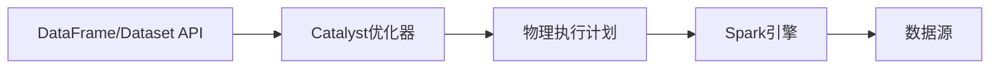

# 【AI大数据计算原理与代码实例讲解】Spark SQL

## 1. 背景介绍

### 1.1 大数据处理的挑战
在当今大数据时代,海量数据的存储和处理给传统的数据处理方式带来了巨大挑战。企业需要从海量数据中快速获取有价值的信息,以支持业务决策和创新。然而,传统的数据处理技术如关系型数据库,在面对TB甚至PB级别的数据时,在性能和扩展性方面都显得力不从心。

### 1.2 Spark的诞生
为了应对大数据处理的挑战,加州大学伯克利分校的AMP实验室在2009年开始了Spark研究项目。Spark最初是作为Hadoop MapReduce的替代方案而开发的,其目标是提供一个更快、更通用的大数据处理平台。经过多年发展,Spark已经成为了大数据处理领域的事实标准,被广泛应用于各行各业。

### 1.3 Spark SQL的提出
Spark SQL是Spark生态系统中的一个重要组件,它建立在Spark之上,为Spark提供了结构化数据处理的能力。Spark SQL的提出,源于人们对于大数据分析中使用类SQL交互方式的强烈需求。相比编写复杂的代码,数据分析师更习惯使用SQL这种声明式语言来描述数据分析逻辑。Spark SQL正是为了满足这一需求而诞生的。

## 2. 核心概念与联系

### 2.1 DataFrame与Dataset
DataFrame和Dataset是Spark SQL中最核心的数据抽象,它们为用户提供了高层次的结构化API:
- DataFrame是一种以RDD为基础的分布式数据集合,类似于传统数据库中的二维表格。DataFrame带有Schema元信息,支持嵌套数据类型(struct、array和map)。
- Dataset是DataFrame的一个扩展,提供了强类型的支持。Dataset支持在编译时进行类型检查,提高了程序的健壮性。

DataFrame和Dataset都支持丰富的算子如select、where、groupBy、join等,使得结构化数据处理变得简单高效。

### 2.2 Spark SQL的运行架构
下图展示了Spark SQL的整体架构:



从上到下分别是:
1. DataFrame/Dataset API层:提供了高层次的结构化API,方便用户进行数据处理和分析。
2. Catalyst优化器:Spark SQL的核心,负责将用户代码转换并优化为执行计划。
3. 物理执行计划:Catalyst生成的物理执行计划,可以在Spark集群上高效运行。
4. Spark引擎:负责执行物理计划,对数据进行计算处理。
5. 数据源:Spark SQL支持多种异构数据源,包括Hive、Avro、Parquet、ORC、JSON、JDBC等。

### 2.3 Spark SQL与Hive的关系
Spark SQL的一大特色是与Hive的良好兼容性。Spark SQL可以无缝对接Hive,包括:
- 通过Hive MetaStore访问Hive表。
- 支持HiveQL语法,用户可以使用熟悉的HiveQL进行数据分析。 
- 支持Hive UDF和UDAF,方便用户扩展功能。
- 支持Hive SerDe,可以处理Hive支持的各种数据格式。

综上,Spark SQL在很大程度上可以作为Hive的替代品,而且在性能和扩展性方面更胜一筹。

## 3. 核心算法原理与具体操作步骤

### 3.1 DataFrame/Dataset的创建
Spark SQL提供了多种创建DataFrame和Dataset的方式,主要包括:
1. 从RDD转换:可以将已有的RDD转换为DataFrame或Dataset。
2. 从Hive表:可以直接读取Hive中的表创建DataFrame。
3. 从数据源:可以从外部数据源如JSON、Parquet、ORC等创建DataFrame。
4. 以编程方式创建:通过指定Schema和数据内容,以编程方式创建DataFrame。

下面是一个从JSON文件创建DataFrame的例子:

```scala
val df = spark.read.json("examples/src/main/resources/people.json")
```

### 3.2 DataFrame/Dataset的操作
DataFrame和Dataset支持丰富的算子操作,主要分为转换算子和动作算子两大类:
- 转换算子:如select、where、groupBy等,根据现有的DataFrame/Dataset派生出新的DataFrame/Dataset,进行某种转换。
- 动作算子:如show、count、collect等,触发DataFrame/Dataset的执行,将数据输出。

下面是一个使用算子的例子:

```scala
df.select("name", "age")
  .where("age > 20")
  .groupBy("age") 
  .count()
  .show()
```

### 3.3 Catalyst优化器原理
Catalyst是Spark SQL的核心,负责将用户代码转换为优化后的物理执行计划。Catalyst由一系列的优化规则(Rule)组成,主要分为以下几个阶段:
1. 分析阶段(Analysis):解析用户代码,生成未解析的逻辑计划。
2. 逻辑优化阶段(Logical Optimization):对逻辑计划进行优化,如谓词下推、列剪裁等。
3. 物理计划生成阶段(Physical Planning):将逻辑计划转换为物理计划,生成可在Spark上执行的RDD操作。
4. 代码生成阶段(Code Generation):生成可执行的Java字节码,进一步提升执行效率。

通过这一系列的优化过程,Catalyst可以将用户代码转换为高度优化的执行计划,充分发挥Spark的性能优势。

## 4. 数学模型和公式详细讲解举例说明
Spark SQL的实现涉及到多种数学模型和算法,这里主要介绍其中的关系代数模型。

关系代数是数据库领域的经典数学模型,由关系(Relation)和算子(Operator)组成。常见的关系代数算子包括:
- 选择(Selection):从关系中选择满足条件的元组。记为$\sigma_{condition}(R)$。
- 投影(Projection):从关系中选择指定的属性列。记为$\prod_{attribute}(R)$。
- 并集(Union):将两个关系合并,去除重复元组。记为$R \cup S$。 
- 差集(Difference):从一个关系中去除另一个关系中存在的元组。记为$R - S$。
- 笛卡尔积(Cartesian Product):两个关系做笛卡尔积,生成新的关系。记为$R \times S$。
- 连接(Join):两个关系基于某个条件做连接。如等值连接记为$R \bowtie_{R.a=S.b} S$。

Spark SQL正是以关系代数为基础,实现了DataFrame/Dataset的各种算子。如:
- select对应投影算子
- where对应选择算子
- join对应连接算子

通过关系代数,我们可以用严格的数学语言来描述Spark SQL的语义,并基于此进行优化。

## 5. 项目实践:代码实例和详细解释说明
下面通过一个具体的项目实践,来演示Spark SQL的使用。该项目的目标是分析美国航班数据,统计每个航空公司的航班延误情况。

### 5.1 准备数据
首先准备航班数据,该数据以CSV格式存储,每行表示一个航班记录。部分数据如下:

```csv
Year,Month,DayofMonth,DayOfWeek,DepTime,CRSDepTime,ArrTime,CRSArrTime,UniqueCarrier,FlightNum,TailNum,ActualElapsedTime,CRSElapsedTime,AirTime,ArrDelay,DepDelay,Origin,Dest,Distance,TaxiIn,TaxiOut,Cancelled,CancellationCode,Diverted,CarrierDelay,WeatherDelay,NASDelay,SecurityDelay,LateAircraftDelay
2008,1,3,4,2003,1955,2211,2225,WN,335,N712SW,128,150,116,-14,8,IAD,TPA,810,4,8,0,,0,NA,NA,NA,NA,NA
2008,1,3,4,754,735,1002,1000,WN,3231,N772SW,128,145,113,2,19,IAD,TPA,810,5,10,0,,0,NA,NA,NA,NA,NA
2008,1,3,4,628,620,804,750,WN,448,N428WN,96,90,76,14,8,IND,BWI,515,3,17,0,,0,NA,NA,NA,NA,NA
...
```

### 5.2 读取数据
使用Spark SQL读取CSV数据,创建DataFrame:

```scala
val flightsDF = spark.read
  .option("header", "true")
  .option("inferSchema", "true") 
  .csv("flights.csv")
```

### 5.3 数据清洗
对数据进行清洗和预处理,去除无效数据:

```scala
val cleanedFlightsDF = flightsDF
  .filter(!isnan(col("ArrDelay"))) // 去除ArrDelay为NaN的行
  .filter(!isnan(col("DepDelay"))) // 去除DepDelay为NaN的行  
  .filter(col("Cancelled") === 0) // 去除取消的航班
```

### 5.4 数据分析
使用Spark SQL的DSL进行数据分析,统计每个航空公司的平均航班延误时间:

```scala
val delaysByCarrier = cleanedFlightsDF
  .groupBy("UniqueCarrier") 
  .agg(
    avg("ArrDelay").alias("avgArrDelay"),
    avg("DepDelay").alias("avgDepDelay")
  )
```

### 5.5 结果展示
将分析结果显示出来:

```scala
delaysByCarrier.show()
```

输出:
```
+--------------+------------------+------------------+
|UniqueCarrier|       avgArrDelay|       avgDepDelay|
+--------------+------------------+------------------+
|           OH| 7.376741154562382|10.754071510957324|
|           MQ|12.491286863660361| 9.921092619392368|
|           DL|6.0506072874493945| 8.195112285198109|
|           WN| 4.900637615027034| 8.554987111113227|
|           US|4.0527465312965075| 5.626300235190055|
|           UA|11.888362121391074|12.426562823940048|
|           XE| 8.374583333333334|11.551401869158877|
|           NW|10.463393402615216|13.435237717908243|
|           CO|  6.54985754985755| 7.014962486124659|
|           AA| 5.414490369332769|8.8034825870646|
|           EV|15.767295597484277|14.832451875844274|
|           B6|12.007306590257879|11.248020301324354|
|           AS| 4.038461538461543| 5.231292517006807|
|           F9|16.536178107607567|18.596059113300492|
|           FL|6.6443632104019885| 8.140863286713933|
|           YV|15.847457627118644| 8.067510548523206|
|           9E|6.7333333333333325|11.528138528138529|
|           OO| 7.659334126040428| 9.518796992481203|
|           HA| 2.115942028985508|-0.869565217391304|
|           AQ|-0.060606060606061|-1.515151515151516|
+--------------+------------------+------------------+
```

可以看到,不同航空公司的平均延误时间差异较大,其中F9航空公司的延误最为严重。

## 6. 实际应用场景
Spark SQL在实际中有非常广泛的应用,主要包括:

### 6.1 数据仓库
Spark SQL可以作为数据仓库的计算引擎,与Hive良好集成,提供高性能的SQL分析能力。相比Hive,Spark SQL的性能更优,且能支持更复杂的分析算法。

### 6.2 数据湖分析
对于存储在数据湖(如HDFS、S3)中的海量数据,Spark SQL提供了一套统一的分析方案。不同格式的数据(如CSV、JSON、Parquet等)可以轻松加载为DataFrame,然后使用强大的DSL进行分析。

### 6.3 数据ETL
Spark SQL是一个强大的数据ETL工具,可以从各种来源读取数据,经过一系列转换后写入目标系统。得益于Spark的分布式特性,Spark SQL可以对海量数据进行高效的ETL处理。

### 6.4 机器学习
Spark SQL与MLlib无缝集成,可以方便地在DataFrame/Dataset上应用机器学习算法。将结构化数据与MLlib结合,可以实现端到端的数据分析和挖掘流程。

## 7. 工具和资源推荐
对于Spark SQL的学习和使用,推荐以下工具和资源:
1. Spark官方文档:提供了Spark SQL详尽的API文档和编程指南。
2. Databricks: