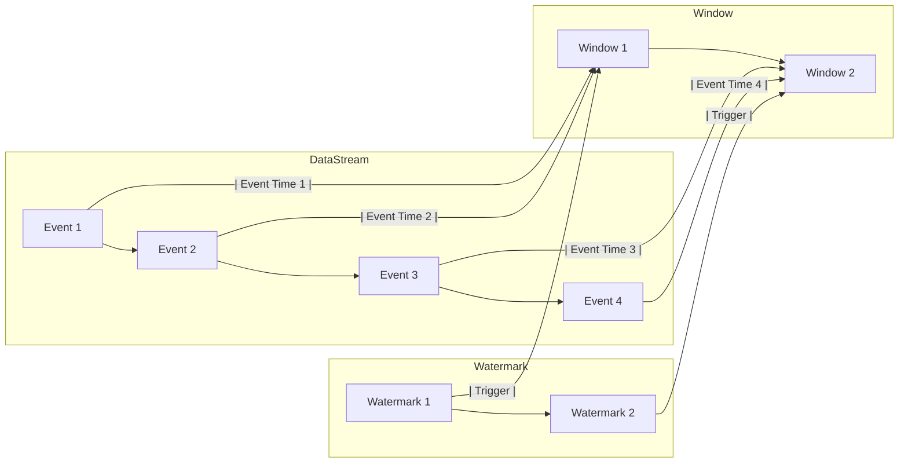

# 【AI大数据计算原理与代码实例讲解】Watermark

## 1. 背景介绍

### 1.1 大数据时代的机遇与挑战

随着互联网、物联网、云计算等技术的快速发展,我们已经进入了大数据时代。海量的数据每时每刻都在被生成和收集,蕴藏着巨大的价值。然而,如何有效地存储、处理和分析这些大数据,挖掘其中的价值,是摆在我们面前的重大挑战。

### 1.2 AI赋能大数据计算

人工智能技术的飞速发展为大数据计算带来了新的突破。通过将AI算法与大数据计算平台相结合,我们可以更加高效、智能地处理海量数据,从复杂的数据中自动提取有价值的特征和规律,极大地提升数据分析和决策的效率。

### 1.3 Watermark在大数据计算中的重要性

在大数据计算中,Watermark(水位线)是一个非常重要的概念。它是流式计算框架(如Flink、Spark Streaming等)中的核心机制之一,用于处理乱序数据,保证数据处理的正确性和时效性。深入理解Watermark的原理和使用方法,对于构建高效可靠的流式大数据计算应用至关重要。

## 2. 核心概念与联系

### 2.1 事件时间(Event Time)与处理时间(Processing Time)

- 事件时间:事件实际发生的时间,通常由事件中的时间戳字段来表示。
- 处理时间:事件被处理的时间,也就是数据进入计算系统的时间。

在理想情况下,事件时间和处理时间应该是一致的。但在实际场景中,由于网络延迟、消息乱序等因素,事件时间和处理时间可能存在偏差。

### 2.2 数据流(DataStream)与窗口(Window)

- 数据流:连续不断的数据序列,每个数据都带有时间戳信息。
- 窗口:在数据流上定义的一个时间段,用于对数据进行分组和聚合计算。常见的窗口类型有滚动窗口(Tumbling Window)、滑动窗口(Sliding Window)和会话窗口(Session Window)。

### 2.3 Watermark与窗口计算

Watermark是一种衡量事件时间进展的机制,可以解决数据乱序问题。它定义了一个延迟阈值,用于表示在该时间点之前,所有时间戳小于等于该时间的数据都已经到达。

当Watermark到达某个时间点时,意味着之前所有的数据都已经到达,可以触发对应窗口的计算。这样既可以容忍一定程度的数据延迟,又能保证计算的正确性。

下图展示了Watermark、数据流和窗口之间的关系:



## 3. 核心算法原理与具体操作步骤

### 3.1 Watermark的生成

Watermark的生成通常由应用程序自行定义,根据数据的特点和业务需求来设置。以下是一些常见的Watermark生成策略:

1. 周期性生成:每隔固定时间(如1分钟)生成一个Watermark。
2. 基于事件时间生成:根据接收到的事件的时间戳来生成Watermark,通常设置一个最大延迟阈值。
3. 基于特定事件生成:当接收到特定的事件(如心跳事件)时生成Watermark。

例如,我们可以定义一个最大延迟阈值为5秒的Watermark生成器:

```java
DataStream<Event> stream = ...
stream.assignTimestampsAndWatermarks(
    WatermarkStrategy
        .<Event>forBoundedOutOfOrderness(Duration.ofSeconds(5))
        .withTimestampAssigner((event, timestamp) -> event.getTimestamp())
);
```

### 3.2 窗口的定义与触发

在定义了Watermark之后,我们可以在数据流上定义窗口,并指定窗口的触发条件。例如,定义一个基于事件时间的滚动窗口,窗口大小为10秒:

```java
DataStream<Event> windowedStream = stream
    .keyBy(Event::getKey)
    .window(TumblingEventTimeWindows.of(Time.seconds(10)))
    .aggregate(new AggregateFunction<Event, AccumValue, Result>() {
        // ...
    });
```

当Watermark到达窗口结束时间时,窗口会自动触发计算。

### 3.3 处理延迟数据

对于延迟到达的数据,我们可以通过设置允许的延迟时间(allowed lateness)来处理。在允许的延迟时间内到达的数据会被加入对应的窗口并触发重新计算;而超过允许延迟时间的数据则会被丢弃或单独处理。

```java
DataStream<Event> windowedStream = stream
    .keyBy(Event::getKey)
    .window(TumblingEventTimeWindows.of(Time.seconds(10)))
    .allowedLateness(Time.seconds(5))
    .aggregate(new AggregateFunction<Event, AccumValue, Result>() {
        // ...
    });
```

## 4. 数学模型和公式详细讲解举例说明

### 4.1 Watermark的数学定义

我们可以将Watermark定义为一个时间戳函数$W(t)$,表示在时间$t$之前,所有时间戳小于等于$W(t)$的事件都已经到达。

假设事件流$E$中的事件$e_i$的时间戳为$t_i$,则Watermark函数需要满足以下条件:

$$
\forall e_i \in E, t_i \leq W(t) \Rightarrow e_i \text{ has arrived}
$$

### 4.2 延迟阈值的设置

在实际应用中,我们通常会设置一个延迟阈值$\Delta t$,表示允许事件最大的延迟时间。则Watermark函数可以定义为:

$$
W(t) = \max_{i}\{t_i | t_i \leq t - \Delta t\}
$$

例如,假设我们设置延迟阈值为5秒,当前时间为12:00:00,收到的事件时间戳如下:

- 11:59:58
- 11:59:59 
- 12:00:01
- 11:59:57

则此时的Watermark为:

$$
W(12:00:00) = \max\{11:59:58, 11:59:59, 11:59:57\} = 11:59:59
$$

而时间戳为12:00:01的事件由于超过了延迟阈值,因此不会影响当前的Watermark。

### 4.3 窗口计算的触发

对于一个时间窗口$[T_{start}, T_{end})$,当Watermark满足以下条件时,窗口会被触发计算:

$$
W(t) \geq T_{end}
$$

这意味着,在窗口结束时间之前,所有属于该窗口的事件都已经到达,可以进行窗口的计算了。

例如,对于一个[12:00:00, 12:00:10)的窗口,当Watermark到达12:00:10时,该窗口会被触发计算。而在此之前到达的所有时间戳小于12:00:10的事件都会被归入该窗口进行计算。

## 5. 项目实践:代码实例和详细解释说明

下面我们通过一个具体的代码实例来展示如何在Flink中使用Watermark进行窗口计算。

### 5.1 数据源定义

首先,我们定义一个数据源,不断生成带有时间戳的事件。为了模拟乱序数据,我们随机生成事件的时间戳。

```java
DataStream<Event> eventStream = env.addSource(new EventSource())
    .assignTimestampsAndWatermarks(
        WatermarkStrategy.<Event>forBoundedOutOfOrderness(Duration.ofSeconds(5))
            .withTimestampAssigner((event, timestamp) -> event.timestamp)
    );
```

其中,`EventSource`是自定义的数据源,`Event`是事件的POJO类,包含了时间戳字段`timestamp`。我们使用`assignTimestampsAndWatermarks`方法指定了时间戳提取方式,并设置了5秒的最大延迟阈值。

### 5.2 窗口计算

接下来,我们在事件流上定义一个滚动窗口,窗口大小为10秒,并允许2秒的延迟数据:

```java
DataStream<String> windowedStream = eventStream
    .keyBy(Event::getKey)
    .window(TumblingEventTimeWindows.of(Time.seconds(10)))
    .allowedLateness(Time.seconds(2))
    .aggregate(new EventCountAggregator())
    .map(EventCount::toString);
```

`EventCountAggregator`是自定义的聚合函数,用于统计每个窗口内的事件数量:

```java
private static class EventCountAggregator 
        implements AggregateFunction<Event, Integer, EventCount> {
    @Override
    public Integer createAccumulator() {
        return 0;
    }

    @Override
    public Integer add(Event value, Integer accumulator) {
        return accumulator + 1;
    }

    @Override
    public EventCount getResult(Integer accumulator) {
        return new EventCount(accumulator);
    }

    @Override
    public Integer merge(Integer a, Integer b) {
        return a + b;
    }
}
```

### 5.3 结果输出

最后,我们将窗口计算的结果输出到控制台:

```java
windowedStream.print();
```

运行程序,我们可以看到类似如下的输出:

```
EventCount{count=12, windowStart=12:00:00, windowEnd=12:00:10}
EventCount{count=15, windowStart=12:00:10, windowEnd=12:00:20}
EventCount{count=9, windowStart=12:00:20, windowEnd=12:00:30}
...
```

每一行表示一个窗口的计算结果,包括窗口内的事件数量、窗口的起始时间和结束时间。

## 6. 实际应用场景

Watermark机制在实际的流式大数据处理中有广泛的应用,下面是一些典型的场景:

### 6.1 日志分析

在日志分析场景中,我们通常需要按照时间窗口对日志进行聚合统计,如每分钟的请求数、每小时的错误数等。由于日志的生成和传输可能存在延迟和乱序,使用Watermark可以很好地解决这个问题。

### 6.2 实时监控和告警

在实时监控和告警场景中,我们需要对系统的各项指标进行实时计算和判断,如CPU使用率、内存占用等。当指标超过预设的阈值时,需要触发告警。使用Watermark可以保证告警的及时性和准确性,避免因为数据延迟而导致的漏报或误报。

### 6.3 在线广告计费

在在线广告系统中,广告的点击和展示日志通常会有一定的延迟。但是广告主需要实时了解广告的效果,并按照点击和展示的数量进行计费。使用Watermark可以准确地统计一段时间内的点击和展示数据,保证计费的准确性。

## 7. 工具和资源推荐

以下是一些学习和使用Watermark的优秀资源:

- Flink官方文档:https://ci.apache.org/projects/flink/flink-docs-stable/
- 《Stream Processing with Apache Flink》书籍:https://www.oreilly.com/library/view/stream-processing-with/9781491974285/
- Flink中文社区:https://flink-learning.org.cn/
- Watermark的博客文章:https://www.ververica.com/blog/introduction-to-watermark

## 8. 总结:未来发展趋势与挑战

Watermark作为流式计算中处理乱序数据的重要机制,未来还有很大的发展空间和潜力。以下是一些值得关注的趋势和挑战:

### 8.1 自适应Watermark生成

目前Watermark的生成大多依赖于用户手动配置,如延迟阈值的设置。未来可以探索根据数据的特点和分布,自动生成最优的Watermark,减轻用户的配置负担。

### 8.2 Watermark的增量更新

在某些场景下,Watermark可能需要动态调整,如延迟阈值的动态变化。如何在不影响已有计算结果的情况下,增量更新Watermark,是一个值得研究