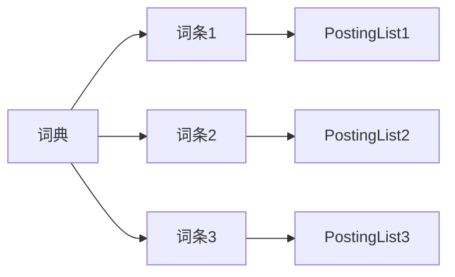
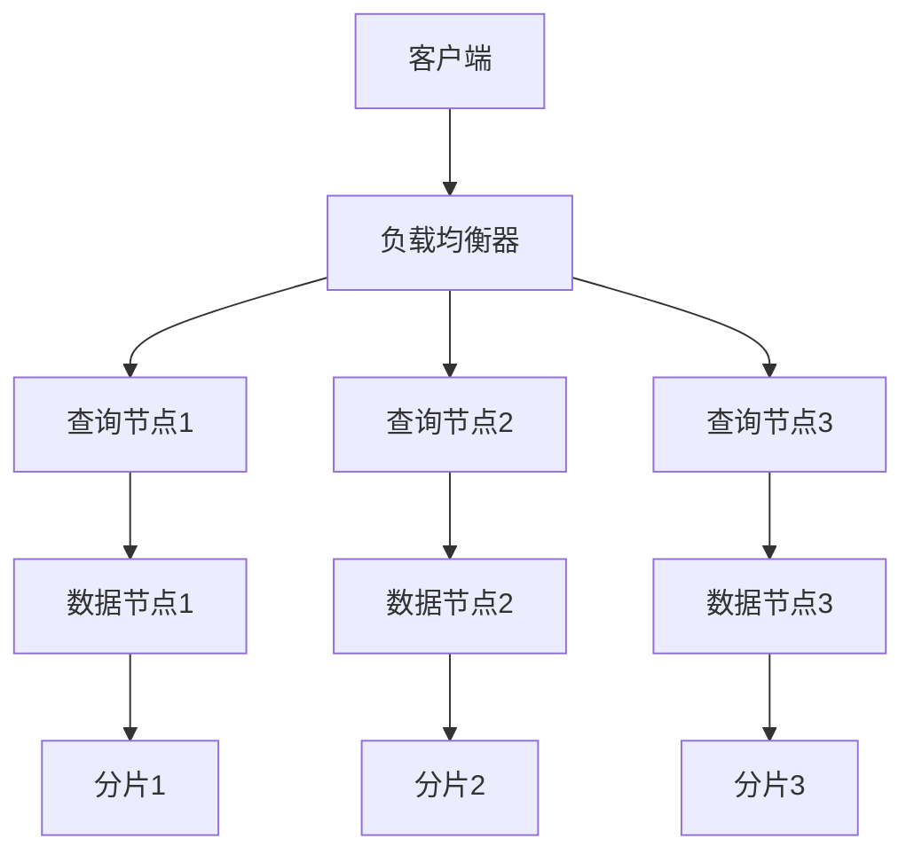

# 【AI大数据计算原理与代码实例讲解】分布式搜索

## 1.背景介绍

在当今大数据时代,海量数据的存储和检索成为了一个巨大的挑战。传统的集中式搜索系统由于单点故障、扩展性差等问题,已经无法满足现代应用的需求。为了解决这些问题,分布式搜索系统应运而生。

分布式搜索系统是一种在多台服务器上分布式部署的搜索引擎,它能够高效地存储和检索大规模数据集。通过将数据分散存储在多个节点上,分布式搜索系统可以实现高可用性、高扩展性和高性能,从而满足大数据场景下的搜索需求。

### 1.1 分布式搜索系统的优势

- **高可用性**: 由于数据分散存储在多个节点上,单个节点出现故障不会导致整个系统瘫痪,从而提高了系统的可用性。
- **高扩展性**: 分布式搜索系统可以通过添加新的节点来线性扩展存储和计算能力,满足不断增长的数据量和查询负载。
- **高性能**: 通过并行处理查询请求,分布式搜索系统可以提供更快的响应时间和更高的吞吐量。
- **容错性**: 分布式搜索系统通常采用数据副本机制,确保数据的可靠性和持久性。

### 1.2 分布式搜索系统的应用场景

分布式搜索系统广泛应用于各种需要处理大规模数据的场景,如:

- **网络搜索引擎**: 谷歌、必应等大型搜索引擎都采用分布式架构来索引和搜索互联网上的海量网页数据。
- **电子商务网站**: 亚马逊、淘宝等电商平台使用分布式搜索系统来提供高效的商品搜索和推荐服务。
- **日志分析**: 分布式搜索系统可用于存储和分析大量的日志数据,以发现潜在的问题和趋势。
- **物联网数据处理**: 物联网设备产生的海量数据可以通过分布式搜索系统进行存储和分析。

## 2.核心概念与联系

在深入探讨分布式搜索系统的核心原理之前,我们需要先了解一些基本概念。

### 2.1 倒排索引(Inverted Index)

倒排索引是分布式搜索系统的核心数据结构。它将文档中的每个词条映射到包含该词条的文档列表,从而实现快速搜索。倒排索引通常由以下几个部分组成:

- **词条(Term)**: 文档中出现的单词或短语。
- **词典(Dictionary)**: 存储所有不重复词条的数据结构,通常使用前缀树(Trie)或哈希表实现。
- **PostingList**: 对于每个词条,都有一个对应的PostingList,记录包含该词条的所有文档的信息,如文档ID、词条频率等。
- **PostingList的编码**: 为了节省存储空间,PostingList通常采用压缩编码,如稀疏编码、间隔编码等。

下图展示了一个简单的倒排索引结构:

### 2.2 分布式架构

为了支持大规模数据的存储和检索,分布式搜索系统通常采用分布式架构。常见的分布式架构模式包括:

- **主从架构(Master-Slave)**: 主节点负责协调和管理整个集群,从节点执行实际的数据存储和检索操作。
- **对等架构(Peer-to-Peer)**: 所有节点都是对等的,共同参与数据的存储和检索。
- **分片架构(Sharding)**: 将数据按照某种策略(如哈希分区)分散存储在不同的节点上,每个节点只负责管理一部分数据。

下图展示了一个典型的分布式搜索系统架构:

在这个架构中,客户端的查询请求首先由负载均衡器分发到查询节点。查询节点根据查询条件从相应的数据节点中检索数据,数据节点管理着分散存储的数据分片。

## 3.核心算法原理具体操作步骤

分布式搜索系统的核心算法原理包括以下几个方面:

### 3.1 数据分区和路由

为了实现数据的分布式存储,需要将数据划分为多个分区(Partition),并将每个分区分配给不同的节点管理。常见的分区策略包括:

- **哈希分区**: 根据文档ID或其他键值计算哈希值,将文档映射到不同的分区。
- **范围分区**: 根据某个键值的范围将文档划分到不同的分区。
- **地理位置分区**: 根据文档的地理位置信息将文档划分到不同的分区。

在查询时,需要一个路由机制来确定哪些分区可能包含相关文档,从而将查询请求路由到正确的节点。常见的路由算法包括:

- **一致性哈希(Consistent Hashing)**: 将文档和节点都映射到同一个哈希环上,通过计算哈希值来确定文档应该存储在哪个节点上。
- **Rendezvous哈希(Highest Random Weight)**: 为每个节点分配一个随机权重,文档将被路由到具有最高权重的节点。

### 3.2 数据复制和分布

为了提高数据的可用性和容错性,分布式搜索系统通常会在多个节点上保存数据副本。常见的复制策略包括:

- **主从复制(Master-Slave Replication)**: 将数据分为主分片和从分片,主分片负责写入操作,从分片只负责读取操作。
- **对等复制(Peer-to-Peer Replication)**: 所有节点都是对等的,每个节点都可以执行读写操作,并将数据复制到其他节点。

在分布式环境下,需要一种分布式协调机制来确保数据的一致性。常见的分布式协调算法包括:

- **Paxos算法**: 一种基于多数投票的一致性算法,用于在分布式系统中达成共识。
- **Raft算法**: 一种更易于理解和实现的一致性算法,被广泛应用于分布式系统中。

### 3.3 查询处理

在分布式搜索系统中,查询处理过程通常包括以下几个步骤:

1. **查询解析**: 将用户输入的查询解析为可执行的查询计划。
2. **查询路由**: 根据查询条件确定需要访问哪些数据分区,并将查询请求路由到相应的节点。
3. **数据检索**: 在相关节点上执行实际的数据检索操作,获取符合查询条件的文档列表。
4. **结果合并**: 将来自不同节点的检索结果进行合并和排序,形成最终的查询结果。
5. **结果返回**: 将查询结果返回给客户端。

在查询处理过程中,还需要考虑以下几个因素:

- **查询缓存**: 为了提高查询性能,可以缓存常见查询的结果。
- **查询优化**: 通过查询重写、索引选择等技术优化查询执行效率。
- **相关性排序**: 根据文档与查询的相关性对结果进行排序,提高结果质量。

### 3.4 索引构建和更新

随着数据的不断变化,分布式搜索系统需要定期重新构建或更新索引。常见的索引构建和更新策略包括:

- **批量索引构建**: 周期性地对全量数据进行重新索引,通常在低峰时段执行。
- **增量索引更新**: 实时地对新增或变更的数据进行索引更新,保持索引的实时性。
- **并行索引构建**: 将索引构建任务分散到多个节点上并行执行,提高索引构建效率。

在索引构建和更新过程中,需要考虑以下几个因素:

- **数据预处理**: 对原始数据进行清洗、分词、过滤等预处理,以提高索引质量。
- **索引压缩**: 采用合适的压缩算法和编码方式,减小索引的存储空间占用。
- **索引分片**: 将索引划分为多个分片,分散存储在不同的节点上,提高并行性能。

## 4.数学模型和公式详细讲解举例说明

在分布式搜索系统中,有一些常见的数学模型和公式用于衡量和优化系统的性能。

### 4.1 倒排索引压缩

为了节省存储空间,PostingList通常采用压缩编码。常见的压缩编码算法包括:

1. **稀疏编码(Sparse Coding)**: 对于包含大量0的PostingList,可以使用稀疏编码来压缩存储。例如,对于PostingList `[0, 0, 0, 3, 0, 0, 0, 0, 7]`,可以编码为 `[(0, 3), (3, 1), (7, 1)]`,其中第一个元素表示起始位置,第二个元素表示连续0的个数。

2. **间隔编码(Delta Encoding)**: 对于递增的PostingList,可以存储相邻元素之间的差值,而不是存储实际值。例如,对于PostingList `[3, 5, 7, 9]`,可以编码为 `[3, 2, 2, 2]`,表示相邻元素之间的差值。

3. **字节编码(Byte-Aligned Encoding)**: 将整数按字节对齐存储,每个字节的高位表示数据长度,低位表示实际数据。这种编码方式可以有效地压缩小整数。

4. **Elias Gamma编码**: 一种用于编码非负整数的前缀编码,对于小整数具有较好的压缩效果。

5. **PForDelta编码**: 一种针对递增序列进行压缩的高效算法,常用于压缩PostingList。

假设我们有一个PostingList `[3, 5, 7, 9, 12, 18, 20, 25]`,使用不同的压缩算法,其压缩结果如下:

- 稀疏编码: `[(0, 1), (3, 1), (5, 1), (7, 1), (9, 1), (12, 1), (18, 1), (20, 1), (25, 1)]`
- 间隔编码: `[3, 2, 2, 2, 3, 6, 2, 5]`
- 字节编码: `[0x83, 0x85, 0x87, 0x89, 0x8C, 0x92, 0x94, 0x99]`
- Elias Gamma编码: `[0b1000011, 0b1010, 0b1010, 0b1010, 0b101100, 0b1001010, 0b101000, 0b1001001]`
- PForDelta编码: `[3, 2, 2, 2, 3, 6, 2, 5]`

通过比较不同算法的压缩结果,我们可以选择最优的压缩方式,从而节省存储空间。

### 4.2 查询评分模型

为了排序查询结果并提高结果质量,分布式搜索系统通常采用查询评分模型来衡量文档与查询的相关性。常见的查询评分模型包括:

1. **布尔模型(Boolean Model)**: 文档要么完全匹配查询,要么完全不匹配,相关性分数只有0或1两种值。

2. **向量空间模型(Vector Space Model)**: 将文档和查询表示为向量,通过计算两个向量之间的余弦相似度来衡量相关性。

   设文档向量为 $\vec{d}$,查询向量为 $\vec{q}$,则相关性分数计算公式为:

   $$\text{score}(\vec{d}, \vec{q}) = \frac{\vec{d} \cdot \vec{q}}{|\vec{d}||\vec{q}|}$$

3. **概率模型(Probabilistic Model)**: 基于贝叶斯定理,计算文档满足查询的概率作为相关性