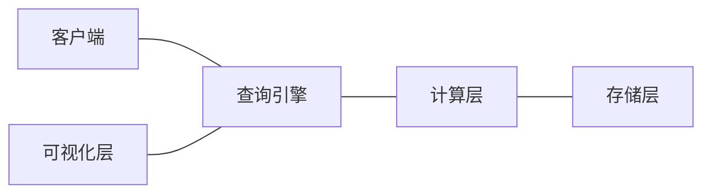
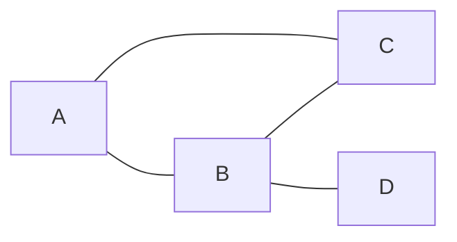

# 【AI大数据计算原理与代码实例讲解】图数据库

## 1. 背景介绍

### 1.1 大数据时代的数据管理挑战

随着互联网、物联网、社交网络等技术的快速发展,数据呈现出爆炸式增长的趋势。据统计,全球数据量每两年翻一番,预计到2025年将达到163ZB。面对如此海量、多样化的大数据,传统的关系型数据库在存储、查询等方面遇到了巨大的挑战。

### 1.2 图数据库的兴起 

图数据库作为一种新兴的NoSQL数据库,其数据模型采用了图这种数据结构。图由节点(Node)和边(Edge)组成,节点表示实体对象,边表示实体之间的关系。图数据库天然适合处理高度关联的复杂数据,如社交网络、知识图谱、推荐系统等。与关系型数据库相比,图数据库在表达关联数据时更加直观高效。

### 1.3 图数据库在人工智能领域的应用

人工智能是计算机科学的一个重要分支,其目标是研究如何让机器像人一样思考和行动。当前,深度学习和知识图谱是AI领域的两大热点。

- 深度学习需要大量的训练数据,如何高效地管理和查询这些数据是一大挑战。图数据库为深度学习提供了理想的数据基础设施。

- 知识图谱是结构化的语义知识库,采用图的数据结构来描述概念、实体及其关系。知识图谱是人工智能的重要支撑技术,被广泛应用于智能问答、语义搜索、智能推荐等场景。图数据库是构建知识图谱的理想存储方案。

## 2. 核心概念与联系

### 2.1 属性图模型(Property Graph Model) 

属性图模型是图数据库的核心概念,它由节点(Node)和边(Edge)两种基本元素组成:

- 节点用来表示实体对象,如人、地点、事物等。每个节点可以有多个属性(Property),用Key-Value对表示。
- 有向边表示节点之间的关系,每条边也可以有多个属性。边有方向,起点节点和终点节点不能交换。
- 无向边可以看作两条方向相反的有向边。

属性图模型简单灵活,能够直观地表达现实世界中的各种关联数据。

### 2.2 图遍历算法

图遍历(Graph Traversal)是指按照一定的规则,不重复地访问图的所有节点的过程。常见的图遍历算法有:

- 广度优先搜索(Breadth-First Search,BFS):先访问起始节点,然后依次访问起始节点的所有未被访问过的邻居节点,再访问这些节点的所有未被访问过的邻居节点,直到所有节点都被访问到。
- 深度优先搜索(Depth-First Search,DFS):先访问起始节点,然后递归地访问起始节点的一个未被访问过的邻居节点,再递归访问后者的一个邻居节点,直到所有节点都被访问到。
- A*搜索:启发式搜索算法,在BFS的基础上引入评估函数,优先搜索最有可能到达目标的节点。常用于路径规划、游戏AI等。

图遍历是图数据库查询的基础,通过组合不同的遍历规则可以实现复杂的图查询。

### 2.3 图数据库与其他数据库的区别

图数据库与关系型数据库、文档型数据库、列式数据库等在数据模型和查询方式上有很大区别:

| 对比项   | 图数据库   | 关系型数据库  | 文档数据库 | 列式数据库  |
|:-------|:--------|:---------|:------|:-------|
| 数据模型 | 属性图模型 | 关系模型(二维表) | JSON文档 | 列族和列  | 
| 数据关联 | 图的节点边关联 | 主外键关联  | 文档内嵌和引用 | 行键关联 |
| 查询方式 | 图遍历和模式匹配 | SQL      | 文档路径查询 | 行键范围查询 |
| 查询性能 | 与关联度相关  | 与数据量相关 | 与文档数相关 | 与列数相关 |
| 适用场景 | 关联数据挖掘  | 事务处理系统 | 非结构化数据存储 | 海量结构化数据分析 |

可以看出,图数据库在处理关联数据时具有独特的优势,它采用图这种数据结构,将关联关系显式地存储为边,通过图遍历和模式匹配实现高效的关联数据查询。而其他类型的数据库需要多表JOIN或多次查询才能实现类似的功能。

### 2.4 图数据库的技术架构

图数据库的技术架构通常包括以下几个部分:

- 存储层:负责将图数据持久化到磁盘,常见的存储格式有原生图存储(Native Graph Storage)和关系型存储等。原生图存储采用邻接表、边表等专门针对图优化的存储结构,查询性能更高。
- 计算层:实现图数据库的CRUD操作和图算法,包括节点和边的增删改查,以及最短路径、PageRank等算法。
- 查询引擎:提供声明式的图查询语言如Cypher、Gremlin,将查询转换为图遍历操作。
- 可视化层:提供图形化的界面展示和交互,如Neo4j Browser。

下图是一个典型的图数据库架构:

## 3. 核心算法原理具体操作步骤

### 3.1 最短路径算法

在图数据库中,最短路径是指两个节点之间的最短路径,即经过的边数最少的路径。最短路径算法是图数据库的重要算法之一,广泛应用于路径规划、网络流量优化等场景。

以下是Dijkstra算法的具体步骤:

1. 初始化: 
   - 创建一个距离表,记录起点到每个节点的距离,初始时起点到自身距离为0,到其他节点距离为无穷大。
   - 创建一个访问集合,记录已经找到最短路径的节点,初始时为空。
   
2. 从距离表中选择一个未访问的距离最小的节点作为当前节点,加入访问集合。

3. 遍历当前节点的所有邻居节点,计算起点经过当前节点到达每个邻居节点的距离,如果小于距离表中的距离,则更新距离表。

4. 重复步骤2和3,直到所有节点都被访问。

5. 距离表中的值即为起点到每个节点的最短距离,通过回溯路径可以得到最短路径。

除了Dijkstra算法,图数据库中还有A*、Floyd等多种最短路径算法,它们在实现细节和适用场景上有所不同。

### 3.2 PageRank算法

PageRank是Google提出的一种用于评估网页重要性的算法,后来被广泛应用于社交网络影响力分析、推荐系统等领域。PageRank的基本思想是:如果一个节点被很多其他节点指向,或者被一些重要节点指向,那么这个节点也是重要的。

以下是PageRank的计算步骤:

1. 初始化每个节点的PageRank值为1/N,其中N为节点总数。

2. 对每个节点i,计算其PageRank值:
   $$PR(i) = (1-d) + d \sum_{j \in M(i)} \frac{PR(j)}{L(j)}$$
   其中:
   - d为阻尼系数,一般取0.85。
   - M(i)为指向节点i的节点集合。
   - L(j)为节点j的出度,即从节点j指出的边数。

3. 重复步骤2,直到所有节点的PageRank值收敛。

4. 将所有节点的PageRank值归一化,使它们的和为1。

可以看出,PageRank本质上是一个迭代计算的过程,每个节点的重要性由指向它的节点的重要性决定。PageRank能够很好地揭示节点在图中的重要程度和影响力。

### 3.3 社区发现算法

在图数据库中,社区(Community)指的是一组紧密关联的节点的集合。社区发现就是要把图中的节点划分为若干个社区,使得同一个社区内部的节点关联紧密,不同社区之间的关联相对稀疏。社区发现可以帮助我们理解图的结构和功能。

以下是基于模块度(Modularity)的Louvain社区发现算法的步骤:

1. 初始化,每个节点分配到一个独立的社区。

2. 对每个节点i,尝试将其移动到其邻居节点所在的社区,选择使模块度增益最大的社区,如果模块度增益为正,则执行移动。

3. 重复步骤2,直到模块度不再增加。

4. 将每个社区看作一个新的节点,两个新节点之间的边的权重为两个社区之间的边数,得到一个新的图。

5. 在新图上重复步骤2到4,直到图不再变化。

其中,模块度的定义为:

$$Q = \frac{1}{2m}\sum_{i,j} \left(A_{ij} - \frac{k_i k_j}{2m}\right) \delta(c_i,c_j)$$

其中:
- m为图中边的总数。
- $A_{ij}$为节点i和j之间的边数。
- $k_i$为节点i的度数,即与节点i相连的边数。
- $c_i$为节点i所属的社区。
- $\delta(c_i,c_j)$当$c_i=c_j$时为1,否则为0。

直观地说,模块度衡量了社区内部边的密度与随机情况下边的密度之间的差异。Louvain算法通过不断地优化模块度,得到层次化的社区结构。

## 4. 数学模型和公式详细讲解举例说明

### 4.1 图的数学表示

从数学的角度看,图是由一组节点(顶点)和连接节点的边组成的。我们通常用$G(V,E)$来表示一个图,其中$V$是节点的集合,$E$是边的集合。

以下是一个简单的无向图的例子:

这个图可以表示为:

$G(V,E)$, 其中
- $V=\{A,B,C,D\}$
- $E=\{\{A,B\},\{A,C\},\{B,C\},\{B,D\}\}$

我们也可以用邻接矩阵来表示这个图:

$$
A = 
\begin{bmatrix} 
0 & 1 & 1 & 0\\\\
1 & 0 & 1 & 1\\\\
1 & 1 & 0 & 0\\\\
0 & 1 & 0 & 0
\end{bmatrix}
$$

其中,$A_{ij}$表示节点i和j之间是否有边,1表示有边,0表示无边。

对于带权重的图,邻接矩阵的元素为边的权重,不存在的边可以用0或无穷大表示。

### 4.2 节点中心性的数学定义

在图论中,节点的中心性(Centrality)衡量了节点在图中的重要程度。常见的中心性指标有:

1. 度中心性(Degree Centrality):节点的度数,即与节点直接相连的边数。对于有向图,还可以分为入度和出度。
   $$C_D(i) = \frac{d_i}{N-1}$$
   其中,$d_i$为节点i的度数,$N$为图中节点数。

2. 介数中心性(Betweenness Centrality):节点出现在其他节点对之间最短路径上的次数。
   $$C_B(i) = \sum_{s \neq i \neq t} \frac{\sigma_{st}(i)}{\sigma_{st}}$$
   其中,$\sigma_{st}$是节点s和t之间的最短路径数,$\sigma_{st}(i)$是经过节点i的最短路径数。

3. 接近中心性(Closeness Centrality):节点与其他所有节点之间的平均最短距离的倒数。
   $$C_C(i) = \frac{N-1}{\sum_{j \neq i} d(i,j)}$$
   其中,$d(