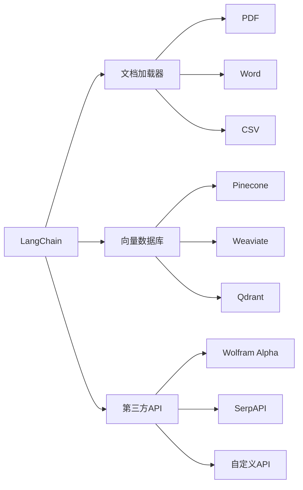

# 【LangChain编程：从入门到实践】其他库安装

## 1. 背景介绍
### 1.1 LangChain简介
LangChain是一个用于开发由语言模型驱动的应用程序的强大框架。它提供了一套工具和组件，使开发人员能够轻松地将大型语言模型（LLMs）与外部数据源和计算相结合，以创建更智能、更强大的应用程序。

### 1.2 为什么需要安装其他库
虽然LangChain本身已经提供了丰富的功能，但在实际开发过程中，我们经常需要与其他库和工具进行集成，以实现更复杂和多样化的任务。例如，我们可能需要使用向量数据库来存储和检索嵌入向量，使用文档加载器来处理不同格式的文档，或者使用第三方API来获取额外的信息。因此，了解如何安装和配置这些其他库对于充分发挥LangChain的潜力至关重要。

## 2. 核心概念与联系
### 2.1 LangChain的核心组件
- 模型（Models）：语言模型，如OpenAI的GPT系列
- 提示模板（PromptTemplates）：用于构建动态提示的模板
- 索引（Indexes）：用于构建数据的索引，以便语言模型可以与之交互
- 内存（Memory）：用于在多轮对话中存储状态
- 链（Chains）：将多个组件组合在一起形成一个应用程序

### 2.2 其他库与LangChain的关系
其他库可以与LangChain的核心组件进行无缝集成，扩展其功能和适用范围。例如：
- 向量数据库（如Pinecone、Weaviate等）可以用作LangChain索引的后端存储
- 文档加载器（如PyPDF2、Unstructured等）可以帮助LangChain处理各种格式的文档
- 第三方API（如Wolfram Alpha、SerpAPI等）可以为LangChain提供额外的知识和计算能力

## 3. 核心算法原理具体操作步骤
### 3.1 安装Python和pip
- 从官方网站下载并安装适用于您操作系统的Python
- 验证Python和pip是否正确安装：
```bash
python --version
pip --version
```

### 3.2 创建和激活虚拟环境（可选但推荐）
- 创建虚拟环境：
```bash
python -m venv myenv
```
- 激活虚拟环境：
  - Windows：
  ```bash
  myenv\Scripts\activate
  ```
  - Unix/MacOS：
  ```bash
  source myenv/bin/activate
  ```

### 3.3 安装LangChain
```bash
pip install langchain
```

### 3.4 安装其他库
- 安装向量数据库（以Pinecone为例）：
```bash
pip install pinecone-client
```
- 安装文档加载器（以PyPDF2为例）：
```bash
pip install pypdf2
```
- 安装第三方API客户端（以SerpAPI为例）：
```bash
pip install google-search-results
```

## 4. 数学模型和公式详细讲解举例说明
在本文的上下文中，我们主要关注如何安装和配置其他库，而不涉及复杂的数学模型和公式。但是，值得一提的是，LangChain中的一些组件（如索引和嵌入）依赖于向量空间模型和相似度计算。

例如，当我们使用向量数据库存储嵌入向量时，查询向量与索引向量之间的相似度通常使用余弦相似度进行计算：

$$
\text{similarity} = \cos(\theta) = \frac{\mathbf{A} \cdot \mathbf{B}}{\|\mathbf{A}\| \|\mathbf{B}\|} = \frac{\sum_{i=1}^n A_i B_i}{\sqrt{\sum_{i=1}^n A_i^2} \sqrt{\sum_{i=1}^n B_i^2}}
$$

其中$\mathbf{A}$和$\mathbf{B}$是两个$n$维向量。余弦相似度的取值范围为$[-1, 1]$，值越大表示两个向量越相似。

## 5. 项目实践：代码实例和详细解释说明
下面是一个使用LangChain和Pinecone进行语义搜索的简单示例：

```python
from langchain.embeddings import OpenAIEmbeddings
from langchain.vectorstores import Pinecone
from langchain.llms import OpenAI
from langchain.chains import VectorDBQAWithSourcesChain
import pinecone

# 初始化Pinecone客户端
pinecone.init(api_key="your_api_key", environment="your_env")

# 创建或加载索引
index_name = "my-index"
embedding = OpenAIEmbeddings()
vectorstore = Pinecone.from_existing_index(index_name, embedding)

# 创建问答链
llm = OpenAI(temperature=0)
chain = VectorDBQAWithSourcesChain.from_llm(llm, vectorstore)

# 执行查询
query = "What is the capital of France?"
result = chain({"question": query})

print(result["answer"])
print(result["sources"])
```

这个示例中，我们首先初始化Pinecone客户端，然后加载一个已经创建好的索引。接下来，我们创建一个使用OpenAI语言模型和Pinecone向量存储的问答链。最后，我们执行一个查询，打印出答案和相关的信息源。

## 6. 实际应用场景
LangChain与其他库的集成可以应用于各种场景，例如：

- 智能文档搜索：使用文档加载器处理PDF、Word等文档，提取文本并创建嵌入向量索引，实现基于语义的文档搜索。
- 个性化推荐：将用户数据存储在向量数据库中，通过计算用户嵌入与物品嵌入之间的相似度，生成个性化推荐。
- 知识图谱问答：将知识图谱存储在向量数据库中，通过语言模型和向量搜索实现基于知识图谱的问答系统。
- 多源信息聚合：使用第三方API获取额外的数据和见解，与语言模型生成的结果进行整合，提供更全面和准确的信息。

## 7. 工具和资源推荐
- 官方文档：[LangChain文档](https://docs.langchain.com/)
- 教程和示例：
  - [LangChain Hub](https://github.com/hwchase17/langchain-hub)
  - [LangChain Template Gallery](https://github.com/hwchase17/langchain-gallery)
- 社区支持：
  - [LangChain Discord社区](https://discord.gg/6adMQxSpJS)
  - [LangChain GitHub讨论区](https://github.com/hwchase17/langchain/discussions)

## 8. 总结：未来发展趋势与挑战
LangChain正在快速发展，不断引入新的功能和改进。未来，我们可以期待看到更多与其他库和工具的集成，以及更多针对特定领域和任务的预构建组件。此外，随着语言模型的不断进步，LangChain也将受益于更强大和高效的基础模型。

然而，LangChain的发展也面临一些挑战。其中之一是管理不断增长的库和组件生态系统的复杂性。另一个挑战是确保不同组件之间的兼容性和互操作性。此外，随着应用程序变得越来越复杂，调试和优化LangChain应用程序也可能变得更具挑战性。

尽管存在这些挑战，但LangChain作为一个连接语言模型和外部世界的强大框架，其前景依然非常光明。随着越来越多的开发者和研究人员加入到LangChain社区中来，我们可以期待看到更多创新性的应用和解决方案。

## 9. 附录：常见问题与解答
### 9.1 安装其他库时遇到问题怎么办？
- 检查是否使用了正确的包名和版本
- 确保您的Python环境满足库的要求
- 尝试在新的虚拟环境中安装库
- 查看库的官方文档和问题跟踪器，寻求帮助和解决方案

### 9.2 如何选择合适的向量数据库？
选择向量数据库时，需要考虑以下因素：
- 可扩展性：数据库是否能够处理大规模数据和高并发查询
- 查询性能：查询的速度和准确性是否满足应用程序的需求
- 数据持久性：数据库是否提供可靠的数据持久化和备份机制
- 集成难易程度：数据库是否提供了易于使用的API和客户端库
- 成本：数据库的定价模型是否适合您的预算

一些流行的向量数据库选项包括Pinecone、Weaviate、Qdrant和Milvus等。

### 9.3 LangChain能否与非Python库集成？
是的，尽管LangChain本身是一个Python框架，但它可以通过API和客户端库与其他编程语言编写的库和工具进行集成。例如，您可以使用REST API或gRPC与其他语言中的向量数据库进行交互。

以下是一个简化的LangChain与其他库集成的流程图：



作者：禅与计算机程序设计艺术 / Zen and the Art of Computer Programming