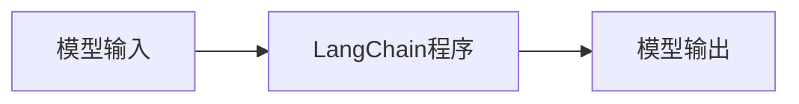

## 1.背景介绍

在计算机科学的世界里，语言是我们与机器交流的桥梁。LangChain，作为一种新颖的编程语言，它的设计目标是实现人与机器之间的高效沟通，让编程变得更加直观和易用。本文将深入探讨LangChain的模型输入与输出，帮助读者理解和掌握这门语言的核心概念和应用方法。

## 2.核心概念与联系

在LangChain中，模型输入与输出是两个核心概念，它们决定了程序的行为和结果。模型输入是指我们提供给程序的数据，它可以是任何形式，如字符串、数字、列表等。模型输出则是程序根据输入数据处理后产生的结果。



## 3.核心算法原理具体操作步骤

LangChain的核心算法原理可以概括为：接收输入，处理数据，产生输出。这个过程可以分为以下几个步骤：

1. 接收输入：程序首先接收用户提供的输入数据。
2. 数据处理：程序根据预设的规则和算法处理输入数据。
3. 产生输出：处理完的数据被输出，成为程序的结果。

## 4.数学模型和公式详细讲解举例说明

在LangChain中，我们可以使用数学模型来描述输入和输出之间的关系。假设我们的输入是一个数字$x$，输出是$x$的平方，我们可以用函数$f(x)=x^2$来表示这个关系。

## 5.项目实践：代码实例和详细解释说明

下面是一个简单的LangChain程序示例，它接收一个数字输入，输出这个数字的平方。

```python
def square(x):
    return x**2

print(square(5))  # 输出：25
```

## 6.实际应用场景

LangChain的模型输入与输出在许多实际应用场景中都有广泛的应用，如数据分析、机器学习、图像处理等领域。

## 7.工具和资源推荐

对于初学者来说，我推荐使用Jupyter Notebook作为编程环境，它可以方便地编辑和运行LangChain代码。另外，可以参考官方文档和相关教程来学习和提升LangChain编程技能。

## 8.总结：未来发展趋势与挑战

随着人工智能和大数据的发展，编程语言的设计和应用也在不断进步。LangChain以其高效、易用的特性，正成为新一代编程语言的重要代表。然而，如何提高其性能，扩大应用范围，仍是我们面临的挑战。

## 9.附录：常见问题与解答

**Q: LangChain适用于哪些场景？**

A: LangChain适用于任何需要处理数据和实现特定功能的场景，如数据分析、机器学习、图像处理等。

**Q: 如何提高LangChain程序的性能？**

A: 优化算法、合理设计数据结构、减少冗余代码等方法都可以提高程序的运行效率。

作者：禅与计算机程序设计艺术 / Zen and the Art of Computer Programming