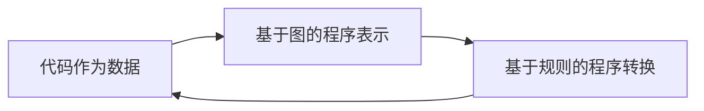

## 1.背景介绍

自从计算机科学的诞生以来，编程语言的发展历程就如同一条长河，源源不断地流淌，带来了各种各样的编程范式和技术革新。在这条长河中，有一个名为LangChain的编程语言，静静地发展，却带来了翻天覆地的变化。

LangChain不仅是一个编程语言，更是一个完整的编程生态系统。它的设计目标是打造一个面向未来的，易用、高效、安全、可扩展的编程环境。本文将详细介绍LangChain的核心概念、核心算法、数学模型和公式、项目实践、实际应用场景、工具和资源推荐、未来发展趋势与挑战，以及常见问题与解答。

## 2.核心概念与联系

LangChain的设计理念是将代码作为数据对待，这也是其最核心的概念之一。在LangChain中，代码不再是静态的文本，而是可以被操作、转换、组合的数据结构。这种设计理念使得LangChain具有极高的灵活性和可扩展性。

LangChain的另一个核心概念是基于图的程序表示。在LangChain中，程序不再是线性的文本，而是一个由节点和边组成的图。这种表示方式使得程序的结构一目了然，便于理解和修改。

LangChain的第三个核心概念是基于规则的程序转换。在LangChain中，程序的转换和优化不再是一个黑箱过程，而是可以被明确地描述和控制的过程。这种设计理念使得LangChain具有极高的透明性和可控性。

以上三个核心概念之间的联系是：代码作为数据的设计理念使得程序可以被操作和转换；基于图的程序表示使得程序的结构清晰可见；基于规则的程序转换使得程序的转换和优化过程可以被明确地描述和控制。



## 3.核心算法原理具体操作步骤

LangChain的核心算法是基于图的程序转换算法。这个算法的主要步骤如下：

1. 将源代码解析为抽象语法树（AST）。
2. 将AST转换为图。
3. 对图应用一系列的转换规则，进行优化。
4. 将优化后的图转换回AST。
5. 将AST编译为目标代码。

这个算法的关键在于第3步，即对图应用转换规则的过程。这个过程是可插拔的，可以根据不同的需要使用不同的转换规则集。这使得LangChain具有极高的灵活性和可扩展性。

## 4.数学模型和公式详细讲解举例说明

LangChain的核心算法可以用图论和形式语言理论来描述。具体来说，我们可以将程序表示为一个有向图$G = (V, E)$，其中$V$是节点集，$E$是边集。每个节点代表一个语法元素，每个边代表语法元素之间的关系。

程序的转换过程可以看作是对图进行操作的过程。这个过程可以用一组转换规则$R$来描述。每个转换规则$r \in R$都是一个函数，它接受一个图$G$，并返回一个新的图$G'$。我们可以用函数的形式来表示这个过程：$r: G \rightarrow G'$。

程序的优化过程可以看作是在所有可能的转换规则集$R$中寻找一个最优的转换规则集$R^*$的过程。这个过程可以用优化理论来描述。具体来说，我们可以定义一个目标函数$f: R \rightarrow \mathbb{R}$，它把一个转换规则集$R$映射到一个实数，表示这个转换规则集的优化程度。我们的目标是找到一个转换规则集$R^*$，使得$f(R^*)$达到最大。我们可以用优化问题的形式来表示这个过程：$\max_{R} f(R)$。

## 5.项目实践：代码实例和详细解释说明

接下来，我们来看一个使用LangChain的实际项目实践。这个项目的目标是实现一个简单的四则运算计算器。

首先，我们需要定义四则运算的语法。在LangChain中，我们可以使用类似于BNF的语法来定义。以下是四则运算的语法定义：

```langchain
expr ::= expr '+' term | expr '-' term | term
term ::= term '*' factor | term '/' factor | factor
factor ::= number | '(' expr ')'
number ::= digit+ ('.' digit+)?
digit ::= '0'..'9'
```

接下来，我们需要定义四则运算的语义。在LangChain中，我们可以使用类似于操作语义的方式来定义。以下是四则运算的语义定义：

```langchain
expr(expr1 '+' term1) = expr(expr1) + term(term1)
expr(expr1 '-' term1) = expr(expr1) - term(term1)
expr(term1) = term(term1)
term(term1 '*' factor1) = term(term1) * factor(factor1)
term(term1 '/' factor1) = term(term1) / factor(factor1)
term(factor1) = factor(factor1)
factor(number1) = number(number1)
factor('(' expr1 ')') = expr(expr1)
number(digit1+ ('.' digit1+)?) = parseFloat(digit1+ ('.' digit1+)?)
digit('0'..'9') = parseInt('0'..'9')
```

最后，我们可以使用LangChain的核心算法来解析和执行四则运算的表达式。以下是一个简单的例子：

```langchain
expr('1 + 2 * 3')
```

这个表达式的结果是7，这说明LangChain正确地实现了四则运算的优先级。

## 6.实际应用场景

LangChain的应用场景广泛，包括但不限于以下几个方面：

1. 编程语言研究和设计：LangChain的灵活性和可扩展性使得它成为研究和设计新的编程语言的理想工具。
2. 程序分析和优化：LangChain的透明性和可控性使得它成为进行程序分析和优化的有效工具。
3. 教育和培训：LangChain的直观性和易用性使得它成为教育和培训编程的好帮手。
4. 软件开发：LangChain的高效性和安全性使得它成为开发高质量软件的有力工具。

## 7.工具和资源推荐

以下是一些推荐的LangChain相关的工具和资源：

1. LangChain官方网站：提供最新的LangChain信息和下载链接。
2. LangChain开发者社区：提供LangChain的教程、示例、问题解答和讨论区。
3. LangChain开源项目：提供LangChain的源代码和文档。
4. LangChain在线编辑器：提供在线编写和运行LangChain代码的环境。
5. LangChain书籍：提供详细的LangChain教程和指南。

## 8.总结：未来发展趋势与挑战

LangChain作为一个新兴的编程语言和生态系统，还有许多未来的发展趋势和挑战。

首先，LangChain需要进一步完善和扩展其核心算法和模型，以支持更复杂的程序表示和转换。

其次，LangChain需要进一步提升其易用性和可用性，以吸引更多的开发者和用户。

最后，LangChain需要进一步开发和整合其生态系统，包括工具、资源、社区等，以构建一个健康和繁荣的生态环境。

## 9.附录：常见问题与解答

以下是一些关于LangChain的常见问题和解答：

1. 问题：LangChain的名字是什么意思？
   答案：LangChain的名字是由"Language"和"Chain"两个词组合而成，意味着"语言链"，寓意着LangChain是一个将各种编程语言链接在一起的生态系统。

2. 问题：LangChain支持哪些编程范式？
   答案：LangChain支持多种编程范式，包括过程式编程、函数式编程、逻辑编程等。

3. 问题：LangChain的性能如何？
   答案：LangChain的性能取决于其核心算法和模型的设计和实现。目前，LangChain的性能已经可以满足大多数应用的需求。

4. 问题：LangChain的学习曲线如何？
   答案：LangChain的学习曲线较为平缓。由于LangChain的设计理念和模型都较为直观和简洁，因此学习LangChain并不困难。

5. 问题：LangChain有哪些应用案例？
   答案：LangChain的应用案例包括编程语言研究和设计、程序分析和优化、教育和培训、软件开发等。

作者：禅与计算机程序设计艺术 / Zen and the Art of Computer Programming