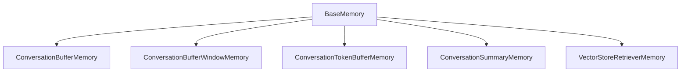

# 【LangChain编程：从入门到实践】记忆组件类型

## 1. 背景介绍
### 1.1 LangChain简介
LangChain是一个用于开发由语言模型驱动的应用程序的开源库。它可以帮助开发人员将语言模型与其他计算或知识源相结合，创建更强大的应用程序。

### 1.2 记忆组件的重要性
在构建对话式AI应用时，记忆组件扮演着至关重要的角色。它可以帮助AI保持对话的上下文，从而生成更加连贯和相关的响应。没有记忆，对话将变得支离破碎，AI无法理解用户之前说过的话。

### 1.3 本文的目的和结构
本文旨在深入探讨LangChain中的各种记忆组件类型，帮助读者理解它们的原理和使用方法。文章将首先介绍记忆组件的核心概念，然后详细讲解各种类型的原理和实现。接下来，我们将通过实际的代码示例演示如何在项目中使用这些记忆组件。最后，文章还将讨论记忆组件的实际应用场景，并对未来的发展趋势进行展望。

## 2. 核心概念与联系
### 2.1 记忆组件的定义
在LangChain中，记忆组件指的是一种用于存储和管理对话历史的机制。它可以帮助语言模型根据之前的对话内容生成更加相关和连贯的响应。

### 2.2 记忆组件与语言模型的关系
记忆组件是语言模型的重要补充。语言模型本身只能根据当前的输入生成响应，而记忆组件可以提供额外的上下文信息，帮助语言模型生成更加准确和相关的输出。

### 2.3 记忆组件的类型
LangChain提供了多种类型的记忆组件，包括:
- ConversationBufferMemory
- ConversationBufferWindowMemory 
- ConversationTokenBufferMemory
- ConversationSummaryMemory
- VectorStoreRetrieverMemory

每种类型的记忆组件都有其独特的特点和适用场景，下文将对它们进行详细介绍。

### 2.4 记忆组件之间的联系
下图展示了LangChain中各种记忆组件之间的联系:



可以看出，所有的记忆组件都继承自BaseMemory基类，它们之间的主要区别在于存储和管理对话历史的方式不同。

## 3. 核心算法原理具体操作步骤
### 3.1 ConversationBufferMemory
ConversationBufferMemory是最基本的记忆组件，它将对话历史存储在一个字符串列表中。当调用`load_memory_variables()`方法时，它会将列表中的所有字符串拼接成一个字符串，作为语言模型的附加输入。

ConversationBufferMemory的工作原理如下:
1. 初始化时，创建一个空列表`self.buffer`用于存储对话历史。
2. 每当调用`save_context()`方法时，将新的对话内容追加到`self.buffer`中。
3. 当调用`load_memory_variables()`方法时，将`self.buffer`中的所有字符串拼接成一个字符串，并返回一个包含`history`键的字典。

### 3.2 ConversationBufferWindowMemory
ConversationBufferWindowMemory是ConversationBufferMemory的变体，它只保留最近的k个对话轮次。当对话历史超过k轮时，早期的对话内容将被丢弃。

ConversationBufferWindowMemory的工作原理如下:
1. 初始化时，创建一个空列表`self.buffer`和一个整数`self.k`表示窗口大小。
2. 每当调用`save_context()`方法时，将新的对话内容追加到`self.buffer`中。如果`len(self.buffer) > self.k`，则删除`self.buffer`中最早的对话内容，直到`len(self.buffer) <= self.k`。
3. 当调用`load_memory_variables()`方法时，将`self.buffer`中的所有字符串拼接成一个字符串，并返回一个包含`history`键的字典。

### 3.3 ConversationTokenBufferMemory 
ConversationTokenBufferMemory类似于ConversationBufferWindowMemory，但它根据token数量而不是对话轮次来限制记忆的大小。当对话历史的token数量超过限制时，早期的对话内容将被丢弃。

ConversationTokenBufferMemory的工作原理如下:
1. 初始化时，创建一个空列表`self.buffer`和一个整数`self.max_token_limit`表示最大token数量。
2. 每当调用`save_context()`方法时，将新的对话内容追加到`self.buffer`中。然后计算`self.buffer`中所有字符串的token数量，如果超过`self.max_token_limit`，则删除`self.buffer`中最早的对话内容，直到token数量不超过限制。
3. 当调用`load_memory_variables()`方法时，将`self.buffer`中的所有字符串拼接成一个字符串，并返回一个包含`history`键的字典。

### 3.4 ConversationSummaryMemory
ConversationSummaryMemory使用另一个语言模型(SummarizerLLM)来总结对话历史，而不是存储完整的对话历史。这可以减少传递给主语言模型的文本量，提高效率。

ConversationSummaryMemory的工作原理如下:
1. 初始化时，创建一个空字符串`self.summary`用于存储对话摘要，并指定一个SummarizerLLM。
2. 每当调用`save_context()`方法时，将新的对话内容追加到`self.summary`中，并使用SummarizerLLM生成新的摘要。
3. 当调用`load_memory_variables()`方法时，返回一个包含`history`键的字典，其值为当前的摘要。

### 3.5 VectorStoreRetrieverMemory
VectorStoreRetrieverMemory使用向量数据库来存储和检索与当前对话相关的历史对话片段。它首先将对话历史编码为向量，然后在向量数据库中搜索与当前输入最相似的向量，最后返回对应的对话片段。

VectorStoreRetrieverMemory的工作原理如下:
1. 初始化时，创建一个VectorStore对象`self.vectorstore`和一个Retriever对象`self.retriever`。
2. 每当调用`save_context()`方法时，将新的对话内容添加到`self.vectorstore`中。
3. 当调用`load_memory_variables()`方法时，使用`self.retriever`在`self.vectorstore`中搜索与当前输入最相似的对话片段，并返回一个包含`history`键的字典，其值为检索到的对话片段。

## 4. 数学模型和公式详细讲解举例说明
### 4.1 向量相似度计算
VectorStoreRetrieverMemory中的核心操作是在向量数据库中搜索与当前输入最相似的向量。这通常使用余弦相似度来计算。

给定两个向量$\vec{a}$和$\vec{b}$，它们的余弦相似度定义为:

$$\cos(\theta) = \frac{\vec{a} \cdot \vec{b}}{\|\vec{a}\| \|\vec{b}\|} = \frac{\sum_{i=1}^n a_i b_i}{\sqrt{\sum_{i=1}^n a_i^2} \sqrt{\sum_{i=1}^n b_i^2}}$$

其中$a_i$和$b_i$分别是$\vec{a}$和$\vec{b}$的第$i$个分量，$n$是向量的维度。

余弦相似度的取值范围为$[-1, 1]$，值越大表示两个向量越相似。

例如，假设我们有两个向量:

$\vec{a} = (1, 2, 3)$
$\vec{b} = (4, 5, 6)$

它们的余弦相似度为:

$$\cos(\theta) = \frac{1 \times 4 + 2 \times 5 + 3 \times 6}{\sqrt{1^2 + 2^2 + 3^2} \sqrt{4^2 + 5^2 + 6^2}} \approx 0.9746$$

这个值非常接近1，说明这两个向量非常相似。

### 4.2 token数量估计
ConversationTokenBufferMemory需要估计字符串的token数量，以便限制记忆的大小。一种常见的估计方法是将字符串长度除以一个常数(如4)。

例如，假设我们有一个字符串:

"Hello, how are you?"

这个字符串的长度为19(包括标点和空格)。如果我们使用4作为常数，那么这个字符串的估计token数量为:

$\frac{19}{4} \approx 4.75$

我们可以将结果向上取整，得到5个token。

请注意，这只是一种粗略的估计方法，实际的token数量取决于所使用的具体标记化算法。

## 5. 项目实践：代码实例和详细解释说明
下面是一个使用ConversationBufferWindowMemory的示例代码:

```python
from langchain.memory import ConversationBufferWindowMemory
from langchain import OpenAI, LLMChain, PromptTemplate

template = """Assistant is a large language model trained by OpenAI.

Assistant is designed to be able to assist with a wide range of tasks, from answering simple questions to providing in-depth explanations and discussions on a wide range of topics. As a language model, Assistant is able to generate human-like text based on the input it receives, allowing it to engage in natural-sounding conversations and provide responses that are coherent and relevant to the topic at hand.

Assistant is constantly learning and improving, and its capabilities are constantly evolving. It is able to process and understand large amounts of text, and can use this knowledge to provide accurate and informative responses to a wide range of questions. Additionally, Assistant is able to generate its own text based on the input it receives, allowing it to engage in discussions and provide explanations and descriptions on a wide range of topics.

Overall, Assistant is a powerful tool that can help with a wide range of tasks and provide valuable insights and information on a wide range of topics. Whether you need help with a specific question or just want to have a conversation about a particular topic, Assistant is here to assist.