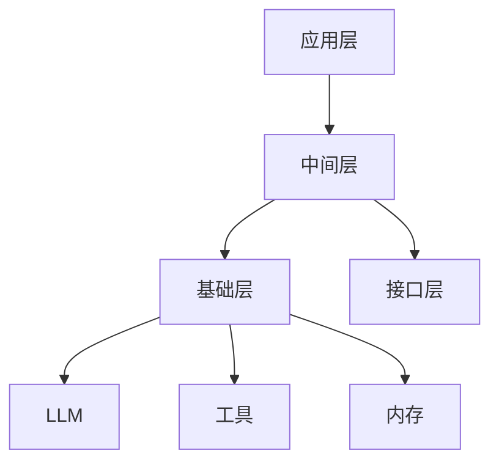

# 【LangChain编程：从入门到实践】需求分析

## 1. 背景介绍

### 1.1 人工智能的兴起

人工智能(Artificial Intelligence, AI)是当代科技发展的前沿领域,近年来受到了前所未有的关注和投资。随着计算能力的不断提升和算法的持续创新,AI技术在诸多领域展现出了巨大的潜力,如自然语言处理、计算机视觉、决策优化等。AI的崛起正在重塑着我们的生产生活方式,催生出新兴的商业模式和应用场景。

### 1.2 语义AI的重要性

在AI的多个分支中,自然语言处理(Natural Language Processing, NLP)是一个极为重要的领域。语言是人类交流和传递信息的关键载体,NLP技术赋予了机器理解和处理自然语言的能力。随着大数据时代的到来,海量的非结构化文本数据等待被挖掘和利用,因此语义AI应运而生。语义AI旨在赋予机器更深层次的语言理解能力,捕捉语言中的语义信息,从而支持更智能的人机交互和决策辅助。

### 1.3 LangChain的诞生

LangChain是一个由Anthropic公司开发的开源Python库,旨在简化语义AI应用的构建过程。它提供了一套模块化的组件和工具,帮助开发者快速集成各种大语言模型(LLM)、数据源和中间件,构建复杂的语义应用程序。LangChain的出现极大地降低了语义AI应用的开发难度,使得更多的企业和个人开发者能够享受语义AI带来的红利。

## 2. 核心概念与联系

### 2.1 LangChain的核心概念

要理解LangChain,我们需要先了解几个核心概念:

1. **代理(Agent)**: 代理是LangChain中的核心概念,它封装了一个或多个LLM,并与外部工具、数据源和其他代理进行交互,以完成特定的任务。代理可以是一个简单的问答系统,也可以是一个复杂的任务规划和执行系统。

2. **LLM(Large Language Model)**: LLM是指大型语言模型,如GPT-3、BERT等。这些模型经过了大规模的语料训练,能够理解和生成自然语言。LangChain支持集成多种LLM,如OpenAI的GPT模型、Anthropic的模型、以及自定义的LLM。

3. **工具(Tool)**: 工具是指各种外部程序、API或数据源,用于辅助代理完成任务。例如,搜索引擎API、计算器、文件系统等。代理可以根据需要调用这些工具,获取所需的信息或执行特定的操作。

4. **内存(Memory)**: 内存用于存储代理在执行任务过程中的中间状态和上下文信息。这些信息可以被代理后续访问和利用,从而支持更复杂的任务流程。

5. **链(Chain)**: 链是LangChain中的一种控制流程,它将多个代理、LLM和工具组合在一起,形成一个完整的任务处理流程。链可以是顺序执行的,也可以包含条件分支和循环等复杂逻辑。

这些核心概念相互关联,共同构建了LangChain的应用框架。开发者可以灵活地组合和配置这些组件,以满足特定的应用需求。

### 2.2 LangChain的架构概览

LangChain采用了模块化的设计,其整体架构可以概括为以下几个层次:

1. **基础层**: 包括LLM、工具、内存等基础组件,为上层应用提供支持。

2. **中间层**: 包括代理、链等核心概念,负责组织和协调基础组件的工作。

3. **应用层**: 基于中间层构建具体的应用程序,如问答系统、任务规划系统等。

4. **接口层**: 提供统一的API接口,方便与外部系统集成。

这种分层架构使得LangChain具有良好的可扩展性和可维护性。开发者可以专注于特定层次的开发,而不必过多关注其他层次的细节。同时,这种架构也便于引入新的组件和功能模块,满足不断变化的应用需求。



上图展示了LangChain的整体架构,其中:

- 应用层构建在中间层之上,实现具体的应用程序。
- 中间层包含代理、链等核心概念,负责协调和组织基础组件。
- 基础层提供LLM、工具、内存等基础组件。
- 接口层为应用层提供统一的API接口。

通过这种模块化的设计,LangChain实现了高度的灵活性和可扩展性,能够满足各种复杂的语义AI应用需求。

## 3. 核心算法原理具体操作步骤 

虽然LangChain提供了多种预定义的代理和链,但它的真正强大之处在于允许开发者自定义代理和链的行为。在这一节中,我们将探讨如何构建一个自定义的代理,并介绍其核心算法原理和具体操作步骤。

### 3.1 代理的基本结构

在LangChain中,代理是一个Python类,它需要实现以下几个核心方法:

1. `__init__`: 初始化代理,设置LLM、工具、内存等组件。
2. `plan`: 根据当前状态规划出一系列行动步骤。
3. `act`: 执行规划好的行动步骤,可能会调用工具或LLM。
4. `analyze_result`: 分析行动的结果,决定是否需要进一步行动。

这些方法共同构成了代理的基本框架,控制着代理的整个生命周期。开发者可以通过实现这些方法来定制代理的行为。

### 3.2 代理的核心算法

代理的核心算法体现在`plan`方法中,它决定了代理如何根据当前状态规划出行动步骤。LangChain提供了多种不同的规划算法,开发者可以根据需求选择合适的算法。

以下是一些常见的规划算法:

1. **Zero-Shot规划**: 直接让LLM根据给定的指令生成行动步骤,适用于简单的任务。
2. **基于反馈的规划(MRKL)**: 基于人类反馈,通过迭代优化的方式学习规划策略。
3. **基于奖励建模的规划(RM)**: 使用奖励模型评估行动序列的质量,并优化规划策略。
4. **基于示例的规划**: 通过示例训练一个规划模型,根据当前状态生成行动步骤。

不同的规划算法具有不同的优缺点,开发者需要根据任务的复杂性、可用的数据和计算资源等因素进行权衡选择。

### 3.3 代理的具体操作步骤

以下是构建一个自定义代理的典型操作步骤:

1. **定义任务**: 明确代理需要完成的任务,确定所需的LLM、工具和数据源。

2. **选择规划算法**: 根据任务的复杂性和可用资源,选择合适的规划算法。

3. **实现核心方法**: 实现`__init__`、`plan`、`act`和`analyze_result`等核心方法,定制代理的行为。

4. **配置组件**: 配置LLM、工具、内存等组件,并将它们注入到代理中。

5. **训练和优化(可选)**: 对于基于示例或反馈的规划算法,需要收集数据并训练规划模型。

6. **测试和调试**: 使用测试用例和示例输入测试代理的行为,并进行必要的调试和优化。

7. **部署和集成**: 将代理集成到更大的应用程序中,或者通过API暴露给其他系统使用。

通过这些步骤,开发者可以构建出满足特定需求的自定义代理,充分发挥LangChain的灵活性和可扩展性。

## 4. 数学模型和公式详细讲解举例说明

在构建语义AI应用时,我们通常需要处理和理解各种数学公式和模型。LangChain提供了多种工具和技术来简化这一过程,本节将详细介绍其中的一些关键方法。

### 4.1 符号计算

符号计算是指对数学表达式进行代数运算和简化,而不是直接计算数值结果。LangChain通过集成SymPy库,支持对符号表达式进行各种操作,如:

- 简化表达式: $$\frac{x^2 + 2x + 1}{x + 1} = x + 1$$
- 求导数: $$\frac{d}{dx}(x^2 + 2x + 1) = 2x + 2$$
- 解方程: $$x^2 - 4x + 3 = 0 \Rightarrow x = 3, 1$$

这些符号计算能力可以帮助代理理解和处理复杂的数学表达式,支持更高级的任务,如公式推导、方程求解等。

### 4.2 数学解析

除了符号计算,LangChain还提供了数学解析功能,可以从自然语言中提取数学表达式,并将其转换为计算机可理解的形式。这一功能依赖于自然语言处理技术,如命名实体识别、语义解析等。

例如,给定自然语言描述"将x平方加上2x再加1",LangChain可以将其解析为数学表达式$x^2 + 2x + 1$。这种解析能力使得代理能够更自然地与人类交互,处理包含数学内容的自然语言输入。

### 4.3 概率模型

在许多应用场景中,我们需要处理概率模型和统计数据。LangChain通过集成Python的统计学库(如NumPy、SciPy等),支持各种概率分布和统计操作,如:

- 计算正态分布的概率密度函数(PDF)和累积分布函数(CDF)
- 生成随机数据,模拟概率过程
- 进行假设检验和置信区间估计

这些概率模型和统计工具可以帮助代理进行数据分析、风险评估和决策优化等任务。

### 4.4 数值计算

在某些情况下,我们需要进行高精度的数值计算,如工程设计、金融建模等。LangChain可以与专业的数值计算库(如MATLAB、Mathematica等)集成,利用它们强大的数值计算能力。

例如,我们可以使用MATLAB求解复杂的微分方程:

$$\frac{\partial^2 u}{\partial x^2} + \frac{\partial^2 u}{\partial y^2} = f(x, y)$$

或者使用Mathematica进行符号推导:

$$\int_0^1 \frac{x^n}{1+x^2} dx = \frac{1}{2}(\psi(\frac{n+1}{2}) - \psi(\frac{n}{2}))$$

通过与这些专业工具的集成,LangChain可以支持更广泛的数学和科学计算需求。

综上所述,LangChain提供了全面的数学和科学计算支持,涵盖了符号计算、数学解析、概率模型和数值计算等多个方面。这些功能为构建智能的数学辅助系统、科学计算助手等应用奠定了坚实的基础。

## 5. 项目实践: 代码实例和详细解释说明

为了更好地理解LangChain的使用方式,本节将通过一个具体的项目实践来演示如何构建一个简单的问答代理。我们将逐步介绍代码实现的各个部分,并对关键步骤进行详细解释。

### 5.1 项目概述

我们将构建一个基于LangChain的问答代理,它可以回答有关"Python编程"主题的各种问题。代理将利用Wikipedia作为知识源,并使用OpenAI的GPT模型作为LLM。

整个项目将包括以下几个主要步骤:

1. 加载Wikipedia数据
2. 初始化OpenAI LLM
3. 创建问答代理
4. 与代理进行交互

### 5.2 加载Wikipedia数据

首先,我们需要加载Wikipedia的数据,作为代理的知识源。LangChain提供了一个名为`WikipediaLoader`的工具,可以方便地从Wikipedia下载和处理数据。

```python
from langchain.utilities import WikipediaAPIWrapper
wikipedia = WikipediaAPIWrapper()

# 下载与"Python编程"相关的Wikipedia页面
python_docs = wikipedia.load(["