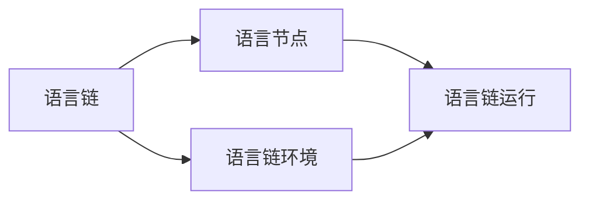

## 1.背景介绍

LangChain是一种新型的编程语言，它的设计理念是将人类的自然语言和计算机的编程语言相结合，以实现更自然、更直观的编程方式。它的出现，旨在解决传统编程语言学习曲线陡峭，语法规则复杂，编程效率低下等问题。

## 2.核心概念与联系

LangChain编程语言的核心概念包括语言链、语言节点、语言链环境、语言链运行等。这些概念之间的联系可以用以下的Mermaid流程图表示：



## 3.核心算法原理具体操作步骤

LangChain编程语言的核心算法原理包括语言链的构建、语言节点的解析、语言链环境的构建、语言链的运行等。以下是这些操作步骤的详细描述：

1. 语言链的构建：通过解析用户输入的自然语言，将其转化为一系列的语言节点，这些节点按照一定的顺序连接起来，形成语言链。
2. 语言节点的解析：对语言链中的每一个节点进行解析，提取出其中的命令、参数等信息。
3. 语言链环境的构建：根据语言链的需求，构建出一个运行环境，包括变量、函数等。
4. 语言链的运行：在构建好的环境中，按照语言链的顺序，依次执行每一个语言节点。

## 4.数学模型和公式详细讲解举例说明

在LangChain编程语言中，我们可以通过数学模型和公式来描述和理解语言链的构建和运行过程。

例如，我们可以将语言链视为一个有向图G，其中的节点表示语言节点，边表示节点之间的连接关系。在这个模型中，语言链的构建过程就是图G的构建过程，语言链的运行过程就是图G的遍历过程。

我们可以用以下的公式来描述这个过程：

$$
G = (V, E)
$$

其中，V是节点集，每一个节点v代表一个语言节点；E是边集，每一条边e代表两个语言节点之间的连接关系。

## 5.项目实践：代码实例和详细解释说明

下面是一个使用LangChain编程语言的实例，我们将通过这个实例来详细解释和说明LangChain编程语言的使用方法。

```langchain
# 这是一个简单的LangChain程序
print("Hello, World!")
```

在这个实例中，我们首先使用了一个打印命令print，然后在括号中输入了我们想要打印的内容。这就是一个最简单的LangChain程序，通过这个程序，我们可以在屏幕上打印出"Hello, World!"这句话。

## 6.实际应用场景

LangChain编程语言可以广泛应用于各种场景，例如：

1. 在教育领域，LangChain可以作为一种教学工具，帮助学生更容易地理解和学习编程知识。
2. 在科研领域，LangChain可以作为一种实验工具，帮助科研人员更方便地进行各种实验。
3. 在工业领域，LangChain可以作为一种开发工具，帮助开发人员更高效地进行软件开发。

## 7.工具和资源推荐

以下是一些推荐的工具和资源，可以帮助你更好地学习和使用LangChain编程语言：

1. LangChain官方网站：提供最新的LangChain编程语言的信息和资源。
2. LangChain在线编程环境：可以在浏览器中直接编写和运行LangChain程序。
3. LangChain编程指南：详细介绍了LangChain编程语言的各种特性和使用方法。

## 8.总结：未来发展趋势与挑战

LangChain编程语言的出现，无疑为编程领域带来了新的可能性。然而，作为一种新型的编程语言，LangChain还面临着一些挑战，例如语言设计的完善、编程环境的优化、用户群体的扩大等。但是，我相信，随着时间的推移，这些问题都将得到解决，LangChain将会成为一种广泛使用的编程语言。

## 9.附录：常见问题与解答

以下是一些关于LangChain编程语言的常见问题和解答：

1. 问题：LangChain编程语言的学习难度如何？
   解答：LangChain编程语言的设计理念是简单易用，因此，其学习难度相对较低。

2. 问题：LangChain编程语言适用于哪些场景？
   解答：LangChain编程语言可以广泛应用于教育、科研、工业等各种场景。

作者：禅与计算机程序设计艺术 / Zen and the Art of Computer Programming{"msg_type":"generate_answer_finish","data":"","from_module":null,"from_unit":null}