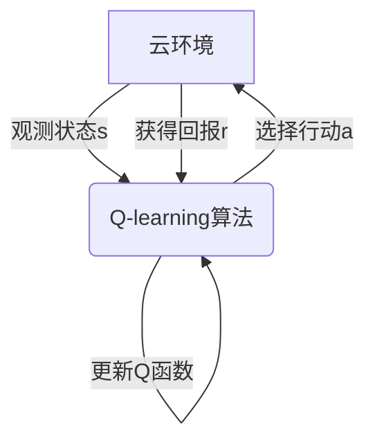

# 一切皆是映射：AI Q-learning在云计算中的实践

## 1.背景介绍

### 1.1 云计算的兴起

近年来,云计算技术的快速发展推动了信息技术的革新。云计算通过提供按需使用、快速部署、可扩展的计算资源,为企业带来了前所未有的灵活性和成本节约。然而,随着业务需求的不断变化,有效管理和优化云资源的分配和利用成为了一个巨大的挑战。

### 1.2 资源管理的挑战

在云计算环境中,资源管理是一项复杂的任务。它需要平衡多个相互矛盾的目标,如成本最小化、性能最大化、高可用性和负载均衡等。传统的基于规则的方法往往效率低下,难以适应动态变化的环境。因此,需要一种更智能、更自适应的资源管理方法。

### 1.3 AI在云计算中的作用

人工智能(AI)技术为解决云资源管理问题提供了新的思路。其中,强化学习(Reinforcement Learning)是一种基于奖惩机制的机器学习方法,能够通过与环境的交互来学习最优策略。Q-learning作为强化学习的一种重要算法,已被成功应用于各种决策问题,展现出了巨大的潜力。

## 2.核心概念与联系

### 2.1 Q-learning概述

Q-learning是一种基于时序差分(Temporal Difference)的强化学习算法,它通过不断尝试和学习,逐步优化行为策略,以获得最大的累积回报。Q-learning的核心思想是建立一个Q函数,用于估计在特定状态下采取某个行动所能获得的期望回报。

$$Q(s,a) = r(s,a) + \gamma \max_{a'} Q(s',a')$$

其中,
- $Q(s,a)$表示在状态$s$下采取行动$a$的期望回报
- $r(s,a)$表示在状态$s$下采取行动$a$获得的即时回报
- $\gamma$是折现因子,用于平衡即时回报和未来回报的权重
- $s'$表示由状态$s$和行动$a$转移到的新状态
- $\max_{a'} Q(s',a')$表示在新状态$s'$下能获得的最大期望回报

通过不断更新Q函数,Q-learning算法可以逐步找到最优策略。

### 2.2 Q-learning在云计算中的应用

在云计算环境中,我们可以将资源管理问题建模为一个马尔可夫决策过程(MDP):

- 状态($s$):描述当前的资源使用情况、负载等
- 行动($a$):分配或回收资源等操作
- 回报($r$):根据成本、性能等指标计算得到的奖惩

Q-learning算法通过与云环境的交互,不断更新Q函数,从而学习到一个最优的资源管理策略。这种基于AI的自适应方法可以动态调整资源分配,提高资源利用效率,降低运营成本。



## 3.核心算法原理具体操作步骤

Q-learning算法的核心步骤如下:

1. 初始化Q函数,对所有状态-行动对赋予一个较小的初始值。
2. 观测当前状态$s$。
3. 根据当前Q函数值,选择一个行动$a$。常用的选择策略有$\epsilon$-贪婪策略和softmax策略。
4. 执行选择的行动$a$,观测到新状态$s'$和即时回报$r$。
5. 根据下式更新Q函数:

$$Q(s,a) \leftarrow Q(s,a) + \alpha [r + \gamma \max_{a'} Q(s',a') - Q(s,a)]$$

其中$\alpha$是学习率,控制更新的幅度。
6. 将$s'$设为当前状态,回到步骤3,重复上述过程。

通过不断探索和利用,Q-learning算法可以逐渐收敛到最优策略。

### 3.1 探索与利用的权衡

在Q-learning中,探索(Exploration)和利用(Exploitation)之间需要平衡:

- 探索:尝试新的行动,以发现潜在的更优策略
- 利用:选择当前已知的最优行动,以获得最大回报

一种常用的权衡方法是$\epsilon$-贪婪策略:

- 以$\epsilon$的概率随机选择一个行动(探索)
- 以$1-\epsilon$的概率选择当前Q值最大的行动(利用)

$\epsilon$的值通常会随着时间的推移而递减,以确保算法最终收敛到最优策略。

### 3.2 离线更新与在线更新

Q-learning算法可以采用离线更新或在线更新的方式:

- 离线更新:先收集大量的状态转移样本,然后使用这些样本批量更新Q函数。这种方式计算效率高,但需要大量存储空间。
- 在线更新:每观测到一个状态转移样本,就立即更新Q函数。这种方式计算量较小,但收敛速度较慢。

在云计算场景中,通常采用在线更新的方式,以便算法能够实时响应环境的变化。

## 4.数学模型和公式详细讲解举例说明

### 4.1 马尔可夫决策过程(MDP)

云资源管理问题可以建模为一个马尔可夫决策过程(MDP),它是一个由五元组$(S, A, P, R, \gamma)$构成的数学模型:

- $S$是状态空间的集合
- $A$是行动空间的集合
- $P(s'|s,a)$是状态转移概率,表示在状态$s$下执行行动$a$后,转移到状态$s'$的概率
- $R(s,a)$是回报函数,表示在状态$s$下执行行动$a$所获得的即时回报
- $\gamma \in [0,1)$是折现因子,用于平衡即时回报和未来回报的权重

在MDP中,我们的目标是找到一个策略$\pi: S \rightarrow A$,使得期望的累积折现回报最大化:

$$G_t = \mathbb{E}\left[ \sum_{k=0}^\infty \gamma^k r_{t+k+1} \right]$$

其中$r_t$是在时间$t$获得的即时回报。

### 4.2 Q-learning更新规则

Q-learning算法通过不断更新Q函数来逼近最优策略。Q函数的更新规则如下:

$$Q(s_t,a_t) \leftarrow Q(s_t,a_t) + \alpha \left[ r_t + \gamma \max_{a} Q(s_{t+1},a) - Q(s_t,a_t) \right]$$

其中:

- $\alpha$是学习率,控制更新的幅度
- $r_t$是执行行动$a_t$后获得的即时回报
- $\gamma$是折现因子
- $\max_{a} Q(s_{t+1},a)$是在新状态$s_{t+1}$下能获得的最大期望回报

这个更新规则基于贝尔曼方程(Bellman Equation):

$$Q^*(s,a) = \mathbb{E}_{s'}\left[ r + \gamma \max_{a'} Q^*(s',a') \right]$$

它表示,最优Q函数$Q^*(s,a)$等于在状态$s$下执行行动$a$获得的即时回报$r$,加上从下一状态$s'$开始获得的最大期望回报的折现值。

通过不断更新Q函数,使其逐渐逼近最优Q函数$Q^*$,Q-learning算法就能找到最优策略。

### 4.3 示例:云资源调度

假设我们有一个简化的云资源调度问题,需要根据当前的CPU利用率和内存利用率来决定是否需要扩展或缩减资源。

- 状态空间$S$:包含所有可能的CPU利用率和内存利用率组合
- 行动空间$A$:包含"增加CPU"、"减少CPU"、"增加内存"、"减少内存"和"不做操作"五种行动
- 状态转移概率$P(s'|s,a)$:根据当前状态和行动,计算转移到新状态的概率
- 回报函数$R(s,a)$:根据成本和性能等指标,计算行动的回报值

我们可以使用Q-learning算法来学习一个最优的资源调度策略,从而实现成本和性能的最佳平衡。

## 5.项目实践:代码实例和详细解释说明

以下是一个使用Python实现的简单Q-learning示例,用于解决一个网格世界(GridWorld)问题。

### 5.1 问题描述

在一个4x4的网格世界中,智能体的目标是从起点(0,0)到达终点(3,3)。网格中存在一些障碍物,智能体不能穿过。智能体可以执行四种行动:上、下、左、右。每一步行动都会获得-1的回报,到达终点后获得+10的回报。

### 5.2 代码实现

```python
import numpy as np

# 定义网格参数
GRID_SIZE = 4
OBSTACLE_COORDS = [(1, 1), (1, 2), (2, 1), (3, 1)]  # 障碍物坐标
START_STATE = (0, 0)  # 起点
GOAL_STATE = (3, 3)  # 终点

# 定义行动
ACTIONS = ['up', 'down', 'left', 'right']

# 定义回报函数
def get_reward(state, action, next_state):
    if next_state == GOAL_STATE:
        return 10
    elif next_state in OBSTACLE_COORDS:
        return -10  # 撞到障碍物
    else:
        return -1  # 正常移动

# 定义状态转移函数
def get_next_state(state, action):
    row, col = state
    if action == 'up':
        next_state = (max(row - 1, 0), col)
    elif action == 'down':
        next_state = (min(row + 1, GRID_SIZE - 1), col)
    elif action == 'left':
        next_state = (row, max(col - 1, 0))
    else:
        next_state = (row, min(col + 1, GRID_SIZE - 1))
    return next_state

# 初始化Q表
Q = np.zeros((GRID_SIZE, GRID_SIZE, len(ACTIONS)))

# 设置学习参数
ALPHA = 0.1  # 学习率
GAMMA = 0.9  # 折现因子
EPSILON = 0.1  # 探索率
MAX_EPISODES = 10000  # 最大训练回合数

# Q-learning算法
for episode in range(MAX_EPISODES):
    state = START_STATE
    done = False
    while not done:
        # 选择行动
        if np.random.uniform() < EPSILON:
            action = np.random.choice(ACTIONS)  # 探索
        else:
            action = ACTIONS[np.argmax(Q[state])]  # 利用

        # 执行行动
        next_state = get_next_state(state, action)
        reward = get_reward(state, action, next_state)

        # 更新Q表
        Q[state][ACTIONS.index(action)] += ALPHA * (
            reward + GAMMA * np.max(Q[next_state]) - Q[state][ACTIONS.index(action)]
        )

        # 更新状态
        state = next_state

        # 检查是否到达终点
        if state == GOAL_STATE:
            done = True

# 输出最优路径
state = START_STATE
path = [state]
while state != GOAL_STATE:
    action = ACTIONS[np.argmax(Q[state])]
    state = get_next_state(state, action)
    path.append(state)

print("最优路径:", path)
```

### 5.3 代码解释

1. 首先定义网格参数,包括网格大小、障碍物坐标、起点和终点。
2. 定义四种可能的行动:上、下、左、右。
3. 定义回报函数`get_reward`。到达终点获得+10的回报,撞到障碍物获得-10的回报,正常移动获得-1的回报。
4. 定义状态转移函数`get_next_state`,根据当前状态和行动计算下一个状态。
5. 初始化Q表,大小为(网格大小,网格大小,行动数量)。
6. 设置学习参数:学习率`ALPHA`、折现因子`GAMMA`、探索率`EPSILON`和最大训练回合数`MAX_EPISODES`。
7. 开始Q-learning算法的训练过程。每一回合,智能体从起点出发:
   - 根据$\epsilon$-贪婪策略选择行动
   - 执行选择的行动,获得下一个状态和即时回报
   - 根据Q-learning更新规则更新Q表
   - 更新当前状