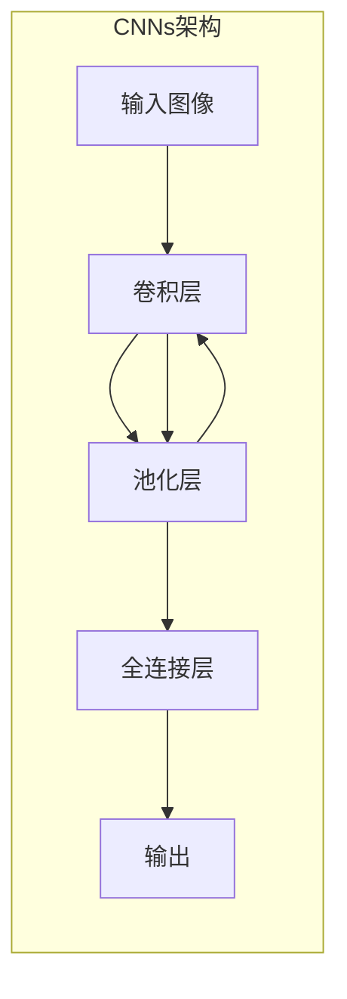
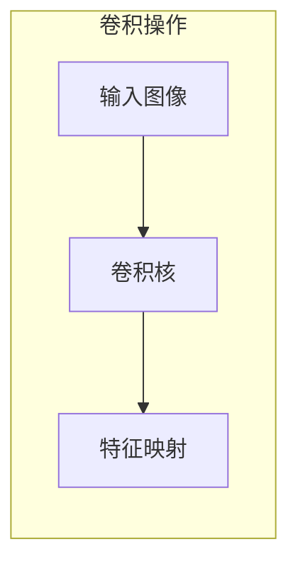
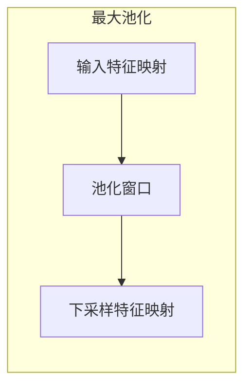

# 一切皆是映射：卷积神经网络(CNNs)在图像处理中的应用

## 1.背景介绍

### 1.1 图像处理的重要性

在当今数字时代,图像处理已经无处不在,从日常生活到科学研究,从娱乐到安全监控,图像数据都扮演着至关重要的角色。有效地处理和理解图像数据对于各种应用领域都至关重要,例如:

- **计算机视觉**:自动驾驶汽车、无人机导航等需要实时处理图像数据。
- **医疗影像**:X光、CT、MRI等医学成像技术产生的图像需要被分析和诊断。 
- **遥感**:通过卫星和无人机获取的遥感图像可用于环境监测、农业等领域。
- **多媒体**:图像/视频压缩、增强、检索等处理是多媒体应用的基础。

### 1.2 图像处理的挑战

然而,图像处理并非一蹴而就的简单任务。原始图像数据通常包含大量冗余和噪声信息,这给提取有用特征带来了挑战。此外,不同的图像可能具有复杂的视觉模式、不同的分辨率、光照条件等,使得设计通用的图像处理算法变得困难。

传统的图像处理方法,如基于手工设计的特征提取和分类器,需要大量的领域知识和人工努力。而随着深度学习的兴起,卷积神经网络(Convolutional Neural Networks, CNNs)为图像处理任务提供了一种全新的解决方案。

## 2.核心概念与联系

### 2.1 神经网络与深度学习

深度学习是机器学习的一个新兴热点领域,其核心思想是使用具有多个隐藏层的人工神经网络来自动从数据中学习特征表示。与传统的机器学习方法相比,深度学习模型可以直接从原始数据(如图像像素)中自动学习层次化的特征表示,而无需人工设计复杂的特征提取器。

神经网络是深度学习的基础模型,它通过模拟生物神经元的工作原理,构建了一种由大量互连的计算单元(神经元)组成的数学模型。每个神经元接收来自前一层的输入,经过加权求和和非线性激活函数的计算,产生自己的输出,并传递给下一层。通过反向传播算法对网络中的权重参数进行优化训练,神经网络就能够从数据中自动学习特征,并对新的输入数据进行预测或决策。

### 2.2 卷积神经网络(CNNs)

卷积神经网络是一种专门用于处理网格结构数据(如图像)的深度神经网络。与普通的全连接神经网络不同,CNNs通过卷积(Convolution)和池化(Pooling)操作来提取图像的局部特征,并利用权重共享机制大幅减少网络参数,从而更高效地捕捉图像的空间和时间相关性。

CNNs的核心思想是局部连接(local connectivity)和权值共享(weight sharing)。局部连接使得每个神经元仅与输入数据的一个局部区域相连,从而提取该区域的局部特征;而权值共享则使得在整个输入数据上滑动的神经元共享相同的权值,从而大大降低了网络参数量。通过多层卷积和池化操作,CNNs能够逐层提取图像的低级到高级的抽象特征。



CNNs已经在图像处理领域取得了巨大的成功,在图像分类、目标检测、语义分割等任务上都表现出色,成为计算机视觉的主导模型。

## 3.核心算法原理具体操作步骤  

### 3.1 卷积层

卷积(Convolution)是CNNs中最关键的操作之一。它的工作原理是,使用一个可学习的小权重滤波器(kernel)在输入图像上滑动,对每个局部区域进行加权求和,得到该区域的特征响应。通过在整个输入上滑动该滤波器,我们就可以为输入数据提取一个特征映射(feature map)。

具体地,给定一个输入图像 $I$ 和一个卷积核 $K$,卷积操作在每个位置 $(m,n)$ 计算:

$$
(I * K)(m, n) = \sum_{i, j} I(m+i, n+j) \cdot K(i, j)
$$

其中,卷积核 $K$ 在输入图像 $I$ 上滑动,在每个位置对相应的局部区域进行加权求和。通过在整个输入上滑动该卷积核,我们就得到了一个特征映射输出。



卷积层通常包含多个卷积核,每个卷积核可以提取不同的特征模式。通过堆叠多个卷积层,CNNs能够从低级的边缘和纹理特征,逐步提取到高级的形状和物体部件特征。

### 3.2 池化层

池化(Pooling)是CNNs中另一个重要操作,它的作用是对卷积层的输出进行下采样,减小特征映射的维度。最常用的池化方法是最大池化(Max Pooling),它从输入特征映射中的每个小窗口区域中选取最大值作为输出。

具体地,给定一个输入特征映射 $F$ 和一个池化窗口大小 $k \times k$,最大池化在每个窗口 $(m, n)$ 计算:

$$
\text{pool}(F)(m, n) = \max_{i, j \in k \times k} F(m+i, n+j)
$$

通过池化操作,CNNs可以获得一些平移不变性,使特征映射对于输入的小变化更加稳健。此外,池化还能够减小特征映射的维度,从而降低后续层的计算复杂度。



通常,卷积层和池化层会交替堆叠,先使用卷积层提取局部特征,再通过池化层进行下采样,从而逐步捕捉输入数据的不同层次抽象特征。

## 4.数学模型和公式详细讲解举例说明

### 4.1 卷积神经网络的前向传播

为了更好地理解卷积神经网络的工作原理,让我们详细推导一下其前向传播过程。假设我们有一个输入图像 $X$,经过一个卷积层和一个池化层,得到特征映射 $H$。

1) **卷积层**

令卷积层的卷积核为 $K$,偏置为 $b$,输入特征映射为 $X$,则卷积层的输出特征映射 $Z$ 可以表示为:

$$
Z_{x,y} = \sum_{i,j} X_{x+i,y+j} \cdot K_{i,j} + b
$$

其中,$(x,y)$ 表示输出特征映射 $Z$ 中的位置,求和是在卷积核 $K$ 的感受野范围内进行的。通常,我们会对输入特征映射 $X$ 进行零填充(zero-padding),以控制输出特征映射的空间维度。

2) **激活函数**

为了增加卷积神经网络的非线性表达能力,我们通常会在卷积层的输出上应用一个非线性激活函数,如ReLU函数:

$$
H = \text{ReLU}(Z) = \max(0, Z)
$$

ReLU函数能够保留正值,抑制负值,从而引入非线性,同时也有助于缓解梯度消失问题。

3) **池化层**

经过激活函数后,我们得到了特征映射 $H$,接下来对其进行池化操作。最常用的是最大池化(Max Pooling),在每个池化窗口内取最大值:

$$
H^{pool}_{x,y} = \max_{i,j \in R} H_{x \cdot s + i, y \cdot s + j}
$$

其中,$(x,y)$ 表示输出池化特征映射 $H^{pool}$ 中的位置, $R$ 是池化窗口的大小(如 $2 \times 2$), $s$ 是池化窗口的步长。

通过上述卷积、激活和池化操作,我们就完成了卷积神经网络的一个基本模块。在实际应用中,这些基本模块会被堆叠成多层网络,以捕捉输入数据越来越抽象的特征表示。

### 4.2 卷积神经网络的反向传播

为了训练卷积神经网络,我们需要计算损失函数相对于网络权重的梯度,并使用优化算法(如随机梯度下降)来更新权重,从而最小化损失函数。这个过程称为反向传播(Back Propagation)。

假设我们的损失函数为 $\mathcal{L}$,输出特征映射为 $H^{pool}$,池化层的输入为 $H$,卷积层的输入为 $X$,权重为 $K$,偏置为 $b$。根据链式法则,我们可以计算损失函数相对于权重和偏置的梯度:

$$
\begin{aligned}
\frac{\partial \mathcal{L}}{\partial K} &= \sum_{x,y} \frac{\partial \mathcal{L}}{\partial H^{pool}_{x,y}} \cdot \frac{\partial H^{pool}_{x,y}}{\partial H} \cdot \frac{\partial H}{\partial Z} \cdot \frac{\partial Z}{\partial K} \\
\frac{\partial \mathcal{L}}{\partial b} &= \sum_{x,y} \frac{\partial \mathcal{L}}{\partial H^{pool}_{x,y}} \cdot \frac{\partial H^{pool}_{x,y}}{\partial H} \cdot \frac{\partial H}{\partial Z} \cdot \frac{\partial Z}{\partial b}
\end{aligned}
$$

其中,各项分别表示:

- $\frac{\partial \mathcal{L}}{\partial H^{pool}_{x,y}}$: 损失函数相对于池化层输出的梯度,可以通过后续层的反向传播计算得到。
- $\frac{\partial H^{pool}_{x,y}}{\partial H}$: 池化层的梯度,对于最大池化,它只保留了每个池化窗口中最大值对应的位置的梯度,其余位置的梯度为0。
- $\frac{\partial H}{\partial Z}$: 激活函数的梯度,对于ReLU函数,大于0的梯度为1,小于等于0的梯度为0。
- $\frac{\partial Z}{\partial K}$和$\frac{\partial Z}{\partial b}$: 卷积层的梯度,分别是卷积输出 $Z$ 相对于权重 $K$ 和偏置 $b$ 的梯度。

通过上述计算,我们就可以得到损失函数相对于卷积层权重和偏置的梯度。然后,我们可以使用优化算法(如随机梯度下降)来更新权重和偏置,从而最小化损失函数,完成卷积神经网络的训练过程。

需要注意的是,在实际应用中,我们通常会使用自动微分工具(如TensorFlow或PyTorch)来自动计算这些梯度,而不是手动推导和编码。这些工具可以极大地简化深度学习模型的开发和训练过程。

## 5.项目实践:代码实例和详细解释说明

为了更好地理解卷积神经网络的工作原理,让我们通过一个实际的代码示例来演示如何使用Python和PyTorch构建并训练一个简单的CNN模型,用于手写数字识别任务。

我们将使用经典的MNIST数据集,它包含60,000个训练图像和10,000个测试图像,每个图像都是一个28x28的手写数字(0-9)灰度图像。

### 5.1 导入必要的库

```python
import torch
import torch.nn as nn
import torch.nn.functional as F
import torchvision
import torchvision.transforms as transforms
```

### 5.2 加载和预处理数据

```python
# 下载并加载MNIST数据集
train_dataset = torchvision.datasets.MNIST(root='./data', train=True, transform=transforms.ToTensor(), download=True)
test_dataset = torchvision.datasets.MNIST(root='./data', train=