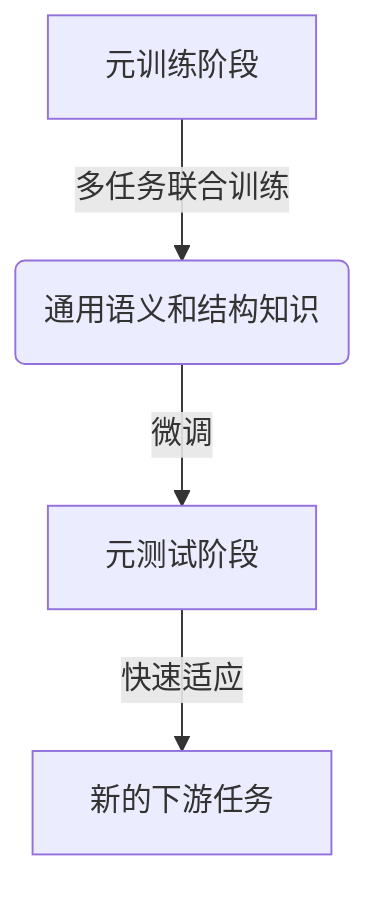
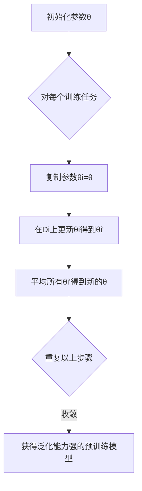

# 一切皆是映射：基于元学习的自然语言处理模型预训练

## 1. 背景介绍

### 1.1 自然语言处理的重要性

自然语言处理(Natural Language Processing, NLP)是人工智能领域的一个核心分支,旨在使计算机能够理解和生成人类语言。随着大数据时代的到来,海量的自然语言数据不断涌现,对NLP技术的需求也与日俱增。NLP技术已广泛应用于机器翻译、智能问答、情感分析、文本摘要等诸多领域,为提升人机交互体验和挖掘文本数据价值做出了重要贡献。

### 1.2 预训练模型的兴起

传统的NLP模型通常需要针对特定任务进行训练,这种方式存在一些局限性:

1. 需要大量手动标注的数据,成本高昂;
2. 模型的泛化能力较差,难以迁移到其他领域;
3. 模型架构复杂,需要专门设计特征工程。

为了解决这些问题,预训练语言模型(Pre-trained Language Model, PLM)应运而生。PLM在大规模无标注语料库上进行预训练,学习通用的语言表示,然后再对下游任务进行微调(fine-tuning),大幅提高了NLP模型的性能和泛化能力。

### 1.3 元学习(Meta-Learning)的概念

元学习是机器学习中的一个新兴范式,旨在提高模型的学习能力和泛化性。与传统的"一次学习"不同,元学习通过在多个相关任务上进行学习,获取任务之间的共性知识,从而更快地适应新任务。这种"学会学习"的思路为解决NLP等领域中的"少样本学习"问题提供了新的视角。

## 2. 核心概念与联系

### 2.1 元学习在NLP中的应用

将元学习思想引入NLP预训练模型,可以提高模型在新领域和少样本场景下的适应能力。具体来说,元学习可以帮助预训练模型从多个NLP任务中捕获通用的语义和结构模式,从而更快地适应新的下游任务。

### 2.2 基于元学习的预训练范式

基于元学习的NLP预训练模型通常分为两个阶段:

1. **元训练(Meta-Training)阶段**:在多个NLP任务的数据集上进行联合训练,学习任务之间的共性知识。
2. **元测试(Meta-Testing)阶段**:在新的下游任务上进行微调,利用元训练阶段获取的知识快速适应新任务。

这种范式类似于人类的学习过程:我们先从多个场景中总结出通用的知识和经验,再将其应用于新的具体情况。



### 2.3 基于元学习的预训练模型示例

一些代表性的基于元学习的NLP预训练模型包括:

- **MT-DNN**:通过对多个NLP任务进行多任务学习,提高了模型的泛化能力。
- **ERNIE Meta**:采用元学习框架对预训练模型进行优化,在少样本场景下表现优异。
- **MetaDialog**:专门针对对话系统设计的基于元学习的预训练模型。

这些模型展示了元学习在NLP预训练中的广阔前景。

## 3. 核心算法原理具体操作步骤

### 3.1 模型优化目标

基于元学习的NLP预训练模型的优化目标可以形式化为:

$$\underset{\theta}{\mathrm{min}}\sum_{i=1}^{N}\mathcal{L}_{\mathcal{D}_i}(f_{\theta'_i})$$

其中:
- $\theta$是预训练模型的参数
- $N$是训练任务的数量
- $\mathcal{D}_i$是第$i$个任务的训练数据集
- $f_{\theta'_i}$是在第$i$个任务上经过微调后的模型
- $\mathcal{L}_{\mathcal{D}_i}$是第$i$个任务的损失函数

该目标旨在找到一个初始参数$\theta$,使得在所有训练任务上经过微调后的模型性能最优。

### 3.2 模型优化算法

常见的模型优化算法包括:

1. **REPTILE算法**:通过在每个任务上进行梯度更新,然后将所有任务的参数进行平均,从而获得通用的初始参数。

2. **MAML算法**:直接对初始参数进行梯度更新,使得在所有任务上经过一步梯度下降后的性能最优。

3. **在线元学习算法**:将元训练过程建模为一个在线学习问题,通过不断观察新任务并更新参数来获得通用初始参数。

这些算法在计算效率和性能之间进行了权衡,可以根据具体需求进行选择。

### 3.3 算法实现步骤

以REPTILE算法为例,基于元学习的NLP预训练模型的训练过程可分为以下步骤:

1. 初始化预训练模型参数$\theta$。
2. 对每个训练任务$\mathcal{D}_i$:
    a. 从$\theta$复制出一个新的参数$\theta_i$。
    b. 在$\mathcal{D}_i$上对$\theta_i$进行$k$步梯度更新,得到$\theta_i'$。
3. 将所有任务的$\theta_i'$进行平均,得到新的$\theta$。
4. 重复步骤2-3,直到收敛。

通过这种方式,预训练模型可以逐步获取多个任务的共性知识,提高在新任务上的适应能力。



## 4. 数学模型和公式详细讲解举例说明

在3.1小节中,我们形式化了基于元学习的NLP预训练模型的优化目标:

$$\underset{\theta}{\mathrm{min}}\sum_{i=1}^{N}\mathcal{L}_{\mathcal{D}_i}(f_{\theta'_i})$$

让我们具体分析一下这个公式:

- $\theta$是我们要优化的预训练模型参数,也是这个优化问题的自变量。
- $N$是训练任务的总数,通常是一个较大的正整数,以确保预训练模型能够从多个任务中学习到通用的知识。
- $\mathcal{D}_i$代表第$i$个训练任务的数据集,可以是一个标注的语料库、一个分类任务的数据等。
- $f_{\theta'_i}$表示在第$i$个任务上经过微调后的模型,其中$\theta'_i$是从初始参数$\theta$经过几步梯度更新得到的新参数。
- $\mathcal{L}_{\mathcal{D}_i}(f_{\theta'_i})$是第$i$个任务上的损失函数,用于评估微调后模型在该任务上的性能,损失函数的选择取决于任务的具体类型(如分类任务可用交叉熵损失)。

通过最小化所有训练任务损失函数的总和,我们可以获得一个能够快速适应新任务的通用初始参数$\theta$。

让我们用一个简单的例子来说明:假设我们有两个文本分类任务$\mathcal{D}_1$和$\mathcal{D}_2$,分别是新闻分类和产品评论情感分析。我们的目标是找到一个初始参数$\theta$,使得在这两个任务上经过微调后的模型性能都很好。

具体来说,我们可以:

1. 从$\theta$复制出$\theta_1$和$\theta_2$。
2. 在$\mathcal{D}_1$上对$\theta_1$进行$k$步梯度更新,得到$\theta_1'$;同理在$\mathcal{D}_2$上得到$\theta_2'$。
3. 计算$\mathcal{L}_{\mathcal{D}_1}(f_{\theta_1'})$和$\mathcal{L}_{\mathcal{D}_2}(f_{\theta_2'})$,即$\theta_1'$和$\theta_2'$在两个任务上的损失。
4. 将$\theta$更新为$\theta_1'$和$\theta_2'$的平均值,以最小化两个任务损失的总和。
5. 重复步骤1-4,直到收敛。

通过这种方式,我们可以获得一个能够同时适应新闻分类和情感分析任务的通用初始参数$\theta$,从而提高了预训练模型的泛化能力。

## 5. 项目实践:代码实例和详细解释说明

为了更好地理解基于元学习的NLP预训练模型,我们将使用PyTorch实现一个简化版本的REPTILE算法,并在两个文本分类任务上进行训练和测试。

### 5.1 导入所需库

```python
import torch
import torch.nn as nn
import torch.optim as optim
from torch.utils.data import DataLoader, TensorDataset
```

### 5.2 定义模型

我们使用一个简单的前馈神经网络作为文本分类模型:

```python
class TextClassifier(nn.Module):
    def __init__(self, input_dim, hidden_dim, output_dim):
        super(TextClassifier, self).__init__()
        self.fc1 = nn.Linear(input_dim, hidden_dim)
        self.relu = nn.ReLU()
        self.fc2 = nn.Linear(hidden_dim, output_dim)

    def forward(self, x):
        x = self.fc1(x)
        x = self.relu(x)
        x = self.fc2(x)
        return x
```

### 5.3 定义训练和测试函数

```python
def train(model, optimizer, data_loader, criterion):
    model.train()
    total_loss = 0
    for inputs, labels in data_loader:
        optimizer.zero_grad()
        outputs = model(inputs)
        loss = criterion(outputs, labels)
        loss.backward()
        optimizer.step()
        total_loss += loss.item()
    return total_loss / len(data_loader)

def test(model, data_loader, criterion):
    model.eval()
    total_loss = 0
    with torch.no_grad():
        for inputs, labels in data_loader:
            outputs = model(inputs)
            loss = criterion(outputs, labels)
            total_loss += loss.item()
    return total_loss / len(data_loader)
```

### 5.4 实现REPTILE算法

```python
def reptile(tasks, meta_lr, inner_lr, inner_steps, outer_steps):
    model = TextClassifier(input_dim, hidden_dim, output_dim)
    meta_optimizer = optim.Adam(model.parameters(), lr=meta_lr)

    for outer_step in range(outer_steps):
        meta_weights = [p.clone() for p in model.parameters()]

        for task in tasks:
            task_weights = [p.clone() for p in model.parameters()]
            task_optimizer = optim.SGD(model.parameters(), lr=inner_lr)
            task_criterion = nn.CrossEntropyLoss()

            for inner_step in range(inner_steps):
                train_loss = train(model, task_optimizer, task.train_loader, task_criterion)

            for p, p_task in zip(model.parameters(), task_weights):
                p.data -= (p.data - p_task.data) / len(tasks)

        for p, p_meta in zip(model.parameters(), meta_weights):
            p_meta.data -= meta_lr * (p.data - p_meta.data)

        meta_optimizer.step()

    return model
```

在这个实现中,我们定义了一个`reptile`函数,它接受以下参数:

- `tasks`:一个包含多个文本分类任务的列表,每个任务都有一个`train_loader`和`test_loader`属性。
- `meta_lr`:元学习的学习率。
- `inner_lr`:内部任务的学习率。
- `inner_steps`:在每个任务上进行梯度更新的步数。
- `outer_steps`:外部循环的迭代次数。

函数的工作流程如下:

1. 初始化模型和元优化器。
2. 对于每一个外部迭代步骤:
    a. 保存当前模型参数的副本。
    b. 对于每个任务:
        i. 保存当前模型参数的副本。
        ii. 在该任务上进行`inner_steps`次梯度更新。
        iii. 将模型参数更新为所有任务参数的平均值。
    c. 使用REPTILE算法更新元优化器中的模型参数。
3. 返回训练好的模型。

通过这个实现