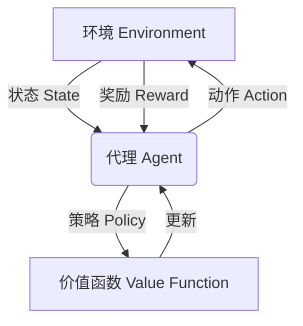

# 一切皆是映射：强化学习在工业自动化中的应用：挑战与机遇

## 1.背景介绍

### 1.1 工业自动化的重要性

在现代工业生产中,自动化扮演着至关重要的角色。通过将人工操作替换为自动化系统,企业可以显著提高生产效率、降低人工成本,并确保产品质量的一致性。然而,传统的自动化系统往往依赖于预先编程的指令,缺乏灵活性和适应性,难以应对复杂多变的生产环境。

### 1.2 强化学习的崛起

强化学习(Reinforcement Learning, RL)作为机器学习的一个分支,近年来引起了广泛关注。它通过与环境的交互,学习如何采取最优行动以最大化预期回报。与监督学习和无监督学习不同,强化学习没有明确的训练数据集,而是通过试错和奖惩机制来学习。这种学习方式使得强化学习在处理复杂、动态环境时表现出色,因此被认为是解决工业自动化挑战的潜在方案之一。

### 1.3 强化学习在工业自动化中的应用前景

将强化学习应用于工业自动化,可以赋予自动化系统自主学习和决策的能力,使其能够适应不断变化的生产环境,优化生产流程,提高效率和产品质量。然而,将强化学习成功应用于工业自动化也面临着诸多挑战,例如高维状态空间、安全性和可解释性等问题。本文将探讨强化学习在工业自动化中的应用,分析其面临的挑战,并探讨潜在的解决方案和未来发展趋势。

## 2.核心概念与联系

### 2.1 强化学习的基本概念

强化学习是一种基于奖惩机制的学习方法,其核心思想是通过与环境的交互,学习如何采取最优行动以最大化预期回报。强化学习系统通常由以下几个核心组件组成:

- **环境(Environment)**: 指代理与之交互的外部世界,包括状态、奖励和动作。
- **状态(State)**: 描述环境的当前情况。
- **动作(Action)**: 代理可以采取的行为。
- **奖励(Reward)**: 环境对代理行为的反馈,用于指导代理学习。
- **策略(Policy)**: 定义了在给定状态下代理应采取的行动。
- **价值函数(Value Function)**: 评估给定状态或状态-动作对的长期预期回报。

强化学习算法的目标是找到一个最优策略,使得代理在与环境交互时能够获得最大的累积奖励。

### 2.2 强化学习与工业自动化的联系

在工业自动化中,可以将生产过程视为一个复杂的环境,其中包括各种设备、原材料和产品。自动化系统则扮演代理的角色,通过与环境交互并获得反馈(如产品质量、能耗等),学习采取最优行动以优化生产流程。

强化学习在工业自动化中的应用可以分为以下几个方面:

- **过程控制**: 使用强化学习算法优化生产过程中的各个环节,如原材料配比、温度控制等,以提高产品质量和生产效率。
- **机器人控制**: 训练机器人执行各种复杂任务,如装配、焊接、物料搬运等,提高生产灵活性。
- **预测维护**: 通过监测设备状态,预测故障发生概率,并采取相应的维护措施,减少停机时间。
- **能源优化**: 优化能源使用,降低生产成本和环境影响。

## 3.核心算法原理具体操作步骤

强化学习算法的核心思想是通过与环境的交互,学习一个最优策略,使得代理在与环境交互时能够获得最大的累积奖励。以下是一些常见的强化学习算法及其具体操作步骤:

### 3.1 Q-Learning

Q-Learning是一种基于价值函数的强化学习算法,它通过估计每个状态-动作对的价值函数(Q值)来学习最优策略。具体操作步骤如下:

1. 初始化Q表格,将所有状态-动作对的Q值设置为0或随机值。
2. 对于每个时间步:
   a. 观察当前状态 s。
   b. 根据当前策略(通常是ε-贪婪策略)选择一个动作 a。
   c. 执行动作 a,观察到新状态 s'和奖励 r。
   d. 更新Q值:Q(s, a) = Q(s, a) + α[r + γ * max(Q(s', a')) - Q(s, a)]。
3. 重复步骤2,直到convergence达到收敛条件。

### 3.2 Sarsa

Sarsa算法与Q-Learning类似,但它直接学习状态-动作值函数,而不是学习最优Q值函数。具体操作步骤如下:

1. 初始化Q表格,将所有状态-动作对的Q值设置为0或随机值。
2. 对于每个时间步:
   a. 观察当前状态 s,根据当前策略选择动作 a。
   b. 执行动作 a,观察到新状态 s'、奖励 r,并根据策略选择新动作 a'。
   c. 更新Q值:Q(s, a) = Q(s, a) + α[r + γ * Q(s', a') - Q(s, a)]。
3. 重复步骤2,直到达到收敛条件。

### 3.3 Deep Q-Network (DQN)

DQN是一种结合深度神经网络和Q-Learning的算法,它可以处理高维状态空间,并通过经验回放和目标网络稳定训练过程。具体操作步骤如下:

1. 初始化两个神经网络:评估网络和目标网络,权重初始化相同。
2. 对于每个时间步:
   a. 观察当前状态 s。
   b. 使用评估网络输出所有动作的Q值,选择Q值最大的动作 a。
   c. 执行动作 a,观察到新状态 s'和奖励 r。
   d. 将经验(s, a, r, s')存入经验回放池。
   e. 从经验回放池中随机采样一批经验,计算目标Q值:y = r + γ * max(Q'(s', a'))。
   f. 使用y和评估网络输出的Q值计算损失函数,并通过梯度下降更新评估网络权重。
   g. 每隔一定步数,将评估网络的权重复制到目标网络。
3. 重复步骤2,直到达到收敛条件。

### 3.4 Policy Gradient

Policy Gradient算法直接学习策略函数,而不是学习价值函数。具体操作步骤如下:

1. 初始化策略网络,通常使用神经网络表示策略函数。
2. 对于每个时间步:
   a. 观察当前状态 s。
   b. 使用策略网络输出动作概率分布,并从中采样一个动作 a。
   c. 执行动作 a,观察到新状态 s'和奖励 r。
   d. 计算回报 G = Σ(γ^t * r_t)。
   e. 使用策略梯度定理,计算梯度:∇θJ(θ) = E[G * ∇θlog(π(a|s, θ))]。
   f. 使用梯度上升法更新策略网络权重。
3. 重复步骤2,直到达到收敛条件。

上述算法只是强化学习算法的一小部分,在实际应用中还有许多变体和改进版本,如Actor-Critic算法、Trust Region Policy Optimization (TRPO)、Proximal Policy Optimization (PPO)等。选择合适的算法需要根据具体问题的特点和约束条件。

## 4.数学模型和公式详细讲解举例说明

强化学习算法中涉及到许多重要的数学概念和公式,理解这些公式对于掌握算法原理和实现非常重要。以下是一些核心公式及其详细解释:

### 4.1 马尔可夫决策过程 (Markov Decision Process, MDP)

马尔可夫决策过程是强化学习的数学基础,它用于描述代理与环境的交互过程。一个MDP可以用一个元组 (S, A, P, R, γ) 来表示,其中:

- S 是状态集合
- A 是动作集合
- P 是状态转移概率函数,P(s'|s, a) 表示在状态 s 执行动作 a 后转移到状态 s' 的概率
- R 是奖励函数,R(s, a, s') 表示在状态 s 执行动作 a 后转移到状态 s' 所获得的奖励
- γ 是折现因子,用于平衡当前奖励和未来奖励的权重

### 4.2 价值函数 (Value Function)

价值函数用于评估一个状态或状态-动作对的长期预期回报。在强化学习中,我们通常使用两种价值函数:

- 状态价值函数 V(s):
  $$V(s) = \mathbb{E}_\pi\left[\sum_{t=0}^\infty \gamma^t r_{t+1} | s_0 = s\right]$$
  表示在策略 π 下,从状态 s 开始,获得的预期累积折现奖励。

- 状态-动作价值函数 Q(s, a):
  $$Q(s, a) = \mathbb{E}_\pi\left[\sum_{t=0}^\infty \gamma^t r_{t+1} | s_0 = s, a_0 = a\right]$$
  表示在策略 π 下,从状态 s 执行动作 a 开始,获得的预期累积折现奖励。

### 4.3 Bellman方程

Bellman方程是价值函数的递归定义,它将价值函数分解为当前奖励和未来预期奖励之和。对于状态价值函数,Bellman方程如下:

$$V(s) = \sum_{a \in A} \pi(a|s) \sum_{s' \in S} P(s'|s, a) \left[R(s, a, s') + \gamma V(s')\right]$$

对于状态-动作价值函数,Bellman方程如下:

$$Q(s, a) = \sum_{s' \in S} P(s'|s, a) \left[R(s, a, s') + \gamma \sum_{a' \in A} \pi(a'|s') Q(s', a')\right]$$

这些方程为求解价值函数提供了理论基础,并且在许多强化学习算法中被广泛使用。

### 4.4 策略梯度 (Policy Gradient)

策略梯度方法直接优化策略函数,而不是通过价值函数来间接优化策略。策略梯度定理给出了策略梯度的计算公式:

$$\nabla_\theta J(\theta) = \mathbb{E}_{\pi_\theta}\left[\sum_{t=0}^\infty \nabla_\theta \log \pi_\theta(a_t|s_t) Q^{\pi_\theta}(s_t, a_t)\right]$$

其中 $J(\theta)$ 是期望累积折现奖励, $\pi_\theta$ 是参数化的策略函数, $Q^{\pi_\theta}(s_t, a_t)$ 是在策略 $\pi_\theta$ 下的状态-动作价值函数。通过计算策略梯度,我们可以使用梯度上升法来优化策略函数的参数。

### 4.5 示例:Q-Learning算法中的Bellman方程

在Q-Learning算法中,我们使用Bellman方程来更新状态-动作价值函数Q(s, a)。具体地,在每个时间步,我们观察到状态s、执行动作a、获得奖励r并转移到新状态s'。然后,我们使用以下更新规则来更新Q(s, a):

$$Q(s, a) \leftarrow Q(s, a) + \alpha \left[r + \gamma \max_{a'} Q(s', a') - Q(s, a)\right]$$

其中 $\alpha$ 是学习率, $\gamma$ 是折现因子。这个更新规则实际上是Bellman方程的一种近似形式:

$$Q(s, a) \approx r + \gamma \max_{a'} Q(s', a')$$

通过不断应用这个更新规则,Q-Learning算法可以逐步学习到最优的Q值函数,从而得到最优策略。

## 5.项目实践:代码实例和详细解释说明

为了更好地理解强化学习算法在工业自动化