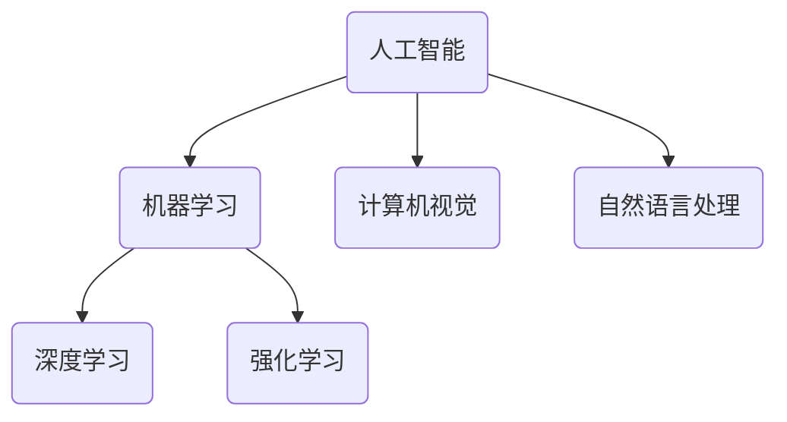

# 人工智能前沿研究热点与发展趋势原理与代码实战案例讲解

## 1. 背景介绍

人工智能(Artificial Intelligence, AI)是当前科技领域最热门、发展最快的前沿技术之一。近年来,AI技术在计算机视觉、自然语言处理、决策系统等多个领域取得了突破性进展,极大地推动了相关产业的发展。随着算力的不断提升、算法的持续优化以及海量数据的积累,AI技术正在渗透到我们生活和工作的方方面面。

### 1.1 人工智能的定义与发展历程

人工智能是一门致力于研究如何生产出一种能够模拟、延伸和扩展人类智能的理论、方法、技术及应用系统的新的技术科学。人工智能的目标是使机器能够模拟人类的学习、推理、规划、解决问题等智能行为。

人工智能的发展可以追溯到20世纪50年代,经历了几个重要的阶段:

1. 符号主义时期(1950s-1980s):这一阶段的研究集中在基于规则和逻辑的系统上,如专家系统、逻辑推理等。
2. 知识工程时期(1980s-1990s):研究重点转移到知识表示和推理方面,如神经网络、机器学习等。
3. 统计学习时期(1990s-现在):以统计学习理论为基础,利用大数据和强大的计算能力,发展出深度学习等先进技术。

### 1.2 人工智能的重要性与影响

人工智能技术正在深刻影响和改变我们的生产生活方式,对经济和社会的发展产生了重大影响:

- 提高生产效率:在制造、农业、医疗等领域,AI技术可以优化流程,提高生产效率。
- 改善生活质量:智能家居、无人驾驶汽车等AI应用,让生活更加智能便捷。
- 促进科研发展:AI在科学计算、药物发现等领域发挥着重要作用。
- 推动产业升级:AI正在重塑传统产业,催生新的商业模式和产业形态。

然而,AI技术的发展也带来了一些潜在风险和挑战,如隐私安全、算法偏差、技术失业等,需要我们高度重视并采取相应的应对措施。

## 2. 核心概念与联系

人工智能是一个庞大而复杂的领域,涉及多个核心概念和技术,它们之间存在着密切的联系和交叉。理解这些核心概念及其关联,对于掌握AI技术至关重要。

### 2.1 机器学习

机器学习(Machine Learning)是AI的核心,旨在使计算机能够从数据中自动分析获得规律,并利用规律对新的数据进行预测或决策。常见的机器学习算法包括:

- 监督学习:基于标注数据训练模型,如分类、回归等。
- 无监督学习:从未标注数据中发现隐藏的模式和规律。
- 强化学习:通过与环境交互,学习如何获得最大化回报。

### 2.2 深度学习

深度学习(Deep Learning)是机器学习的一个分支,它模仿人脑神经网络结构,通过构建深层神经网络模型对数据进行表征学习和模式识别。常见的深度学习模型包括:

- 卷积神经网络(CNN):擅长处理图像、视频等结构化数据。
- 循环神经网络(RNN):擅长处理序列数据,如文本、语音等。
- 生成对抗网络(GAN):可用于生成逼真的图像、音频和视频。

### 2.3 计算机视觉

计算机视觉(Computer Vision)是AI的一个重要分支,专注于赋予机器视觉能力,即使计算机能够获取、处理、分析和理解数字图像或视频中包含的信息。常见的计算机视觉任务包括:

- 图像分类:将图像划分到预定义的类别中。
- 目标检测:在图像中定位并识别感兴趣的目标。
- 语义分割:对图像中的每个像素进行分类,标注出不同对象。

### 2.4 自然语言处理

自然语言处理(Natural Language Processing, NLP)是AI的另一个重要分支,旨在使计算机能够理解和生成人类语言。常见的NLP任务包括:

- 文本分类:将文本划分到预定义的类别中。
- 机器翻译:将一种语言的文本自动翻译成另一种语言。
- 问答系统:根据给定的问题,从知识库中检索相关答案。

这些核心概念和技术相互关联、相互渗透,共同推动了人工智能的快速发展。

## 3. 核心算法原理具体操作步骤

人工智能的核心算法原理是机器学习,包括监督学习、无监督学习和强化学习等不同的学习范式。这些算法通过对大量数据进行训练,从而获得对特定任务的解决能力。下面我们将详细介绍其中一些典型算法的原理和操作步骤。

### 3.1 监督学习算法

监督学习算法是机器学习中最常见和最成熟的一类算法,它需要使用已标注的训练数据来训练模型。常见的监督学习算法包括:

#### 3.1.1 线性回归

线性回归是一种简单但有效的算法,用于解决回归问题。其基本思想是通过最小化预测值与真实值之间的均方误差,来学习出一个最佳的线性模型。

线性回归算法的具体步骤如下:

1. 收集数据:准备包含输入特征(X)和目标值(y)的数据集。
2. 数据预处理:对数据进行归一化或标准化处理。
3. 定义模型:设定线性模型 $y = \theta_0 + \theta_1x_1 + \theta_2x_2 + ... + \theta_nx_n$。
4. 损失函数:定义均方误差损失函数 $J(\theta) = \frac{1}{2m}\sum_{i=1}^m(h_\theta(x^{(i)}) - y^{(i)})^2$。
5. 优化算法:使用梯度下降等优化算法,不断迭代更新模型参数$\theta$,最小化损失函数。
6. 模型评估:在测试集上评估模型的性能,如均方根误差(RMSE)等指标。

#### 3.1.2 逻辑回归

逻辑回归是一种常用的分类算法,适用于二分类问题。它通过学习一个逻辑sigmoid函数,将输入映射到0到1之间的值,从而对实例进行分类。

逻辑回归算法的具体步骤如下:

1. 收集数据:准备包含输入特征(X)和二元标签(y)的数据集。
2. 数据预处理:对数据进行归一化或标准化处理。
3. 定义模型:设定逻辑回归模型 $h_\theta(x) = g(\theta^Tx) = \frac{1}{1 + e^{-\theta^Tx}}$。
4. 损失函数:定义交叉熵损失函数 $J(\theta) = -\frac{1}{m}\sum_{i=1}^m[y^{(i)}\log(h_\theta(x^{(i)})) + (1-y^{(i)})\log(1-h_\theta(x^{(i)}))]$。
5. 优化算法:使用梯度下降等优化算法,不断迭代更新模型参数$\theta$,最小化损失函数。
6. 模型评估:在测试集上评估模型的性能,如准确率、精确率、召回率等指标。

### 3.2 无监督学习算法

无监督学习算法不需要标注数据,它们通过对未标注数据进行训练,自动发现数据中的隐藏模式和结构。常见的无监督学习算法包括:

#### 3.2.1 K-Means聚类

K-Means聚类是一种常用的无监督学习算法,它将数据集划分为K个簇,使得簇内数据点之间的距离尽可能小,簇间数据点之间的距离尽可能大。

K-Means聚类算法的具体步骤如下:

1. 初始化:随机选择K个数据点作为初始质心。
2. 簇分配:对于每个数据点,计算它与每个质心的距离,将其分配到最近的簇。
3. 质心更新:对于每个簇,重新计算其所有数据点的均值作为新的质心。
4. 迭代:重复步骤2和3,直到质心不再发生变化或达到最大迭代次数。
5. 结果输出:输出最终的K个簇及其质心。

#### 3.2.2 主成分分析(PCA)

主成分分析是一种常用的无监督学习算法,它通过线性变换将高维数据投影到一个低维空间,从而实现降维和数据可视化。

PCA算法的具体步骤如下:

1. 数据标准化:对数据进行零均值标准化处理。
2. 计算协方差矩阵:计算数据的协方差矩阵。
3. 计算特征值和特征向量:对协方差矩阵进行特征值分解,得到特征值和对应的特征向量。
4. 选择主成分:按照特征值大小排序,选择前K个最大的特征值对应的特征向量作为主成分。
5. 投影数据:将原始数据投影到由主成分构成的低维空间中。

### 3.3 强化学习算法

强化学习是一种基于环境交互的学习范式,智能体通过不断尝试和学习,获得最大化的累积回报。常见的强化学习算法包括:

#### 3.3.1 Q-Learning

Q-Learning是一种基于时序差分的强化学习算法,它通过不断更新状态-行为值函数(Q函数),学习出一个最优策略。

Q-Learning算法的具体步骤如下:

1. 初始化:初始化Q函数,通常将所有状态-行为对的值设为0或一个小的常数。
2. 选择行为:在当前状态下,根据某种策略(如$\epsilon$-贪婪策略)选择一个行为。
3. 执行行为:执行选择的行为,获得下一个状态和即时奖励。
4. 更新Q函数:根据下式更新Q函数的估计值:

$$Q(s_t, a_t) \leftarrow Q(s_t, a_t) + \alpha[r_{t+1} + \gamma\max_aQ(s_{t+1}, a) - Q(s_t, a_t)]$$

其中$\alpha$是学习率,$\gamma$是折现因子。

5. 迭代:重复步骤2-4,直到收敛或达到最大迭代次数。

#### 3.3.2 Deep Q-Network (DQN)

Deep Q-Network是结合了深度学习和Q-Learning的一种强化学习算法,它使用深度神经网络来近似Q函数,从而能够处理高维状态空间的问题。

DQN算法的具体步骤如下:

1. 初始化:初始化一个深度神经网络作为Q网络,用于近似Q函数。
2. 构建经验回放池:在与环境交互过程中,将状态转移样本存储到经验回放池中。
3. 采样数据:从经验回放池中随机采样一批数据作为训练集。
4. 训练Q网络:使用采样数据,通过最小化损失函数来训练Q网络,更新网络参数。
5. 选择行为:在当前状态下,根据Q网络输出的Q值选择行为(如$\epsilon$-贪婪策略)。
6. 迭代:重复步骤2-5,直到收敛或达到最大迭代次数。

这些算法原理和具体操作步骤为人工智能的发展奠定了坚实的基础,也是我们理解和掌握AI技术的关键所在。

## 4. 数学模型和公式详细讲解举例说明

人工智能算法中涉及了大量的数学模型和公式,这些数学工具为算法提供了理论基础和计算框架。本节将详细讲解一些常见的数学模型和公式,并结合实例进行说明。

### 4.1 线性代数

线性代数是人工智能算法的基础数学工具,它为向量、矩阵等数据结