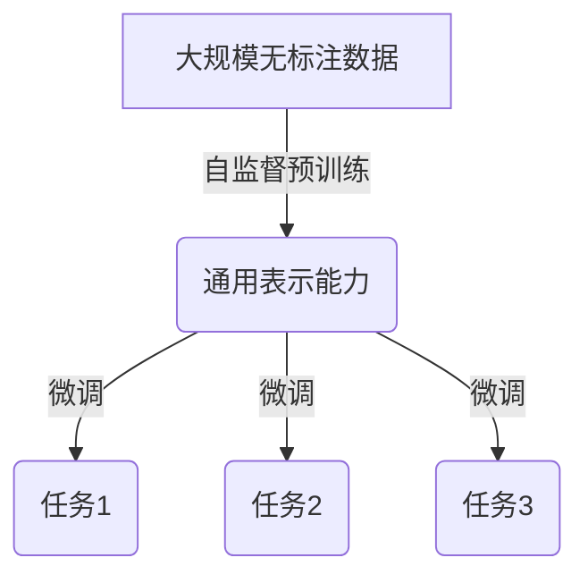
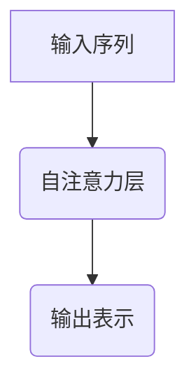
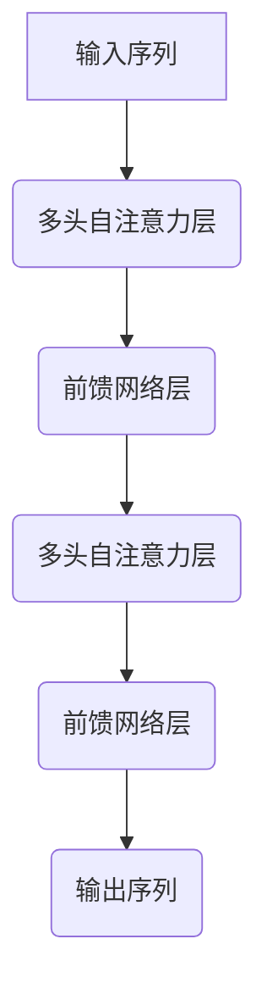
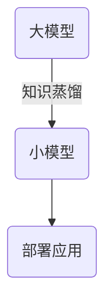
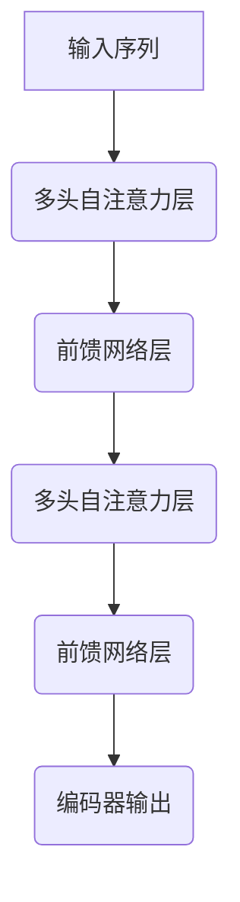
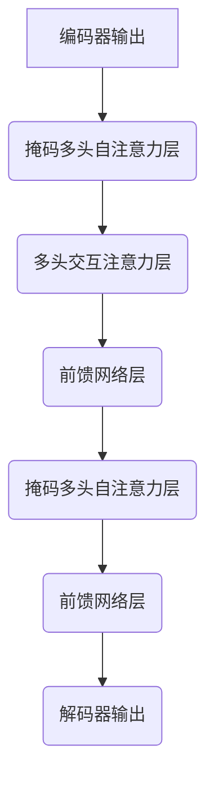

# 从零开始大模型开发与微调：大模型开启人工智能的新时代

## 1. 背景介绍

### 1.1 人工智能的发展历程

人工智能(Artificial Intelligence, AI)是当代科技发展的重要领域,自20世纪50年代问世以来,已经经历了几个重要的发展阶段。早期的人工智能系统主要基于专家系统和规则推理,能够解决一些特定领域的问题。随着机器学习和深度学习技术的兴起,人工智能进入了一个新的发展时期,能够从海量数据中自动学习模式和规律,解决更加复杂的任务。

### 1.2 大模型的崛起

近年来,随着计算能力的飞速提升和大规模数据的积累,大型神经网络模型(Large Neural Network Models)开始在自然语言处理、计算机视觉等领域展现出卓越的性能。这些大模型通过在海量数据上进行预训练,获得了丰富的知识表示和泛化能力,能够在下游任务上快速微调并取得优异表现。代表性的大模型包括GPT(Generative Pre-trained Transformer)、BERT(Bidirectional Encoder Representations from Transformers)、ResNet(Residual Neural Network)等。

### 1.3 大模型的意义

大模型的出现标志着人工智能进入了一个新的发展阶段。它们不仅在特定任务上表现出色,更重要的是展现出了通用的学习和推理能力,有望成为通用人工智能(Artificial General Intelligence, AGI)的基础。同时,大模型也带来了一些新的挑战,如训练成本高昂、模型可解释性差、潜在的偏见和安全隐患等,需要研究人员进一步探索和解决。

## 2. 核心概念与联系

### 2.1 预训练与微调

大模型的核心思想是先在大规模无标注数据上进行自监督预训练(Self-Supervised Pretraining),获得通用的表示能力,然后在特定任务上进行微调(Fine-Tuning),快速迁移学习到目标任务。这种预训练-微调范式大大提高了模型的泛化性和学习效率。

### 2.2 自注意力机制

自注意力机制(Self-Attention Mechanism)是大模型中的关键技术,它允许模型捕获输入序列中任意两个位置之间的依赖关系,从而更好地建模长期依赖。相比于传统的循环神经网络(RNN)和卷积神经网络(CNN),自注意力机制具有更强的并行计算能力和长期依赖建模能力。

### 2.3 transformer架构

Transformer是一种全新的基于自注意力机制的神经网络架构,它完全摒弃了RNN和CNN中的递归和卷积操作,使用多头自注意力层和前馈神经网络层构建了一种高度并行化的序列到序列模型。Transformer架构在机器翻译、语言模型等任务上表现出色,成为了大模型的核心架构。

### 2.4 模型压缩与知识蒸馏

由于大模型通常包含数十亿甚至上百亿参数,在实际应用中存在计算资源和内存占用过高的问题。为了解决这一问题,研究人员提出了模型压缩(Model Compression)和知识蒸馏(Knowledge Distillation)等技术,将大模型中学习到的知识迁移到更小的模型中,在保持性能的同时大幅降低计算和存储开销。

## 3. 核心算法原理具体操作步骤

### 3.1 自注意力机制原理

自注意力机制的核心思想是让每个位置的输出向量由输入序列中所有位置的加权和来计算,权重由输入序列中每对位置的相似度决定。具体来说,给定一个长度为n的输入序列$\boldsymbol{X} = (x_1, x_2, \dots, x_n)$,自注意力机制的计算过程如下:

1. 将输入序列$\boldsymbol{X}$分别通过三个线性变换得到查询向量(Query)$\boldsymbol{Q}$、键向量(Key)$\boldsymbol{K}$和值向量(Value)$\boldsymbol{V}$:

$$\boldsymbol{Q} = \boldsymbol{X}\boldsymbol{W}^Q, \quad \boldsymbol{K} = \boldsymbol{X}\boldsymbol{W}^K, \quad \boldsymbol{V} = \boldsymbol{X}\boldsymbol{W}^V$$

其中$\boldsymbol{W}^Q, \boldsymbol{W}^K, \boldsymbol{W}^V$为可学习的权重矩阵。

2. 计算查询向量$\boldsymbol{Q}$与键向量$\boldsymbol{K}$的点积,得到注意力分数矩阵$\boldsymbol{S}$:

$$\boldsymbol{S} = \boldsymbol{Q}\boldsymbol{K}^\top$$

3. 对注意力分数矩阵$\boldsymbol{S}$进行缩放和softmax操作,得到注意力权重矩阵$\boldsymbol{A}$:

$$\boldsymbol{A} = \text{softmax}\left(\frac{\boldsymbol{S}}{\sqrt{d_k}}\right)$$

其中$d_k$为键向量$\boldsymbol{K}$的维度,缩放操作是为了避免点积过大导致softmax梯度饱和。

4. 将注意力权重矩阵$\boldsymbol{A}$与值向量$\boldsymbol{V}$相乘,得到自注意力的输出$\boldsymbol{Z}$:

$$\boldsymbol{Z} = \boldsymbol{A}\boldsymbol{V}$$

自注意力机制的优点在于能够直接捕获输入序列中任意两个位置之间的依赖关系,并且计算过程高度并行化,适合利用GPU等加速硬件进行加速。

### 3.2 Transformer架构详解

Transformer是一种全新的基于自注意力机制的序列到序列模型,它完全摒弃了RNN和CNN中的递归和卷积操作,使用多头自注意力层和前馈神经网络层构建了一种高度并行化的架构。Transformer的编码器(Encoder)和解码器(Decoder)结构如下:

**Encoder**:

1. 输入序列首先通过一个词嵌入层(Word Embedding Layer)和位置编码(Positional Encoding)层,将每个词映射为一个向量表示,并引入位置信息。
2. 然后输入序列依次通过多个编码器层(Encoder Layer),每个编码器层由一个多头自注意力子层(Multi-Head Attention Sublayer)和一个前馈网络子层(Feed-Forward Sublayer)组成。
3. 多头自注意力子层允许每个位置的输出向量由输入序列中所有位置的加权和来计算,捕获序列内的长期依赖关系。
4. 前馈网络子层则对每个位置的向量进行独立的非线性变换,为模型引入更强的表示能力。
5. 编码器的输出是一个序列的向量表示,包含了输入序列的全部信息。

**Decoder**:

1. 解码器的输入是一个目标序列的词嵌入表示,同样经过位置编码层。
2. 解码器中的每个解码器层(Decoder Layer)包含三个子层:掩码多头自注意力子层(Masked Multi-Head Attention Sublayer)、多头交互注意力子层(Multi-Head Attention Sublayer)和前馈网络子层(Feed-Forward Sublayer)。
3. 掩码多头自注意力子层用于捕获目标序列内部的依赖关系,但由于目标序列是逐个生成的,因此需要对未生成的后续位置进行掩码,避免获取未来信息。
4. 多头交互注意力子层则用于将目标序列的表示与编码器输出的表示进行关联,获取输入序列的信息。
5. 前馈网络子层与编码器中的作用相同,为每个位置的向量引入非线性变换。
6. 解码器的输出是一个序列的向量表示,可用于预测目标序列的下一个词。

通过自注意力机制和并行化的架构设计,Transformer在序列到序列任务上展现出了卓越的性能,成为了大模型的核心架构。

## 4. 数学模型和公式详细讲解举例说明

在自然语言处理任务中,大模型通常需要对文本序列进行建模。我们将文本序列$\boldsymbol{X} = (x_1, x_2, \dots, x_n)$表示为一系列的词嵌入向量$(\boldsymbol{e}_1, \boldsymbol{e}_2, \dots, \boldsymbol{e}_n)$,其中$\boldsymbol{e}_i \in \mathbb{R}^{d_\text{model}}$为$d_\text{model}$维词嵌入向量。

### 4.1 自注意力机制公式推导

自注意力机制的核心是计算输入序列中每对位置之间的注意力权重,并将所有位置的值向量根据注意力权重进行加权求和。具体来说,给定查询向量$\boldsymbol{Q}$、键向量$\boldsymbol{K}$和值向量$\boldsymbol{V}$,自注意力机制的输出$\boldsymbol{Z}$计算如下:

1. 计算注意力分数矩阵:

$$\boldsymbol{S} = \boldsymbol{Q}\boldsymbol{K}^\top$$

其中$\boldsymbol{S} \in \mathbb{R}^{n \times n}$,表示输入序列中每对位置之间的相似度分数。

2. 对注意力分数矩阵进行缩放和softmax操作,得到注意力权重矩阵:

$$\boldsymbol{A} = \text{softmax}\left(\frac{\boldsymbol{S}}{\sqrt{d_k}}\right)$$

其中$d_k$为键向量$\boldsymbol{K}$的维度,缩放操作是为了避免点积过大导致softmax梯度饱和。

3. 将注意力权重矩阵与值向量相乘,得到自注意力的输出:

$$\boldsymbol{Z} = \boldsymbol{A}\boldsymbol{V}$$

其中$\boldsymbol{Z} \in \mathbb{R}^{n \times d_\text{model}}$,表示输入序列在考虑了所有位置之间的依赖关系后的新表示。

### 4.2 多头自注意力机制

为了进一步提高模型的表示能力,Transformer采用了多头自注意力机制(Multi-Head Attention Mechanism)。具体来说,将查询向量$\boldsymbol{Q}$、键向量$\boldsymbol{K}$和值向量$\boldsymbol{V}$分别线性投影到$h$个子空间,在每个子空间中独立计算自注意力,最后将$h$个子空间的输出拼接起来:

$$\begin{aligned}
\boldsymbol{Q}^{(i)} &= \boldsymbol{Q}\boldsymbol{W}_i^Q, \quad \boldsymbol{K}^{(i)} = \boldsymbol{K}\boldsymbol{W}_i^K, \quad \boldsymbol{V}^{(i)} = \boldsymbol{V}\boldsymbol{W}_i^V \\
\boldsymbol{Z}^{(i)} &= \text{Attention}(\