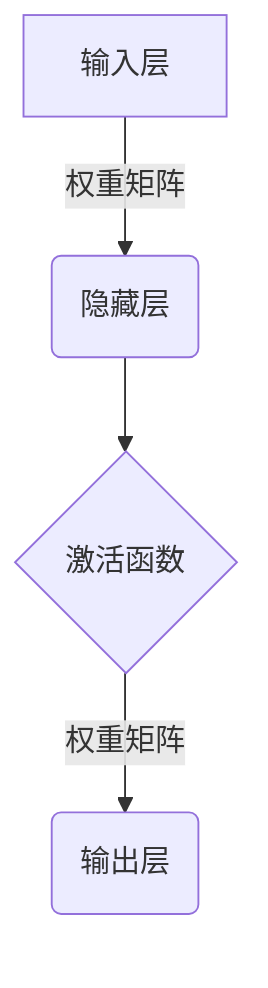
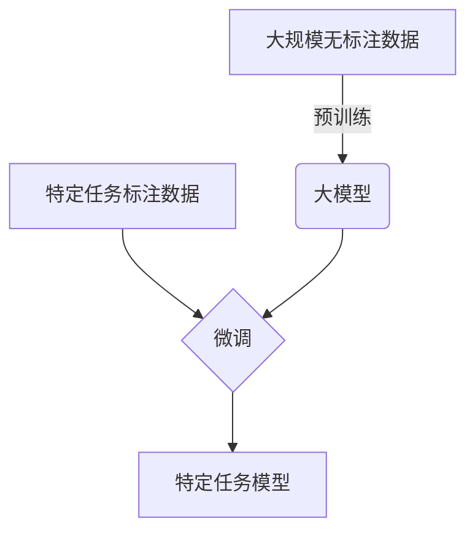

# 从零开始大模型开发与微调：自定义神经网络框架的具体实现

## 1.背景介绍

### 1.1 大模型时代的到来

近年来,大型神经网络模型在自然语言处理、计算机视觉等各个领域展现出了令人惊叹的性能表现,引领了人工智能的新潮流。从GPT-3、DALL-E到最新的ChatGPT,这些大模型不仅在特定任务上超越了人类水平,更是展现出了跨领域的泛化能力。大模型时代的到来,为人工智能的发展带来了前所未有的机遇。

### 1.2 大模型开发的挑战

然而,训练这些大规模神经网络模型需要耗费大量的计算资源,对硬件设备、算力支持有着极高的要求。此外,大模型开发过程中还面临着模型设计、数据处理、超参数调优等诸多挑战。因此,掌握大模型开发的核心技术,构建自定义的神经网络框架,成为了越来越多人工智能从业者和研究人员所追求的目标。

### 1.3 本文内容概览

本文将从零开始,详细介绍大模型开发与微调的全过程,包括模型设计、数据预处理、模型训练、超参数优化等关键环节。我们将自底向上地构建一个高度可扩展、模块化的神经网络框架,并在此基础上实现大模型的训练和微调。通过实践案例,读者将全面掌握大模型开发的方法论,为未来投身于人工智能前沿研究做好充分准备。

## 2.核心概念与联系

在深入探讨大模型开发的具体实现之前,我们有必要先了解一些核心概念,为后续内容的理解打下坚实基础。

### 2.1 神经网络模型

神经网络模型是一种受生物神经系统启发而设计的计算模型,广泛应用于机器学习和深度学习领域。它由大量互连的节点(神经元)组成,通过对输入数据进行复杂的非线性变换,学习并捕捉数据中的模式和特征。



上图展示了一个典型的前馈神经网络结构,包括输入层、隐藏层和输出层。神经元之间通过权重矩阵相连,激活函数则引入了非线性,使模型能够学习复杂的映射关系。

### 2.2 大模型与微调

所谓大模型,是指具有数十亿甚至上百亿参数的巨型神经网络模型。这些模型通常在大规模无标注数据集上进行预训练,获得了丰富的通用知识表示。而微调(fine-tuning)则是在预训练模型的基础上,利用特定任务的标注数据进行进一步训练,使模型适应特定任务的需求。



上图描述了大模型开发与微调的基本流程。首先在海量无标注数据上预训练获得大模型,然后利用特定任务的标注数据对大模型进行微调,从而得到适用于该任务的专用模型。

### 2.3 自定义神经网络框架

虽然现有的深度学习框架(如PyTorch、TensorFlow等)提供了丰富的模型构建模块,但在大模型开发过程中,我们往往需要对这些框架进行定制化扩展,以满足特殊的需求。因此,构建自定义的神经网络框架就显得尤为重要,它不仅能够提高模型的灵活性和可扩展性,还能加深我们对深度学习原理的理解。

在本文中,我们将从头开始构建一个模块化的神经网络框架,涵盖数据处理、模型定义、训练循环、评估指标等各个方面,为大模型开发奠定坚实的基础。

## 3.核心算法原理具体操作步骤

### 3.1 张量运算

张量(Tensor)是深度学习中的核心数据结构,它可以看作是一个多维数组。在构建自定义神经网络框架时,我们需要从底层实现一些基础的张量运算,如张量创建、索引、切片、广播、归约等操作。

```python
import numpy as np

class Tensor:
    def __init__(self, data):
        self.data = np.array(data)

    def __repr__(self):
        return f"Tensor({self.data})"

    # 其他张量运算方法...
```

上面是一个简单的`Tensor`类的实现,它基于NumPy数组进行封装。我们可以在此基础上,逐步实现各种张量运算,如张量加法、矩阵乘法等,为后续的神经网络计算奠定基础。

### 3.2 自动微分

自动微分(Automatic Differentiation)是深度学习中一个非常重要的概念,它提供了一种高效计算导数的方法,使得我们能够对复杂的神经网络模型进行端到端的训练。在构建自定义神经网络框架时,实现自动微分机制是必不可少的一步。

```python
class Value:
    def __init__(self, data, requires_grad=False):
        self.data = data
        self.grad = 0
        self.requires_grad = requires_grad
        self.children = []

    def backward(self):
        # 反向传播算法实现...

# 定义一些基础运算,如加法、乘法等
# 并实现它们的前向和反向传播

x = Value(2.0, requires_grad=True)
y = Value(3.0, requires_grad=True)
z = x * y
z.backward()
print(x.grad)  # 输出: 3.0
print(y.grad)  # 输出: 2.0
```

上面的代码展示了一个简化版的自动微分实现。我们定义了一个`Value`类,用于表示计算图中的节点。每个节点都有一个`data`属性存储值,以及一个`grad`属性存储导数。通过实现`backward`方法,我们可以对计算图进行反向传播,计算每个节点的梯度。

在实现自动微分时,我们需要考虑各种运算的前向和反向传播规则,如加法、乘法、指数、对数等。同时,还需要处理计算图中的分支和汇合情况,确保梯度的正确计算。

### 3.3 模块化设计

为了提高代码的可维护性和可扩展性,我们需要采用模块化的设计思路,将神经网络框架拆分为多个模块,每个模块负责特定的功能。

```python
class Module:
    def __init__(self):
        self.parameters = []

    def forward(self, *inputs):
        raise NotImplementedError

    def backward(self, grad):
        raise NotImplementedError

    def param(self):
        return [p for p in self.parameters if p.requires_grad]


class Linear(Module):
    def __init__(self, in_features, out_features):
        super().__init__()
        self.weight = Value(np.random.randn(in_features, out_features), requires_grad=True)
        self.bias = Value(np.zeros(out_features), requires_grad=True)
        self.parameters.append(self.weight)
        self.parameters.append(self.bias)

    def forward(self, x):
        return x @ self.weight.data + self.bias.data

    def backward(self, grad):
        # 计算权重和偏置的梯度
        # ...


class ReLU(Module):
    def __init__(self):
        super().__init__()

    def forward(self, x):
        # ReLU前向传播
        # ...

    def backward(self, grad):
        # ReLU反向传播
        # ...
```

上面的代码定义了一个基类`Module`和两个子类`Linear`(全连接层)和`ReLU`(激活函数层)。每个模块都需要实现`forward`和`backward`方法,分别定义前向和反向传播的计算逻辑。通过组合不同的模块,我们就可以构建出复杂的神经网络结构。

模块化设计不仅提高了代码的可读性和可维护性,还使得我们能够灵活地扩展和定制神经网络框架,以满足特定的需求。

### 3.4 模型训练

在实现了基础的张量运算、自动微分和模块化设计之后,我们就可以进一步实现模型的训练过程。训练过程包括数据加载、前向传播、损失计算、反向传播和优化器更新等步骤。

```python
class Model(Module):
    def __init__(self, layers):
        super().__init__()
        self.layers = layers

    def forward(self, x):
        for layer in self.layers:
            x = layer.forward(x)
        return x

    def backward(self, grad):
        for layer in reversed(self.layers):
            grad = layer.backward(grad)

    def parameters(self):
        params = []
        for layer in self.layers:
            params.extend(layer.param())
        return params


def train(model, data, loss_fn, optimizer, epochs):
    for epoch in range(epochs):
        for x, y in data:
            output = model.forward(x)
            loss = loss_fn(output, y)
            model.backward(loss.grad)
            optimizer.step(model.parameters())
```

上面的代码定义了一个`Model`类,它由多个模块层组成。在训练过程中,我们首先对输入数据进行前向传播,计算模型输出和损失函数。然后,通过反向传播计算每个模块的梯度,并使用优化器更新模型参数。

优化器的实现也是一个重要环节,我们需要实现常见的优化算法,如随机梯度下降(SGD)、Adam等,以更新模型参数。同时,还需要考虑学习率衰减、梯度裁剪等技术,以提高训练的稳定性和收敛性。

### 3.5 评估指标

在训练过程中,我们需要定义合适的评估指标,以衡量模型的性能表现。根据不同的任务,评估指标可能包括准确率、精确率、召回率、F1分数、平均绝对误差等。

```python
def accuracy(output, target):
    _, predicted = torch.max(output.data, 1)
    correct = (predicted == target).sum().item()
    total = target.size(0)
    return correct / total
```

上面的代码定义了一个计算分类任务准确率的函数。我们首先找到输出张量中最大值对应的索引(即模型的预测类别),然后与真实标签进行比较,计算正确预测的数量,最后除以总样本数即可得到准确率。

除了评估指标之外,我们还需要实现模型保存和加载功能,以便在训练过程中保存中间模型,或者加载预训练模型进行微调。

## 4.数学模型和公式详细讲解举例说明

在深度学习中,数学模型和公式扮演着至关重要的角色。它们不仅描述了神经网络的基本原理和运作机制,还为我们提供了优化和改进模型的理论基础。在这一部分,我们将详细讲解一些核心的数学模型和公式,并通过具体的例子加深理解。

### 4.1 线性模型

线性模型是最基础的机器学习模型之一,它试图通过一个线性函数来拟合输入数据和目标值之间的关系。在神经网络中,线性模型通常作为输入层或全连接层的一部分存在。

给定输入向量 $\mathbf{x} = (x_1, x_2, \ldots, x_n)^T$ 和权重向量 $\mathbf{w} = (w_1, w_2, \ldots, w_n)^T$,线性模型的数学表达式为:

$$
y = \mathbf{w}^T\mathbf{x} + b = \sum_{i=1}^{n} w_i x_i + b
$$

其中 $b$ 是偏置项。

在实现线性模型时,我们可以利用矩阵乘法和向量广播等张量运算来实现高效的批量计算。

### 4.2 损失函数

损失函数(Loss Function)是衡量模型预测值与真实值之间差异的指标,它在模型训练过程中扮演着至关重要的角色。选择合适的损失函数不仅能够加快模型的收敛速度,还能够获得更好的泛化性能。

一些常见的损失函数包括:

1. **均方误差(Mean Squared Error, MSE)**: $\text{MSE}(y, \hat{y}) = \frac{1}{n} \sum_{i=1}^{n} (y_i - \hat{y}_i)^2$
2. **交叉熵损失(Cross-Entropy Loss)**: $\text{CE}(y, \hat{y}) = -\sum