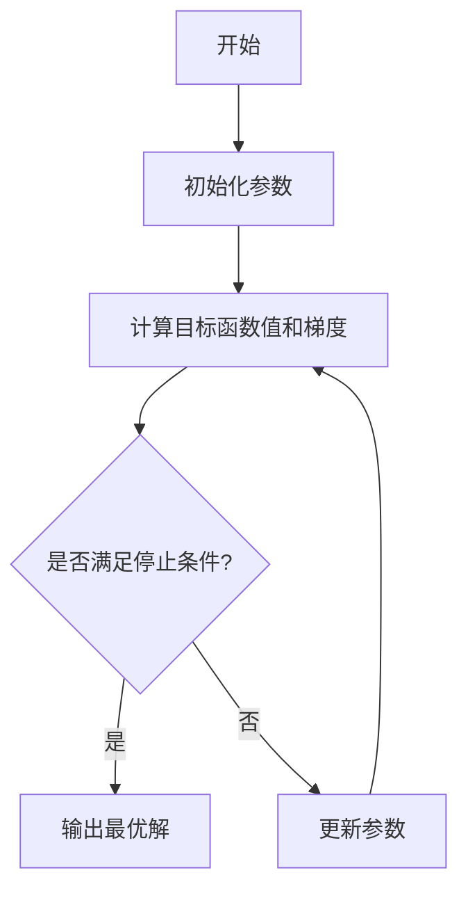

以下是《优化算法：梯度下降(Gradient Descent)原理与代码实例讲解》的正文内容:

# 优化算法：梯度下降(Gradient Descent)原理与代码实例讲解

## 1.背景介绍

### 1.1 什么是优化问题?

在数学、计算机科学和相关领域中,优化问题是指在给定的约束条件下,寻找最优解(最大值或最小值)的问题。优化问题无处不在,例如:

- 机器学习模型训练时需要最小化损失函数
- 网络路由时需要寻找最短路径
- 投资组合优化时需要最大化收益并最小化风险

### 1.2 优化算法的重要性

由于优化问题广泛存在,因此高效的优化算法对于解决实际问题至关重要。梯度下降作为一种简单而强大的优化算法,在机器学习、深度学习等领域有着广泛的应用。

## 2.核心概念与联系

### 2.1 梯度下降算法概述

梯度下降(Gradient Descent)是一种用于求解无约束最优化问题的迭代算法。其基本思想是:从初始点出发,沿着目标函数的梯度方向,每次迭代都朝着使目标函数值下降最快的方向移动一小步,直到达到极小值点。

### 2.2 梯度下降在机器学习中的应用

在机器学习中,我们通常需要最小化损失函数(如均方误差、交叉熵等)来训练模型参数。梯度下降算法正是用于优化这种损失函数的常用算法之一。

### 2.3 梯度下降算法流程图



## 3.核心算法原理具体操作步骤

梯度下降算法的核心步骤如下:

1. **初始化参数**:给定初始参数的值,如机器学习模型的权重和偏置。
2. **计算目标函数值和梯度**:计算当前参数下的目标函数值(如损失函数值)和梯度。
3. **检查停止条件**:如果满足停止条件(如梯度接近0或达到最大迭代次数),则停止迭代并输出最优解。
4. **更新参数**:根据学习率和梯度,更新参数的值。
5. **重复2-4步**,直到满足停止条件。

### 3.1 计算梯度

对于函数$f(x_1, x_2, ..., x_n)$,其梯度为:

$$\nabla f = \left( \frac{\partial f}{\partial x_1}, \frac{\partial f}{\partial x_2}, ..., \frac{\partial f}{\partial x_n} \right)$$

其中$\frac{\partial f}{\partial x_i}$表示函数对第i个变量的偏导数。

### 3.2 参数更新

在每一次迭代中,参数$\theta$的更新公式为:

$$\theta_{new} = \theta_{old} - \eta \cdot \nabla_\theta J(\theta)$$

其中:
- $\eta$是学习率(step size),控制每次迭代的步长大小。
- $\nabla_\theta J(\theta)$是目标函数$J(\theta)$关于参数$\theta$的梯度。

## 4.数学模型和公式详细讲解举例说明

### 4.1 线性回归的梯度下降

考虑线性回归模型:

$$h_\theta(x) = \theta_0 + \theta_1x_1 + ... + \theta_nx_n$$

其中$\theta_i$是模型参数。我们的目标是最小化均方误差损失函数:

$$J(\theta) = \frac{1}{2m}\sum_{i=1}^m(h_\theta(x^{(i)}) - y^{(i)})^2$$

对于单个训练样本$(x, y)$,损失函数$J(\theta)$对参数$\theta_j$的梯度为:

$$\frac{\partial J(\theta)}{\partial \theta_j} = \frac{1}{m}\sum_{i=1}^m(h_\theta(x^{(i)}) - y^{(i)})x_j^{(i)}$$

因此,参数$\theta_j$的更新公式为:

$$\theta_j := \theta_j - \alpha \cdot \frac{1}{m}\sum_{i=1}^m(h_\theta(x^{(i)}) - y^{(i)})x_j^{(i)}$$

其中$\alpha$是学习率。

### 4.2 逻辑回归的梯度下降

对于逻辑回归模型:

$$h_\theta(x) = \frac{1}{1 + e^{-\theta^Tx}}$$

其中$\theta$是模型参数向量。

我们的目标是最小化交叉熵损失函数:

$$J(\theta) = -\frac{1}{m} \sum_{i=1}^m [y^{(i)}\log (h_\theta (x^{(i)})) + (1 - y^{(i)})\log (1 - h_\theta(x^{(i)}))]$$

损失函数$J(\theta)$对参数$\theta_j$的梯度为:

$$\frac{\partial J(\theta)}{\partial \theta_j} = \frac{1}{m}\sum_{i=1}^m(h_\theta(x^{(i)}) - y^{(i)})x_j^{(i)}$$

因此,参数$\theta_j$的更新公式为:

$$\theta_j := \theta_j - \alpha \cdot \frac{1}{m}\sum_{i=1}^m(h_\theta(x^{(i)}) - y^{(i)})x_j^{(i)}$$

## 5.项目实践:代码实例和详细解释说明

以下是使用Python实现线性回归的梯度下降算法的示例代码:

```python
import numpy as np

# 生成数据
X = 2 * np.random.rand(100, 1)
y = 4 + 3 * X + np.random.randn(100, 1)

# 初始化参数
theta = np.random.randn(2, 1)

# 一些设置
iterations = 1000
alpha = 0.01

# 计算梯度下降
for i in range(iterations):
    gradients = 2/100 * X.T.dot(X.dot(theta) - y)
    theta = theta - alpha * gradients

# 打印结果
print(f"Theta0: {theta[0][0]}, Theta1: {theta[1][0]}")
```

代码解释:

1. 首先生成一些示例数据,包括输入特征`X`和目标变量`y`。
2. 初始化模型参数`theta`为随机值。
3. 设置超参数,包括最大迭代次数`iterations`和学习率`alpha`。
4. 进入梯度下降的迭代循环:
   - 计算当前参数下的梯度`gradients`。
   - 根据梯度和学习率更新参数`theta`。
5. 输出最终的参数值。

注意,这只是一个简单的线性回归示例,在实际应用中,我们需要根据具体问题调整目标函数、特征等。

## 6.实际应用场景

梯度下降算法在机器学习和深度学习等领域有着广泛的应用,例如:

- **线性回归**:用于预测连续值输出。
- **逻辑回归**:用于二分类问题。
- **神经网络训练**:通过反向传播算法计算梯度,并使用梯度下降优化网络参数。
- **结构化预测**:如条件随机场(CRF)等模型的参数估计。

除此之外,梯度下降也被广泛应用于其他优化问题,如:

- **组合优化**:如旅行商问题等。
- **控制理论**:如机器人运动规划等。
- **信号处理**:如图像去噪等。

## 7.工具和资源推荐

以下是一些学习和使用梯度下降算法的工具和资源:

- **Python库**:NumPy、SciPy、Scikit-learn、TensorFlow、PyTorch等。
- **在线课程**:吴恩达的"机器学习"、"深度学习专修"等。
- **书籍**:《模式识别与机器学习》、《深度学习》等。
- **博客/文章**:机器之心、纸牌屋等技术博客。
- **开源项目**:Keras、XGBoost等。

## 8.总结:未来发展趋势与挑战

### 8.1 优化算法的发展趋势

虽然梯度下降算法简单有效,但它也存在一些缺陷,如可能陷入局部最优、对初始值敏感等。因此,近年来出现了许多改进的优化算法,如:

- **随机梯度下降**(Stochastic Gradient Descent)
- **动量梯度下降**(Momentum)  
- **RMSProp**
- **Adam**
- **L-BFGS**等

这些算法在保留梯度下降简单性的同时,提高了收敛速度和鲁棒性。

### 8.2 挑战

尽管优化算法取得了长足进步,但仍面临一些挑战:

- **高维优化**:对于高维空间中的优化问题,算法往往容易陷入局部最优。
- **非凸优化**:对于非凸函数的优化,寻找全局最优解更加困难。
- **约束优化**:如何高效地处理优化问题中的约束条件。
- **大规模优化**:对于海量数据的优化问题,需要高效的分布式算法。
- **黑箱优化**:对于黑箱函数(无法获得梯度信息),需要无梯度优化算法。

未来,优化算法的研究和应用将会更加广泛和深入。

## 9.附录:常见问题与解答  

### 9.1 梯度下降算法为什么可行?

梯度下降算法的可行性基于以下事实:如果目标函数可微,那么函数值沿着梯度方向变化最快。因此,通过朝着梯度相反的方向移动,可以最快地减小目标函数值。

### 9.2 如何选择合适的学习率?

学习率的选择对算法的收敛性能有很大影响。过大的学习率可能导致算法发散,而过小的学习率则会使收敛变慢。一种常用的方法是先选择一个较大的初始学习率,然后在算法运行过程中逐渐减小学习率。

### 9.3 梯度下降算法是否一定能收敛到全局最优解?

不一定。梯度下降算法只能保证收敛到一个(局部)极小值点,无法确保一定是全局最小值。这取决于目标函数的特性(是否为凸函数)和初始点的选择。

### 9.4 梯度下降算法在处理大规模数据时是否有缺陷?

是的。对于海量数据,需要计算所有训练样本的梯度,这将带来很大的计算开销。因此,在大规模优化问题中,通常采用随机梯度下降等改进算法。

### 9.5 梯度下降算法是否可以处理约束优化问题?

梯度下降算法本身无法直接处理约束优化问题。但我们可以通过惩罚函数或者投影等方法,将约束优化问题转化为无约束优化问题,再使用梯度下降算法求解。

作者: 禅与计算机程序设计艺术 / Zen and the Art of Computer Programming