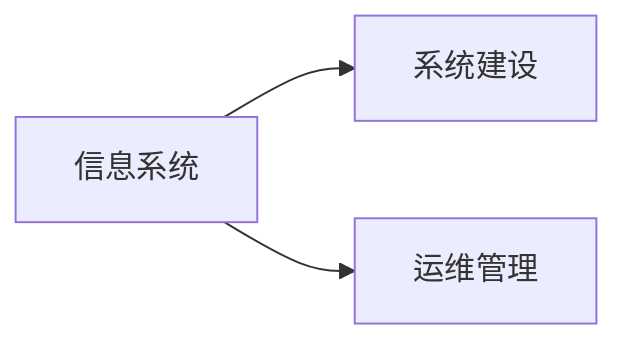

## 1.背景介绍

在当前的信息化社会，软硬件系统对于企业的运营至关重要。从企业内部的办公自动化，到与外部客户的交互，再到数据的存储和分析，都离不开信息系统的支持。因此，如何建设和运维管理这些系统，成为了企业必须面对的重要问题。

## 2.核心概念与联系

在讨论信息系统建设和运维管理之前，我们首先需要理解几个核心概念：

- **信息系统**：信息系统是由硬件、软件、数据、网络和人员组成的系统，用于收集、处理、存储和传播信息的。

- **系统建设**：系统建设是指建立和配置信息系统的过程，包括需求分析、系统设计、编码、测试等步骤。

- **运维管理**：运维管理是指对信息系统进行日常管理和维护的过程，包括系统监控、故障处理、性能优化等活动。

这三个概念之间的联系是，系统建设是建立信息系统的基础，而运维管理则是保证信息系统稳定运行的保障。



## 3.核心算法原理具体操作步骤

接下来，我们将详细介绍信息系统的建设和运维管理的具体步骤。

### 3.1 系统建设

#### 3.1.1 需求分析

需求分析是系统建设的第一步，需要明确系统需要完成的功能、性能要求、安全需求等。这个阶段通常需要与系统的使用者进行深入沟通，以确保系统能够满足他们的需求。

#### 3.1.2 系统设计

在明确了需求之后，就可以开始设计系统了。这个阶段需要制定系统的架构，选择合适的技术方案，设计数据结构和接口等。

#### 3.1.3 编码

编码阶段是将设计的系统转化为实际的代码。这个阶段需要编程人员具备良好的编程能力和对系统设计的深入理解。

#### 3.1.4 测试

测试是检验系统是否满足需求的重要步骤。通过测试，可以发现系统的缺陷和不足，为后续的优化提供依据。

### 3.2 运维管理

#### 3.2.1 系统监控

系统监控是运维管理的重要组成部分，通过监控，可以实时了解系统的运行状态，及时发现和处理问题。

#### 3.2.2 故障处理

故障处理是运维工作的常态，当系统出现故障时，需要及时定位问题并进行处理，以保证系统的正常运行。

#### 3.2.3 性能优化

性能优化是通过调整系统配置、优化代码等手段，提高系统的运行效率和稳定性。


## 4.数学模型和公式详细讲解举例说明

在信息系统的建设和运维管理中，有一些关键的决策需要依赖数学模型和公式。例如，在性能优化中，我们可以通过排队论模型来预测系统的性能。

排队论是研究等待线（队列）现象的数学理论。在信息系统中，请求到达的速率和服务的速率都是随机的，因此，系统的性能（如响应时间、队列长度等）也是随机的。排队论提供了一种量化这种随机性的方法。

假设请求到达的速率为$\lambda$，服务的速率为$\mu$，那么系统的平均响应时间$R$可以用以下公式计算：

$$
R = \frac{1}{\mu - \lambda}
$$

这个公式告诉我们，如果服务的速率大于请求的速率（即$\mu > \lambda$），那么系统的平均响应时间就会减小。因此，我们可以通过提高服务的速率（例如，增加服务器数量，优化代码等）来优化系统的性能。

## 5.项目实践：代码实例和详细解释说明

在实际的项目中，我们可以通过一些工具和技术来实现上述的系统建设和运维管理。下面，我们以一个简单的Web服务器为例，介绍一下实践过程。

### 5.1 系统建设

首先，我们需要建立一个Web服务器来响应用户的请求。这可以通过如下的Python代码实现：

```python
from flask import Flask
app = Flask(__name__)

@app.route('/')
def hello_world():
    return 'Hello, World!'
```

这段代码创建了一个Web服务器，当用户访问服务器的根目录（'/'）时，服务器会返回'Hello, World!'。

### 5.2 运维管理

在运维管理中，我们需要监控服务器的运行状态，当出现问题时进行处理。这可以通过一些专门的监控工具实现，例如Prometheus和Grafana。

Prometheus是一个开源的监控系统，可以收集各种指标数据，如CPU使用率、内存使用量等。Grafana则是一个可视化工具，可以将Prometheus收集的数据以图表的形式展示出来，方便我们观察和分析。

## 6.实际应用场景

信息系统的建设和运维管理在各种场景下都有应用，例如：

- **电商平台**：电商平台需要处理大量的用户请求，处理订单、支付、物流等信息，因此需要高效稳定的信息系统。

- **金融机构**：金融机构需要处理大量的交易数据，进行风险控制和决策支持，因此需要高效安全的信息系统。

- **政府部门**：政府部门需要处理公民的各种申请和查询，提供公共服务，因此需要方便易用的信息系统。

## 7.工具和资源推荐

在信息系统的建设和运维管理中，有一些工具和资源可以帮助我们更好地完成工作，例如：

- **开发工具**：例如Visual Studio Code、PyCharm等，可以提高编程的效率。

- **版本控制工具**：例如Git，可以方便地管理代码的版本，协助多人协作。

- **监控工具**：例如Prometheus和Grafana，可以方便地监控系统的运行状态。

- **云服务**：例如AWS、Azure等，可以提供弹性的计算资源，方便地部署和扩展系统。

- **开源社区**：例如GitHub，有大量的开源项目和资源，可以学习和参考。

## 8.总结：未来发展趋势与挑战

随着信息化的深入发展，信息系统的建设和运维管理面临着新的趋势和挑战：

- **自动化**：通过自动化工具和技术，可以大大提高系统建设和运维的效率，减少人为错误。

- **智能化**：通过AI和机器学习技术，可以实现更智能的系统优化和故障处理。

- **安全性**：随着网络攻击的日益猖獗，系统的安全性问题越来越重要。

- **隐私保护**：随着数据隐私法规的日益严格，如何在保护用户隐私的同时，有效地利用数据，成为了一个重要的问题。

## 9.附录：常见问题与解答

**问题1：系统建设和运维管理需要什么样的技能？**

答：系统建设需要编程、系统设计、数据结构和算法等技能；运维管理需要系统监控、故障处理、性能优化等技能。此外，还需要对相关的工具和技术有深入的了解。

**问题2：如何提高系统的性能？**

答：提高系统的性能可以从多个方面入手，例如增加硬件资源、优化代码、调整系统配置等。具体的方法需要根据系统的特性和瓶颈来确定。

**问题3：如何保证系统的安全性？**

答：保证系统的安全性需要从多个方面来考虑，例如采用安全的编程实践、设置合理的权限控制、定期进行安全审计和漏洞扫描等。

作者：禅与计算机程序设计艺术 / Zen and the Art of Computer Programming
