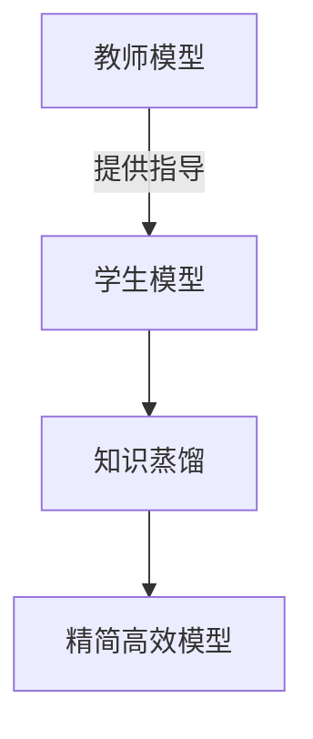
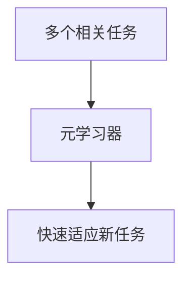

# 元学习算法概述:知识蒸馏与学习到学习

## 1.背景介绍

### 1.1 机器学习的挑战

机器学习已经取得了令人瞩目的成就,但仍然面临着一些挑战。传统的机器学习算法需要大量的标记数据、计算资源和时间来训练模型,这使得它们在新的任务或环境中很难快速适应。此外,这些算法通常无法从先前的经验中积累知识,在解决新问题时需要从头开始训练。

### 1.2 元学习的兴起

为了解决这些挑战,元学习(Meta-Learning)应运而生。元学习旨在设计能够快速适应新任务的学习算法,借助从先前任务中获得的经验来加速新任务的学习过程。换句话说,元学习是"学习如何学习"的过程。

### 1.3 知识蒸馏与学习到学习

知识蒸馏(Knowledge Distillation)和学习到学习(Learning to Learn)是元学习中两种主要的方法。知识蒸馏旨在从一个大型预训练模型(教师模型)中提取知识,并将其传递给一个小型模型(学生模型)。学习到学习则是设计一种元学习器(meta-learner),通过多任务训练来学习快速适应新任务的能力。

## 2.核心概念与联系

### 2.1 知识蒸馏

知识蒸馏的核心思想是利用一个大型预训练模型(教师模型)来指导一个小型模型(学生模型)的训练,使学生模型能够学习到教师模型中蕴含的知识。



这个过程通常包括以下步骤:

1. 训练一个大型教师模型
2. 使用教师模型的输出(如softmax概率分布)作为软目标(soft targets)
3. 训练学生模型,使其输出尽可能接近软目标

通过知识蒸馏,学生模型可以学习到教师模型的知识,同时保持较小的模型大小和较低的计算复杂度,从而实现高效的部署和推理。

### 2.2 学习到学习

学习到学习的目标是设计一种元学习器(meta-learner),使其能够从多个相关任务中学习到一种快速适应新任务的能力。这种方法通常包括以下步骤:



1. 收集一组相关的任务
2. 使用这些任务对元学习器进行训练
3. 在新任务上,元学习器可以快速适应并获得良好的性能

学习到学习的关键在于设计合适的元学习算法,使元学习器能够从多个任务中提取出通用的知识,并将其应用到新任务上。常见的元学习算法包括基于优化的方法(如MAML)和基于度量的方法(如Prototypical Networks)等。

### 2.3 知识蒸馏与学习到学习的联系

知识蒸馏和学习到学习都旨在提高模型的泛化能力和适应性,但它们的侧重点不同。知识蒸馏侧重于从大型模型中提取知识,并将其传递给小型高效模型;而学习到学习则侧重于设计能够快速适应新任务的元学习算法。

这两种方法可以相互补充。例如,我们可以首先使用知识蒸馏来训练一个高效的学生模型,然后将该学生模型作为元学习器的初始模型,通过学习到学习的方式来提高其快速适应新任务的能力。

## 3.核心算法原理具体操作步骤

### 3.1 知识蒸馏算法

知识蒸馏算法的核心步骤如下:

1. **训练教师模型**:首先训练一个大型的教师模型,使其在目标任务上达到较高的性能。

2. **生成软目标**:使用教师模型对训练数据进行前向传播,获得softmax输出(即softmax概率分布)。这些softmax输出就是软目标(soft targets)。

3. **训练学生模型**:初始化一个小型的学生模型,其输出维度与教师模型相同。使用知识蒸馏损失函数(如交叉熵损失)将学生模型的输出与软目标进行对比,并优化学生模型的参数。

知识蒸馏损失函数通常包括两个部分:

$$L_{KD} = (1-\alpha)L_{CE}(y, p_s) + \alpha T^2L_{KL}(p_t, p_s)$$

其中:
- $L_{CE}$是硬目标(hard targets)与学生模型输出之间的交叉熵损失
- $L_{KL}$是教师模型softmax输出($p_t$)与学生模型softmax输出($p_s$)之间的KL散度
- $\alpha$是平衡两个损失项的超参数
- $T$是软目标温度超参数,用于放大softmax概率分布

4. **模型微调**:在知识蒸馏后,可以对学生模型进行进一步的微调,以提高其在目标任务上的性能。

### 3.2 学习到学习算法

学习到学习算法的具体步骤取决于所采用的元学习方法。这里以基于优化的MAML(Model-Agnostic Meta-Learning)算法为例:

1. **任务采样**:从任务分布$p(\mathcal{T})$中采样一批任务,每个任务包含支持集(support set)和查询集(query set)。

2. **内循环**:对于每个任务,使用支持集对模型进行几步梯度更新,得到适应该任务的模型参数$\phi_i'$:

$$\phi_i' = \phi - \alpha \nabla_{\phi} \mathcal{L}_{\mathcal{T}_i}(f_{\phi})$$

其中$\alpha$是内循环的学习率,$\mathcal{L}_{\mathcal{T}_i}$是任务$\mathcal{T}_i$上的损失函数。

3. **外循环**:使用查询集计算每个任务的损失,并对这些损失求和作为元损失函数:

$$\mathcal{L}_{\phi} = \sum_{\mathcal{T}_i \sim p(\mathcal{T})} \mathcal{L}_{\mathcal{T}_i}(f_{\phi_i'})$$

使用元损失函数对模型参数$\phi$进行更新。

4. **重复上述过程**:重复任务采样、内循环和外循环,直到模型收敛。

通过上述过程,MAML算法可以学习到一个初始化,使得在新任务上只需少量梯度步骤即可适应该任务。其他元学习算法(如Prototypical Networks等)也遵循类似的"内循环-外循环"范式,但具体实现会有所不同。

## 4.数学模型和公式详细讲解举例说明

### 4.1 知识蒸馏损失函数

知识蒸馏损失函数是知识蒸馏算法的核心,它将学生模型的输出与教师模型的软目标(soft targets)进行对比。常用的知识蒸馏损失函数如下:

$$L_{KD} = (1-\alpha)L_{CE}(y, p_s) + \alpha T^2L_{KL}(p_t, p_s)$$

其中:

- $L_{CE}$是硬目标(hard targets)与学生模型输出之间的交叉熵损失,定义为:

$$L_{CE}(y, p_s) = -\sum_{i=1}^{C} y_i \log p_{s_i}$$

其中$y$是one-hot编码的硬目标,$p_s$是学生模型的softmax输出。

- $L_{KL}$是教师模型softmax输出($p_t$)与学生模型softmax输出($p_s$)之间的KL散度,定义为:

$$L_{KL}(p_t, p_s) = \sum_{i=1}^{C} p_{t_i} \log \frac{p_{t_i}}{p_{s_i}}$$

KL散度可以衡量两个概率分布之间的差异,知识蒸馏旨在最小化这个差异。

- $\alpha$是平衡两个损失项的超参数,通常取值在[0, 1]范围内。
- $T$是软目标温度超参数,用于放大softmax概率分布,通常取值大于1。当$T$增大时,softmax概率分布会变得更加"软化"(即熵增加),这有助于传递教师模型的"黑暗知识"(dark knowledge)。

例如,假设一个二分类问题,教师模型的softmax输出为$p_t=[0.8, 0.2]$,学生模型的softmax输出为$p_s=[0.7, 0.3]$,硬目标为$y=[1, 0]$,取$\alpha=0.5,T=2$,则知识蒸馏损失为:

$$\begin{aligned}
L_{KD} &= 0.5 \times (-\log 0.7) + 0.5 \times 2^2 \times (0.8 \log \frac{0.8}{0.7} + 0.2 \log \frac{0.2}{0.3}) \\
       &= 0.5 \times 0.357 + 0.5 \times 4 \times 0.068 \\
       &= 0.179 + 0.136 \\
       &= 0.315
\end{aligned}$$

通过最小化这个损失函数,学生模型可以逐渐学习到教师模型的知识。

### 4.2 MAML算法

MAML(Model-Agnostic Meta-Learning)算法是一种基于优化的元学习算法,其核心思想是找到一个好的模型初始化,使得在新任务上只需少量梯度步骤即可适应该任务。

MAML算法的数学模型如下:

1. **内循环**:对于每个任务$\mathcal{T}_i$,使用支持集对模型进行几步梯度更新,得到适应该任务的模型参数$\phi_i'$:

$$\phi_i' = \phi - \alpha \nabla_{\phi} \mathcal{L}_{\mathcal{T}_i}(f_{\phi})$$

其中$\alpha$是内循环的学习率,$\mathcal{L}_{\mathcal{T}_i}$是任务$\mathcal{T}_i$上的损失函数。

2. **外循环**:使用查询集计算每个任务的损失,并对这些损失求和作为元损失函数:

$$\mathcal{L}_{\phi} = \sum_{\mathcal{T}_i \sim p(\mathcal{T})} \mathcal{L}_{\mathcal{T}_i}(f_{\phi_i'})$$

使用梯度下降法对模型参数$\phi$进行更新:

$$\phi \leftarrow \phi - \beta \nabla_{\phi} \mathcal{L}_{\phi}$$

其中$\beta$是外循环的学习率。

通过上述"内循环-外循环"的优化过程,MAML算法可以找到一个好的初始化$\phi$,使得在新任务上只需少量梯度步骤即可适应该任务。

例如,假设我们有两个二分类任务$\mathcal{T}_1$和$\mathcal{T}_2$,每个任务都有支持集和查询集。我们使用MAML算法对一个二层神经网络进行元训练,初始参数为$\phi=\{W_1, b_1, W_2, b_2\}$。

对于任务$\mathcal{T}_1$,内循环更新后的参数为:

$$\phi_1' = \phi - \alpha \nabla_{\phi} \mathcal{L}_{\mathcal{T}_1}(f_{\phi})$$

对于任务$\mathcal{T}_2$,内循环更新后的参数为:

$$\phi_2' = \phi - \alpha \nabla_{\phi} \mathcal{L}_{\mathcal{T}_2}(f_{\phi})$$

然后,我们计算元损失函数:

$$\mathcal{L}_{\phi} = \mathcal{L}_{\mathcal{T}_1}(f_{\phi_1'}) + \mathcal{L}_{\mathcal{T}_2}(f_{\phi_2'})$$

使用梯度下降法对$\phi$进行更新:

$$\phi \leftarrow \phi - \beta \nabla_{\phi} \mathcal{L}_{\phi}$$

通过多次迭代上述过程,MAML算法可以找到一个好的初始化$\phi$,使得在新的二分类任务上,只需少量梯度步骤即可获得良好的性能。

## 5.项目实践:代码实例和详细解释说明

### 5.1 知识蒸馏实例

以下是一个使用PyTorch实现知识蒸馏的简单示例:

```python
import torch
import torch.nn as