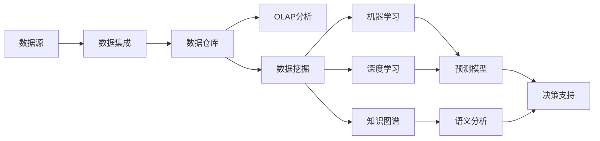

# 决策支持系统的AI革命：从数据到洞见

## 1. 背景介绍
### 1.1 决策支持系统的定义与发展历程
#### 1.1.1 决策支持系统的定义
决策支持系统（Decision Support System，DSS）是一种交互式的计算机信息系统，它利用数据和模型来帮助决策者解决非结构化或半结构化的决策问题。DSS通过整合和分析海量数据，为决策者提供及时、准确、全面的信息支持，辅助其做出科学、合理的决策。

#### 1.1.2 决策支持系统的发展历程
决策支持系统的概念最早由美国麻省理工学院的Michael S. Scott Morton教授在20世纪60年代提出。此后，随着计算机技术和管理科学的发展，DSS经历了数据驱动、模型驱动、知识驱动等多个阶段。近年来，人工智能技术的兴起为DSS注入了新的活力，推动其向智能化、自适应化方向发展。

### 1.2 人工智能在决策支持中的应用现状
#### 1.2.1 机器学习算法的应用
机器学习是人工智能的核心技术之一，它通过对历史数据的学习和训练，建立预测模型，实现对未知数据的分类、回归、聚类等任务。在DSS中，机器学习算法被广泛应用于需求预测、风险评估、用户画像等场景，大大提升了决策的精准度和效率。

#### 1.2.2 自然语言处理技术的应用
自然语言处理（Natural Language Processing，NLP）是人工智能的另一个重要分支，它赋予计算机理解、分析和生成人类语言的能力。在DSS中，NLP技术可以用于语义分析、情感计算、知识图谱构建等任务，帮助决策者快速获取关键信息，把握舆情动态。

#### 1.2.3 知识推理与专家系统
知识推理是人工智能的传统研究领域，它模拟人类专家的思维方式，利用领域知识和推理规则，对复杂问题进行分析和求解。专家系统是知识推理的典型应用，它将人类专家的知识和经验固化到计算机系统中，为决策提供智能化支持。在医疗、金融、工业等领域，专家系统已经得到了广泛应用。

## 2. 核心概念与联系
### 2.1 数据挖掘与知识发现
数据挖掘（Data Mining）是从海量数据中发现隐藏的、先前未知的、具有潜在价值的知识的过程。它综合运用了机器学习、统计学、数据库等多个学科的方法，可以实现关联分析、分类预测、聚类分析等功能。数据挖掘是知识发现（Knowledge Discovery）的核心步骤，其目标是将数据转化为知识，为决策提供依据。

### 2.2 OLAP与数据仓库
联机分析处理（Online Analytical Processing，OLAP）是一种多维度的、交互式的数据分析技术，它允许用户从不同角度、不同粒度对数据进行探索和分析。OLAP的基础是数据仓库（Data Warehouse），它是一个面向主题的、集成的、相对稳定的、反映历史变化的数据集合，为OLAP提供了统一的数据视图。

### 2.3 机器学习与深度学习
机器学习（Machine Learning）是人工智能的一个分支，它通过算法设计和数据训练，使计算机系统具备自动学习和改进的能力。根据学习方式的不同，机器学习可以分为监督学习、无监督学习、半监督学习、强化学习等类型。深度学习（Deep Learning）是机器学习的一种，它模拟人脑的神经网络结构，利用多层次的特征表示和抽象，实现了对复杂模式的识别和学习。

### 2.4 知识图谱与语义分析
知识图谱（Knowledge Graph）是一种结构化的语义网络，它以图的形式表示实体、概念及其相互关系。知识图谱可以用于语义搜索、问答系统、推荐系统等场景，帮助计算机理解自然语言的语义信息。语义分析（Semantic Analysis）是自然语言处理的一个重要任务，它利用语言学规则和统计方法，对文本的语义结构和内在含义进行分析和表示。

### 2.5 Mermaid流程图

## 3. 核心算法原理具体操作步骤
### 3.1 关联规则挖掘
关联规则挖掘（Association Rule Mining）是一种常用的数据挖掘技术，用于发现数据集中变量之间的关联关系。其基本思想是首先找出频繁项集，然后由频繁项集产生关联规则。具体步骤如下：
1. 数据预处理：对原始数据进行清洗、集成、变换和规约，生成适合挖掘的事务数据集。
2. 频繁项集生成：采用Apriori、FP-growth等算法，找出满足最小支持度阈值的所有频繁项集。
3. 关联规则生成：对每个频繁项集，枚举其所有非空子集，计算置信度，生成满足最小置信度的关联规则。
4. 规则评估与解释：对生成的关联规则进行评估和解释，去除冗余和无效的规则，形成最终的关联规则集。

### 3.2 决策树学习
决策树（Decision Tree）是一种常用的分类与预测方法，它通过对训练数据的递归划分，生成一个树形的决策模型。决策树学习的基本步骤如下：
1. 特征选择：根据某种准则（如信息增益、基尼指数），选择最优的特征作为当前节点的分裂属性。
2. 树的生成：根据分裂属性的取值，将数据集划分为若干子集，递归地在每个子集上构建子树，直到满足停止条件。
3. 树的剪枝：通过剪除一些分支来简化决策树，提高其泛化能力，避免过拟合问题。
4. 模型评估：使用测试集数据对决策树模型进行评估，计算准确率、召回率、F1值等指标。

### 3.3 支持向量机
支持向量机（Support Vector Machine，SVM）是一种基于统计学习理论的二分类模型，它通过在特征空间中寻找最优分离超平面，实现对样本的分类。SVM的基本步骤如下：
1. 数据转换：将原始数据映射到高维特征空间，使其在高维空间中线性可分。
2. 最优化问题求解：构建SVM的目标函数和约束条件，转化为凸二次规划问题，求解出最优分离超平面的参数。
3. 核函数选择：根据数据的特点和先验知识，选择合适的核函数（如线性核、多项式核、高斯核），实现非线性分类。
4. 模型评估：使用测试集数据对SVM模型进行评估，计算分类准确率等指标。

### 3.4 神经网络与深度学习
人工神经网络（Artificial Neural Network，ANN）是一种模拟生物神经系统的计算模型，由大量的节点（神经元）和连接（权重）组成。深度学习是神经网络的延伸，通过构建多隐层的深度网络结构，实现了对复杂特征的自动学习和提取。深度学习的基本步骤如下：
1. 网络构建：根据任务的需要，设计合适的网络结构（如卷积神经网络、循环神经网络），确定网络的层数、节点数、激活函数等参数。
2. 数据准备：对原始数据进行预处理，如归一化、特征缩放等，并划分为训练集、验证集和测试集。
3. 模型训练：使用训练集数据对网络进行训练，通过前向传播计算输出，通过反向传播更新权重，不断迭代直到达到停止条件。
4. 模型调优：使用验证集数据对模型进行调优，通过调整超参数（如学习率、正则化系数）来优化模型性能。
5. 模型评估：使用测试集数据对最终模型进行评估，计算准确率、误差等指标。

## 4. 数学模型和公式详细讲解举例说明
### 4.1 支持向量机的数学模型
支持向量机的目标是在特征空间中找到一个最优分离超平面，使得两类样本点到超平面的距离最大化。假设训练集为$\{(x_i,y_i)\}_{i=1}^N$，其中$x_i \in R^n$为特征向量，$y_i \in \{-1,+1\}$为类别标签。分离超平面可以表示为$w^Tx+b=0$，其中$w$为法向量，$b$为偏置项。SVM的数学模型可以表示为以下优化问题：

$$
\min_{w,b} \frac{1}{2}||w||^2 \\
s.t. \quad y_i(w^Tx_i+b) \geq 1, \quad i=1,2,...,N
$$

其中，$\frac{1}{2}||w||^2$表示最大化分类间隔，$y_i(w^Tx_i+b) \geq 1$表示正确分类的约束条件。通过引入拉格朗日乘子$\alpha_i \geq 0$，可以将上述优化问题转化为其对偶形式：

$$
\max_{\alpha} \sum_{i=1}^N \alpha_i - \frac{1}{2} \sum_{i=1}^N \sum_{j=1}^N \alpha_i \alpha_j y_i y_j x_i^T x_j \\
s.t. \quad \sum_{i=1}^N \alpha_i y_i = 0, \quad 0 \leq \alpha_i \leq C, \quad i=1,2,...,N
$$

其中，$C$为惩罚参数，用于控制模型的复杂度和容错能力。通过求解上述对偶问题，可以得到最优的$\alpha$，进而得到分离超平面的参数$w$和$b$。对于非线性可分的情况，可以通过核函数$K(x_i,x_j)$将样本映射到高维空间，实现非线性分类。

### 4.2 BP神经网络的数学模型
BP（Backpropagation）神经网络是一种多层前馈网络，通过反向传播算法对网络权重进行训练和更新。假设BP网络有$L$层，第$l$层有$n_l$个节点，第$l-1$层有$n_{l-1}$个节点。记第$l$层第$j$个节点的输出为$a_j^l$，第$l-1$层第$i$个节点到第$l$层第$j$个节点的权重为$w_{ij}^l$，第$l$层第$j$个节点的偏置为$b_j^l$。则BP网络的前向传播过程可以表示为：

$$
z_j^l = \sum_{i=1}^{n_{l-1}} w_{ij}^l a_i^{l-1} + b_j^l \\
a_j^l = f(z_j^l)
$$

其中，$f(\cdot)$为激活函数，常用的有sigmoid函数、tanh函数、ReLU函数等。网络的损失函数定义为预测输出与真实标签之间的均方误差：

$$
J(W,b) = \frac{1}{2m} \sum_{k=1}^m ||h_{W,b}(x^{(k)}) - y^{(k)}||^2
$$

其中，$m$为样本数量，$h_{W,b}(x)$为网络的预测输出，$y$为真实标签。BP算法通过链式法则计算损失函数对每一层权重和偏置的梯度，并使用梯度下降法对其进行更新：

$$
w_{ij}^l := w_{ij}^l - \alpha \frac{\partial J}{\partial w_{ij}^l} \\
b_j^l := b_j^l - \alpha \frac{\partial J}{\partial b_j^l}
$$

其中，$\alpha$为学习率。通过不断迭代上述过程，网络权重和偏置会逐渐收敛，最终得到一个性能优异的模型。

## 5. 项目实践：代码实例和详细解释说明
下面以Python语言为例，演示如何使用scikit-