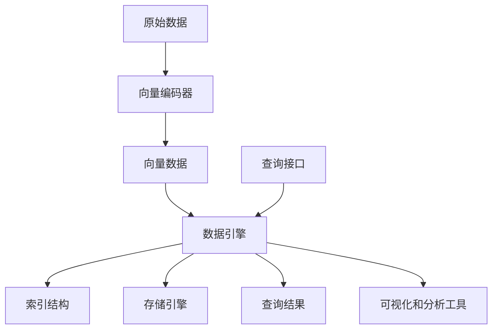

# 向量数据库基础：存储和检索多维数据的科学

## 1.背景介绍

### 1.1 数据的高维化趋势

在当今的数字时代,数据已经成为了推动科技创新和商业发展的核心动力。随着人工智能、物联网、多媒体等领域的快速发展,数据的形式和结构也变得越来越复杂和多样化。传统的结构化数据(如关系数据库中的表格数据)已经无法满足新兴应用对数据存储和检索的需求。

特别是在自然语言处理、计算机视觉、推荐系统等领域,数据通常表现为高维向量的形式,如词向量、图像特征向量等。这些高维向量数据蕴含着丰富的语义信息,能够更好地捕捉数据之间的相似性和关联性。因此,如何高效地存储和检索这些多维数据成为了一个迫切的挑战。

### 1.2 向量数据库的兴起

为了解决高维数据存储和检索的问题,近年来兴起了一种新型的数据库——向量数据库(Vector Database)。与传统的关系数据库和NoSQL数据库不同,向量数据库专门设计用于存储和检索高维向量数据,并提供了高效的相似性搜索和分析功能。

向量数据库的核心思想是将高维向量作为基本的数据单元进行存储和索引,并基于向量之间的相似度进行快速检索和计算。这种新型数据库为处理高维数据提供了一种全新的范式,在自然语言处理、计算机视觉、推荐系统等领域发挥着越来越重要的作用。

## 2.核心概念与联系

### 2.1 向量空间模型

向量数据库的理论基础是向量空间模型(Vector Space Model),这是一种在信息检索领域广泛使用的数学模型。在向量空间模型中,每个数据对象(如文本文档、图像等)都被表示为一个高维向量,其中每个维度对应着一个特征(如词频、像素值等)。

通过将数据对象映射到向量空间,我们可以利用向量之间的相似度来衡量数据对象之间的相关性。常用的相似度度量包括余弦相似度、欧几里得距离等。具有较高相似度的向量对应着相关性较高的数据对象。

### 2.2 近似最近邻搜索

在向量数据库中,一个核心操作是近似最近邻搜索(Approximate Nearest Neighbor Search,简称ANN)。给定一个查询向量,ANN的目标是在整个向量集合中快速找到与查询向量最相似的若干个向量。

由于向量空间通常是高维的,而高维空间中的数据分布呈现"维数灾难"(Curse of Dimensionality)的特征,因此精确地找到最近邻是一个计算量极大的问题。为了提高搜索效率,向量数据库通常采用近似算法,在牺牲一定精度的情况下,快速地找到足够相似的近邻向量。

常用的ANN算法包括局部敏感哈希(Locality Sensitive Hashing,LSH)、层次导航(Hierarchical Navigable Small World,HNSW)、矢量乘积量化(Vector Product Quantization,PQ)等。这些算法通过构建高效的索引结构和利用空间分割、哈希编码等技术,大幅提高了高维向量的查询速度。

### 2.3 向量数据库架构

一个典型的向量数据库系统通常包括以下几个核心组件:

1. **数据引擎**:负责向量数据的存储、索引和查询,实现高效的向量相似性搜索。
2. **向量编码器**:将原始数据(如文本、图像等)编码为高维向量的模块。
3. **查询接口**:提供友好的API,支持向量插入、删除、更新和相似性搜索等操作。
4. **可视化和分析工具**:用于探索和分析向量数据的可视化界面和分析工具。

这些组件协同工作,为用户提供了一站式的向量数据管理和分析解决方案。

## 3.核心算法原理具体操作步骤

### 3.1 向量编码

在将原始数据存储到向量数据库之前,需要先将其转换为高维向量的形式。这个过程称为向量编码(Vector Encoding)。

常见的向量编码方法包括:

1. **词袋模型(Bag-of-Words)**:将文本文档表示为词频向量。
2. **词嵌入(Word Embedding)**:利用神经网络模型(如Word2Vec、GloVe等)将单词映射到连续的向量空间。
3. **图像特征提取**:使用卷积神经网络(CNN)等模型从图像中提取特征向量。

以词嵌入为例,Word2Vec模型的训练过程可以概括为以下步骤:

1. 构建训练语料库,将文本切分为单词序列。
2. 初始化词向量和上下文向量的权重矩阵。
3. 对于每个目标单词,使用当前权重矩阵预测上下文单词。
4. 计算预测误差,并使用反向传播算法更新权重矩阵。
5. 重复3-4步骤,直到模型收敛。

经过训练,每个单词都被映射到一个固定维度的向量空间中,相似的单词在向量空间中彼此靠近。

### 3.2 向量索引

为了加速向量相似性搜索,向量数据库需要构建高效的索引结构。常用的向量索引算法包括:

1. **局部敏感哈希(LSH)**:通过设计特殊的哈希函数族,将相似的向量映射到相同的哈希桶中,从而实现快速的近似最近邻搜索。
2. **层次导航(HNSW)**:构建一种分层的导航小世界图,在图中进行有效的最近邻搜索。
3. **矢量乘积量化(PQ)**:将高维向量分割为多个低维子向量,分别对子向量进行量化和编码,从而减小索引的空间开销。

以LSH为例,其核心思想是通过设计一族局部敏感的哈希函数,使得相似的向量有很高的概率被映射到相同的哈希桶中。具体步骤如下:

1. 选择一组随机投影向量 $\vec{r_1}, \vec{r_2}, \dots, \vec{r_k}$。
2. 对于每个数据向量 $\vec{v}$,计算 $h_i(\vec{v}) = \lfloor \vec{r_i} \cdot \vec{v} / W \rfloor$,其中 $W$ 是一个窗口大小参数。
3. 将 $\vec{v}$ 插入到对应的哈希桶 $(h_1(\vec{v}), h_2(\vec{v}), \dots, h_k(\vec{v}))$ 中。
4. 在查询时,对于查询向量 $\vec{q}$,计算其哈希值,并检索对应哈希桶中的向量作为候选集。

通过构建多个哈希表并合并结果,LSH可以在牺牲一定精度的情况下,大幅提高最近邻搜索的效率。

### 3.3 向量相似性搜索

向量相似性搜索是向量数据库的核心功能,它可以快速找到与给定查询向量最相似的若干个向量。常见的相似性度量包括:

1. **余弦相似度**:衡量两个向量的夹角余弦值,范围在 [-1, 1] 之间。
2. **欧几里得距离**:衡量两个向量在欧几里得空间中的距离。
3. **内积**:两个向量的点乘,可以看作是余弦相似度的重加权版本。

假设我们使用余弦相似度作为相似性度量,给定一个查询向量 $\vec{q}$,相似性搜索的过程如下:

1. 利用向量索引(如LSH)快速找到一个候选向量集 $C$。
2. 计算 $\vec{q}$ 与 $C$ 中每个向量 $\vec{v}$ 的余弦相似度 $\text{sim}(\vec{q}, \vec{v}) = \frac{\vec{q} \cdot \vec{v}}{||\vec{q}|| \cdot ||\vec{v}||}$。
3. 根据相似度值排序,返回前 $k$ 个最相似的向量。

在实际应用中,我们还可以设置相似度阈值,只返回相似度超过该阈值的向量,以满足不同的精度要求。

## 4.数学模型和公式详细讲解举例说明

### 4.1 向量空间模型

在向量空间模型中,每个数据对象 $d$ 被表示为一个 $n$ 维向量 $\vec{v_d} = (w_{d1}, w_{d2}, \dots, w_{dn})$,其中每个维度 $w_{di}$ 对应着该对象在第 $i$ 个特征上的权重或计数。

对于文本数据,常用的特征包括词频(Term Frequency,TF)和逆文档频率(Inverse Document Frequency,IDF)。词频 $\text{TF}(t, d)$ 表示词项 $t$ 在文档 $d$ 中出现的次数,而逆文档频率 $\text{IDF}(t) = \log \frac{N}{|\{d : t \in d\}|}$ 则衡量了词项 $t$ 的区分能力,其中 $N$ 是语料库中文档的总数。

通过将 TF 和 IDF 相结合,我们可以得到 TF-IDF 向量:

$$\vec{v_d} = (w_{d1}, w_{d2}, \dots, w_{dn})$$
$$w_{di} = \text{TF}(t_i, d) \cdot \text{IDF}(t_i)$$

在这种表示下,相似的文档往往具有相似的 TF-IDF 向量,因此可以通过向量相似度来衡量文档相似性。

### 4.2 向量相似度

在向量空间模型中,向量相似度是衡量两个向量相似程度的一种度量。常用的相似度函数包括:

1. **余弦相似度**

余弦相似度衡量两个向量之间的夹角余弦值,定义为:

$$\text{sim}_\text{cos}(\vec{u}, \vec{v}) = \frac{\vec{u} \cdot \vec{v}}{||\vec{u}|| \cdot ||\vec{v}||} = \frac{\sum_{i=1}^{n} u_i v_i}{\sqrt{\sum_{i=1}^{n} u_i^2} \sqrt{\sum_{i=1}^{n} v_i^2}}$$

其中 $\vec{u} \cdot \vec{v}$ 表示两个向量的点乘,而 $||\vec{u}||$ 和 $||\vec{v}||$ 分别表示向量的 $L_2$ 范数。余弦相似度的值域为 $[-1, 1]$,当两个向量完全相同时,余弦相似度为 1;当两个向量正交时,余弦相似度为 0;当两个向量方向完全相反时,余弦相似度为 -1。

2. **欧几里得距离**

欧几里得距离衡量两个向量在欧几里得空间中的距离,定义为:

$$\text{dist}_\text{euc}(\vec{u}, \vec{v}) = \sqrt{\sum_{i=1}^{n} (u_i - v_i)^2}$$

欧几里得距离的值域为 $[0, +\infty)$,当两个向量完全相同时,距离为 0;距离越大,表示两个向量越不相似。

在向量数据库中,余弦相似度被广泛用于相似性搜索,因为它对向量的长度不敏感,只关注向量的方向。而欧几里得距离则更适合于需要考虑向量长度的场景。

### 4.3 局部敏感哈希

局部敏感哈希(Locality Sensitive Hashing,LSH)是一种用于近似最近邻搜索的有效技术。它的核心思想是通过设计一族局部敏感的哈希函数,使得相似的向量有很高的概率被映射到相同的哈希桶中,从而加速最近邻搜索。

对于一个给定的向量空间 $\mathbb{R}^n$,LSH 算法首先选择一组随机投影向量 $\vec{r_1}, \vec