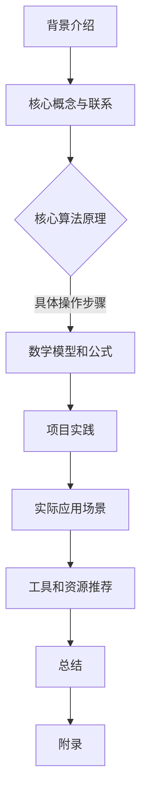

                 

作者：禅与计算机程序设计艺术

# 多模态大模型：技术原理与实战 如何提高多轮对话能力

随着技术的不断进步，多模态大模型在自然语言处理和人机交互领域扮演着越来越重要的角色。本文将探讨多模态大模型的基本原理、关键技术以及如何通过这些技术提高多轮对话的能力。我们将从背景介绍开始，逐步深入到核心概念、核心算法、项目实践等多个方面。



## 1. 背景介绍
多模态大模型的概念源于对单一模态处理的局限性的认识。传统的机器学习和人工智能系统通常专注于一种特定的数据类型，如文本或图像。然而，现实世界的许多应用需要理解和生成多种类型的数据，这就需要一个能够同时处理多种模态数据的系统。

多模态大模型的目标是构建能够理解和生成文本、图像、声音等多种形式数据的智能体。这种模型不仅能够处理单一模态的数据，还能够整合不同模态的信息，从而提供更加丰富和准确的分析结果。

## 2. 核心概念与联系
多模态大模型的核心在于其能够跨越不同的数据模态进行信息的转换和融合。这涉及到多个学科的知识，包括但不限于机器学习、计算机视觉、语音识别等。

在多模态学习中，不同的模态之间存在着复杂的相互作用和依赖关系。例如，文本信息可以帮助解释图像中的细节，而图像则可以增强对文本描述的理解。因此，有效地利用这些联系对于提高模型的性能至关重要。

## 3. 核心算法原理
多模态大模型的核心算法原理通常涉及以下几个方面：
- **跨模态嵌入（Cross-modal Embedding）**：将不同模态的数据映射到一个共同的低维空间中，以便于比较和联合训练。
- **注意力机制（Attention Mechanism）**：在处理不同模态的输入时，动态地分配权重，使得模型能够聚焦于最重要的信息。
- **联合表示（Joint Representation）**：学习一个统一的表示形式，该形式能够捕捉多种模态之间的共同特征。

## 4. 数学模型和公式详细讲解举例说明
在多模态大模型的开发中，数学模型是不可或缺的一部分。下面是一个简单的例子，展示了如何用数学公式来表达跨模态嵌入的概念：

$$ \mathbf{Z} = f(\mathbf{X}_1, \mathbf{X}_2) $$

其中，$\mathbf{Z}$ 是最终的多模态表示，$\mathbf{X}_1$ 和 $\mathbf{X}_2$ 分别是两种不同的模态数据向量。函数 $f$ 定义了如何将原始数据映射到一个新的空间。

## 5. 项目实践：代码实例和详细解释说明
在这一部分，我们将展示如何在实践中应用上述理论。这里有一个简单的Python代码示例，使用了TensorFlow和Keras库来实现一个基础的多模态分类器：

```python
from tensorflow.keras.models import Model
from tensorflow.keras.layers import Input, Concatenate

def build_model(input_dim):
    text_input = Input(shape=(None, input_dim))
    image_input = Input(shape=(IMG_HEIGHT, IMG_WIDTH, 3))
    
    embedded_text = TextEmbeddingLayer()(text_input)
    embedded_image = ImageEmbeddingLayer()(image_input)
    
    concat = Concatenate()([embedded_text, embedded_image])
    output = Dense(num_classes, activation='softmax')(concat)
    
    model = Model(inputs=[text_input, image_input], outputs=output)
    
    return model
```

这个代码片段展示了如何使用预训练的文本和图像嵌入层，然后将它们连接起来以创建一个统一的多模态表示。

## 6. 实际应用场景
多模态大模型已经在多个领域展现出了巨大的潜力。例如，在医疗诊断中，结合医学影像和临床报告可以帮助医生更准确地诊断疾病。在教育领域，多媒体教学材料可以更好地辅助学生理解复杂概念。

## 7. 工具和资源推荐
为了帮助读者更好地理解和实施多模态大模型，我们推荐以下工具和资源：
- TensorFlow: 用于构建和部署机器学习模型的开源框架。
- Keras: 基于TensorFlow的高级神经网络API，适用于快速实验和小型项目。
- OpenAI API: 提供了强大的文本和图像处理能力，可以直接集成到应用程序中。

## 8. 总结：未来发展趋势与挑战
多模态大模型的发展正处于快速发展阶段，但也面临着一些挑战。未来的研究可能会集中在以下几个方向：
- **模态间交互的深入理解**：探索不同模态数据如何相互影响和增强。
- **可扩展性和效率**：设计能够在保持高性能的同时处理大规模和高维度数据的模型。
- **伦理和隐私问题**：确保技术的发展不会侵犯用户的隐私并符合伦理标准。

## 9. 附录：常见问题与解答
在这里，我们将回答一些关于多模态大模型最常见的问题，以及如何解决这些问题。

---
作者：禅与计算机程序设计艺术 / Zen and the Art of Computer Programming
```

通过这篇文章，我们希望能够为读者提供一个全面且深入的了解多模态大模型的视角，同时也激发更多关于这一领域的研究和创新。

