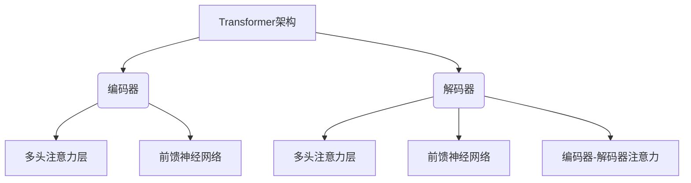

# 大语言模型(Large Language Models) - 原理与代码实例讲解

## 1.背景介绍

在过去几年中,大型语言模型(Large Language Models, LLMs)在自然语言处理(NLP)领域取得了令人瞩目的进展。这些模型通过在海量文本数据上进行预训练,学习了丰富的语言知识和上下文关系,从而能够生成高质量、连贯的文本输出。

LLMs的兴起主要源于两个关键因素:

1. **算力的飞速增长**:强大的GPU和TPU等加速硬件,使得训练大规模神经网络模型成为可能。
2. **大规模文本数据的可用性**:互联网上海量的文本数据(如网页、书籍、论文等)为LLMs提供了丰富的训练资源。

目前,LLMs已在多个NLP任务中展现出卓越的性能,如机器翻译、文本生成、问答系统等,为人工智能的发展注入了新的动力。

## 2.核心概念与联系

### 2.1 自然语言处理(NLP)

自然语言处理(Natural Language Processing, NLP)是人工智能的一个分支,旨在使计算机能够理解和生成人类语言。它涉及多个子任务,如文本分类、机器翻译、文本摘要、问答系统等。

### 2.2 语言模型(Language Model)

语言模型是NLP的核心组成部分,用于捕捉语言的统计规律和上下文关系。传统的语言模型通常基于n-gram或神经网络,用于估计一个句子或文本序列的概率。

### 2.3 大型语言模型(LLMs)

大型语言模型(Large Language Models, LLMs)是一种特殊的语言模型,其规模和复杂度远远超过传统模型。LLMs通常由数十亿甚至数万亿参数组成,能够在海量文本数据上进行预训练,从而学习丰富的语言知识和上下文关系。

LLMs的核心思想是:通过在大规模语料库上进行自监督学习,模型可以捕捉语言的内在规律和语义信息,从而在下游任务中表现出强大的泛化能力。

著名的LLMs包括GPT(Generative Pre-trained Transformer)系列、BERT(Bidirectional Encoder Representations from Transformers)、XLNet、RoBERTa等。

### 2.4 Transformer架构

Transformer是LLMs中广泛采用的一种神经网络架构,它完全基于注意力机制(Attention Mechanism),避免了传统RNN结构中的一些缺陷(如长期依赖问题)。Transformer的核心组成部分包括编码器(Encoder)、解码器(Decoder)和注意力层(Attention Layer)。

## 3.核心算法原理具体操作步骤

### 3.1 Transformer编码器

Transformer编码器的主要作用是将输入序列(如一个句子)映射为一系列连续的表示向量。其核心操作步骤如下:

1. **词嵌入(Word Embeddings)**: 将输入序列中的每个词token映射为一个固定长度的向量表示。
2. **位置编码(Positional Encoding)**: 因为Transformer没有循环或卷积结构,无法直接捕捉序列的位置信息,因此需要将位置信息编码到输入中。
3. **多头注意力(Multi-Head Attention)**: 计算输入序列中每个词与其他词的注意力权重,捕捉长距离依赖关系。
4. **残差连接(Residual Connection)**: 将注意力输出与输入相加,以更好地传递信息。
5. **层归一化(Layer Normalization)**: 对残差连接的输出进行归一化,加速训练并提高性能。
6. **前馈神经网络(Feed-Forward Neural Network)**: 对归一化后的向量进行非线性变换,提取更高层次的特征表示。

上述操作在编码器的多个层中重复进行,最终输出一系列编码向量,作为解码器的输入。

### 3.2 Transformer解码器

Transformer解码器的作用是根据编码器的输出,生成目标序列(如翻译后的句子)。其核心操作步骤如下:

1. **遮掩多头注意力(Masked Multi-Head Attention)**: 计算目标序列中每个词与之前词的注意力权重,避免attending到未来的位置。
2. **编码器-解码器注意力(Encoder-Decoder Attention)**: 计算目标序列中每个词与编码器输出的注意力权重,融合编码器的信息。
3. **残差连接(Residual Connection)**: 将注意力输出与输入相加,以更好地传递信息。
4. **层归一化(Layer Normalization)**: 对残差连接的输出进行归一化,加速训练并提高性能。
5. **前馈神经网络(Feed-Forward Neural Network)**: 对归一化后的向量进行非线性变换,提取更高层次的特征表示。
6. **输出层(Output Layer)**: 根据最终的解码器输出,预测目标序列的下一个词token。

上述操作在解码器的多个层中重复进行,最终生成完整的目标序列。

### 3.3 自注意力机制(Self-Attention)

自注意力机制是Transformer的核心,它允许模型直接捕捉输入序列中任意两个位置之间的依赖关系,而不受距离的限制。具体操作步骤如下:

1. 将输入序列 $X = (x_1, x_2, ..., x_n)$ 映射为查询(Query)、键(Key)和值(Value)向量:

   $$
   Q = X \cdot W_Q \\
   K = X \cdot W_K \\
   V = X \cdot W_V
   $$

   其中 $W_Q, W_K, W_V$ 是可学习的权重矩阵。

2. 计算查询与所有键的点积,得到未缩放的注意力分数:

   $$
   \text{Attention Scores} = Q \cdot K^T
   $$

3. 对注意力分数进行缩放和软化,得到注意力权重:

   $$
   \text{Attention Weights} = \text{softmax}(\frac{\text{Attention Scores}}{\sqrt{d_k}})
   $$

   其中 $d_k$ 是键的维度,用于防止较大的值导致梯度饱和。

4. 将注意力权重与值向量相乘,得到加权和作为注意力输出:

   $$
   \text{Attention Output} = \text{Attention Weights} \cdot V
   $$

通过多头注意力机制,模型可以从不同的子空间捕捉不同的依赖关系,提高表示能力。

### 3.4 预训练与微调

LLMs通常采用两阶段的训练策略:预训练(Pre-training)和微调(Fine-tuning)。

1. **预训练**: 在大规模无监督文本数据上训练LLM,使其学习通用的语言知识和上下文关系。常见的预训练目标包括:

   - **蒙版语言模型(Masked Language Modeling, MLM)**: 随机遮蔽输入序列中的一些词,让模型预测被遮蔽的词。
   - **下一句预测(Next Sentence Prediction, NSP)**: 判断两个句子是否相邻。
   - **因果语言模型(Causal Language Modeling, CLM)**: 给定前缀,预测下一个词token。

2. **微调**: 在特定的下游任务上,使用有监督数据对预训练模型进行微调,使其适应特定任务。微调通常只需要更新模型的部分参数,而保留大部分预训练参数不变。

预训练和微调的两阶段策略,使LLMs能够在下游任务上快速收敛,并取得出色的性能。

## 4.数学模型和公式详细讲解举例说明

### 4.1 自注意力计算

自注意力机制是Transformer的核心,它允许模型直接捕捉输入序列中任意两个位置之间的依赖关系。具体计算过程如下:

1. 将输入序列 $X = (x_1, x_2, ..., x_n)$ 映射为查询(Query)、键(Key)和值(Value)向量:

   $$
   Q = X \cdot W_Q \\
   K = X \cdot W_K \\
   V = X \cdot W_V
   $$

   其中 $W_Q, W_K, W_V$ 是可学习的权重矩阵,用于将输入向量映射到查询、键和值空间。

2. 计算查询与所有键的点积,得到未缩放的注意力分数:

   $$
   \text{Attention Scores} = Q \cdot K^T
   $$

   这里的点积操作可以捕捉查询和键之间的相似性,从而确定它们之间的依赖关系。

3. 对注意力分数进行缩放和软化,得到注意力权重:

   $$
   \text{Attention Weights} = \text{softmax}(\frac{\text{Attention Scores}}{\sqrt{d_k}})
   $$

   其中 $d_k$ 是键的维度,用于防止较大的值导致梯度饱和。softmax函数将注意力分数转换为概率分布,确保权重之和为1。

4. 将注意力权重与值向量相乘,得到加权和作为注意力输出:

   $$
   \text{Attention Output} = \text{Attention Weights} \cdot V
   $$

   这一步将值向量根据注意力权重进行加权求和,生成最终的注意力输出向量。

通过上述计算,自注意力机制可以自适应地捕捉输入序列中任意两个位置之间的依赖关系,而不受距离的限制。这种灵活的建模能力是Transformer取得卓越性能的关键所在。

### 4.2 多头注意力

为了进一步提高模型的表示能力,Transformer采用了多头注意力(Multi-Head Attention)机制。多头注意力将注意力计算过程分成多个子空间,每个子空间捕捉不同的依赖关系,最终将所有子空间的输出进行拼接。具体计算过程如下:

1. 将查询、键和值向量分别线性投影到 $h$ 个子空间:

   $$
   \begin{aligned}
   \text{Head}_i &= \text{Attention}(Q \cdot W_i^Q, K \cdot W_i^K, V \cdot W_i^V) \\
   &\text{where } i = 1, 2, ..., h
   \end{aligned}
   $$

   其中 $W_i^Q, W_i^K, W_i^V$ 是对应子空间的可学习权重矩阵。

2. 将所有子空间的注意力输出进行拼接:

   $$
   \text{MultiHead}(Q, K, V) = \text{Concat}(\text{Head}_1, \text{Head}_2, ..., \text{Head}_h) \cdot W^O
   $$

   其中 $W^O$ 是另一个可学习的权重矩阵,用于将拼接后的向量投影回原始空间。

通过多头注意力机制,模型可以从不同的子空间捕捉不同的依赖关系,提高了表示能力和建模灵活性。

### 4.3 位置编码

由于Transformer完全基于注意力机制,没有循环或卷积结构,因此无法直接捕捉序列的位置信息。为了解决这个问题,Transformer引入了位置编码(Positional Encoding)机制,将位置信息编码到输入序列中。

具体来说,对于输入序列 $X = (x_1, x_2, ..., x_n)$,我们为每个位置 $i$ 计算一个位置编码向量 $P_i$,将其与对应的词嵌入向量 $x_i$ 相加,得到最终的输入向量:

$$
\text{Input}_i = x_i + P_i
$$

位置编码向量 $P_i$ 可以通过不同的函数来计算,如三角函数、学习的嵌入向量等。常见的三角函数位置编码定义如下:

$$
P_{i,2j} = \sin(i / 10000^{2j/d_\text{model}}) \\
P_{i,2j+1} = \cos(i / 10000^{2j/d_\text{model}})
$$

其中 $i$ 是位置索引, $j$ 是维度索引, $d_\text{model}$ 是模型的隐藏层维度。

通过将位置信息编码到输入中,Transformer能够有效地捕捉序列的位置依赖关系,从而更好地建模语言数据。

## 5