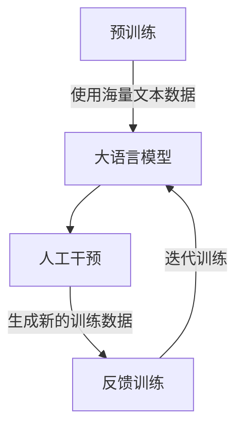

# 大语言模型原理与工程实践：RefinedWeb

## 1. 背景介绍

在当今的人工智能领域,大型语言模型(Large Language Models, LLMs)正成为一股不可忽视的力量。作为一种基于深度学习的自然语言处理技术,LLMs展现出令人惊叹的语言生成能力,可以产生看似人类写作的连贯、流畅、富有内容的文本输出。

随着计算能力的不断提高和训练数据的日益丰富,LLMs的规模也在不断扩大。从2018年发布的GPT(11亿参数)到2022年的GPT-3(1750亿参数),模型参数量呈现出爆炸式增长。大规模的参数量使得LLMs能够捕捉更丰富、更复杂的语言模式,从而产生更加自然、更加人性化的文本输出。

然而,LLMs的强大能力也带来了一些挑战和风险。由于模型训练过程中使用的数据可能存在偏差和噪声,因此LLMs的输出可能包含不当、不准确或有害的内容。此外,LLMs缺乏真正的理解和推理能力,它们只是在模仿训练数据中的语言模式,因此可能产生不连贯、不合逻辑或者自相矛盾的输出。

为了应对这些挑战,RefinedWeb作为一种新型的大语言模型架构应运而生。它旨在通过引入人工干预和反馈机制,提高LLMs的输出质量、可控性和可解释性。在本文中,我们将深入探讨RefinedWeb的核心原理、算法细节、工程实践,以及它在各种应用场景中的潜力和前景。

## 2. 核心概念与联系

### 2.1 大语言模型(LLMs)

大语言模型(LLMs)是一种基于深度学习的自然语言处理技术,旨在从大量文本数据中学习语言模式和知识表示。LLMs通常采用自注意力机制(Self-Attention)和Transformer架构,能够有效地捕捉长距离的上下文依赖关系。

LLMs的核心思想是通过预训练(Pre-training)的方式,在海量的文本数据上学习通用的语言表示,然后再通过微调(Fine-tuning)的方式,将预训练模型应用于特定的下游任务,如机器翻译、问答系统、文本生成等。

### 2.2 人工干预与反馈

尽管LLMs展现出了强大的语言生成能力,但它们的输出质量和可控性仍然存在一些挑战。为了解决这些问题,RefinedWeb引入了人工干预和反馈机制。

人工干预指的是在LLMs的生成过程中,允许人工编辑和修改模型的输出,以纠正错误、增强连贯性或者添加新的内容。通过人工干预,我们可以有效地控制LLMs的输出方向,确保其符合预期目标。

反馈机制则是将人工干预的结果作为新的训练数据,重新训练LLMs模型,使其能够学习和内化人工编辑的模式。通过不断地迭代训练和反馈,LLMs可以逐步改进其输出质量,最终达到更加可控和可解释的状态。

### 2.3 可控性与可解释性

可控性(Controllability)是指我们能够有效地控制和调整LLMs的输出,使其符合特定的目标和要求。例如,我们可以控制输出的语气、风格、长度等属性,或者指定输出需要包含或排除某些内容。

可解释性(Interpretability)则是指LLMs的输出过程和结果是可解释和可理解的。通过引入人工干预和反馈机制,我们可以更好地理解模型的决策过程,并且能够追溯输出结果的来源和依据。

可控性和可解释性是RefinedWeb架构的两个关键目标,它们不仅能够提高LLMs的输出质量,还能够增强人们对这些复杂模型的信任和接受度。

## 3. 核心算法原理具体操作步骤

RefinedWeb的核心算法原理可以分为三个主要步骤:预训练(Pre-training)、人工干预(Human Intervention)和反馈训练(Feedback Training)。



### 3.1 预训练(Pre-training)

预训练是LLMs的基础,它使用海量的文本数据(如网页、书籍、新闻等)来训练一个通用的语言模型。常见的预训练目标包括掩码语言模型(Masked Language Modeling)和下一句预测(Next Sentence Prediction)等。

在RefinedWeb中,我们使用自注意力机制(Self-Attention)和Transformer架构来构建预训练模型。这种架构能够有效地捕捉长距离的上下文依赖关系,从而提高模型的语言理解和生成能力。

### 3.2 人工干预(Human Intervention)

在预训练模型的基础上,RefinedWeb引入了人工干预环节。在这个阶段,人工编辑可以查看模型的输出,并根据需要进行修改、补充或删除操作。

人工干预可以采用多种形式,如:

1. **编辑输出文本**: 直接修改模型生成的文本,纠正错误、增强连贯性或添加新内容。
2. **提供反馈信号**: 为模型的输出打分或提供反馈,指导模型朝着正确的方向调整。
3. **设置控制参数**: 调整模型的控制参数,如输出长度、语气、风格等,以满足特定的需求。

人工干预过程可以是交互式的,允许多次迭代和修改,直到达到满意的输出结果。

### 3.3 反馈训练(Feedback Training)

在人工干预之后,RefinedWeb会将编辑后的文本作为新的训练数据,重新训练预训练模型。这个过程被称为反馈训练(Feedback Training)。

在反馈训练中,我们将原始输出和编辑后的输出作为成对数据,使用监督学习的方式训练模型。目标是使模型能够学习和内化人工编辑的模式,从而在未来的生成过程中产生更加符合预期的输出。

反馈训练可以采用不同的策略,如:

1. **全量训练**: 使用所有编辑后的数据重新训练整个模型。
2. **增量训练**: 只使用新编辑的数据对模型进行微调,保留原有模型的大部分知识。
3. **分布式训练**: 在多个计算节点上并行训练,加速训练过程。

通过不断地迭代人工干预和反馈训练,RefinedWeb可以逐步提高模型的输出质量、可控性和可解释性。

## 4. 数学模型和公式详细讲解举例说明

在RefinedWeb中,我们采用了自注意力机制(Self-Attention)和Transformer架构来构建大语言模型。这种架构能够有效地捕捉长距离的上下文依赖关系,从而提高模型的语言理解和生成能力。

### 4.1 自注意力机制(Self-Attention)

自注意力机制是Transformer架构的核心组件,它允许模型在计算每个单词的表示时,直接关注整个输入序列中的所有其他单词。这种机制可以有效地捕捉长距离的依赖关系,克服了传统循环神经网络(RNNs)的局限性。

自注意力机制的计算过程可以表示为:

$$
\text{Attention}(Q, K, V) = \text{softmax}\left(\frac{QK^T}{\sqrt{d_k}}\right)V
$$

其中:

- $Q$ 表示查询(Query)向量,用于计算注意力分数。
- $K$ 表示键(Key)向量,用于计算注意力分数。
- $V$ 表示值(Value)向量,表示要关注的信息。
- $d_k$ 是缩放因子,用于防止注意力分数过大或过小。

注意力分数$\text{softmax}\left(\frac{QK^T}{\sqrt{d_k}}\right)$表示查询向量与每个键向量之间的相似性,通过softmax函数归一化为概率分布。然后,将注意力分数与值向量$V$相乘,得到加权求和的结果,即注意力输出。

自注意力机制允许模型在计算每个单词的表示时,同时关注整个输入序列中的所有其他单词,从而捕捉长距离的依赖关系。

### 4.2 Transformer架构

Transformer架构是一种全新的序列到序列(Sequence-to-Sequence)模型,它完全基于自注意力机制,不再使用传统的循环或卷积神经网络。Transformer架构主要由编码器(Encoder)和解码器(Decoder)两部分组成。

编码器的作用是将输入序列映射为一系列连续的表示,捕捉输入序列中的重要信息。编码器由多个相同的层组成,每一层包含两个子层:多头自注意力子层和全连接前馈网络子层。

解码器的作用是根据编码器的输出和先前生成的单词,预测下一个单词。解码器的结构与编码器类似,但在自注意力子层中引入了掩码机制,确保在预测每个单词时,只关注之前的单词,而不能看到未来的单词。

Transformer架构的数学表示如下:

$$
\begin{aligned}
\text{Encoder} &= \text{EncoderLayer}_N \circ \cdots \circ \text{EncoderLayer}_1 \\
\text{Decoder} &= \text{DecoderLayer}_N \circ \cdots \circ \text{DecoderLayer}_1
\end{aligned}
$$

其中,$\text{EncoderLayer}_i$和$\text{DecoderLayer}_j$分别表示编码器和解码器的第$i$和第$j$层,它们都包含自注意力子层和前馈网络子层。

通过堆叠多个编码器和解码器层,Transformer架构可以构建深度的语言模型,捕捉复杂的语言模式和依赖关系。

## 5. 项目实践: 代码实例和详细解释说明

在本节中,我们将提供一个基于PyTorch实现的RefinedWeb示例代码,并详细解释每个部分的功能和用法。

### 5.1 导入必要的库

```python
import torch
import torch.nn as nn
import torch.optim as optim
from transformers import GPT2LMHeadModel, GPT2Tokenizer
```

我们首先导入PyTorch及相关库,以及Hugging Face的Transformers库,用于加载预训练的GPT-2语言模型。

### 5.2 定义RefinedWeb模型

```python
class RefinedWebModel(nn.Module):
    def __init__(self, pretrained_model, tokenizer):
        super(RefinedWebModel, self).__init__()
        self.gpt2 = pretrained_model
        self.tokenizer = tokenizer

    def forward(self, input_ids, attention_mask=None, labels=None):
        outputs = self.gpt2(input_ids, attention_mask=attention_mask, labels=labels)
        return outputs

    def generate(self, prompt, max_length=100, num_beams=5, early_stopping=True):
        input_ids = self.tokenizer.encode(prompt, return_tensors='pt')
        output_ids = self.gpt2.generate(input_ids, max_length=max_length, num_beams=num_beams, early_stopping=early_stopping)
        output_text = self.tokenizer.decode(output_ids[0], skip_special_tokens=True)
        return output_text
```

`RefinedWebModel`是我们定义的模型类,它继承自`nn.Module`。在初始化函数`__init__`中,我们加载预训练的GPT-2模型和tokenizer。

`forward`函数定义了模型的前向传播过程,它调用底层的GPT-2模型,并返回输出。

`generate`函数用于文本生成,它将输入的提示(prompt)编码为token id,然后使用GPT-2模型生成输出序列。可以设置生成的最大长度(`max_length`)、beam search的宽度(`num_beams`)和是否启用早停(`early_stopping`)。

### 5.3 加载预训练模型和tokenizer

```python
pretrained_model = GPT2LMHeadModel.from_pretrained('gpt2')
tokenizer = GPT2Tokenizer.from_pretrained('gpt2')
model = RefinedWebModel(pretrained_model, tokenizer)
```

我们从Hugging Face的模型库中加载预训练的GPT-2模型和tokenizer,然后创建一个`RefinedWebModel`实例。

### 5.4 文本生成示例

```python
prompt = "Write a short story about a brave knight:"
output_text = model.generate(prompt, max_length=200)