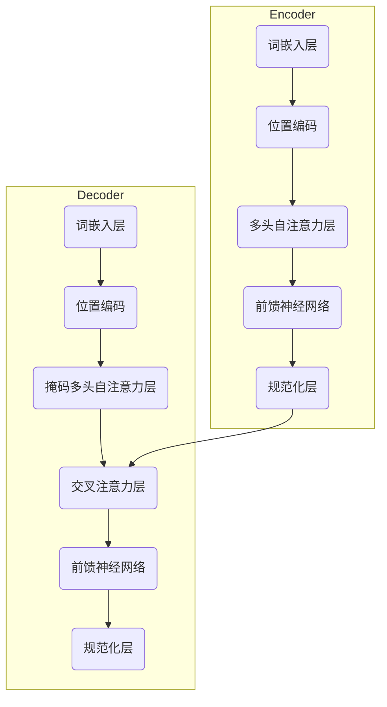

# 大语言模型原理与工程实践：手把手教你训练 7B 大语言模型 指令微调实践

## 1. 背景介绍

### 1.1 大语言模型的兴起

近年来,随着人工智能技术的快速发展,大型语言模型(Large Language Model,LLM)在自然语言处理领域掀起了一场革命。这些模型通过在海量文本数据上进行预训练,学习到了丰富的语言知识和上下文理解能力,从而在下游任务中表现出色。

代表性的大语言模型包括 GPT-3、PaLM、Chinchilla、BLOOMZ 等,其中 GPT-3 模型规模高达 1750 亿参数,是当前最大的语言模型。这些模型展现出了惊人的语言生成能力,可以根据提示生成看似人类水平的文本内容。

### 1.2 大语言模型的挑战

尽管大语言模型取得了巨大成功,但它们也面临着一些挑战:

1. **训练成本高昂**: 大规模语料和参数量导致训练成本昂贵,需要强大的计算资源。
2. **缺乏可解释性**: 模型内部是一个黑箱,难以解释其决策过程。
3. **存在偏见和不当内容**: 训练数据中的偏见可能会被模型学习并放大。
4. **幻觉和不一致性**: 模型有时会产生不合理、自相矛盾的输出。

为了更好地利用大语言模型的潜力,需要在算法、工程实践等多方面进行创新和改进。

## 2. 核心概念与联系

### 2.1 自然语言处理基础

自然语言处理(Natural Language Processing, NLP)是人工智能的一个分支,旨在使计算机能够理解和生成人类语言。它包括以下核心概念:

1. **词向量(Word Embedding)**: 将词语映射到连续的向量空间,使语义相似的词具有相近的向量表示。
2. **语言模型(Language Model)**: 根据上下文预测下一个词或序列的概率分布模型。
3. **序列到序列模型(Seq2Seq Model)**: 将一个序列(如文本)映射到另一个序列(如翻译)的模型。
4. **注意力机制(Attention Mechanism)**: 允许模型在处理序列时关注相关部分的机制。
5. **transformer**: 基于自注意力机制的序列到序列模型,是大语言模型的核心架构。

### 2.2 大语言模型架构

大语言模型通常采用 transformer 编码器-解码器架构,包括以下核心组件:

1. **词嵌入层(Word Embedding Layer)**: 将输入文本映射为向量表示。
2. **位置编码(Positional Encoding)**: 为序列中的每个位置添加位置信息。
3. **多头自注意力层(Multi-Head Self-Attention Layer)**: 捕获输入序列中不同位置之间的依赖关系。
4. **前馈神经网络(Feed-Forward Neural Network)**: 对注意力输出进行非线性变换。
5. **规范化层(Normalization Layer)**: 稳定训练过程,加速收敛。

通过堆叠多个编码器和解码器层,模型可以学习复杂的语言表示和生成能力。

## 3. 核心算法原理具体操作步骤

### 3.1 transformer 模型

Transformer 是大语言模型的核心架构,它完全基于注意力机制,不需要复杂的序列对齐操作。其算法原理如下:

1. **输入表示**:
   - 将输入序列 $X = (x_1, x_2, \dots, x_n)$ 映射为词嵌入矩阵 $\mathbf{E} = (\mathbf{e}_1, \mathbf{e}_2, \dots, \mathbf{e}_n)$。
   - 添加位置编码 $\mathbf{P} = (\mathbf{p}_1, \mathbf{p}_2, \dots, \mathbf{p}_n)$,得到输入表示 $\mathbf{X} = \mathbf{E} + \mathbf{P}$。

2. **多头自注意力**:
   - 将输入 $\mathbf{X}$ 线性投影为查询 $\mathbf{Q}$、键 $\mathbf{K}$ 和值 $\mathbf{V}$ 矩阵。
   - 计算注意力权重矩阵 $\mathbf{A} = \text{softmax}(\mathbf{Q}\mathbf{K}^\top / \sqrt{d_k})$。
   - 计算加权和 $\text{MultiHead}(\mathbf{X}) = \text{Concat}(\mathbf{A}_1\mathbf{V}_1, \dots, \mathbf{A}_h\mathbf{V}_h)\mathbf{W}^O$。

3. **前馈神经网络**:
   - 对注意力输出进行两层全连接变换: $\text{FFN}(\mathbf{x}) = \text{ReLU}(\mathbf{x}\mathbf{W}_1 + \mathbf{b}_1)\mathbf{W}_2 + \mathbf{b}_2$。

4. **编码器层**:
   - 将多头注意力和前馈网络的输出相加,并进行层规范化,得到编码器层输出。

5. **解码器层**:
   - 解码器包含掩码多头自注意力层、交叉注意力层和前馈网络。
   - 掩码自注意力只能关注当前位置及之前的位置。
   - 交叉注意力关注编码器输出,用于捕获输入和输出之间的依赖关系。

6. **输出生成**:
   - 对解码器最终输出进行线性投影和 softmax 操作,得到下一个词的概率分布。
   - 根据概率分布采样或选取最大值,生成下一个词,重复该过程直到生成完整序列。

Transformer 模型通过自注意力机制有效捕获长距离依赖关系,并通过残差连接和层规范化提高了训练稳定性,从而在序列建模任务中取得了卓越表现。

### 3.2 大语言模型预训练

为了获得强大的语言理解和生成能力,大语言模型需要在大规模语料库上进行预训练。常见的预训练目标包括:

1. **蒙版语言模型(Masked Language Modeling, MLM)**: 随机掩蔽部分输入词,模型需要预测被掩蔽的词。
2. **下一句预测(Next Sentence Prediction, NSP)**: 判断两个句子是否相邻出现。
3. **因果语言模型(Causal Language Modeling, CLM)**: 基于前文预测下一个词或序列。
4. **序列到序列预训练(Sequence-to-Sequence Pretraining)**: 在成对句子上进行序列到序列建模。

以 BERT 为例,它采用 MLM 和 NSP 两个预训练目标,通过预训练捕获了丰富的语义和上下文信息。预训练完成后,BERT 可以在下游任务上进行微调(fine-tuning),快速适应特定任务。

### 3.3 指令微调

尽管大语言模型展现出了强大的语言理解和生成能力,但它们在特定任务上的表现仍有提升空间。指令微调(Instruction-tuning)是一种有效的微调方法,通过提供任务指令和示例,引导模型学习特定任务的语义和格式要求。

指令微调的具体步骤如下:

1. **构建指令数据集**:
   - 为目标任务设计高质量的指令和示例,覆盖不同的输入输出格式和语义。
   - 示例中应包含输入、输出和任务描述。

2. **指令微调**:
   - 将预训练的大语言模型作为初始化权重。
   - 在指令数据集上进行有监督微调,最小化模型输出与期望输出之间的损失。
   - 微调过程中,模型学习将指令和输入映射到正确输出的能力。

3. **推理**:
   - 在推理阶段,将任务指令和新的输入提供给微调后的模型。
   - 模型生成与指令和输入相符的输出序列。

指令微调的优点在于,它可以利用大语言模型的强大语言理解能力,并通过少量高质量的指令数据,使模型快速适应新任务。这种方法已被证明在许多自然语言处理任务中表现出色,包括文本生成、问答系统和任务导向对话系统等。

## 4. 数学模型和公式详细讲解举例说明

### 4.1 transformer 注意力机制

注意力机制是 transformer 模型的核心,它允许模型在处理序列时动态关注相关部分。具体来说,给定一个查询 $\mathbf{q}$ 和一组键值对 $(\mathbf{k}_i, \mathbf{v}_i)$,注意力机制计算加权和:

$$\text{Attention}(\mathbf{q}, (\mathbf{k}_i, \mathbf{v}_i)) = \sum_{i=1}^n \alpha_i \mathbf{v}_i$$

其中,注意力权重 $\alpha_i$ 由查询和键的相似性决定:

$$\alpha_i = \frac{\exp(\text{score}(\mathbf{q}, \mathbf{k}_i))}{\sum_{j=1}^n \exp(\text{score}(\mathbf{q}, \mathbf{k}_j))}$$

$\text{score}$ 函数可以是点积或其他相似性度量。

在 transformer 中,注意力机制被扩展为多头注意力(Multi-Head Attention),它允许模型从不同的子空间捕获不同的相关性:

$$\begin{aligned}
\text{MultiHead}(\mathbf{Q}, \mathbf{K}, \mathbf{V}) &= \text{Concat}(\text{head}_1, \dots, \text{head}_h)\mathbf{W}^O \\
\text{head}_i &= \text{Attention}(\mathbf{Q}\mathbf{W}_i^Q, \mathbf{K}\mathbf{W}_i^K, \mathbf{V}\mathbf{W}_i^V)
\end{aligned}$$

其中 $\mathbf{W}_i^Q$、$\mathbf{W}_i^K$、$\mathbf{W}_i^V$ 和 $\mathbf{W}^O$ 是可学习的线性变换。

通过注意力机制,transformer 模型可以动态地关注输入序列中与当前位置相关的部分,从而有效地捕获长距离依赖关系。

### 4.2 transformer 位置编码

由于 transformer 完全基于注意力机制,因此它无法像循环神经网络那样自然地编码序列的位置信息。为了解决这个问题,transformer 引入了位置编码(Positional Encoding)。

位置编码是一种将位置信息编码为向量的方法,它被添加到输入的词嵌入中。具体来说,对于序列中的第 $i$ 个位置,其位置编码 $\mathbf{p}_i$ 由以下公式给出:

$$\begin{aligned}
\mathbf{p}_{i, 2j} &= \sin\left(i / 10000^{2j/d_\text{model}}\right) \\
\mathbf{p}_{i, 2j+1} &= \cos\left(i / 10000^{2j/d_\text{model}}\right)
\end{aligned}$$

其中 $j$ 是维度索引,取值范围为 $[0, d_\text{model}/2)$。这种编码方式允许模型学习相对位置信息,因为对于任意固定偏移量 $k$,均有 $\mathbf{p}_{i+k} = f(\mathbf{p}_i)$。

通过将位置编码与词嵌入相加,transformer 模型可以获得输入序列的位置信息,从而更好地建模序列数据。

## 5. 项目实践: 代码实例和详细解释说明

在本节中,我们将通过一个实际的代码示例,演示如何使用 Hugging Face 的 Transformers 库进行大语言模型的指令微调。我们将使用 FLAN-T5 模型,并在 FLAN 指令数据集上进行微调,最终得到一