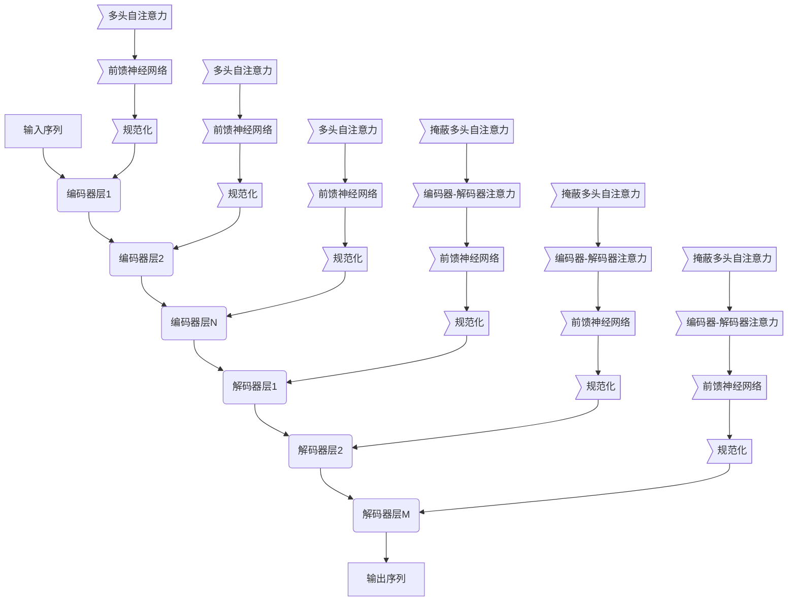

# 大语言模型原理与工程实践：检索增强生成技术

## 1. 背景介绍

### 1.1 大语言模型的兴起

近年来,大型语言模型(Large Language Models, LLMs)在自然语言处理领域掀起了一场革命。这些模型通过在海量文本数据上进行预训练,学习到了丰富的语言知识和上下文理解能力,从而在广泛的自然语言任务中展现出卓越的表现。

代表性的大语言模型包括 GPT-3、PaLM、ChatGPT等,它们能够生成看似人类写作的连贯、流畅的文本,在问答、文本摘要、机器翻译等任务中表现出色。大语言模型的出现极大推动了人工智能在自然语言处理领域的发展。

### 1.2 检索增强生成的重要性

尽管大语言模型在生成高质量文本方面有着卓越表现,但它们存在一些固有缺陷,比如知识覆盖有限、事实矛盾、偏差等。为了解决这些问题,研究人员提出了检索增强生成(Retrieval-Augmented Generation)的范式,将大语言模型与外部知识库相结合,以提高生成质量。

检索增强生成技术通过从知识库中检索相关信息,为语言模型提供补充知识,从而提高生成结果的准确性、一致性和多样性。这种方法不仅可以缓解大语言模型的知识缺陷,还能够为模型注入新的知识,使其具备持续学习的能力。

### 1.3 本文概述

本文将全面介绍大语言模型原理与检索增强生成技术。我们将首先探讨大语言模型的核心概念和基本原理,包括自注意力机制、Transformer架构和预训练技术等。接下来,我们将重点阐述检索增强生成范式的关键思想、核心算法和实现细节。此外,本文还将介绍相关的数学模型和公式推导,以及在实际应用中的代码实例。最后,我们将讨论检索增强生成技术在不同场景的应用,以及未来的发展趋势和挑战。

## 2. 核心概念与联系

### 2.1 自注意力机制(Self-Attention)

自注意力机制是大语言模型的核心组成部分,它允许模型捕捉输入序列中任意两个位置之间的依赖关系。与传统的序列模型(如RNN和LSTM)不同,自注意力机制不需要按顺序处理序列,而是通过计算每个位置与所有其他位置的注意力分数,从而同时捕获长距离和短距离的依赖关系。

在自注意力机制中,每个位置的表示是通过对其他所有位置的表示进行加权求和得到的。这种注意力加权机制使模型能够自适应地关注输入序列中的不同部分,从而更好地建模复杂的依赖关系。

自注意力机制可以形式化表示为:

$$
\text{Attention}(Q, K, V) = \text{softmax}(\frac{QK^T}{\sqrt{d_k}})V
$$

其中 $Q$ 表示查询(Query)向量, $K$ 表示键(Key)向量, $V$ 表示值(Value)向量, $d_k$ 是缩放因子。

### 2.2 Transformer 架构

Transformer 是一种全新的序列到序列(Seq2Seq)模型架构,它完全基于自注意力机制,不依赖于循环神经网络(RNN)或卷积神经网络(CNN)。Transformer 架构主要由编码器(Encoder)和解码器(Decoder)两部分组成。

编码器将输入序列映射为一系列连续的表示,解码器则根据这些表示生成目标序列。编码器和解码器都由多个相同的层组成,每一层都包含多头自注意力子层和前馈神经网络子层。

Transformer 架构的关键特点是:

1. 完全基于自注意力机制,有效捕捉长距离依赖关系。
2. 允许并行计算,比RNN更高效。
3. 编码器和解码器堆叠多层,可以学习到更复杂的表示。

Transformer 架构极大推动了自然语言处理领域的发展,为大语言模型的出现奠定了基础。



### 2.3 预训练技术

预训练是大语言模型取得巨大成功的关键技术之一。预训练的目标是在大规模无监督文本数据上训练语言模型,使其学习到丰富的语言知识和上下文理解能力。

常见的预训练目标包括:

1. **掩蔽语言模型(Masked Language Modeling, MLM)**: 随机掩蔽部分输入tokens,模型需要预测被掩蔽的tokens。
2. **下一句预测(Next Sentence Prediction, NSP)**: 判断两个句子是否为连续句子。
3. **自回归语言模型(Autoregressive Language Modeling)**: 给定前缀,预测下一个token。
4. **替代токrn任务(Replaced Token Detection)**: 检测输入序列中被替换的tokens。

通过在大规模语料库上进行预训练,语言模型可以学习到丰富的语义和语法知识,为下游任务的微调奠定基础。

预训练技术的发展催生了一系列成功的大语言模型,如BERT、GPT、T5等,极大推动了自然语言处理领域的进展。

## 3. 核心算法原理具体操作步骤

### 3.1 检索增强生成范式

检索增强生成(Retrieval-Augmented Generation)是一种将大语言模型与外部知识库相结合的技术范式。其核心思想是:在生成过程中,先从知识库中检索相关的信息片段,然后将这些信息作为额外的上下文,与原始输入一起送入语言模型,指导模型生成更准确、更丰富的输出。

检索增强生成范式的一般流程如下:

1. 输入查询(如问题或上下文)
2. 基于查询从知识库中检索相关信息片段
3. 将检索到的信息片段与原始查询拼接,作为语言模型的输入
4. 语言模型生成最终输出(如答案或续写内容)

这种方法的优势在于:

- 弥补了大语言模型知识有限的缺陷
- 为模型提供了动态的知识补充,使其具备持续学习的能力
- 生成结果更准确、更丰富、更多样

### 3.2 检索模块

检索模块是检索增强生成系统的核心组成部分,其目标是从知识库中快速检索与查询相关的信息片段。常见的检索模型包括双向编码器(Bi-Encoders)、交叉编码器(Cross-Encoders)和最新的高效向量检索模型。

**双向编码器(Bi-Encoders)**

双向编码器将查询和知识库条目分别编码为向量表示,然后基于向量相似度进行检索。其优点是计算高效,可以快速检索大型知识库,但精度可能不如交叉编码器。

**交叉编码器(Cross-Encoders)**

交叉编码器将查询和知识库条目拼接后共同编码为向量表示,相关性评分更准确。但由于需要对每个查询-条目对进行单独编码,计算成本较高,难以应用于大型知识库。

**高效向量检索模型**

最新的向量检索模型(如SPLADE、FiD等)通过学习高效的向量索引方法,在保持较高检索精度的同时,大幅提高了检索效率,可以支持大规模知识库的实时检索。

### 3.3 生成模块

生成模块是检索增强生成系统的另一核心部分,其目标是基于检索到的信息片段和原始查询,生成高质量的最终输出。

生成模块通常采用大型的序列到序列(Seq2Seq)语言模型,如T5、BART、GPT等。这些模型在预训练阶段已经学习到了丰富的语言知识,能够生成流畅、连贯的文本。

在检索增强生成系统中,生成模块需要被微调,以学习如何有效利用检索到的信息片段。常见的微调策略包括:

1. **前缀微调(Prefix-Tuning)**: 将检索到的信息片段作为前缀,与原始查询拼接后输入语言模型。
2. **融合注意力(Fusion-in-Attention)**: 在Transformer的注意力层中,融合检索到的信息片段的表示。
3. **融合交叉注意力(Fusion-Cross-Attention)**: 在交叉注意力层中,融合检索到的信息片段的表示。

通过合理的微调策略,生成模块能够学会有效利用外部知识,生成更准确、更丰富的输出。

## 4. 数学模型和公式详细讲解举例说明

在检索增强生成系统中,数学模型和公式扮演着重要角色,为核心算法提供理论支撑。本节将详细介绍相关的数学模型和公式,并通过实例加深理解。

### 4.1 向量相似度计算

在检索模块中,需要计算查询向量和知识库条目向量之间的相似度,以确定相关性。常用的相似度度量包括余弦相似度和点积相似度。

**余弦相似度**

余弦相似度衡量两个向量之间的夹角余弦值,取值范围为 [-1, 1]。两个向量越接近,余弦相似度越接近 1。

$$
\text{sim}_\text{cos}(q, d) = \frac{q \cdot d}{\|q\| \|d\|}
$$

其中 $q$ 表示查询向量, $d$ 表示知识库条目向量, $\|\cdot\|$ 表示向量的 $L_2$ 范数。

**点积相似度**

点积相似度直接计算两个向量的点积,无需归一化。当向量已经归一化时,点积相似度等价于余弦相似度。

$$
\text{sim}_\text{dot}(q, d) = q \cdot d
$$

在实践中,我们通常会对向量进行归一化处理,然后使用点积相似度,因为它计算更高效。

**示例**

假设查询向量 $q = [0.5, 0.8, 0.2]$, 知识库条目向量 $d_1 = [0.6, 0.7, 0.3]$, $d_2 = [-0.4, 0.6, -0.2]$。计算查询与两个条目的余弦相似度和点积相似度:

```python
import numpy as np

q = np.array([0.5, 0.8, 0.2])
d1 = np.array([0.6, 0.7, 0.3])
d2 = np.array([-0.4, 0.6, -0.2])

# 余弦相似度
cos_sim1 = np.dot(q, d1) / (np.linalg.norm(q) * np.linalg.norm(d1))
cos_sim2 = np.dot(q, d2) / (np.linalg.norm(q) * np.linalg.norm(d2))
print(f"余弦相似度: sim(q, d1) = {cos_sim1:.4f}, sim(q, d2) = {cos_sim2:.4f}")

# 点积相似度
dot_sim