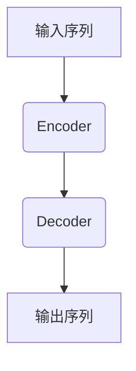
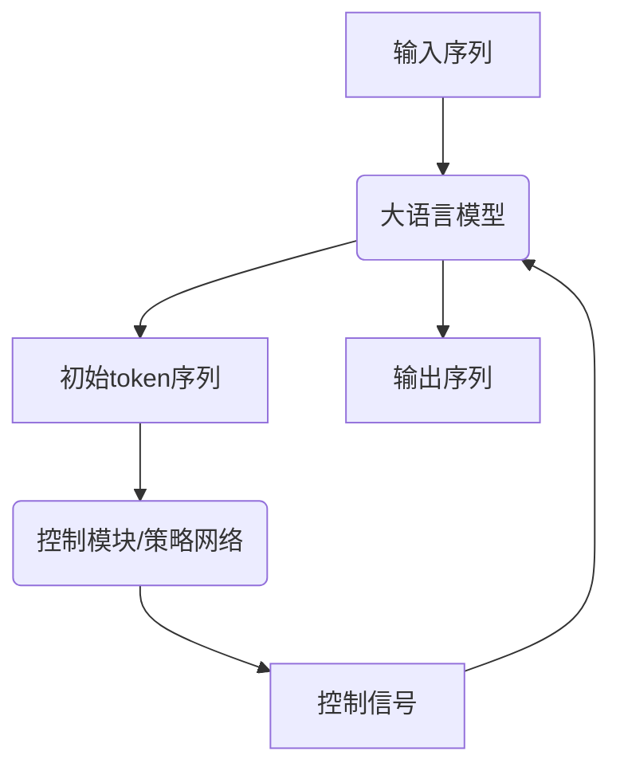
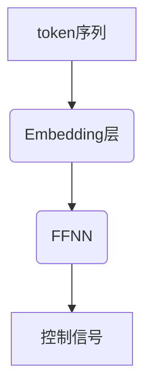

# 大语言模型原理与工程实践：策略网络的结构

## 1. 背景介绍

### 1.1 大语言模型的兴起

近年来,大型语言模型(Large Language Models, LLMs)在自然语言处理(Natural Language Processing, NLP)领域掀起了一场革命。这些模型通过在海量文本数据上进行预训练,学习了丰富的语言知识和上下文信息,展现出令人惊叹的语言理解和生成能力。

大语言模型的兴起可以追溯到2018年,当时OpenAI发布了1.5亿参数的GPT(Generative Pre-trained Transformer)模型。随后,谷歌推出了更大的BERT(Bidirectional Encoder Representations from Transformers)模型,它采用了双向的Transformer编码器,在多项NLP任务上取得了卓越的成绩。

2020年,OpenAI再次引领潮流,发布了拥有1.75亿参数的GPT-3模型。GPT-3展现出了惊人的语言生成能力,可以完成诗歌创作、代码生成、问答等多种任务,引发了学术界和工业界的广泛关注。

### 1.2 策略网络的重要性

尽管大语言模型展现出了强大的语言能力,但它们也面临着一些挑战,例如:

1. **一致性和可控性**: 大语言模型的输出往往缺乏一致性,难以控制输出的风格、语气和主题等方面。
2. **长期依赖建模**: 大语言模型在捕捉长距离依赖关系方面存在不足,导致在处理长文本时表现不佳。
3. **计算效率**: 大型模型的计算和存储开销巨大,在资源受限的环境中很难部署和应用。

为了解决这些挑战,研究人员提出了策略网络(Strategy Network)的概念。策略网络是一种新型的神经网络架构,旨在为大语言模型提供更好的控制和效率。它通过引入一个额外的控制模块,来指导和调节大语言模型的生成过程,从而提高输出的一致性、可控性和长期依赖建模能力。

### 1.3 本文概述

本文将深入探讨策略网络在大语言模型中的应用,包括其核心概念、算法原理、数学模型、工程实践和未来发展趋势。我们将从理论和实践两个层面,全面阐述策略网络如何优化大语言模型的性能,并分析其在实际应用场景中的作用和潜力。

通过本文的学习,读者将能够掌握策略网络的核心知识,了解其在大语言模型中的重要地位,并获得实践经验,为未来的研究和应用奠定基础。

## 2. 核心概念与联系

### 2.1 大语言模型的基本架构

为了更好地理解策略网络的作用,我们首先需要了解大语言模型的基本架构。大多数现代大语言模型都采用了Transformer的架构,它由编码器(Encoder)和解码器(Decoder)两个主要部分组成。

编码器的作用是将输入序列(如自然语言文本)映射为一系列向量表示,捕捉输入序列中的语义和上下文信息。解码器则根据编码器的输出,生成相应的输出序列(如机器翻译、文本摘要等)。

在自回归语言模型(如GPT)中,解码器还会将之前生成的tokens作为输入,以捕捉生成序列的上下文信息。这种架构使得模型能够生成连贯、上下文相关的文本输出。

### 2.2 策略网络的核心思想

尽管大语言模型展现出了强大的语言能力,但它们在一致性、可控性和长期依赖建模方面仍然存在不足。策略网络的核心思想是引入一个额外的控制模块,来指导和调节大语言模型的生成过程,从而优化模型的性能。

策略网络通常由两个主要部分组成:

1. **大语言模型**: 负责生成初始的token序列。
2. **控制模块(策略网络)**: 根据生成的token序列和任务目标,输出一个控制信号,用于调节大语言模型的后续生成过程。

控制模块的作用就像一个"策略制定者",它根据当前的生成状态和任务需求,制定出合适的策略,指导大语言模型朝着期望的方向生成文本。

### 2.3 策略网络与大语言模型的交互

策略网络与大语言模型之间存在着紧密的交互关系。整个生成过程可以概括为以下步骤:

1. 大语言模型生成初始的token序列。
2. 控制模块(策略网络)根据生成的token序列和任务目标,输出一个控制信号。
3. 大语言模型根据控制信号,调整后续的生成策略,生成下一个token。
4. 重复步骤2和3,直到生成完整的输出序列。

通过这种交互式的生成过程,策略网络可以根据任务需求动态调整大语言模型的行为,从而提高输出的一致性、可控性和长期依赖建模能力。

## 3. 核心算法原理具体操作步骤

### 3.1 策略网络的基本架构

策略网络通常由两个主要部分组成:大语言模型和控制模块。控制模块的作用是根据生成的token序列和任务目标,输出一个控制信号,用于调节大语言模型的后续生成过程。

控制模块可以采用不同的神经网络架构,如前馈神经网络(Feed-Forward Neural Network, FFNN)、循环神经网络(Recurrent Neural Network, RNN)或者Transformer等。选择何种架构取决于具体的任务需求和模型复杂度。

以FFNN为例,控制模块的基本架构如下所示:

1. 将生成的token序列输入到Embedding层,获得对应的向量表示。
2. 将Embedding向量输入到FFNN中,经过一系列的线性变换和非线性激活函数,输出控制信号。
3. 控制信号将被用于调节大语言模型的后续生成过程。

控制信号可以采用不同的形式,如一个标量值(用于调节语言模型的温度参数)、一个向量(用于调节注意力分布)或者一个掩码向量(用于控制token的生成概率)等。

### 3.2 策略网络的训练过程

策略网络的训练过程通常分为两个阶段:

1. **预训练大语言模型**: 在大规模文本数据上预训练大语言模型,获得初始的语言知识和上下文表示能力。
2. **联合训练策略网络**: 在特定任务数据上,联合训练大语言模型和控制模块(策略网络),使控制模块学会根据任务目标输出合适的控制信号。

在联合训练阶段,我们需要设计一个合适的损失函数,将任务目标(如一致性、可控性或长期依赖建模)纳入到训练过程中。损失函数通常包括两个部分:

1. **语言模型损失**: 衡量生成序列与ground truth之间的差异,确保模型保持基本的语言生成能力。
2. **任务损失**: 衡量生成序列与任务目标之间的差异,引导控制模块输出合适的控制信号。

通过最小化联合损失函数,我们可以同时优化大语言模型和控制模块的参数,使得整个系统能够满足特定任务的需求。

### 3.3 策略网络的生成过程

在训练完成后,策略网络的生成过程如下所示:

1. 输入初始的token序列(如问题描述或上下文信息)到大语言模型中。
2. 大语言模型生成初始的token序列。
3. 将生成的token序列输入到控制模块中,控制模块根据任务目标输出控制信号。
4. 大语言模型根据控制信号调整后续的生成策略,生成下一个token。
5. 重复步骤3和4,直到生成完整的输出序列。

在这个过程中,控制模块扮演着"策略制定者"的角色,根据当前的生成状态和任务需求,动态调整大语言模型的行为,从而优化输出的一致性、可控性和长期依赖建模能力。

## 4. 数学模型和公式详细讲解举例说明

### 4.1 大语言模型的基本数学模型

大多数现代大语言模型都采用了基于Transformer的架构,其核心数学模型是自注意力(Self-Attention)机制。自注意力机制允许模型捕捉输入序列中任意两个位置之间的依赖关系,从而更好地建模长距离依赖。

给定一个长度为$n$的输入序列$\mathbf{X} = (x_1, x_2, \dots, x_n)$,其中$x_i$是第$i$个token的embedding向量。自注意力机制首先计算出一个三维的注意力分数张量$\mathbf{A} \in \mathbb{R}^{n \times n \times h}$,其中$h$是注意力头(attention head)的数量。

$$\mathbf{A} = \text{softmax}\left(\frac{\mathbf{Q}\mathbf{K}^\top}{\sqrt{d_k}}\right)\mathbf{V}$$

其中,$\mathbf{Q}$、$\mathbf{K}$和$\mathbf{V}$分别是查询(Query)、键(Key)和值(Value)矩阵,它们是通过线性变换从输入序列$\mathbf{X}$得到的。$d_k$是缩放因子,用于防止内积过大导致梯度消失。

注意力分数张量$\mathbf{A}$捕捉了输入序列中每个位置对应的注意力分布,模型可以根据这些注意力分布对输入序列进行加权求和,得到每个位置的上下文表示向量。

$$\mathbf{Z} = \mathbf{A}\mathbf{V}$$

上下文表示向量$\mathbf{Z}$将被送入后续的前馈网络(Feed-Forward Network)和规范化层(Normalization Layer),经过多个这样的编码器层,模型就可以学习到丰富的语义和上下文表示。

在解码器端,自注意力机制除了需要捕捉输入序列的依赖关系外,还需要捕捉已生成的token序列的依赖关系,这就是所谓的"掩码"(Masking)机制。掩码机制确保模型在生成每个token时,只能看到之前生成的token,而不能"窥视"未来的token。

### 4.2 策略网络的数学模型

策略网络的核心数学模型是控制模块,它根据生成的token序列和任务目标,输出一个控制信号,用于调节大语言模型的后续生成过程。

假设我们使用一个前馈神经网络作为控制模块,其输入是生成的token序列$\mathbf{Y} = (y_1, y_2, \dots, y_m)$,其中$y_i$是第$i$个token的embedding向量。控制模块的输出是一个控制信号向量$\mathbf{c} \in \mathbb{R}^d$,其中$d$是控制信号的维度。

控制模块的数学模型可以表示为:

$$\mathbf{c} = \text{FFNN}(\text{Embedding}(\mathbf{Y}))$$

其中,$\text{Embedding}$是一个embedding层,将token序列映射为向量表示;$\text{FFNN}$是一个前馈神经网络,它包括多个线性变换和非线性激活函数层。

控制信号向量$\mathbf{c}$将被用于调节大语言模型的后续生成过程。例如,我们可以将控制信号与大语言模型的注意力分数张量$\mathbf{A}$相加,从而影响注意力分布:

$$\mathbf{A}' = \mathbf{A} + \mathbf{c}$$