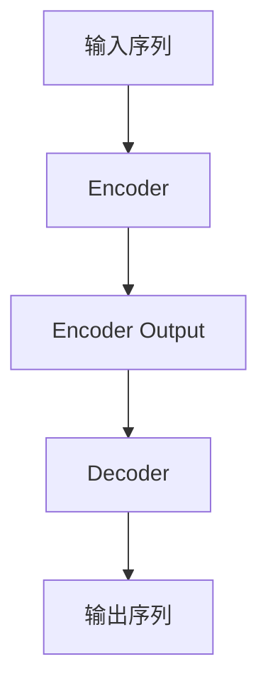
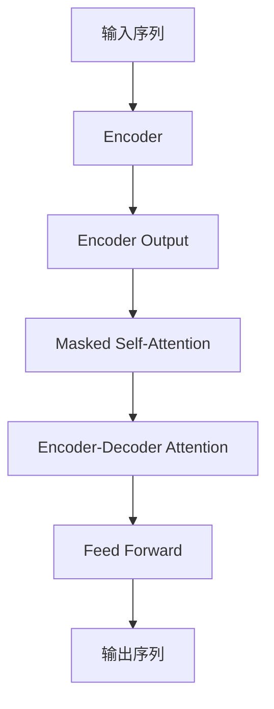
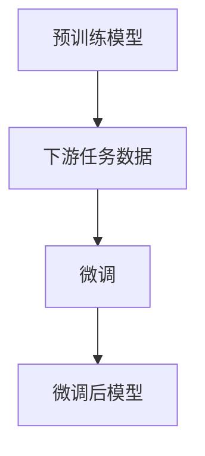

# 大语言模型原理基础与前沿 无分词器

## 1.背景介绍

### 1.1 自然语言处理的挑战

自然语言处理(NLP)是人工智能领域中一个极具挑战性的任务。人类语言的复杂性和多样性使得计算机难以准确理解和生成自然语言。传统的NLP方法通常需要大量的人工特征工程,并且针对特定任务进行训练,难以泛化到其他领域。

### 1.2 深度学习在NLP中的突破

近年来,深度学习技术在NLP领域取得了巨大的突破。特别是transformer模型的出现,使得NLP任务的性能得到了极大的提升。Transformer模型通过自注意力机制来捕捉长距离依赖关系,从而更好地理解上下文信息。

### 1.3 大语言模型的兴起

基于Transformer的大型语言模型(Large Language Model,LLM)通过在海量文本数据上进行预训练,学习到了丰富的语言知识和上下文理解能力。这些预训练模型可以通过微调的方式,快速适应各种下游NLP任务,大大提高了模型的泛化能力。目前,GPT-3、PaLM、ChatGPT等大语言模型已经展现出了惊人的语言生成和理解能力,引领着NLP技术的新浪潮。

## 2.核心概念与联系

### 2.1 自注意力机制

自注意力机制是Transformer模型的核心,它允许模型捕捉输入序列中任意两个位置之间的关系。与RNN和CNN不同,自注意力机制不需要按顺序处理序列,而是通过计算每个位置与所有其他位置的关联程度,从而学习到更好的表示。

### 2.2 掩码语言模型

掩码语言模型(Masked Language Model,MLM)是预训练大语言模型的常用方法之一。它通过随机掩码输入序列中的部分词元,并让模型预测被掩码的词元,从而学习到丰富的语义和上下文信息。

### 2.3 因果语言模型

因果语言模型(Causal Language Model,CLM)是另一种预训练方法,它通过预测序列中下一个词元的方式进行训练。与MLM不同,CLM只能利用当前位置之前的上下文信息,更加符合自然语言的生成过程。

### 2.4 多模态模型

除了处理文本数据,大语言模型还可以扩展到处理图像、视频等多模态数据。通过设计合适的模型架构和预训练任务,模型可以同时学习不同模态之间的关联,实现多模态理解和生成。

## 3.核心算法原理具体操作步骤

### 3.1 Transformer模型架构

Transformer模型主要由编码器(Encoder)和解码器(Decoder)两部分组成。编码器将输入序列编码为上下文表示,解码器则根据上下文表示生成输出序列。



#### 3.1.1 编码器

编码器由多个相同的层组成,每层包含两个子层:多头自注意力层和前馈神经网络层。

1. **多头自注意力层**

$$\begin{aligned}
\text{MultiHead}(Q, K, V) &= \text{Concat}(\text{head}_1, \ldots, \text{head}_h)W^O\\
\text{where}\\ \text{head}_i &= \text{Attention}(QW_i^Q, KW_i^K, VW_i^V)
\end{aligned}$$

多头自注意力层通过计算查询(Query)与键(Key)的相似性,对值(Value)进行加权求和,从而捕捉输入序列中不同位置之间的关系。

2. **前馈神经网络层**

前馈神经网络层对每个位置的表示进行独立的非线性变换,以引入更多的表示能力。

$$\text{FFN}(x) = \max(0, xW_1 + b_1)W_2 + b_2$$

#### 3.1.2 解码器

解码器的结构与编码器类似,但增加了一个掩码自注意力层,用于防止注意力机制关注到当前位置之后的信息。此外,解码器还包含一个编码器-解码器注意力层,用于将编码器的输出与解码器的输出进行融合。



### 3.2 预训练任务

大语言模型通常在海量文本数据上进行预训练,以学习通用的语言知识。常见的预训练任务包括:

1. **掩码语言模型(MLM)**

在输入序列中随机掩码部分词元,让模型预测被掩码的词元。

2. **因果语言模型(CLM)**

给定序列的前缀,让模型预测下一个词元。

3. **下一句预测(Next Sentence Prediction,NSP)**

判断两个句子是否相邻出现。

4. **替换检测(Replaced Token Detection,RTD)**

判断一个词元是否被替换。

### 3.3 微调

经过预训练后,大语言模型可以通过微调的方式快速适应下游NLP任务。微调过程中,模型参数在特定任务的数据上进行进一步调整,以提高模型在该任务上的性能。



## 4.数学模型和公式详细讲解举例说明

### 4.1 自注意力机制

自注意力机制是Transformer模型的核心,它允许模型捕捉输入序列中任意两个位置之间的关系。给定一个长度为$n$的输入序列$X = (x_1, x_2, \ldots, x_n)$,自注意力机制首先计算查询(Query)、键(Key)和值(Value)向量:

$$\begin{aligned}
Q &= XW^Q\\
K &= XW^K\\
V &= XW^V
\end{aligned}$$

其中$W^Q, W^K, W^V$是可学习的权重矩阵。然后,计算查询与键的点积,并对其进行缩放和软化最大化操作,得到注意力分数:

$$\text{Attention}(Q, K, V) = \text{softmax}\left(\frac{QK^T}{\sqrt{d_k}}\right)V$$

其中$d_k$是缩放因子,用于防止点积过大导致梯度消失。最后,将注意力分数与值向量相乘,得到每个位置的加权和表示。

多头自注意力机制通过并行计算多个注意力头,从不同的子空间捕捉不同的关系,进一步提高了模型的表示能力。

### 4.2 掩码语言模型

掩码语言模型(MLM)是预训练大语言模型的常用方法之一。它通过随机掩码输入序列中的部分词元,并让模型预测被掩码的词元,从而学习到丰富的语义和上下文信息。

给定一个长度为$n$的输入序列$X = (x_1, x_2, \ldots, x_n)$,MLM会随机选择一些位置进行掩码,得到掩码后的序列$\tilde{X} = (\tilde{x}_1, \tilde{x}_2, \ldots, \tilde{x}_n)$。对于被掩码的位置$i$,模型需要预测原始的词元$x_i$。

MLM的目标函数是最大化被掩码词元的条件概率:

$$\mathcal{L}_\text{MLM} = \sum_{i \in \text{masked}}-\log P(x_i|\tilde{X})$$

通过最小化该目标函数,模型可以学习到词元与上下文之间的关系,从而提高语言理解能力。

### 4.3 因果语言模型

因果语言模型(CLM)是另一种预训练方法,它通过预测序列中下一个词元的方式进行训练。与MLM不同,CLM只能利用当前位置之前的上下文信息,更加符合自然语言的生成过程。

给定一个长度为$n$的输入序列$X = (x_1, x_2, \ldots, x_n)$,CLM的目标是最大化下一个词元的条件概率:

$$\mathcal{L}_\text{CLM} = \sum_{i=1}^{n-1}-\log P(x_{i+1}|x_1, x_2, \ldots, x_i)$$

通过最小化该目标函数,模型可以学习到生成自然语言的能力,同时也能捕捉到上下文信息。

### 4.4 多模态模型

除了处理文本数据,大语言模型还可以扩展到处理图像、视频等多模态数据。通过设计合适的模型架构和预训练任务,模型可以同时学习不同模态之间的关联,实现多模态理解和生成。

一种常见的多模态模型架构是将不同模态的输入分别编码,然后通过交叉注意力机制融合不同模态的表示。例如,对于图像-文本的多模态任务,可以使用Vision Transformer对图像进行编码,使用Transformer对文本进行编码,然后通过交叉注意力机制捕捉图像和文本之间的关系。

$$\begin{aligned}
Q &= \text{TextEncoder}(X)\\
K, V &= \text{ImageEncoder}(I)\\
\text{MultiModal}(Q, K, V) &= \text{Attention}(Q, K, V)
\end{aligned}$$

通过设计合适的预训练任务,如图像-文本对的对比学习、图像描述生成等,多模态模型可以学习到不同模态之间的关联,从而提高多模态理解和生成的能力。

## 5.项目实践:代码实例和详细解释说明

以下是一个使用PyTorch实现的简单Transformer模型示例,用于机器翻译任务。

### 5.1 导入所需库

```python
import torch
import torch.nn as nn
import math
```

### 5.2 定义模型架构

#### 5.2.1 多头自注意力层

```python
class MultiHeadAttention(nn.Module):
    def __init__(self, d_model, num_heads):
        super(MultiHeadAttention, self).__init__()
        self.d_model = d_model
        self.num_heads = num_heads
        self.head_dim = d_model // num_heads

        self.q_linear = nn.Linear(d_model, d_model)
        self.k_linear = nn.Linear(d_model, d_model)
        self.v_linear = nn.Linear(d_model, d_model)
        self.out_linear = nn.Linear(d_model, d_model)

    def forward(self, q, k, v, mask=None):
        batch_size = q.size(0)

        q = self.q_linear(q).view(batch_size, -1, self.num_heads, self.head_dim).transpose(1, 2)
        k = self.k_linear(k).view(batch_size, -1, self.num_heads, self.head_dim).transpose(1, 2)
        v = self.v_linear(v).view(batch_size, -1, self.num_heads, self.head_dim).transpose(1, 2)

        scores = torch.matmul(q, k.transpose(-2, -1)) / math.sqrt(self.head_dim)
        if mask is not None:
            scores = scores.masked_fill(mask == 0, -1e9)

        attention_weights = nn.Softmax(dim=-1)(scores)
        output = torch.matmul(attention_weights, v).transpose(1, 2).contiguous().view(batch_size, -1, self.d_model)
        output = self.out_linear(output)

        return output
```

多头自注意力层首先将输入分别通过线性层得到查询、键和值向量。然后计算注意力分数,应用掩码(如果有),并使用softmax函数得到注意力权重。最后,将注意力权重与值向量相乘,得到输出表示。

#### 5.2.2 前馈神经网络层

```python
class FeedForward(nn.Module):
    def __init__(self, d_model, d_ff):
        super(FeedForward, self).__init__()
        self.linear1 = nn.Linear(d_model, d_ff)
        self.linear2 = nn.Linear(d_ff, d_model)
        self.relu = nn.ReLU()

    def forward(self, x):
        x = self.linear1(x)
        x = self.relu(x)
        x = self.linear2(x)
        return x
```

前馈神经网络层包含两个线性层和一个ReLU激活函数,用于对输入进行非线性变换。

#### 5.2.3 编码器层

```python
class EncoderLayer(nn.Module):
    def __init__(self, d_model, num_heads, 