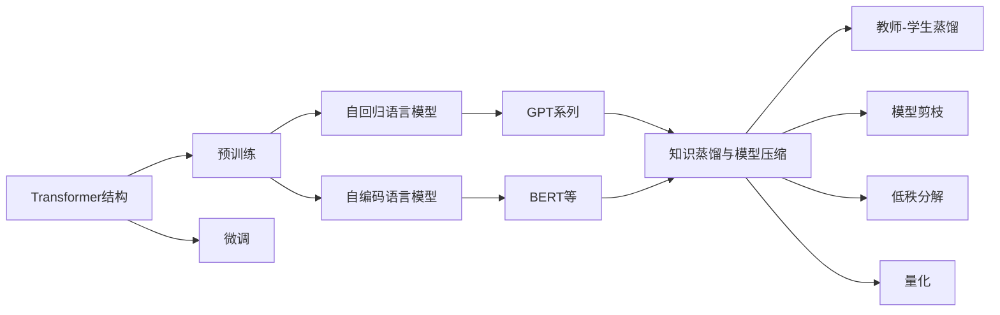

# 大语言模型进阶原理与代码实战案例讲解

## 1. 背景介绍

### 1.1 大语言模型概述
大语言模型(Large Language Model, LLM)是近年来自然语言处理(NLP)领域最重要的突破之一。它们是基于海量文本数据训练的深度神经网络模型,能够学习语言的统计规律和语义关系,具备强大的语言理解和生成能力。代表性的大语言模型包括GPT系列、BERT、XLNet等。

### 1.2 大语言模型的发展历程
大语言模型的发展可以追溯到2018年,谷歌推出了BERT模型,引入了Transformer结构和双向编码机制,在多项NLP任务上取得了突破性进展。此后,OpenAI推出了GPT系列模型,进一步扩大了模型规模,展现了令人惊叹的语言生成能力。近两年,大语言模型的参数量持续增长,从百亿级别跃升到千亿乃至万亿级别,模型能力不断提升。

### 1.3 大语言模型的应用前景
大语言模型强大的语言理解和生成能力,使其在许多领域具有广阔的应用前景,包括:
- 智能对话:构建更加智能、自然流畅的对话系统
- 内容生成:自动撰写文章、新闻、小说等 
- 信息检索:语义级别的搜索和问答
- 机器翻译:更高质量的翻译结果
- 文本分类:情感分析、意图识别等
- 知识图谱:从文本中抽取结构化知识

大语言模型正在深刻影响和重塑NLP领域,推动人工智能在更多场景的落地应用。

## 2. 核心概念与联系

### 2.1 Transformer 结构
Transformer是大语言模型的核心结构,由多层编码器(Encoder)和解码器(Decoder)组成。其核心创新包括:
- 自注意力机制(Self-Attention):捕捉单词之间的长距离依赖关系
- 位置编码(Positional Encoding):引入单词的位置信息
- 残差连接和层归一化:加速模型训练,提高模型泛化能力

### 2.2 预训练和微调
大语言模型通常采用两阶段的训练范式:
1. 预训练(Pre-training):在大规模无标注语料上进行自监督学习,掌握语言的通用表征
2. 微调(Fine-tuning):在下游任务的标注数据上进行监督学习,适应特定任务

预训练使得模型学习到语言的基本规律,微调使模型适应具体应用场景,两个阶段相辅相成。

### 2.3 自回归语言模型与自编码语言模型
按照建模方式,语言模型可分为两大类:
- 自回归语言模型(Auto-regressive LM):代表模型有GPT系列,通过迭代式的单向解码来生成文本
- 自编码语言模型(Auto-encoding LM):代表模型有BERT,通过双向编码来理解和表征文本

两类模型在预训练目标、应用场景等方面各有特点。

### 2.4 知识蒸馏与模型压缩
大语言模型虽然性能卓越,但也面临着模型过于庞大、推理效率低下的问题。知识蒸馏和模型压缩技术可以在保持模型性能的同时,大幅减小模型体积,加速推理速度。主要方法包括:
- 教师-学生蒸馏:用大模型(教师)的输出监督小模型(学生)的训练
- 模型剪枝:去除冗余的神经元连接
- 低秩分解:用若干小矩阵近似大矩阵
- 量化:用低比特的离散值近似连续的权重

### 2.5 核心概念关系图
下图展示了大语言模型涉及的核心概念以及它们之间的关系:

## 3. 核心算法原理具体操作步骤

本节将详细介绍大语言模型的核心算法原理,主要包括Transformer结构、预训练和微调、知识蒸馏等。

### 3.1 Transformer结构

#### 3.1.1 自注意力机制
1. 将输入序列X通过三个线性变换,得到Q(Query)、K(Key)、V(Value)三个矩阵
2. 计算Q与K的点积,得到注意力分数矩阵 $A=softmax(\frac{QK^T}{\sqrt{d_k}})$
3. 用注意力分数矩阵A与V相乘,得到注意力输出 $Attention(Q,K,V)=AV$
4. 将注意力输出与输入X相加,再经过层归一化,得到自注意力的最终输出

自注意力机制通过Q、K、V的交互,使得模型能够捕捉单词之间的依赖关系,特别是长距离依赖。

#### 3.1.2 多头注意力
1. 将Q、K、V分别划分为h个头(head),每个头独立地进行自注意力计算
2. 将h个头的输出拼接起来,再经过一个线性变换,得到多头注意力的输出
   
多头注意力允许模型在不同的子空间内学习到不同的语义关系,提高了模型的表达能力。

#### 3.1.3 位置编码
1. 生成一个与输入序列等长的位置编码向量PE
2. 将位置编码PE与输入嵌入X相加,作为Transformer的输入

位置编码引入了单词的位置信息,使得模型能够区分不同位置的单词,学习到语序特征。

#### 3.1.4 编码器与解码器
- 编码器:由若干个编码器层组成,每个编码器层包含两个子层:自注意力层和前馈神经网络层
- 解码器:由若干个解码器层组成,每个解码器层包含三个子层:自注意力层、编码-解码注意力层和前馈神经网络层

编码器负责对输入序列进行编码,解码器负责根据编码结果和之前的输出,生成下一个单词的概率分布。

### 3.2 预训练和微调

#### 3.2.1 预训练
1. 构建大规模无标注语料库,如维基百科、图书等
2. 根据语言模型的类型(如自回归、自编码),设计相应的预训练目标,如语言模型、掩码语言模型等
3. 在语料库上训练语言模型,优化预训练目标,直至收敛
   
预训练阶段通过自监督学习,使模型掌握语言的通用表征和规律性知识。

#### 3.2.2 微调
1. 根据下游任务的类型,如分类、序列标注等,设计相应的微调结构,如在顶层添加线性分类器
2. 在下游任务的标注数据集上,以较小的学习率微调整个模型
3. 评估微调后的模型在任务上的性能,并根据需要调整超参数

微调阶段通过有监督学习,使模型适应特定任务,学习任务专属的知识。

### 3.3 知识蒸馏与模型压缩

#### 3.3.1 教师-学生蒸馏
1. 使用预训练的大模型作为教师模型,固定其参数
2. 构建一个小模型作为学生模型,初始化其参数
3. 用教师模型的输出作为软标签,监督学生模型的训练,使其拟合教师模型的行为

教师-学生蒸馏可以将大模型的知识转移到小模型中,显著提高小模型的性能。

#### 3.3.2 模型剪枝
1. 计算每个神经元连接的重要性,如L1范数、梯度等
2. 根据重要性对连接进行排序,并设定一个剪枝阈值
3. 将重要性低于阈值的连接剪除,得到稀疏的模型
4. 微调剪枝后的模型,恢复部分性能损失

模型剪枝通过去除冗余连接,可以大幅降低模型体积和计算量。

#### 3.3.3 低秩分解
1. 对大矩阵进行奇异值分解(SVD),得到左奇异矩阵U、奇异值矩阵Σ和右奇异矩阵V
2. 选取前k个最大的奇异值,得到截断的奇异值矩阵 $Σ_k$
3. 用 $U_kΣ_kV_k^T$ 近似原始大矩阵,其中 $U_k$ 和 $V_k$ 分别包含前k列
4. 微调分解后的模型,恢复部分性能损失

低秩分解用若干个小矩阵来近似大矩阵,减小了模型的参数量。

#### 3.3.4 量化
1. 确定量化的比特数,如8比特、4比特等
2. 对权重矩阵进行量化,将其映射到离散值空间
3. 在前向传播时,用量化后的权重计算
4. 在反向传播时,对梯度进行反量化,更新原始连续值权重

量化通过降低数值精度,可以减小模型存储空间,加速计算速度。

## 4. 数学模型和公式详细讲解举例说明

### 4.1 Transformer的数学模型

#### 4.1.1 自注意力机制
给定输入序列 $X \in \mathbb{R}^{n \times d}$,自注意力的计算过程为:

$$
\begin{aligned}
Q &= XW_Q, \quad W_Q \in \mathbb{R}^{d \times d_k} \\
K &= XW_K, \quad W_K \in \mathbb{R}^{d \times d_k} \\
V &= XW_V, \quad W_V \in \mathbb{R}^{d \times d_v} \\
A &= softmax(\frac{QK^T}{\sqrt{d_k}}) \\
Attention(Q,K,V) &= AV
\end{aligned}
$$

其中,$W_Q$、$W_K$、$W_V$为可学习的参数矩阵,$d_k$和$d_v$为注意力头的维度。

举例说明:假设输入序列为"I love NLP"。
1. 将每个单词映射为d维嵌入向量,得到 $X \in \mathbb{R}^{3 \times d}$
2. 通过线性变换得到Q、K、V矩阵,假设 $d_k=d_v=64$,则 $Q,K,V \in \mathbb{R}^{3 \times 64}$
3. 计算注意力分数矩阵 $A \in \mathbb{R}^{3 \times 3}$,其中 $A_{ij}$ 表示第i个单词对第j个单词的注意力分数
4. 将A与V相乘,得到注意力输出矩阵 $Attention(Q,K,V) \in \mathbb{R}^{3 \times 64}$,其中每一行表示融合了上下文信息的单词表征

#### 4.1.2 多头注意力
多头注意力的计算过程为:

$$
\begin{aligned}
head_i &= Attention(XW_Q^i, XW_K^i, XW_V^i) \\
MultiHead(X) &= Concat(head_1, \dots, head_h)W_O
\end{aligned}
$$

其中,$W_Q^i \in \mathbb{R}^{d \times d_k}$、$W_K^i \in \mathbb{R}^{d \times d_k}$、$W_V^i \in \mathbb{R}^{d \times d_v}$为第i个头的参数矩阵,$W_O \in \mathbb{R}^{hd_v \times d}$为输出层的参数矩阵。

举例说明:假设使用8个注意力头,每个头的维度为64。
1. 将输入X分别输入到8个自注意力层,得到8个头的输出矩阵 $head_i \in \mathbb{R}^{n \times 64}, i=1,\dots,8$
2. 将8个头的输出拼接起来,得到 $Concat(head_1, \dots, head_8) \in \mathbb{R}^{n \times 512}$  
3. 经过输出层的线性变换,得到多头注意力的最终输出 $MultiHead(X) \in \mathbb{R}^{n \times