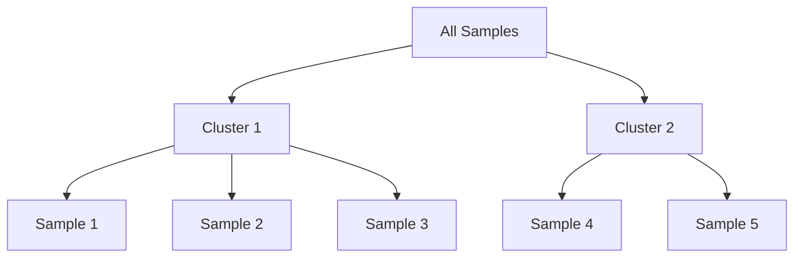
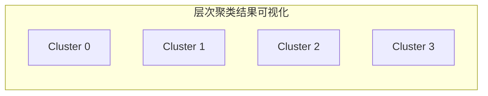

# 层次聚类(Hierarchical Clustering) - 原理与代码实例讲解

## 1.背景介绍

### 1.1 什么是聚类

聚类是一种无监督学习技术,旨在将未标记的数据样本划分为多个组(簇),使得同一簇内的样本彼此相似,而不同簇之间的样本则存在明显差异。聚类广泛应用于客户细分、图像分割、基因表达数据分析等诸多领域。

### 1.2 聚类算法分类

常见的聚类算法可分为以下几类:

- **原型聚类**:如K-Means、K-Medoids等,需要预先指定簇数K。
- **密度聚类**:如DBSCAN、OPTICS等,根据样本密度自动发现簇。
- **层次聚类**:通过层次分区将样本逐步划分为不同簇。
- **基于模型**:如高斯混合模型,基于概率模型进行聚类。
- **基于网格**:如STING等,基于数据空间网格化进行聚类。

### 1.3 层次聚类概述

层次聚类(Hierarchical Clustering)是一种常用的聚类方法,通过层次分区将样本逐步划分为不同簇。根据分层方式不同,可分为:

- **凝聚层次聚类**(Agglomerative Clustering):自底向上,每个样本初始作为一个簇,然后逐步合并相似的簇。
- **分裂层次聚类**(Divisive Clustering):自顶向下,所有样本初始作为一个簇,然后逐步划分为更小的簇。

本文将重点介绍凝聚层次聚类的原理与实现。

## 2.核心概念与联系

### 2.1 簇间距离度量

在层次聚类中,需要定义簇间距离(Cluster Distance),用于衡量两个簇的相似性。常见的簇间距离度量包括:

1. **最短距离聚类**(Single Linkage):簇间距离定义为两个簇中最近的两个样本间距离。
2. **最长距离聚类**(Complete Linkage):簇间距离定义为两个簇中最远的两个样本间距离。
3. **均值距离聚类**(Average Linkage):簇间距离定义为两个簇所有样本对间距离的均值。
4. **质心距离聚类**(Centroid Linkage):簇间距离定义为两个簇质心(均值向量)间的距离。
5. **华德距离聚类**(Ward's Linkage):基于最小化簇内离差平方和(WCSS)的思想,将增加WCSS最小的两个簇合并。

不同距离度量会导致聚类结果的差异,需要根据具体问题选择合适的度量方式。

### 2.2 层次聚类树状图

层次聚类的过程可以用一种称为树状图(Dendrogram)的图形直观表示。树状图是一种二叉树形的图,每个节点表示一个簇,节点高度对应于簇内样本间的距离。



通过剪切树状图的水平线,可以得到不同层次的聚类结果。一般使用轮廓系数(Silhouette Coefficient)等指标来评估最优簇数。

## 3.核心算法原理具体操作步骤  

凝聚层次聚类算法的核心步骤如下:

1. **计算距离矩阵**:计算所有样本对之间的距离,常用欧氏距离或其他距离度量。
2. **初始化簇分配**:将每个样本初始化为一个单独的簇。
3. **寻找最近簇对**:在当前所有簇对中,找到距离最近的两个簇。
4. **合并最近簇对**:将距离最近的两个簇合并为一个新的簇。
5. **更新距离矩阵**:根据选定的簇间距离度量,重新计算新簇与其他簇的距离。
6. **重复3-5步骤**:重复执行步骤3-5,直到所有样本被合并为一个簇。

算法伪代码如下:

```python
# 计算距离矩阵
distance_matrix = compute_distance_matrix(samples)

# 初始化每个样本为一个簇
clusters = [[sample] for sample in samples]

while len(clusters) > 1:
    # 寻找最近簇对
    min_dist = float('inf')
    min_pair = None
    for i, cluster1 in enumerate(clusters):
        for j, cluster2 in enumerate(clusters[i+1:]):
            dist = cluster_distance(cluster1, cluster2, distance_matrix)
            if dist < min_dist:
                min_dist = dist
                min_pair = (i, j+i+1)
    
    # 合并最近簇对
    new_cluster = clusters[min_pair[0]] + clusters[min_pair[1]]
    clusters.append(new_cluster)
    clusters.pop(max(min_pair))
    clusters.pop(min(min_pair))
    
    # 更新距离矩阵
    update_distance_matrix(clusters, distance_matrix)
```

## 4.数学模型和公式详细讲解举例说明

### 4.1 距离度量

在层次聚类中,常用的距离度量包括:

1. **欧氏距离**:

$$
d(x,y) = \sqrt{\sum_{i=1}^{n}(x_i - y_i)^2}
$$

其中$x$和$y$是$n$维样本向量。

2. **曼哈顿距离**:

$$
d(x,y) = \sum_{i=1}^{n}|x_i - y_i|
$$

3. **余弦相似度**:

$$
\text{sim}(x,y) = \frac{x \cdot y}{\|x\| \|y\|} = \frac{\sum_{i=1}^{n}x_iy_i}{\sqrt{\sum_{i=1}^{n}x_i^2}\sqrt{\sum_{i=1}^{n}y_i^2}}
$$

可以将余弦相似度转换为距离:$d(x,y) = 1 - \text{sim}(x,y)$。

### 4.2 簇间距离度量

假设有两个簇$C_1$和$C_2$,簇间距离度量方法如下:

1. **最短距离聚类**:

$$
d(C_1, C_2) = \min\limits_{x \in C_1, y \in C_2} d(x, y)
$$

2. **最长距离聚类**:  

$$
d(C_1, C_2) = \max\limits_{x \in C_1, y \in C_2} d(x, y)
$$

3. **均值距离聚类**:

$$
d(C_1, C_2) = \frac{1}{|C_1||C_2|}\sum\limits_{x \in C_1}\sum\limits_{y \in C_2}d(x, y)
$$

4. **质心距离聚类**:

$$
d(C_1, C_2) = d(\bar{x}_1, \bar{x}_2)
$$

其中$\bar{x}_1$和$\bar{x}_2$分别为$C_1$和$C_2$的质心(均值向量)。

5. **华德距离聚类**:

假设合并$C_1$和$C_2$得到新簇$C_3$,则距离定义为:

$$
d(C_1, C_2) = \sqrt{\frac{|C_1||C_2|}{|C_1|+|C_2|}}\|\bar{x}_1 - \bar{x}_2\|^2 + \frac{|C_1|+|C_2|}{|C_1|+|C_2|}\text{WCSS}(C_3)
$$

其中$\text{WCSS}(C_3) = \sum\limits_{x \in C_3}\|x - \bar{x}_3\|^2$是新簇$C_3$的离差平方和。

### 4.3 轮廓系数评估

轮廓系数(Silhouette Coefficient)是评估聚类效果的一种常用指标,定义如下:

对于样本$i$,计算:

$$
a_i = \frac{1}{|C_i|}\sum\limits_{j \in C_i}d(i, j)
$$

即样本$i$与同簇其他样本的平均距离。

$$
b_i = \min\limits_{k \neq i}\frac{1}{|C_k|}\sum\limits_{l \in C_k}d(i, l)
$$

即样本$i$与最近异簇样本的平均距离。

则样本$i$的轮廓系数为:

$$
s_i = \frac{b_i - a_i}{\max(a_i, b_i)}
$$

$s_i$的取值范围为$[-1, 1]$,值越大表示聚类效果越好。

对于整个聚类结果,轮廓系数为所有样本轮廓系数的平均值:

$$
\text{Silhouette Coefficient} = \frac{1}{n}\sum\limits_{i=1}^{n}s_i
$$

可以通过计算不同$k$值时的轮廓系数,选择最优的$k$值作为最终簇数。

## 5.项目实践:代码实例和详细解释说明

以下是使用Python中的scikit-learn库实现层次聚类的示例代码:

```python
import numpy as np
from sklearn.datasets import make_blobs
from sklearn.cluster import AgglomerativeClustering
import matplotlib.pyplot as plt

# 生成样本数据
X, y = make_blobs(n_samples=500, n_features=2, centers=4, cluster_std=1, random_state=1)

# 层次聚类
clustering = AgglomerativeClustering(n_clusters=4, linkage='ward').fit(X)
labels = clustering.labels_

# 可视化聚类结果
plt.scatter(X[:, 0], X[:, 1], c=labels, cmap='rainbow')
plt.show()
```

代码解释:

1. 使用`make_blobs`函数生成了一个包含500个样本、2个特征、4个真实簇的数据集。
2. 使用`AgglomerativeClustering`类进行层次聚类,指定簇数为4,距离度量方法为`ward`(华德距离)。
3. 调用`fit`方法对数据进行聚类,得到每个样本的簇标签`labels`。
4. 使用`matplotlib`库对聚类结果进行可视化。

运行结果:



上图展示了层次聚类将样本正确划分为4个簇的结果。

## 6.实际应用场景

层次聚类在以下场景中有广泛应用:

1. **基因表达数据分析**:对基因表达数据进行聚类,发现具有相似表达模式的基因组。
2. **客户细分**:根据客户特征对客户进行分组,实现精准营销。
3. **网页聚类**:对网页内容进行聚类,提高网页搜索质量。
4. **图像分割**:将图像像素点根据颜色相似性进行分组,实现图像分割。
5. **异常检测**:将异常样本与正常样本分开,用于异常检测。

## 7.工具和资源推荐

- **scikit-learn**:Python中流行的机器学习库,提供了`AgglomerativeClustering`类实现层次聚类。
- **scipy**:Python中的科学计算库,提供了`hierarchy`模块进行层次聚类分析。
- **R**:在R语言中,可以使用`stats`包中的`hclust`函数进行层次聚类。
- **Weka**:知名的数据挖掘软件,提供了层次聚类算法的实现。
- **Orange**:开源的数据可视化、机器学习和数据挖掘工具,支持层次聚类。

## 8.总结:未来发展趋势与挑战

层次聚类是一种经典而有效的聚类方法,具有以下优势:

- 无需预先指定簇数,能自动发现数据的层次结构。
- 可视化的树状图有助于理解聚类过程和结果。
- 适用于任意形状和密度的数据分布。

但同时也存在一些挑战:

- 计算复杂度较高,对于大规模数据集效率较低。
- 对异常值敏感,可能导致错误的聚类结果。
- 不同距离度量方法会影响聚类效果,需要根据具体问题选择合适的度量。

未来,层次聚类可能会在以下方向发展:

- 提高算法效率,支持大规模数据集的快速聚类。
- 结合深度学习等技术,自动学习最优距离度量。
- 将层次聚类应用于更多新兴领域,如社交网络分析等。

## 9.附录:常见问题与解答

1. **层次聚