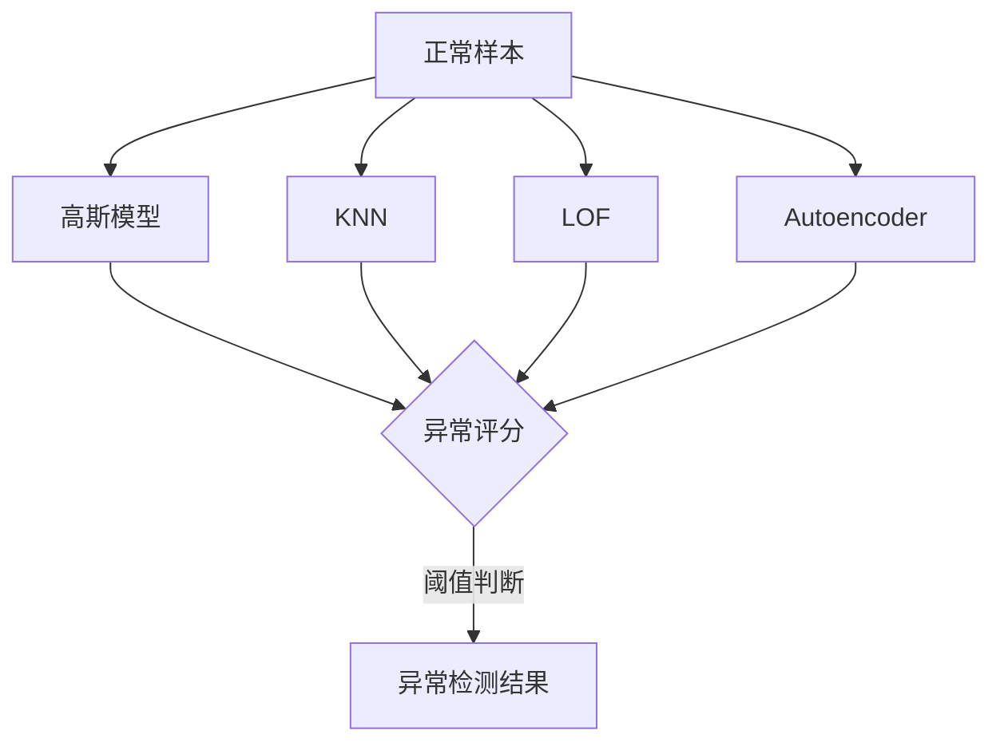

# 异常检测(Anomaly Detection)原理与代码实战案例讲解

## 1. 背景介绍
### 1.1 异常检测的定义与意义
异常检测(Anomaly Detection)是指识别数据集中与其他观测数据有显著差异的罕见项目、事件或观测数据的问题。这些异常数据通常被称为异常值、新奇值、噪声、偏差和异常点等。异常检测在许多领域都有广泛的应用，如欺诈检测、入侵检测、系统健康监测、传感器网络等。及时准确地检测出异常，对保障系统安全、提高决策质量、减少损失都有重要意义。

### 1.2 异常检测面临的挑战
异常检测是一个具有挑战性的问题，主要面临以下难点：

1. 异常定义的模糊性：异常本身是一个相对的概念，很难给出一个明确的数学定义。
2. 异常的稀疏性：异常数据在整个数据集中所占比例通常很小，容易被当做噪声忽略掉。  
3. 异常类型的多样性：异常可能由多种原因导致，表现形式多样，很难用一种通用的模型来刻画。
4. 正常样本的多样性：现实数据的正常样本分布通常很复杂，很难用一个简单的模型来拟合。
5. 缺乏异常样本：在实际应用中，异常数据很难收集到，导致训练样本严重不平衡。

### 1.3 异常检测的常用方法
异常检测是一个历史悠久的研究课题，学术界和工业界都提出了大量的检测方法。常用的异常检测方法可以分为以下几大类：

1. 基于统计的方法：假设数据服从某种概率分布，通过拟合其分布参数，计算样本的异常程度。代表性方法有高斯模型、马尔科夫链等。
2. 基于距离的方法：假设正常数据聚集在一起，异常数据与之相距较远。代表性方法有KNN、LOF等。
3. 基于密度的方法：假设异常数据所在区域的密度显著低于正常数据。代表性方法有DBSCAN、OPTICS等。
4. 基于聚类的方法：先对数据进行聚类，再根据聚类结果判断异常。代表性方法有K-Means、GMM等。
5. 基于分类的方法：将异常检测看做一个二分类问题，用分类模型来判别异常。代表性方法有SVM、决策树等。
6. 基于信息论的方法：利用信息论中的概念如信息熵、KL散度等来度量异常性。
7. 基于深度学习的方法：利用深度神经网络强大的特征学习能力，自动提取高层特征来检测异常。代表性方法有Autoencoder、GAN等。

## 2. 核心概念与联系
### 2.1 异常的定义
异常(Anomaly)是指明显偏离其他数据的罕见观测或事件。从统计学的角度看，异常是指那些落在正常数据分布之外的少数样本点。从机器学习的角度看，异常是指那些无法用学习到的模式很好解释的罕见样本。

### 2.2 异常检测与相关概念的联系
异常检测与以下几个概念密切相关：

1. 离群点检测(Outlier Detection)：异常数据通常被称为离群点或异常点，两者在很多场合可以互换使用。但异常检测强调检测出有意义的异常，而离群点检测更关注数据cleaning，移除异常噪声数据。
2. 新奇检测(Novelty Detection)：新奇是指与已有正常数据显著不同的新样本。新奇检测只需要正常数据的训练集，而异常检测需要同时考虑正常和异常数据。
3. 噪声去除(Noise Removal)：噪声通常指一些随机的、无意义的干扰数据。异常数据和噪声数据都偏离正常模式，但异常数据可能蕴含有价值的信息。
4. 单分类学习(One-class Classification)：单分类学习试图只用一个正常类的数据来训练分类器。它与只用正常数据训练的半监督异常检测很相似。

### 2.3 异常检测的一般流程
一个完整的异常检测流程通常包括以下步骤：

1. 数据预处理：对原始数据进行清洗、集成、转换、归一化等预处理操作，提高数据质量。
2. 特征选择/提取：从原始数据中选择或构建能很好刻画异常的特征子集，消除冗余和不相关特征。
3. 异常度量：根据异常检测算法，计算每个样本的异常分数，得到反映其异常程度的标量或向量。
4. 阈值确定：根据异常分数，设定一个阈值将样本划分为正常或异常。阈值的选取需要平衡准确率和召回率。
5. 模型评估：用测试集中的已知异常样本，评估模型的异常检测性能，并用可视化等方法分析异常结果。

## 3. 核心算法原理与具体操作步骤
本节我们重点介绍几种经典的异常检测算法，包括统计学方法、距离方法、密度方法和深度学习方法。

### 3.1 基于高斯分布的异常检测
基于高斯分布的异常检测是最简单和常用的参数化统计方法。它假设正常数据服从多元高斯分布，然后用样本的高斯密度值来衡量其异常程度。具体步骤如下：

1. 参数估计：用正常样本的均值向量 $\mu$ 和协方差矩阵 $\Sigma$ 来拟合高斯分布参数。
$$\mu=\frac{1}{m}\sum_{i=1}^m x^{(i)}$$
$$\Sigma=\frac{1}{m}\sum_{i=1}^m (x^{(i)}-\mu)(x^{(i)}-\mu)^T$$
2. 异常评分：对于一个新样本 $x$，计算其在高斯分布下的概率密度值作为异常评分。
$$p(x)=\frac{1}{(2\pi)^{n/2}|\Sigma|^{1/2}} \exp\left(-\frac{1}{2}(x-\mu)^T\Sigma^{-1}(x-\mu)\right)$$
3. 阈值判断：若 $p(x)<\epsilon$，则判定 $x$ 为异常样本，其中 $\epsilon$ 为预先设定的阈值。

基于高斯模型的优点是速度快，计算简单，适合低维数据。缺点是假设数据服从高斯分布，对非高斯分布的数据效果不好。

### 3.2 基于KNN的异常检测
KNN(K-Nearest Neighbor)是一种常用的非参数化距离方法。它假设正常数据点的局部密度较高，异常点与其最近邻的距离较远。KNN异常检测的具体步骤如下：

1. 距离计算：对于数据集中的每个样本点 $x^{(i)}$，计算它与其他所有点的距离 $d_{ij}$，通常用欧氏距离。
$$d_{ij} = \sqrt{\sum_{k=1}^n (x_k^{(i)}-x_k^{(j)})^2}$$
2. 异常评分：对每个点 $x^{(i)}$，计算它到其第 $k$ 个最近邻的距离作为异常评分。
$$\text{score}(x^{(i)}) = d(x^{(i)}, NN_k(x^{(i)}))$$
其中 $NN_k(x^{(i)})$ 表示 $x^{(i)}$ 的第 $k$ 个最近邻点。
3. 阈值判断：设定一个距离阈值 $\epsilon$，若 $\text{score}(x^{(i)}) > \epsilon$，则判定 $x^{(i)}$ 为异常点。

KNN方法的优点是无需假设数据分布，适用于各种数据类型。缺点是计算量大，需要存储所有数据点，不适合高维数据。

### 3.3 基于LOF的异常检测
LOF(Local Outlier Factor)是一种常用的密度方法，通过比较样本点与其邻域的局部密度差异来判断异常。具体步骤如下：

1. 计算k-距离：对每个点 $x^{(i)}$，计算它到第 $k$ 个最近邻的距离 $d_k(x^{(i)})$。
2. 计算可达距离：对每对点 $x^{(i)}$ 和 $x^{(j)}$，计算 $x^{(i)}$ 关于 $x^{(j)}$ 的可达距离。
$$\text{reach-dist}_k(x^{(i)}, x^{(j)}) = \max\{d_k(x^{(j)}), d(x^{(i)}, x^{(j)})\}$$
3. 计算局部可达密度：对每个点 $x^{(i)}$，计算其局部可达密度。
$$\text{lrd}_k(x^{(i)}) = 1/\left(\frac{\sum_{j\in N_k(x^{(i)})} \text{reach-dist}_k(x^{(i)}, x^{(j)})}{|N_k(x^{(i)})|}\right)$$
其中 $N_k(x^{(i)})$ 表示 $x^{(i)}$ 的第 $k$ 近邻集合。
4. 计算局部离群因子：对每个点 $x^{(i)}$，计算其局部离群因子。
$$\text{LOF}_k(x^{(i)}) = \frac{\sum_{j\in N_k(x^{(i)})} \frac{\text{lrd}_k(x^{(j)})}{\text{lrd}_k(x^{(i)})}}{|N_k(x^{(i)})|}$$
5. 阈值判断：设定一个LOF阈值 $\epsilon$，若 $\text{LOF}_k(x^{(i)}) > \epsilon$，则判定 $x^{(i)}$ 为异常点。

LOF的优点是对局部异常敏感，鲁棒性强，适合非球形数据。缺点是计算复杂度高，参数 $k$ 不容易选取。

### 3.4 基于Autoencoder的异常检测
Autoencoder是一种常用的深度学习无监督方法，通过数据重构误差来检测异常。它由编码器和解码器两部分组成，试图学习恢复输入数据的低维表示。异常数据通常难以被很好地重构。具体步骤如下：

1. 模型训练：用正常数据训练Autoencoder模型，损失函数为重构误差。
$$L(x, \hat{x}) = \|x - \hat{x}\|^2$$
其中 $x$ 为输入样本， $\hat{x}$ 为重构样本。
2. 异常评分：对每个测试样本 $x$，计算其重构误差作为异常评分。
$$\text{score}(x) = L(x, \text{AE}(x))$$
3. 阈值判断：设定一个重构误差阈值 $\epsilon$，若 $\text{score}(x) > \epsilon$，则判定 $x$ 为异常点。

Autoencoder的优点是可以自动学习数据的高层特征，捕捉复杂的数据结构。缺点是训练时间长，参数调优困难，解释性差。

## 4. 数学模型和公式详细讲解举例说明
本节我们以基于高斯分布的异常检测为例，详细讲解其数学模型和公式。

### 4.1 多元高斯分布
多元高斯分布是单变量高斯分布在多维空间上的推广。一个 $n$ 维随机变量 $\boldsymbol{x}$ 服从多元高斯分布，若其概率密度函数为：
$$p(\boldsymbol{x};\boldsymbol{\mu},\boldsymbol{\Sigma}) = \frac{1}{(2\pi)^{n/2}|\boldsymbol{\Sigma}|^{1/2}} \exp\left(-\frac{1}{2}(\boldsymbol{x}-\boldsymbol{\mu})^T\boldsymbol{\Sigma}^{-1}(\boldsymbol{x}-\boldsymbol{\