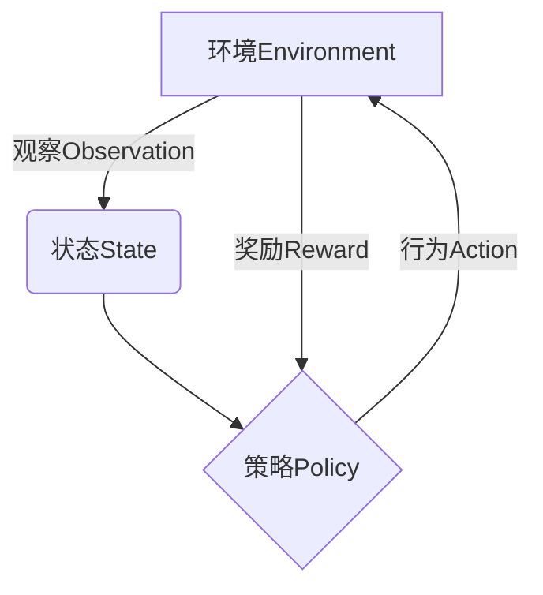
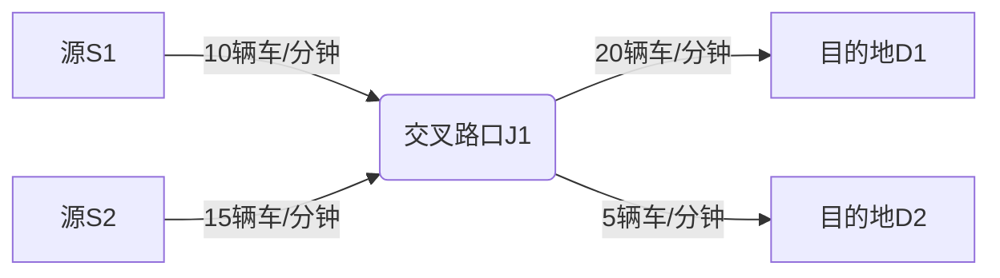

# 强化学习Reinforcement Learning在智慧交通系统中的创新应用

## 1.背景介绍

### 1.1 交通拥堵问题

随着城市化进程的加快和汽车保有量的不断增长,交通拥堵已经成为当今社会面临的一个严峻挑战。交通拥堵不仅导致时间和燃料的浪费,还会产生严重的环境污染和安全隐患。据统计,在一些特大城市,司机每年因交通拥堵而浪费数百个小时,造成巨大的经济损失。

### 1.2 智慧交通系统的兴起

为了缓解日益严重的交通拥堵问题,智慧交通系统(Intelligent Transportation Systems, ITS)应运而生。智慧交通系统是一种利用先进的信息和通信技术来监控、控制和管理交通流的综合性交通管理系统。它的目标是提高交通运输的效率、安全性、可靠性和舒适性。

### 1.3 强化学习在智慧交通系统中的作用

在智慧交通系统中,强化学习(Reinforcement Learning, RL)作为一种先进的机器学习技术,正在发挥越来越重要的作用。强化学习能够通过与环境的交互来学习最优策略,从而实现交通信号控制、路径规划、车辆调度等多种应用场景的优化。

## 2.核心概念与联系

### 2.1 强化学习概述

强化学习是机器学习的一个重要分支,它研究如何在一个由状态、行为和奖励组成的环境中,通过试错学习来获取最优策略。强化学习算法通过与环境交互,根据获得的奖励信号来调整策略,最终找到能够最大化长期累积奖励的最优策略。

强化学习的核心思想是"试错学习",即通过不断尝试不同的行为,并根据获得的奖惩反馈来调整策略。这种学习方式类似于人类和动物的学习过程,不需要事先标注的训练数据,能够自主探索和学习。

强化学习主要包括四个基本元素:

- 环境(Environment):智能体与之交互的外部世界。
- 状态(State):描述环境当前的情况。
- 行为(Action):智能体可以采取的操作。
- 奖励(Reward):智能体采取某个行为后,环境给予的反馈信号。

强化学习算法的目标是找到一个策略(Policy),使得在该策略指导下,智能体能够从环境中获得最大的累积奖励。



### 2.2 强化学习在智慧交通系统中的应用

在智慧交通系统中,强化学习可以应用于多个领域,如交通信号控制、路径规划、车辆调度等。由于交通系统是一个复杂的动态环境,传统的规则based方法往往难以获得最优解。而强化学习则能够通过与环境的交互来学习最优策略,从而实现交通系统的智能化管理和优化。

以交通信号控制为例,智能体可以观察当前的交通状态(如车辆数量、等待时间等),根据策略选择合适的信号周期和相位时间作为行为,环境则会根据交通流量的变化给出相应的奖惩反馈。通过不断尝试和学习,强化学习算法最终能够找到一个能够最大化交通通行效率的最优信号控制策略。

## 3.核心算法原理具体操作步骤  

强化学习算法主要分为三类:基于价值的算法(Value-based)、基于策略的算法(Policy-based)和基于行为者-评论家的算法(Actor-Critic)。这些算法在具体操作步骤上有所不同,但都遵循强化学习的基本框架。

我们以 Q-Learning 算法(一种基于价值的强化学习算法)为例,介绍其核心原理和具体操作步骤。

### 3.1 Q-Learning算法原理

Q-Learning算法的目标是学习一个 Q 函数(Action-Value Function),该函数能够估计在某个状态 s 下采取行为 a 后,可以获得的最大期望累积奖励。通过不断更新 Q 函数,最终可以得到一个最优策略。

Q-Learning算法的核心更新公式为:

$$Q(s_t, a_t) \leftarrow Q(s_t, a_t) + \alpha \big[r_t + \gamma \max_{a} Q(s_{t+1}, a) - Q(s_t, a_t)\big]$$

其中:
- $s_t$ 表示时刻 t 的状态
- $a_t$ 表示时刻 t 采取的行为
- $r_t$ 表示时刻 t 获得的即时奖励
- $\alpha$ 表示学习率,控制学习的速度
- $\gamma$ 表示折现因子,控制未来奖励的重要程度
- $\max_{a} Q(s_{t+1}, a)$ 表示在时刻 t+1 的状态下,所有可能行为的最大 Q 值

通过不断更新 Q 函数,最终可以得到一个最优策略 $\pi^*$,使得对于任意状态 s,执行 $\pi^*(s) = \arg\max_{a} Q^*(s, a)$ 都能获得最大的期望累积奖励。

### 3.2 Q-Learning算法步骤

1. 初始化 Q 表格,对于所有的状态-行为对 (s, a),将 Q(s, a) 初始化为任意值(通常为 0)。
2. 对于每一个时刻 t:
    - 观察当前状态 $s_t$
    - 根据 $\epsilon$-greedy 策略选择行为 $a_t$
        - 以概率 $\epsilon$ 选择随机行为
        - 以概率 1-$\epsilon$ 选择 $\arg\max_{a} Q(s_t, a)$
    - 执行选定的行为 $a_t$,观察到新状态 $s_{t+1}$ 和即时奖励 $r_t$
    - 根据 Q-Learning 更新公式更新 Q(s_t, a_t)
3. 重复步骤 2,直到收敛或达到最大迭代次数

在实际应用中,Q-Learning 算法还可以结合深度神经网络来近似 Q 函数,从而处理大规模、高维的状态空间和行为空间,这就是著名的 Deep Q-Network (DQN) 算法。

## 4.数学模型和公式详细讲解举例说明

在强化学习中,常用的数学模型包括马尔可夫决策过程(Markov Decision Process, MDP)和贝尔曼方程(Bellman Equation)。

### 4.1 马尔可夫决策过程

马尔可夫决策过程是强化学习问题的数学形式化描述,它由一个五元组 $(S, A, P, R, \gamma)$ 组成:

- $S$ 是有限的状态集合
- $A$ 是有限的行为集合
- $P(s'|s, a)$ 是状态转移概率,表示在状态 s 下执行行为 a 后,转移到状态 s' 的概率
- $R(s, a, s')$ 是奖励函数,表示在状态 s 下执行行为 a 后,转移到状态 s' 时获得的即时奖励
- $\gamma \in [0, 1)$ 是折现因子,用于权衡即时奖励和未来奖励的重要性

在马尔可夫决策过程中,我们的目标是找到一个最优策略 $\pi^*$,使得在该策略指导下,智能体能够获得最大的期望累积奖励,即:

$$\pi^* = \arg\max_{\pi} \mathbb{E}_{\pi}\Big[\sum_{t=0}^{\infty} \gamma^t r_t\Big]$$

其中 $r_t$ 表示时刻 t 获得的即时奖励。

### 4.2 贝尔曼方程

贝尔曼方程是求解马尔可夫决策过程最优策略的一种方法。它将期望累积奖励分解为两部分:即时奖励和折现后的未来期望奖励。

对于任意策略 $\pi$,其在状态 s 下的价值函数 $V^{\pi}(s)$ 满足以下贝尔曼方程:

$$V^{\pi}(s) = \mathbb{E}_{\pi}\Big[r_t + \gamma V^{\pi}(s_{t+1}) | s_t = s\Big]$$

同理,对于任意策略 $\pi$,其在状态 s 下执行行为 a 的 Q 函数 $Q^{\pi}(s, a)$ 满足:

$$Q^{\pi}(s, a) = \mathbb{E}_{\pi}\Big[r_t + \gamma \sum_{s'} P(s'|s, a) V^{\pi}(s') | s_t = s, a_t = a\Big]$$

我们可以证明,存在一个最优价值函数 $V^*(s)$ 和最优 Q 函数 $Q^*(s, a)$,它们分别满足:

$$V^*(s) = \max_{\pi} V^{\pi}(s) = \max_{a} \mathbb{E}\Big[r_t + \gamma V^*(s_{t+1}) | s_t = s, a_t = a\Big]$$

$$Q^*(s, a) = \mathbb{E}\Big[r_t + \gamma \max_{a'} Q^*(s_{t+1}, a') | s_t = s, a_t = a\Big]$$

上述方程就是著名的贝尔曼最优方程,它为求解最优策略提供了理论基础。

### 4.3 示例:交通信号控制

假设我们有一个简单的交通信号控制场景,如下图所示:



我们的目标是通过控制交叉路口 J1 的信号周期和相位时间,来最大化车辆的通行效率。

在这个场景中,我们可以定义:

- 状态 $s$:表示当前等待的车辆数量,例如 $s = (10, 15)$ 表示来自 S1 有 10 辆车,来自 S2 有 15 辆车正在等待通过。
- 行为 $a$:表示分配给两个方向的绿灯时间,例如 $a = (30, 20)$ 表示给 S1 方向 30 秒绿灯,给 S2 方向 20 秒绿灯。
- 奖励 $r$:可以定义为在一个信号周期内通过的车辆数量。

我们可以构建一个 Q-Learning 算法来学习最优的信号控制策略。具体步骤如下:

1. 初始化 Q 表格,对于所有的状态-行为对 $(s, a)$,将 $Q(s, a)$ 初始化为 0。
2. 对于每一个时刻 t:
    - 观察当前等待车辆数量 $s_t$
    - 根据 $\epsilon$-greedy 策略选择信号时间 $a_t$
    - 执行选定的信号时间 $a_t$,观察到新的等待车辆数量 $s_{t+1}$ 和通过车辆数量(即时奖励 $r_t$)
    - 根据 Q-Learning 更新公式更新 $Q(s_t, a_t)$
3. 重复步骤 2,直到收敛

通过上述过程,我们可以得到一个最优的信号控制策略,使得在该策略指导下,车辆的通行效率达到最大化。

## 5.项目实践:代码实例和详细解释说明

为了更好地理解强化学习在智慧交通系统中的应用,我们提供一个基于 Python 和 OpenAI Gym 环境的交通信号控制实例。

### 5.1 环境设置

我们使用 OpenAI Gym 提供的 Traffic Signal Control 环境。该环境模拟了一个简单的交叉路口,包含两个车道和一个交通信号灯。我们的目标是通过控制信号灯的相位时间,来最大化车辆的通行效率。

```python
import gym
import numpy as np

env = gym.make('TrafficSignalControl-v0')
```

### 5.2 Q-Learning 算法实现

我们使用 Q-Learning 算法来学习最优的信号控制策略。具体代码如下:

```python
import random

# 初始化 Q 表格
q_table = np.zeros((env.observation_space