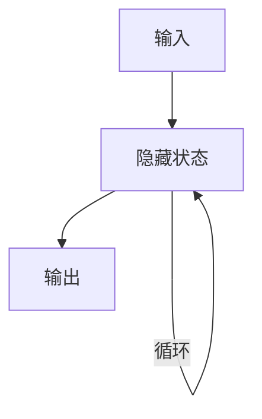

## 1.背景介绍

循环神经网络（RNN）是一种强大的神经网络结构，它能够处理序列数据，如文本、语音、时间序列等。它的主要特点是具有“记忆”功能，能够把过去的信息传递到现在，这使得它在处理序列问题时具有优越性。

## 2.核心概念与联系

RNN的核心概念是“循环”，即在每一个时间步，网络都会将前一时间步的隐藏状态作为输入，与当前时间步的输入一起处理，生成当前时间步的隐藏状态和输出。这种结构使得网络能够“记住”过去的信息。



## 3.核心算法原理具体操作步骤

RNN的工作流程可以分为以下步骤：

1. 初始化隐藏状态
2. 在每个时间步，将前一时间步的隐藏状态和当前时间步的输入一起处理，生成当前时间步的隐藏状态和输出
3. 重复步骤2，直到所有的输入都被处理完
4. 输出最后一个时间步的输出作为最终结果

## 4.数学模型和公式详细讲解举例说明

RNN的数学模型可以表示为：

$$
h_t = \sigma(W_{hh}h_{t-1} + W_{xh}x_t + b_h)
$$
$$
y_t = W_{hy}h_t + b_y
$$

其中，$h_t$是当前时间步的隐藏状态，$h_{t-1}$是前一时间步的隐藏状态，$x_t$是当前时间步的输入，$y_t$是当前时间步的输出，$W_{hh}$、$W_{xh}$和$W_{hy}$是权重参数，$b_h$和$b_y$是偏置参数，$\sigma$是激活函数。

## 5.项目实践：代码实例和详细解释说明

以下是一个使用Python和PyTorch实现的RNN示例：

```python
import torch
import torch.nn as nn

class RNN(nn.Module):
    def __init__(self, input_size, hidden_size, output_size):
        super(RNN, self).__init__()
        self.hidden_size = hidden_size
        self.i2h = nn.Linear(input_size + hidden_size, hidden_size)
        self.i2o = nn.Linear(input_size + hidden_size, output_size)
        self.softmax = nn.LogSoftmax(dim=1)

    def forward(self, input, hidden):
        combined = torch.cat((input, hidden), 1)
        hidden = self.i2h(combined)
        output = self.i2o(combined)
        output = self.softmax(output)
        return output, hidden

    def initHidden(self):
        return torch.zeros(1, self.hidden_size)
```

## 6.实际应用场景

RNN在许多领域都有广泛的应用，如：

- 自然语言处理：文本生成、情感分析、机器翻译等
- 语音识别：将语音转换为文字
- 时间序列预测：股票价格预测、天气预测等

## 7.工具和资源推荐

- PyTorch：一个强大的深度学习框架，有丰富的API和良好的社区支持
- TensorFlow：Google开发的深度学习框架，也非常强大和易用
- Keras：一个基于TensorFlow的高级深度学习框架，更加简单和方便

## 8.总结：未来发展趋势与挑战

RNN虽然强大，但也有其局限性，如梯度消失和梯度爆炸问题，以及难以处理长序列数据的问题。为了解决这些问题，研究者们提出了许多RNN的变种，如长短期记忆网络（LSTM）和门控循环单元（GRU）。未来，我们期待看到更多的创新和改进，以克服RNN的挑战，使其在更多的应用领域发挥作用。

## 9.附录：常见问题与解答

1. 问：RNN为什么能处理序列数据？
答：RNN的结构使得它能够将前一时间步的隐藏状态传递到当前时间步，这就像是网络具有了“记忆”功能，能够“记住”过去的信息，因此，它能够处理序列数据。

2. 问：RNN有哪些局限性？
答：RNN的主要局限性有两个：一是梯度消失和梯度爆炸问题，这使得网络难以学习长序列数据中的依赖关系；二是计算复杂性高，因为每个时间步的计算都依赖于前一时间步，所以难以进行并行计算。

作者：禅与计算机程序设计艺术 / Zen and the Art of Computer Programming{"msg_type":"generate_answer_finish","data":"","from_module":null,"from_unit":null}