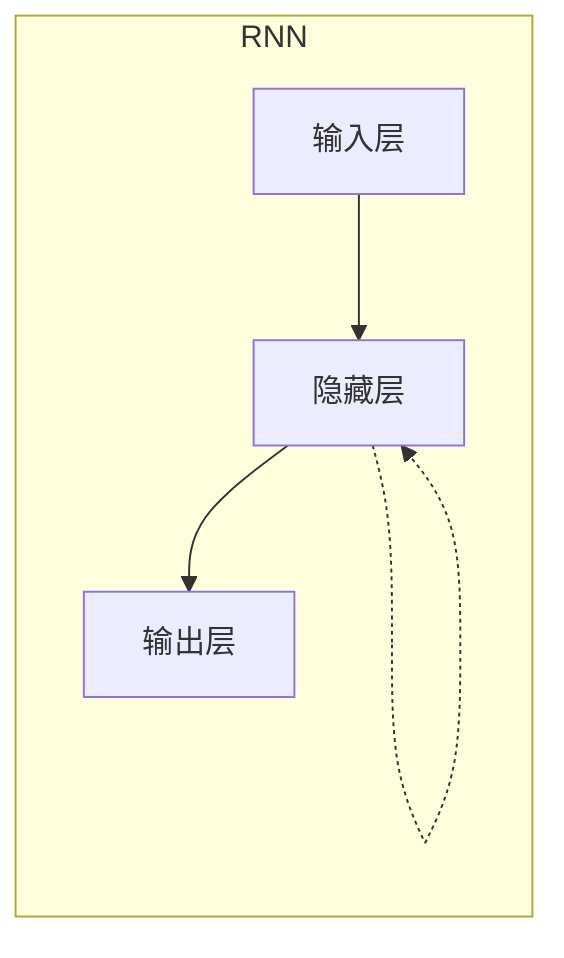
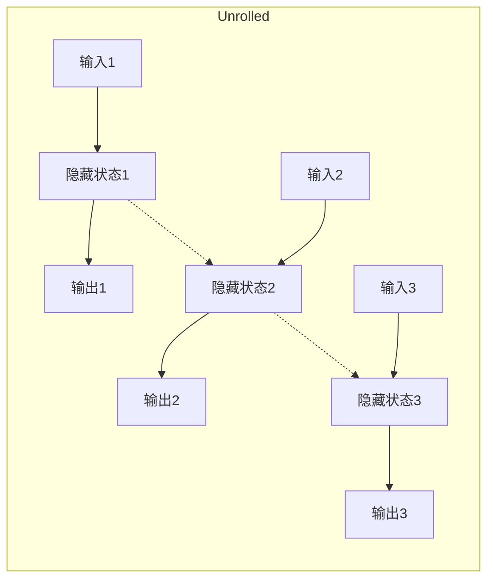
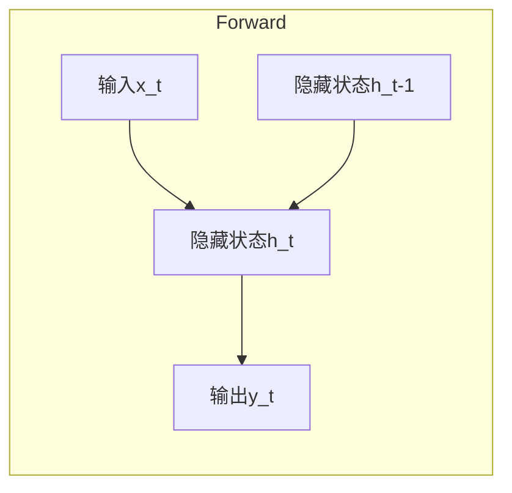
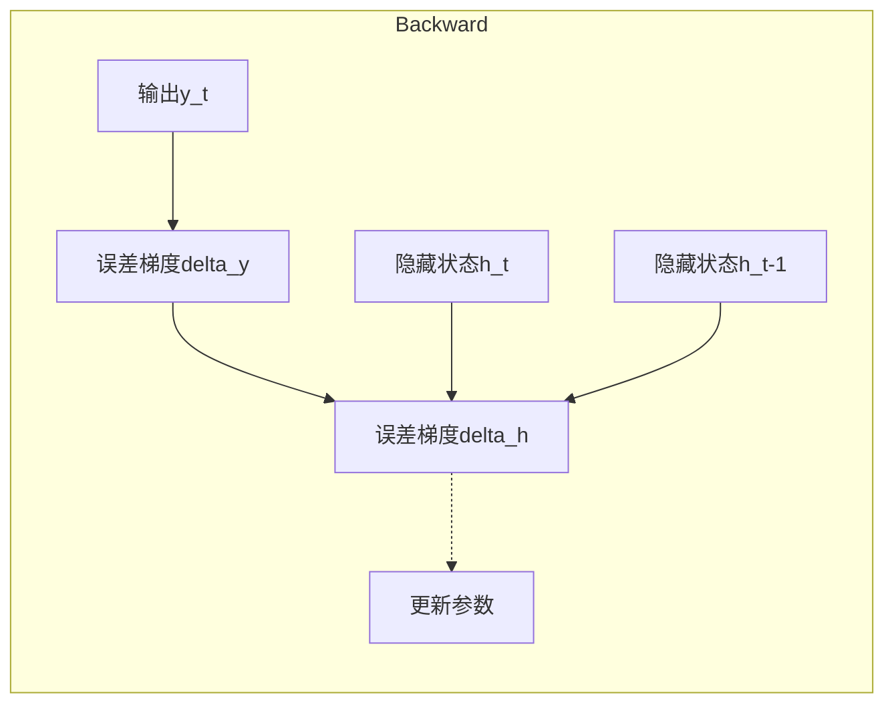

# 循环神经网络(Recurrent Neural Networks) - 原理与代码实例讲解

## 1.背景介绍

### 1.1 神经网络简介

神经网络是一种受生物神经系统启发而设计的机器学习模型。它由大量互相连接的节点(神经元)组成,这些节点通过权重传递信号。神经网络能够从数据中自动学习特征,并用于执行各种任务,如图像识别、自然语言处理和时间序列预测等。

### 1.2 循环神经网络的需求

传统的前馈神经网络(如多层感知机)在处理序列数据时存在局限性。它们无法很好地捕捉序列中元素之间的长期依赖关系,因为每个输入与输出之间是独立的。循环神经网络(Recurrent Neural Networks, RNNs)应运而生,旨在解决这一问题。

### 1.3 循环神经网络的特点

与前馈网络不同,RNNs在隐藏层之间引入了循环连接,使得网络能够记住之前的信息状态,并将其与当前输入相结合,从而更好地处理序列数据。这种内部记忆能力使RNNs在处理文本、语音、时间序列等序列数据时表现出色。

## 2.核心概念与联系

### 2.1 RNNs的基本结构

RNNs由一个输入层、一个隐藏层和一个输出层组成。隐藏层中的节点不仅与当前输入相连,还与自身的先前状态相连,形成了一个循环结构。这种结构使得RNNs能够捕捉序列数据中的长期依赖关系。



### 2.2 RNNs的展开结构

为了更好地理解RNNs的工作原理,我们可以将其展开为一个链式结构。每个时间步长,RNNs都会处理一个输入,并根据当前输入和先前状态计算新的隐藏状态和输出。



### 2.3 RNNs的应用场景

由于RNNs能够处理序列数据,因此它们在以下领域有广泛的应用:

- 自然语言处理(NLP):语言模型、机器翻译、文本生成等。
- 语音识别:将语音信号转换为文本。
- 时间序列预测:股票预测、天气预报等。
- 手写识别:将手写笔迹转换为文本。

## 3.核心算法原理具体操作步骤

### 3.1 RNNs的前向传播

在RNNs中,前向传播过程包括以下步骤:

1. 初始化隐藏状态 $h_0$ (通常为全0向量)。
2. 对于每个时间步长 $t$:
   - 计算当前隐藏状态 $h_t = f(W_{hx}x_t + W_{hh}h_{t-1} + b_h)$,其中 $f$ 是激活函数(如 $\tanh$),$W_{hx}$ 是输入到隐藏层的权重矩阵,$W_{hh}$ 是隐藏层到隐藏层的权重矩阵,$b_h$ 是隐藏层的偏置向量。
   - 计算当前输出 $y_t = g(W_{yh}h_t + b_y)$,其中 $g$ 是输出层的激活函数(如 softmax),$W_{yh}$ 是隐藏层到输出层的权重矩阵,$b_y$ 是输出层的偏置向量。



### 3.2 RNNs的反向传播

与前馈网络类似,RNNs也使用反向传播算法进行训练。但由于引入了循环连接,反向传播过程变得更加复杂。我们需要计算每个时间步长的误差梯度,并将其沿着时间反向传播,以更新网络参数。

1. 计算输出层的误差梯度 $\delta_t^{(y)} = \frac{\partial E}{\partial y_t}$。
2. 计算隐藏层的误差梯度 $\delta_t^{(h)} = \frac{\partial E}{\partial h_t} = W_{yh}^T\delta_t^{(y)} + \frac{\partial E}{\partial h_{t+1}}\frac{\partial h_{t+1}}{\partial h_t}$。
3. 更新网络参数:
   - $W_{yh} \leftarrow W_{yh} - \eta\delta_t^{(y)}h_t^T$
   - $W_{hx} \leftarrow W_{hx} - \eta\delta_t^{(h)}x_t^T$
   - $W_{hh} \leftarrow W_{hh} - \eta\delta_t^{(h)}h_{t-1}^T$
   - $b_y \leftarrow b_y - \eta\delta_t^{(y)}$
   - $b_h \leftarrow b_h - \eta\delta_t^{(h)}$

其中 $\eta$ 是学习率。



### 3.3 RNNs的梯度消失和梯度爆炸问题

在训练RNNs时,我们经常会遇到梯度消失和梯度爆炸的问题。这是由于反向传播过程中,梯度会随着时间步长的增加而指数级衰减或爆炸。

- 梯度消失:当梯度接近于0时,网络将无法继续学习长期依赖关系。
- 梯度爆炸:当梯度值过大时,可能导致权重更新失控。

为了解决这些问题,研究人员提出了一些改进的RNNs架构,如长短期记忆网络(LSTMs)和门控循环单元(GRUs)。

## 4.数学模型和公式详细讲解举例说明

### 4.1 RNNs的数学表示

我们可以使用以下数学符号来表示RNNs:

- $x_t$:时间步长 $t$ 的输入向量
- $h_t$:时间步长 $t$ 的隐藏状态向量
- $y_t$:时间步长 $t$ 的输出向量
- $W_{hx}$:输入到隐藏层的权重矩阵
- $W_{hh}$:隐藏层到隐藏层的权重矩阵
- $W_{yh}$:隐藏层到输出层的权重矩阵
- $b_h$:隐藏层的偏置向量
- $b_y$:输出层的偏置向量
- $f$:隐藏层的激活函数
- $g$:输出层的激活函数

则RNNs的前向传播过程可以表示为:

$$
\begin{aligned}
h_t &= f(W_{hx}x_t + W_{hh}h_{t-1} + b_h) \\
y_t &= g(W_{yh}h_t + b_y)
\end{aligned}
$$

### 4.2 RNNs的反向传播

为了更新网络参数,我们需要计算误差梯度。假设损失函数为 $E$,则:

$$
\begin{aligned}
\delta_t^{(y)} &= \frac{\partial E}{\partial y_t} \\
\delta_t^{(h)} &= \frac{\partial E}{\partial h_t} = W_{yh}^T\delta_t^{(y)} + \frac{\partial E}{\partial h_{t+1}}\frac{\partial h_{t+1}}{\partial h_t}
\end{aligned}
$$

其中 $\frac{\partial h_{t+1}}{\partial h_t}$ 是通过链式法则计算得到的。

### 4.3 梯度消失和梯度爆炸

梯度消失和梯度爆炸的原因在于,反向传播过程中梯度会随着时间步长的增加而指数级衰减或爆炸。

对于梯度消失,我们可以通过以下方式分析:

$$
\begin{aligned}
\frac{\partial h_t}{\partial h_{t-1}} &= \text{diag}(f'(W_{hx}x_t + W_{hh}h_{t-1} + b_h))W_{hh} \\
\left\|\frac{\partial h_t}{\partial h_{t-1}}\right\| &\leq \|W_{hh}\|
\end{aligned}
$$

如果 $\|W_{hh}\| < 1$,则梯度会随着时间步长的增加而指数级衰减,导致无法捕捉长期依赖关系。

类似地,对于梯度爆炸,如果 $\|W_{hh}\| > 1$,则梯度会随着时间步长的增加而指数级爆炸。

为了解决这些问题,我们可以使用一些技巧,如梯度裁剪、初始化策略等。或者使用改进的RNNs架构,如LSTMs和GRUs。

### 4.4 实例:使用RNNs进行情感分析

假设我们有一个情感分析任务,需要对一段文本进行正面或负面情感分类。我们可以使用RNNs来解决这个问题。

1. 将文本表示为一系列词向量 $[x_1, x_2, \dots, x_T]$。
2. 使用RNNs处理这些词向量,得到每个时间步长的隐藏状态 $[h_1, h_2, \dots, h_T]$。
3. 取最后一个隐藏状态 $h_T$,通过一个全连接层得到输出 $y$。
4. 使用 softmax 激活函数将输出 $y$ 转换为概率分布 $\hat{y}$,表示文本属于正面或负面情感的概率。
5. 计算损失函数 $E$,如交叉熵损失:$E = -\sum_c y_c \log \hat{y}_c$。
6. 使用反向传播算法计算梯度,并更新网络参数。

通过上述步骤,RNNs可以学习到文本中的序列模式,并对情感进行分类。

## 5.项目实践:代码实例和详细解释说明

以下是一个使用PyTorch实现的基本RNNs模型,用于对IMDB电影评论数据集进行情感分析。

### 5.1 导入所需库

```python
import torch
import torch.nn as nn
```

### 5.2 定义RNNs模型

```python
class RNNModel(nn.Module):
    def __init__(self, input_size, hidden_size, output_size):
        super(RNNModel, self).__init__()
        self.hidden_size = hidden_size

        self.rnn = nn.RNN(input_size, hidden_size, batch_first=True)
        self.fc = nn.Linear(hidden_size, output_size)

    def forward(self, x):
        batch_size = x.size(0)
        h0 = torch.zeros(1, batch_size, self.hidden_size)

        out, _ = self.rnn(x, h0)
        out = self.fc(out[:, -1, :])
        return out
```

- 我们定义了一个简单的RNNs模型,包含一个RNN层和一个全连接层。
- `input_size`是输入向量的维度,`hidden_size`是隐藏状态的维度,`output_size`是输出向量的维度。
- 在`forward`函数中,我们初始化隐藏状态`h0`为全0向量,然后将输入`x`传递给RNN层。
- 最后,我们取最后一个时间步长的隐藏状态,通过全连接层得到输出。

### 5.3 准备数据集

```python
from torchtext import data, datasets

TEXT = data.Field(tokenize='spacy', batch_first=True)
LABEL = data.LabelField(dtype=torch.float)

train_data, test_data = datasets.IMDB.splits(TEXT, LABEL)

TEXT.build_vocab(train_data, max_size=25000, vectors="glove.6B.100d")
LABEL.build_vocab(train_data)

train_iter, test_iter = data.BucketIterator.splits(
    (