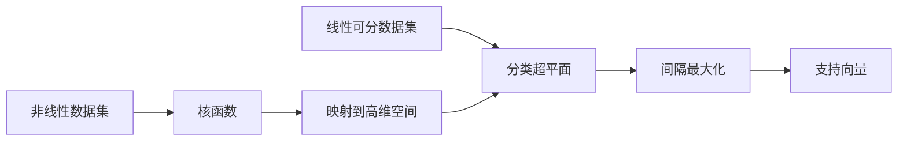

# 支持向量机(Support Vector Machines) - 原理与代码实例讲解

## 1. 背景介绍

### 1.1 机器学习的分类任务

在机器学习领域,分类是一项非常重要和常见的任务。分类的目标是根据输入样本的特征,将其划分到预先定义好的类别中。比如垃圾邮件识别、手写数字识别、图像分类等,都属于典型的分类问题。

### 1.2 经典的分类算法

为了解决分类问题,科学家们提出了许多经典的算法,例如:

- 逻辑回归(Logistic Regression)
- 朴素贝叶斯(Naive Bayes) 
- K近邻(K-Nearest Neighbor)
- 决策树(Decision Tree)
- 随机森林(Random Forest)
- 神经网络(Neural Network)

这些算法在实践中都取得了不错的效果,但它们或多或少都存在一些局限性,如对特征的线性可分性要求较高、容易受噪声干扰、计算复杂度高等。

### 1.3 支持向量机(SVM)的诞生

在上世纪90年代中期,Vapnik等人提出了一种新的机器学习算法——支持向量机(Support Vector Machines,简称SVM),它在解决小样本、非线性及高维模式识别中表现出许多特有的优势,并很快引起了机器学习界的广泛关注。

支持向量机最初是针对二分类问题提出的,它的基本模型是定义在特征空间上的间隔最大的线性分类器。后来,人们将它推广到非线性情形,使其成为处理非线性分类、回归等问题的强有力工具。

## 2. 核心概念与联系

要理解支持向量机的原理,首先需要了解几个核心概念:

### 2.1 分类超平面

在n维空间中,超平面是一个n-1维的子空间。如果数据集能被一个超平面完全正确地划分,我们称这个数据集是线性可分的。分类超平面可以用如下线性方程来描述:

$$w^Tx + b = 0$$

其中,$w=(w_1;w_2;...;w_n)$为法向量,决定了超平面的方向;$b$为位移项,决定了超平面与原点之间的距离。

### 2.2 间隔与支持向量

对于一个线性可分数据集,存在无穷个分类超平面可以将数据正确分类。支持向量机希望找到一个最优超平面,使得两类样本到超平面的最小距离最大化。这个最小距离被称为间隔。

位于间隔边界上的那些点被称为支持向量,它们满足以下条件:

$$y_i(w^Tx_i+b) = 1$$

其中,$y_i$是样本点的类标签,取值为1或-1。可以证明,最优超平面只与支持向量有关,即最优超平面可以由支持向量完全确定。

### 2.3 核函数

对于线性不可分的情况,支持向量机引入了核函数的概念。通过使用核函数,可以将原始空间中的数据映射到一个更高维的特征空间,使得样本在这个特征空间内线性可分。学习是在特征空间进行的,不需要显式地定义特征空间和映射函数,这是核函数的优势。

常用的核函数有:

- 线性核: $K(x,z) = x^Tz$
- 多项式核: $K(x,z) = (x^Tz+c)^d$  
- 高斯核(RBF): $K(x,z) = exp(-\frac{||x-z||^2}{2\sigma^2})$
- Sigmoid核: $K(x,z) = tanh(\beta x^Tz + \theta)$

下面这张图描述了上述核心概念之间的联系:

## 3. 核心算法原理具体操作步骤

### 3.1 硬间隔支持向量机

考虑一个二分类问题,训练集为$\{(x_1,y_1),(x_2,y_2),...,(x_N,y_N)\}, y_i \in \{-1,+1\}, i=1,2,...,N$。假设训练集是线性可分的,我们寻找一个最优分类超平面,使得两类样本到超平面的距离尽可能大。

优化目标可以表示为:

$$
\begin{aligned}
\max_{w,b} \quad & \frac{2}{||w||} \\
s.t. \quad & y_i(w^Tx_i+b) \geq 1, \quad i=1,2,...,N
\end{aligned}
$$

为了求解方便,我们可以等价地改写为:

$$
\begin{aligned}
\min_{w,b} \quad & \frac{1}{2}||w||^2 \\
s.t. \quad & y_i(w^Tx_i+b) \geq 1, \quad i=1,2,...,N
\end{aligned}
$$

这是一个凸二次规划问题,可以用拉格朗日乘子法求解。引入拉格朗日乘子$\alpha_i \geq 0$,定义拉格朗日函数:

$$L(w,b,\alpha) = \frac{1}{2}||w||^2 - \sum_{i=1}^N \alpha_i [y_i(w^Tx_i+b)-1]$$

根据拉格朗日对偶性,原问题可转化为等价的对偶问题:

$$
\begin{aligned}
\max_{\alpha} \quad & \sum_{i=1}^N \alpha_i - \frac{1}{2} \sum_{i=1}^N \sum_{j=1}^N \alpha_i \alpha_j y_i y_j x_i^T x_j \\
s.t. \quad & \sum_{i=1}^N \alpha_i y_i = 0 \\
      & \alpha_i \geq 0, \quad i=1,2,...,N
\end{aligned}
$$

求解出最优解$\alpha^*$后,最优分类超平面可表示为:

$$w^* = \sum_{i=1}^N \alpha_i^* y_i x_i$$

$$b^* = y_i - \sum_{i=1}^N \alpha_i^* y_i x_i^T x_j$$

分类决策函数为:

$$f(x) = sign(w^{*T}x+b^*)$$

### 3.2 软间隔支持向量机

现实中很多数据集并不是线性可分的,或者存在一些噪声点和异常点。为了处理这种情况,我们允许某些样本不满足约束条件,即在最大化间隔的同时,尽量减少分类错误。这就是软间隔支持向量机的思想。

引入松弛变量$\xi_i \geq 0$,优化目标变为:

$$
\begin{aligned}
\min_{w,b,\xi} \quad & \frac{1}{2}||w||^2 + C\sum_{i=1}^N \xi_i \\
s.t. \quad & y_i(w^Tx_i+b) \geq 1-\xi_i, \quad i=1,2,...,N \\
      & \xi_i \geq 0, \quad i=1,2,...,N
\end{aligned}
$$

其中,$C>0$是一个惩罚参数,用于控制间隔大小和分类错误的平衡。

同样地,用拉格朗日乘子法可以得到其对偶问题:

$$
\begin{aligned}
\max_{\alpha} \quad & \sum_{i=1}^N \alpha_i - \frac{1}{2} \sum_{i=1}^N \sum_{j=1}^N \alpha_i \alpha_j y_i y_j x_i^T x_j \\
s.t. \quad & \sum_{i=1}^N \alpha_i y_i = 0 \\
      & 0 \leq \alpha_i \leq C, \quad i=1,2,...,N
\end{aligned}
$$

求解过程与硬间隔支持向量机类似。

### 3.3 非线性支持向量机

对于非线性分类问题,我们利用核函数将原始数据映射到高维空间,然后在高维空间中构造最优分类超平面。

设$\phi(x)$表示从原始空间到高维特征空间的映射,则分类超平面可表示为:

$$w^T\phi(x)+b=0$$

相应的对偶问题变为:

$$
\begin{aligned}
\max_{\alpha} \quad & \sum_{i=1}^N \alpha_i - \frac{1}{2} \sum_{i=1}^N \sum_{j=1}^N \alpha_i \alpha_j y_i y_j K(x_i,x_j) \\
s.t. \quad & \sum_{i=1}^N \alpha_i y_i = 0 \\
      & 0 \leq \alpha_i \leq C, \quad i=1,2,...,N
\end{aligned}
$$

其中,$K(x_i,x_j)=\phi(x_i)^T\phi(x_j)$是核函数。求解出$\alpha^*$后,分类决策函数为:

$$f(x) = sign(\sum_{i=1}^N \alpha_i^* y_i K(x_i,x) + b^*)$$

常见的核函数如前面所述。

## 4. 数学模型和公式详细讲解举例说明

这里我们以一个简单的二维例子来详细说明支持向量机的数学模型和公式。

假设有如下训练集:

$x_1=(1,2), \quad y_1=+1$
$x_2=(2,3), \quad y_2=+1$ 
$x_3=(3,3), \quad y_3=-1$
$x_4=(2,1), \quad y_4=-1$

### 4.1 构造并求解优化问题

根据硬间隔支持向量机的优化目标,我们可以写出如下优化问题:

$$
\begin{aligned}
\min_{w,b} \quad & \frac{1}{2}(w_1^2+w_2^2) \\
s.t. \quad & w_1+2w_2+b \geq 1 \\
      & 2w_1+3w_2+b \geq 1 \\
      & 3w_1+3w_2+b \leq -1 \\
      & 2w_1+w_2+b \leq -1
\end{aligned}
$$

引入拉格朗日乘子$\alpha_1,\alpha_2,\alpha_3,\alpha_4$,写出拉格朗日函数:

$$
\begin{aligned}
L(w,b,\alpha) = & \frac{1}{2}(w_1^2+w_2^2) - \alpha_1(w_1+2w_2+b-1) - \alpha_2(2w_1+3w_2+b-1) \\
& + \alpha_3(3w_1+3w_2+b+1) + \alpha_4(2w_1+w_2+b+1)
\end{aligned}
$$

对偶问题为:

$$
\begin{aligned}
\max_{\alpha} \quad & \alpha_1+\alpha_2+\alpha_3+\alpha_4 - \frac{1}{2}(\alpha_1+2\alpha_2-3\alpha_3-2\alpha_4)^2 - \frac{1}{2}(2\alpha_1+3\alpha_2-3\alpha_3-\alpha_4)^2 \\
s.t. \quad & \alpha_1-\alpha_2+\alpha_3-\alpha_4=0 \\
      & \alpha_i \geq 0, \quad i=1,2,3,4
\end{aligned}
$$

用数值优化方法(如SMO算法)求解上述问题,得到最优解:

$\alpha_1^*=1, \alpha_2^*=1, \alpha_3^*=2, \alpha_4^*=0$

### 4.2 求最优分类超平面

将最优解$\alpha^*$代入,得到最优权向量:

$$w^* = (\alpha_1^*+2\alpha_2^*-3\alpha_3^*-2\alpha_4^*, 2\alpha_1^*+3\alpha_2^*-3\alpha_3^*-\alpha_4^*) = (2,3)$$

选择任意一个支持向量,如$x_1=(1,2)$,代入求解$b^*$:

$$b^* = 1 - w^{*T}x_1 = 1 - (2,3) \cdot (1,2) = -6$$

因此,最优分类超平面为:

$$2x_1 + 3x_2 - 6 = 0$$

分类决策函数为:

$$f(x) = sign(2x_1+3x_2-6)$$

### 4.3 非线性情形

如果将上面的例子改为:

$x_1=(1,1), \quad y_1=+1$
$x_2=(0,0), \quad y_2=+1$ 
$x_3=(1,0), \quad y_3=-1$
$x_4=(0,1), \quad y_4=-1$

这时数据集在原始空间内线性不可分。我们可以使用核函数将其映射到高维空间。例如