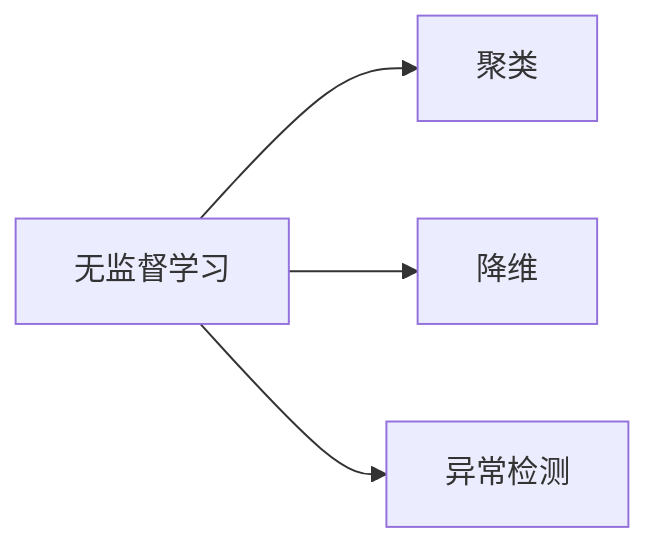

## 1.背景介绍

无监督学习是机器学习的一种主要类型，它的目标是从无标签的数据中学习到数据的内在结构和分布。无监督学习不依赖于预先标记的数据，因此在处理大量数据时具有明显的优势。本文将深入探讨无监督学习的原理，并通过实际代码案例进行讲解。

## 2.核心概念与联系

无监督学习的核心概念包括聚类（Clustering）、降维（Dimensionality Reduction）和异常检测（Anomaly Detection）等。这些概念之间的联系在于，它们都是通过学习数据的内在结构和分布，来理解和揭示数据的特性。



## 3.核心算法原理具体操作步骤

### 3.1 聚类

聚类是无监督学习的一种重要技术，它的目标是将数据集划分为几个组或“簇”，使得同一簇内的数据点彼此相似，而不同簇的数据点彼此不同。常见的聚类算法有K-means、层次聚类等。

### 3.2 降维

降维是另一种重要的无监督学习技术，它的目标是将高维数据转化为低维数据，同时保留尽可能多的信息。常见的降维方法有主成分分析（PCA）、t-分布邻域嵌入算法（t-SNE）等。

### 3.3 异常检测

异常检测是无监督学习的另一个重要应用，它的目标是识别出数据中的异常点或离群点。常见的异常检测算法有孤立森林（Isolation Forest）、一类支持向量机（One-class SVM）等。

## 4.数学模型和公式详细讲解举例说明

### 4.1 K-means聚类

K-means聚类的目标是最小化每个簇内部的平方误差。假设我们有$n$个数据点$x_1, x_2, ..., x_n$，并且我们将这些数据点划分为$k$个簇$C_1, C_2, ..., C_k$，那么K-means聚类的目标函数可以表示为：

$$
J = \sum_{i=1}^{k}\sum_{x \in C_i}||x - \mu_i||^2
$$

其中，$\mu_i$是簇$C_i$的中心点，$||x - \mu_i||^2$表示数据点$x$到中心点$\mu_i$的欧氏距离的平方。

### 4.2 主成分分析

主成分分析（PCA）的目标是找到一个新的坐标系，使得数据在这个坐标系下的方差最大。假设我们有一个$n \times d$的数据矩阵$X$，我们希望将数据降维到$k$维（$k<d$），那么PCA的目标函数可以表示为：

$$
W^* = \arg\max_W{||XW||_F^2}
$$

其中，$W$是一个$d \times k$的矩阵，$||XW||_F^2$表示矩阵$XW$的Frobenius范数的平方。

## 5.项目实践：代码实例和详细解释说明

在这一部分，我们将使用Python的Scikit-learn库来实现K-means聚类和PCA降维。

### 5.1 K-means聚类

首先，我们生成一些随机数据：

```python
from sklearn.datasets import make_blobs
X, y = make_blobs(n_samples=300, centers=4, random_state=0, cluster_std=0.60)
```

然后，我们使用K-means算法进行聚类：

```python
from sklearn.cluster import KMeans
kmeans = KMeans(n_clusters=4)
kmeans.fit(X)
```

最后，我们可以使用以下代码来显示聚类结果：

```python
import matplotlib.pyplot as plt
plt.scatter(X[:, 0], X[:, 1], c=kmeans.labels_)
plt.show()
```

### 5.2 PCA降维

首先，我们生成一些高维数据：

```python
from sklearn.datasets import make_blobs
X, y = make_blobs(n_samples=300, centers=4, random_state=0, cluster_std=0.60)
```

然后，我们使用PCA算法进行降维：

```python
from sklearn.decomposition import PCA
pca = PCA(n_components=2)
X_pca = pca.fit_transform(X)
```

最后，我们可以使用以下代码来显示降维后的数据：

```python
import matplotlib.pyplot as plt
plt.scatter(X_pca[:, 0], X_pca[:, 1], c=y)
plt.show()
```

## 6.实际应用场景

无监督学习在许多实际应用中都有重要的作用。例如，聚类技术可以用于客户分群，以便企业可以根据不同群体的特性制定不同的营销策略；降维技术可以用于高维数据的可视化，帮助我们更好地理解数据的结构；异常检测技术可以用于信用卡欺诈检测，帮助银行识别并阻止欺诈交易。

## 7.工具和资源推荐

对于无监督学习的实践，我推荐以下工具和资源：

- Scikit-learn：一个强大的Python机器学习库，包含了许多无监督学习的算法。
- TensorFlow：一个强大的深度学习框架，可以用于实现更复杂的无监督学习模型，如自编码器和生成对抗网络。
- UCI Machine Learning Repository：包含了许多公开的数据集，可以用于无监督学习的实践。

## 8.总结：未来发展趋势与挑战

无监督学习是机器学习的一个重要领域，它的未来发展趋势包括深度无监督学习、无监督学习的可解释性研究等。然而，无监督学习也面临着许多挑战，例如如何有效地评估无监督学习的性能、如何处理大规模和高维的数据等。

## 9.附录：常见问题与解答

Q: 无监督学习和有监督学习有什么区别？

A: 无监督学习和有监督学习的主要区别在于，无监督学习不依赖于预先标记的数据，而有监督学习则需要预先标记的数据。

Q: K-means聚类的K值应该如何选择？

A: K-means聚类的K值通常通过实验来确定，常用的方法包括肘部法则和轮廓系数。

Q: PCA降维后的数据还能恢复原来的数据吗？

A: PCA降维是一种有损的降维方法，也就是说，降维后的数据无法完全恢复到原来的数据。

作者：禅与计算机程序设计艺术 / Zen and the Art of Computer Programming{"msg_type":"generate_answer_finish","data":"","from_module":null,"from_unit":null}