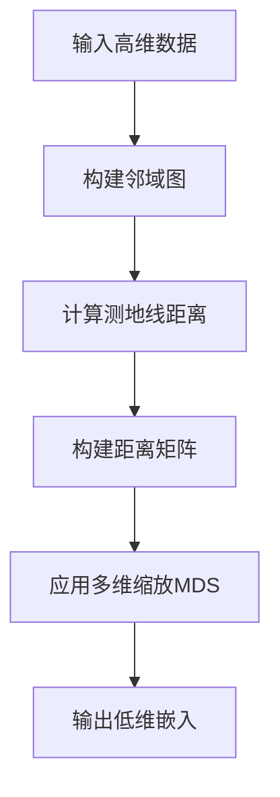
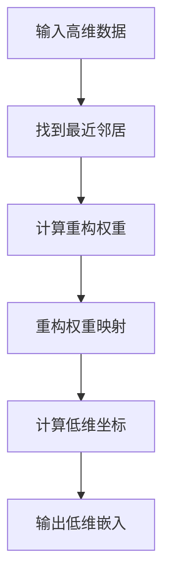

# 流形学习在生产计划优化中的应用

## 1.背景介绍

在当今快节奏的制造业环境中,生产计划优化是一个关键的挑战。传统的生产计划方法通常依赖于线性规划或启发式算法,这些方法在处理高维、非线性和复杂的约束条件时存在局限性。流形学习(Manifold Learning)作为一种新兴的非线性降维技术,已被证明在处理高维数据方面具有显著优势,因此在生产计划优化领域具有广阔的应用前景。

## 2.核心概念与联系

### 2.1 流形学习概述

流形学习是一种将高维数据嵌入到低维空间的技术,同时保留数据的本征结构和拓扑特征。它基于这样一个假设:高维观测数据实际上躺在一个低维流形(Manifold)上。通过学习这个低维流形的结构,我们可以发现数据的本质特征,从而实现有效的降维。

常见的流形学习算法包括等度量映射(Isomap)、局部线性嵌入(LLE)、拉普拉斯特征映射(Laplacian Eigenmaps)等。这些算法通过不同的方式捕捉数据的局部和全局结构,从而实现降维和可视化。

### 2.2 生产计划优化问题

生产计划优化是一个复杂的组合优化问题,旨在确定产品的生产时间、数量和顺序,以最大限度地提高资源利用率、缩短生产周期并满足各种约束条件。这些约束条件可能包括机器可用性、原材料供应、交货期限等。

传统的生产计划优化方法通常基于线性规划或启发式算法,但它们在处理高维、非线性和复杂约束条件时存在局限性。此外,制造数据通常具有高维、非线性和噪声等特征,这进一步增加了优化难度。

### 2.3 流形学习与生产计划优化的联系

将流形学习应用于生产计划优化,可以帮助我们有效地处理高维、非线性的制造数据。通过将数据嵌入到低维流形空间,我们可以发现数据的本质结构和模式,从而简化优化问题并提高求解效率。

此外,流形学习还可以用于数据可视化和异常检测,这对于监控生产过程和识别潜在问题至关重要。通过将高维数据投影到低维空间,我们可以直观地观察数据的分布和聚类结构,从而发现异常值和异常模式。

## 3.核心算法原理具体操作步骤

在介绍具体的流形学习算法之前,我们先来了解一些基本概念。

### 3.1 基本概念

- **流形(Manifold)**: 一个流形是一个局部类似于欧几里德空间的拓扑空间。简单地说,流形就是一个可以局部线性化的空间。
- **维数(Dimensionality)**: 流形的维数指的是该流形在局部线性化后所处的欧几里德空间的维数。
- **内在维数(Intrinsic Dimensionality)**: 内在维数指的是生成观测数据的底层流形的维数,通常远小于数据的原始维数。
- **等度量映射(Isometric Mapping)**: 等度量映射是指保持距离不变的映射。

接下来,我们将介绍两种流行的流形学习算法:等度量映射(Isomap)和局部线性嵌入(LLE)。

### 3.2 等度量映射(Isomap)

等度量映射(Isomap)算法的核心思想是:将高维数据投影到一个低维空间,同时保持数据点之间的测地线距离(沿着流形曲面的最短距离)不变。算法步骤如下:

1. **构建邻域图**: 对于每个数据点,找到它的 k 个最近邻居,并在它们之间构建边。
2. **计算测地线距离**: 计算每对数据点之间的测地线距离,即在邻域图上的最短路径距离。
3. **构建距离矩阵**: 将计算得到的测地线距离存储在距离矩阵中。
4. **应用多维缩放(MDS)**: 对距离矩阵应用经典的多维缩放(Classical MDS)算法,将数据投影到低维空间。

Isomap 算法的优点是能够很好地保持数据的全局结构,但是对于高维数据和复杂流形,计算测地线距离的代价会很高。

### 3.3 局部线性嵌入(LLE)

与 Isomap 关注全局结构不同,局部线性嵌入(LLE)算法着重于保留数据的局部线性结构。算法步骤如下:

1. **找到最近邻居**: 对于每个数据点,找到它的 k 个最近邻居。
2. **计算重构权重**: 对于每个数据点,使用最小二乘法计算其最近邻居的线性重构权重,使得该数据点可以被其邻居的线性组合很好地近似。
3. **重构权重映射**: 将上一步计算得到的重构权重映射到低维空间,使得在低维空间中,每个数据点也可以被其低维邻居的线性组合很好地近似。
4. **计算低维坐标**: 通过最小化映射后的重构误差,求解每个数据点在低维空间中的坐标。

LLE 算法的优点是计算效率较高,能够很好地保留数据的局部线性结构。但是,它对于处理非线性流形的能力相对较弱。

## 4.数学模型和公式详细讲解举例说明

在这一节,我们将详细讨论流形学习算法中涉及的数学模型和公式。

### 4.1 等度量映射(Isomap)

#### 4.1.1 测地线距离

在 Isomap 算法中,关键步骤是计算数据点之间的测地线距离。测地线距离定义为:在流形曲面上连接两点的最短路径长度。形式化地,对于流形 $\mathcal{M}$ 上的两点 $x, y \in \mathcal{M}$,它们之间的测地线距离 $d_\mathcal{M}(x, y)$ 定义为:

$$d_\mathcal{M}(x, y) = \inf_\gamma \int_0^1 \left\|\gamma'(t)\right\| dt$$

其中 $\gamma: [0, 1] \rightarrow \mathcal{M}$ 是连接 $x$ 和 $y$ 的所有可微路径的集合,并且 $\gamma'(t)$ 表示路径 $\gamma$ 在 $t$ 处的切向量。

在实践中,我们无法直接计算测地线距离,因为流形的结构是未知的。相反,我们可以使用邻域图上的最短路径距离来近似测地线距离。具体地,对于每对数据点 $x_i$ 和 $x_j$,我们构建一个邻域图 $G = (V, E)$,其中 $V$ 是数据点的集合,如果 $x_i$ 和 $x_j$ 是彼此的 $k$ 近邻,则在 $E$ 中加入一条边 $(x_i, x_j)$,边的权重为欧几里德距离 $\|x_i - x_j\|$。然后,我们计算邻域图上 $x_i$ 和 $x_j$ 之间的最短路径距离,作为它们之间测地线距离的近似值。

#### 4.1.2 多维缩放(MDS)

在计算出测地线距离矩阵后,Isomap 算法使用经典的多维缩放(Classical MDS)将数据投影到低维空间。多维缩放的目标是找到一组低维坐标 $\{y_1, y_2, \ldots, y_n\}$,使得它们之间的欧几里德距离 $\|y_i - y_j\|$ 尽可能接近对应的测地线距离 $d_\mathcal{M}(x_i, x_j)$。

具体地,多维缩放通过最小化以下应力函数(Stress)来实现:

$$\text{Stress}(Y) = \sum_{i<j} \left(d_\mathcal{M}(x_i, x_j) - \|y_i - y_j\|\right)^2$$

其中 $Y = [y_1, y_2, \ldots, y_n]^\top$ 是低维坐标矩阵。

多维缩放的解可以通过对距离矩阵进行特征值分解得到。具体地,我们首先将距离矩阵 $D$ 中心化,得到矩阵 $B = -\frac{1}{2}HDH$,其中 $H = I - \frac{1}{n}11^\top$ 是中心化矩阵。然后,对 $B$ 进行特征值分解:$B = U\Lambda U^\top$。最后,低维坐标矩阵 $Y$ 可以由前 $d$ 个最大特征值对应的特征向量构成:$Y = \Lambda_d^{1/2}U_d^\top$,其中 $d$ 是期望的目标维数。

### 4.2 局部线性嵌入(LLE)

#### 4.2.1 重构权重

在 LLE 算法中,关键步骤是计算每个数据点的重构权重。对于数据点 $x_i$,我们希望找到一组权重 $\{w_{ij}\}$,使得 $x_i$ 可以被其 $k$ 个最近邻居的线性组合很好地近似:

$$x_i \approx \sum_{j \in \mathcal{N}(i)} w_{ij}x_j$$

其中 $\mathcal{N}(i)$ 表示 $x_i$ 的 $k$ 个最近邻居的索引集合。

为了求解权重 $\{w_{ij}\}$,我们可以通过最小化以下重构误差:

$$\min_W \sum_i \left\|x_i - \sum_{j \in \mathcal{N}(i)} w_{ij}x_j\right\|^2 \quad \text{s.t. } \sum_{j \in \mathcal{N}(i)} w_{ij} = 1$$

其中 $W = [w_{ij}]$ 是权重矩阵。通过引入拉格朗日乘子,上述优化问题可以转化为求解线性方程组:

$$\left(I - \frac{1}{k}11^\top\right)X^\top X\left(I - \frac{1}{k}11^\top\right)W = \left(I - \frac{1}{k}11^\top\right)X^\top X$$

其中 $X = [x_1, x_2, \ldots, x_n]^\top$ 是数据矩阵,并且约束 $\sum_j w_{ij} = 1$ 已经被纳入线性方程组中。

#### 4.2.2 重构权重映射

在计算出重构权重矩阵 $W$ 后,LLE 算法将这些权重映射到低维空间,使得在低维空间中,每个数据点也可以被其低维邻居的线性组合很好地近似。具体地,我们希望找到一组低维坐标 $\{y_1, y_2, \ldots, y_n\}$,使得:

$$y_i \approx \sum_{j \in \mathcal{N}(i)} w_{ij}y_j$$

为了求解低维坐标 $\{y_i\}$,我们需要最小化以下映射误差:

$$\min_Y \sum_i \left\|y_i - \sum_{j \in \mathcal{N}(i)} w_{ij}y_j\right\|^2$$

其中 $Y = [y_1, y_2, \ldots, y_n]^\top$ 是低维坐标矩阵。

通过引入适当的约束(例如去中心化约束),上述优化问题可以转化为求解一个稀疏特征值问题。具体地,我们需要求解以下广义特征值问题:

$$(I - W)^\top(I - W)Y = \Lambda Y$$

其中 $\Lambda$ 是一个对角矩阵,对角线元素为特征值。最后,我们取对应于最小 $d$ 个非零特征值的特征向量,构成低维坐标矩阵 $Y$。

### 4.3 示例:使用 Isomap 可视化瑞士