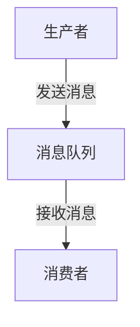

## 1. 背景介绍

在当今的分布式系统中，消息队列已经成为一种不可或缺的技术。消息队列是一种在进程间或者在分布式系统间进行通信的机制，主要用于异步处理，缓冲处理大量消息，以及实现系统解耦。在这篇文章中，我们将深入探讨消息队列的原理，并通过代码实例进行详细讲解。

## 2. 核心概念与联系

在深入讲解消息队列之前，我们需要先理解以下几个核心概念：

- **生产者（Producer）**：生产者是消息的发送者，它创建并发送消息到消息队列。

- **消费者（Consumer）**：消费者是消息的接收者，它从消息队列中获取并处理消息。

- **消息队列（Message Queue）**：消息队列是一种数据结构，可以存储待处理的消息。生产者将消息发送到队列，消费者从队列中获取消息进行处理。

- **消息（Message）**：消息是在生产者和消费者之间传送的数据。一条消息可以包含任何类型的数据，这取决于生产者和消费者如何解析消息。

- **队列（Queue）**：队列是一种特殊的线性表，它只允许在表的前端（front）进行删除操作，在表的后端（rear）进行插入操作。

在消息队列中，生产者和消费者通过消息进行通信，生产者将消息放入队列，消费者从队列中取出消息。



## 3. 核心算法原理具体操作步骤

消息队列的核心原理可以分为以下四步：

1. **生产者创建消息**：生产者根据需要创建消息，消息可以包含任意数据。

2. **生产者发送消息**：生产者将创建的消息发送到消息队列，消息被放入队列的尾部。

3. **消费者获取消息**：消费者从消息队列的头部获取消息，如果队列为空，则消费者需要等待。

4. **消费者处理消息**：消费者获取到消息后，对消息进行处理。

这四个步骤循环执行，直到所有的消息都被处理完。

## 4. 数学模型和公式详细讲解举例说明

在消息队列中，我们可以使用一些数学模型和公式来描述和优化系统的性能。例如，我们可以使用排队论（Queueing Theory）来分析和优化消息队列的性能。

排队论是一种数学方法，用于分析排队系统的性能。在消息队列中，生产者和消费者就像是服务台，消息就像是客户，消息队列就像是等待区。

我们可以使用以下公式来描述系统的性能：

- **平均等待时间（W）**：平均等待时间是每条消息在队列中等待的平均时间。它可以通过到达率（λ）和服务率（μ）来计算，公式为：$W = \frac{1}{μ - λ}$。

- **平均队列长度（L）**：平均队列长度是队列中消息的平均数量。它可以通过到达率（λ）和平均等待时间（W）来计算，公式为：$L = λ * W$。

通过这些公式，我们可以分析和优化消息队列的性能。

## 5. 项目实践：代码实例和详细解释说明

接下来，我们将通过一个简单的Java代码示例来说明如何使用消息队列。在这个示例中，我们将使用Java内置的`ArrayBlockingQueue`类来实现一个简单的消息队列。

```java
import java.util.concurrent.ArrayBlockingQueue;

public class MessageQueue {
    private ArrayBlockingQueue<String> queue = new ArrayBlockingQueue<>(100);

    public void produce(String msg) throws InterruptedException {
        queue.put(msg);
    }

    public String consume() throws InterruptedException {
        return queue.take();
    }
}
```

在这个示例中，我们创建了一个`MessageQueue`类，它有两个方法：`produce`和`consume`。`produce`方法用于生产消息，`consume`方法用于消费消息。我们使用`ArrayBlockingQueue`的`put`方法和`take`方法来实现消息的生产和消费。

## 6. 实际应用场景

消息队列在许多实际应用场景中都有应用，例如：

- **异步处理**：如果一个操作需要很长时间才能完成，我们可以将这个操作作为一个消息发送到消息队列，然后让一个消费者在后台处理这个消息。

- **系统解耦**：如果两个系统需要进行通信，我们可以使用消息队列作为中间件，这样两个系统就不需要直接通信。

- **负载均衡**：如果一个系统的负载过高，我们可以使用消息队列来分摊负载。我们可以将请求作为消息发送到消息队列，然后让多个消费者并行处理这些消息。

## 7. 工具和资源推荐

以下是一些常用的消息队列工具和资源：

- **RabbitMQ**：RabbitMQ是一个开源的消息队列系统，它支持多种消息协议，可以在多种环境中运行。

- **Kafka**：Kafka是一个分布式的流处理平台，它可以处理实时数据流，也可以用作消息队列。

- **ActiveMQ**：ActiveMQ是一个开源的消息队列系统，它支持JMS和其他消息协议。

- **Amazon SQS**：Amazon SQS是Amazon提供的一种全托管的消息队列服务，它可以在AWS环境中运行。

## 8. 总结：未来发展趋势与挑战

随着分布式系统和微服务的发展，消息队列的重要性越来越高。未来，我们将看到更多的消息队列系统出现，它们将支持更多的消息协议，提供更高的性能，更强的可用性和更好的可扩展性。

然而，消息队列也面临一些挑战，例如如何保证消息的顺序性，如何处理消息的重复性，如何保证消息的可靠性等。这些问题需要我们在实践中不断探索和解决。

## 9. 附录：常见问题与解答

- **Q：消息队列为什么可以提高系统的性能？**

  A：消息队列可以缓冲大量的消息，这样生产者和消费者就可以在不同的速度下工作。此外，消息队列可以将消息分发到多个消费者，这样可以并行处理消息，提高系统的性能。

- **Q：消息队列如何保证消息的顺序性？**

  A：在某些消息队列系统中，我们可以使用优先级队列来保证消息的顺序性。此外，我们也可以在消息中添加一个时间戳，然后让消费者按照时间戳的顺序处理消息。

- **Q：消息队列如何处理消息的重复性？**

  A：在某些消息队列系统中，我们可以使用消息的唯一标识来处理消息的重复性。当消费者收到一个消息时，它可以检查这个消息是否已经处理过，如果已经处理过，那么就忽略这个消息。

作者：禅与计算机程序设计艺术 / Zen and the Art of Computer Programming