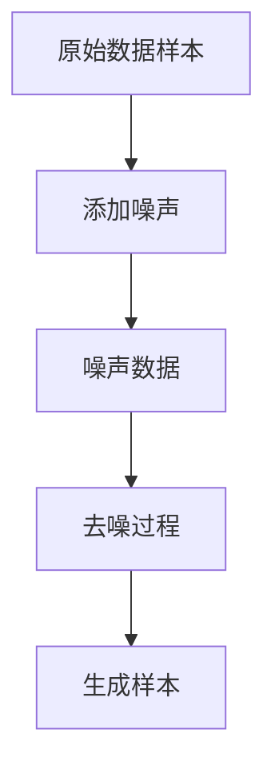

# 潜在扩散模型Latent Diffusion Model原理与代码实例讲解

## 1.背景介绍

### 1.1 生成式人工智能的崛起

近年来,生成式人工智能(Generative AI)技术取得了突破性进展,引领了人工智能领域的新浪潮。生成式AI旨在从数据中学习模式,并基于这些模式生成新的、前所未见的内容,如图像、音频、视频和文本等。这一领域的发展为创造性工作带来了巨大机遇,同时也带来了诸多挑战。

### 1.2 生成对抗网络的局限性

生成对抗网络(Generative Adversarial Networks, GANs)是生成式AI的代表技术,但它存在训练不稳定、模式崩溃等问题,难以生成高分辨率和高质量的图像。为了克服GAN的局限性,扩散模型(Diffusion Models)应运而生,并取得了令人瞩目的成就。

### 1.3 扩散模型的兴起

扩散模型是一种基于逆向扩散过程的生成模型,能够学习数据的潜在分布,并从该分布中高质量地生成新样本。与GAN相比,扩散模型更加稳定,生成质量更高,并且可以灵活地生成各种形式的数据,如图像、音频和3D点云等。扩散模型的出现为生成式AI开辟了新的发展道路。

## 2.核心概念与联系

### 2.1 扩散过程

扩散过程是扩散模型的核心概念。它模拟了一个将数据逐步破坏为噪声的过程,通过添加高斯噪声逐步破坏原始数据样本。这个过程可以被视为一个由一系列噪声级别(noise levels)组成的链,其中每个噪声级别对应一个条件概率分布。

### 2.2 逆向扩散过程

逆向扩散过程是扩散模型的关键,它试图学习从纯噪声中重建原始数据样本的过程。模型通过学习每个噪声级别的条件概率分布,从而能够从任意噪声级别开始,逐步去噪并最终生成所需的样本。



### 2.3 马尔可夫链与潜在空间

扩散过程可以被视为一个马尔可夫链,其中每个状态对应一个噪声级别。通过学习这个马尔可夫链的转移概率,模型可以在潜在空间(latent space)中操作,从而实现高质量的样本生成。

### 2.4 前向扩散与后向扩散

前向扩散过程是将原始数据逐步破坏为噪声,而后向扩散过程则是从噪声中重建原始数据。前向过程是一个固定的、不需要学习的过程,而后向过程则需要通过训练来学习。

## 3.核心算法原理具体操作步骤

扩散模型的核心算法原理可以分为以下几个步骤:

### 3.1 前向扩散过程

1) 定义一个由 `T` 个噪声级别组成的扩散链,每个噪声级别对应一个高斯噪声的方差 $\beta_t$。
2) 从数据分布 $q(x_0)$ 中采样原始数据样本 $x_0$。
3) 对于每个时间步 $t=1,2,...,T$,根据条件概率 $q(x_t|x_{t-1})$ 生成噪声数据 $x_t$。

$$
q(x_t|x_{t-1}) = \mathcal{N}(x_t;\sqrt{1-\beta_t}x_{t-1},\beta_tI)
$$

其中 $\mathcal{N}(\mu,\Sigma)$ 表示均值为 $\mu$,协方差为 $\Sigma$ 的高斯分布。

4) 在时间步 $T$,我们得到纯噪声数据 $x_T \sim \mathcal{N}(0,I)$。

### 3.2 后向扩散过程

1) 定义一个逆向模型 $p_\theta(x_{t-1}|x_t)$,用于从噪声数据 $x_t$ 中重建 $x_{t-1}$。
2) 训练逆向模型,使其能够最小化从噪声数据 $x_T$ 重建原始数据 $x_0$ 的负对数似然:

$$
\mathcal{L}(\theta) = \mathbb{E}_{x_0,\epsilon}\left[\left\|x_0 - x_T^{(pred)}\right\|^2\right]
$$

其中 $x_T^{(pred)}$ 是通过逆向模型从 $x_T$ 生成的预测数据。

3) 在采样时,从纯噪声 $x_T \sim \mathcal{N}(0,I)$ 开始,使用训练好的逆向模型逐步去噪,生成所需的样本。

$$
x_{t-1}^{(pred)} = \frac{1}{\sqrt{\alpha_t}}\left(x_t - \frac{\beta_t}{\sqrt{1-\overline{\alpha}_t}}\epsilon_\theta(x_t,t)\right) + \sigma_t\epsilon
$$

其中 $\alpha_t = 1 - \beta_t$, $\overline{\alpha}_t = \prod_{s=1}^t\alpha_s$, $\sigma_t^2 = \beta_t(1 - \overline{\alpha}_{t-1})/\overline{\alpha}_t(1 - \overline{\alpha}_t)$, $\epsilon_\theta$ 是逆向模型的输出。

## 4.数学模型和公式详细讲解举例说明

### 4.1 扩散过程的数学表示

扩散过程可以用一个由 `T` 个噪声级别组成的马尔可夫链来表示,其中每个状态 $x_t$ 对应一个噪声级别。该过程由条件概率分布 $q(x_t|x_{t-1})$ 定义,表示从状态 $x_{t-1}$ 转移到状态 $x_t$ 的概率。

在扩散模型中,我们采用了一种特殊的转移概率分布:

$$
q(x_t|x_{t-1}) = \mathcal{N}(x_t;\sqrt{1-\beta_t}x_{t-1},\beta_tI)
$$

其中 $\beta_t$ 是一个预定义的噪声方差序列,控制了每个时间步添加的噪声量。在时间步 $t=0$ 时,我们有 $x_0 \sim q(x_0)$,表示原始数据分布。随着时间步的增加,数据样本 $x_t$ 会变得越来越接近纯噪声分布 $\mathcal{N}(0,I)$。

为了更好地理解这个过程,让我们来看一个具体的例子。假设我们有一个 $4 \times 4$ 的灰度图像,其像素值在 $[0,1]$ 范围内。我们定义一个由 $T=10$ 个噪声级别组成的扩散链,噪声方差序列为 $\beta_1=0.0001, \beta_2=0.0004, \beta_3=0.0009, ..., \beta_{10}=0.9$。

在时间步 $t=0$ 时,我们有原始图像 $x_0$。在时间步 $t=1$ 时,根据条件概率 $q(x_1|x_0)$,我们会在原始图像上添加一些微小的高斯噪声,得到 $x_1$。随着时间步的增加,图像会变得越来越模糊,直到在时间步 $t=10$ 时,我们得到一个纯噪声图像 $x_{10}$。

### 4.2 逆向扩散过程的数学表示

逆向扩散过程的目标是学习一个模型 $p_\theta(x_{t-1}|x_t)$,用于从噪声数据 $x_t$ 中重建 $x_{t-1}$。这个模型通常是一个神经网络,参数为 $\theta$。

为了训练这个模型,我们需要最小化从纯噪声数据 $x_T$ 重建原始数据 $x_0$ 的负对数似然:

$$
\mathcal{L}(\theta) = \mathbb{E}_{x_0,\epsilon}\left[\left\|x_0 - x_T^{(pred)}\right\|^2\right]
$$

其中 $x_T^{(pred)}$ 是通过逆向模型从 $x_T$ 生成的预测数据。

在采样时,我们从纯噪声 $x_T \sim \mathcal{N}(0,I)$ 开始,使用训练好的逆向模型逐步去噪,生成所需的样本。具体来说,在每个时间步 $t$,我们根据以下公式更新预测值:

$$
x_{t-1}^{(pred)} = \frac{1}{\sqrt{\alpha_t}}\left(x_t - \frac{\beta_t}{\sqrt{1-\overline{\alpha}_t}}\epsilon_\theta(x_t,t)\right) + \sigma_t\epsilon
$$

其中 $\alpha_t = 1 - \beta_t$, $\overline{\alpha}_t = \prod_{s=1}^t\alpha_s$, $\sigma_t^2 = \beta_t(1 - \overline{\alpha}_{t-1})/\overline{\alpha}_t(1 - \overline{\alpha}_t)$, $\epsilon_\theta$ 是逆向模型的输出,表示模型对 $x_{t-1}$ 的预测误差。

通过这种方式,我们可以从纯噪声 $x_T$ 逐步去噪,最终生成高质量的样本 $x_0^{(pred)}$。

### 4.3 扩散模型的变体

除了上述基本的扩散模型外,还存在一些变体,如:

- DDPM (Denoising Diffusion Probabilistic Models): 使用离散时间扩散过程,并采用 U-Net 作为逆向模型。
- DDIM (Denoising Diffusion Implicit Models): 通过重新参数化技巧,显著加速采样过程。
- Latent Diffusion: 在潜在空间进行扩散和去噪,以提高效率和质量。
- Stable Diffusion: 一种基于 Latent Diffusion 的大型扩散模型,可以生成高质量的图像。

这些变体在不同方面对基本扩散模型进行了改进,扩展了其应用范围。

## 5.项目实践:代码实例和详细解释说明

为了更好地理解扩散模型,我们将通过一个简单的示例来实现一个基本的扩散模型。在这个示例中,我们将使用 PyTorch 框架,并基于 MNIST 手写数字数据集进行训练和采样。

### 5.1 导入必要的库

```python
import torch
import torch.nn as nn
import torch.nn.functional as F
from torchvision import datasets, transforms
```

### 5.2 定义扩散过程

我们首先定义扩散过程的参数,包括噪声级别数 `T` 和噪声方差序列 `betas`。

```python
T = 1000  # 噪声级别数
betas = torch.linspace(1e-4, 0.02, T)  # 噪声方差序列
```

接下来,我们定义一个函数 `q_sample`,用于根据条件概率分布 `q(x_t|x_{t-1})` 生成噪声数据。

```python
def q_sample(x_0, t, noise=None):
    if noise is None:
        noise = torch.randn_like(x_0)
    
    sqrt_alpha_prod = torch.sqrt(betas).cumprod(dim=0)
    sqrt_one_minus_alpha_prod = torch.sqrt(1 - betas).cumprod(dim=0)
    
    mean = sqrt_alpha_prod[t] * x_0
    std = sqrt_one_minus_alpha_prod[t]
    
    x_t = mean + std * noise
    return x_t
```

### 5.3 定义逆向模型

我们使用一个简单的全连接神经网络作为逆向模型,其输入为噪声数据 `x_t` 和时间步 `t`,输出为预测误差 `epsilon`。

```python
class DenoisingModel(nn.Module):
    def __init__(self, in_channels, out_channels):
        super().__init__()
        self.net = nn.Sequential(
            nn.Linear(in_channels + 1, 128),
            nn.ReLU(),
            nn.Linear(128, 128),
            nn.ReLU(),
            nn.Linear(128, out_channels)
        )
    
    def forward(self, x, t):
        t = t.unsqueeze(1).repeat(1, x.shape[1])
        x = torch.cat([x, t], dim=1)
        return self.net(x)
```

### 5.4 训练逆向模型

我们定义训练函数 `train_step`,用于在每个批次上更新模型参数。

```python