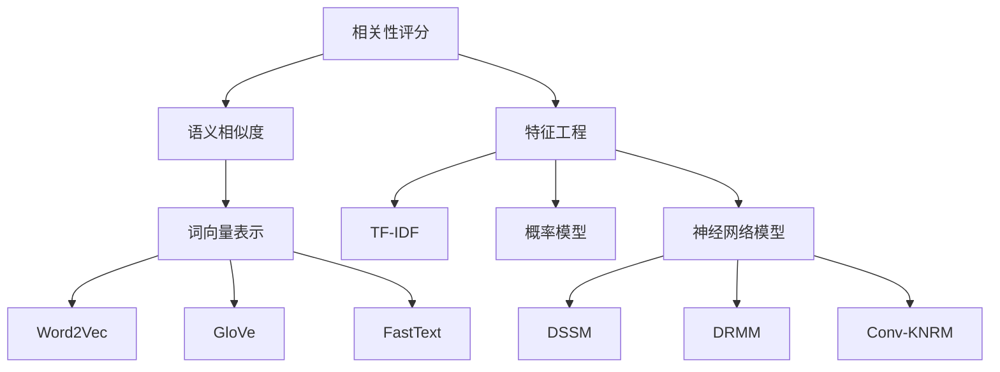

# 相关性评分 原理与代码实例讲解

## 1.背景介绍

在现代信息时代,海量数据的存在使得信息检索和排序变得至关重要。相关性评分是信息检索系统中不可或缺的一个环节,它旨在根据用户的查询和文档内容,计算查询与文档之间的相关程度,并对结果进行排序,从而为用户提供最相关的信息。无论是网页搜索、电商产品推荐,还是个性化新闻推送,相关性评分都扮演着关键角色。

## 2.核心概念与联系

### 2.1 词向量与语义相似度

相关性评分的核心是捕捉查询和文档之间的语义相似度。为了实现这一点,我们需要将查询和文档表示为数值向量,这种表示方式被称为词向量(Word Embedding)。常见的词向量表示方法有Word2Vec、GloVe、FastText等。

词向量能够将语义相似的词映射到向量空间中的相近位置,从而捕捉词与词之间的语义关联。通过计算查询向量和文档向量之间的相似度(如余弦相似度),我们可以量化它们之间的相关程度。

### 2.2 TF-IDF与布尔模型

在传统的信息检索中,常用的相关性评分模型有TF-IDF(Term Frequency-Inverse Document Frequency)和布尔模型。

TF-IDF模型根据词频和逆文档频率对查询词和文档词进行加权,从而衡量查询词在文档中的重要程度。布尔模型则是基于查询词在文档中的存在与否进行strict匹配。

这两种模型虽然简单高效,但都存在一定缺陷。TF-IDF无法很好地捕捉语义信息,而布尔模型过于严格,忽略了部分匹配的情况。

### 2.3 概率模型

为了更好地捕捉查询与文档之间的相关性,概率模型(如BM25)被广泛应用。概率模型基于文档中包含查询词的概率对相关性进行评分。相比之前的模型,概率模型能够更好地综合考虑查询词频、文档长度等多个因素,提高了相关性评分的准确性。

### 2.4 神经网络模型

近年来,基于深度学习的神经网络模型在相关性评分领域取得了突破性进展。这些模型能够自动学习查询和文档的语义表示,并直接对相关性进行建模和打分。

常见的神经网络模型有:

- DSSM(Deep Structured Semantic Model):利用多层神经网络学习低维的语义表示向量。
- DRMM(Deep Relevance Matching Model):引入直histogram映射和神经张
 量网络捕捉查询词与文档词的精确匹配模式。
- Conv-KNRM(Convolutional Kernel-based Neural Ranking Model):使用卷积核和池化操作捕捉查询词与文档词的软匹配模式。

这些模型通过端到端的训练,能够自动学习查询和文档之间的相关性模式,显著提高了排序的准确性。

## 3.核心算法原理具体操作步骤

### 3.1 TF-IDF算法

TF-IDF是一种基于统计的权重算法,用于评估一个词对于一个文档集或语料库中的一个文档的重要程度。TF-IDF由两部分组成:

1. **词频(Term Frequency, TF)**: 指某个词在文档中出现的频率,可以用该词在文档中出现的次数除以文档的总词数来计算。

2. **逆文档频率(Inverse Document Frequency, IDF)**: 用于度量该词是否是常见词。某个词在整个文档集中出现的频率越高,则该词的IDF值就越低。IDF可以用文档总数除以包含该词的文档数的对数来计算。

最终,TF-IDF权重由TF和IDF的乘积计算得到:

$$\text{TF-IDF}(t, d) = \text{TF}(t, d) \times \text{IDF}(t)$$

其中:
- $\text{TF}(t, d)$ 表示词 $t$ 在文档 $d$ 中的词频
- $\text{IDF}(t) = \log\left(\frac{N}{n_t}\right)$,其中 $N$ 是文档总数, $n_t$ 是包含词 $t$ 的文档数量

TF-IDF算法的核心思想是:如果某个词在文档中出现的频率越高,同时在整个文档集中出现的频率越低,则该词对该文档越重要。通过计算每个词的TF-IDF权重,我们可以构建文档的向量表示,用于后续的相关性计算。

### 3.2 BM25算法

BM25是一种概率模型,常用于文本相似度计算和排序。它的核心思想是根据查询词在文档中出现的情况,估计文档与查询的相关性。

BM25分数由以下公式计算:

$$\text{BM25}(d, q) = \sum_{t \in q} \text{IDF}(t) \cdot \frac{f(t, d) \cdot (k_1 + 1)}{f(t, d) + k_1 \cdot (1 - b + b \cdot \frac{|d|}{avgdl})}$$

其中:
- $f(t, d)$ 表示词 $t$ 在文档 $d$ 中出现的频率
- $|d|$ 表示文档 $d$ 的长度(词数)
- $avgdl$ 表示文档集合的平均文档长度
- $k_1$ 和 $b$ 是可调节的超参数,用于控制词频和文档长度的影响

BM25算法的优点在于:

1. 考虑了词频、文档长度和词的逆文档频率,能够更好地评估查询词对文档的重要性。
2. 通过调节 $k_1$ 和 $b$ 参数,可以控制词频和文档长度对分数的影响。
3. 计算效率较高,易于在大规模数据集上实现。

BM25算法广泛应用于网页搜索、文本分类、问答系统等领域,是目前最流行的相关性评分算法之一。

### 3.3 DRMM算法

DRMM(Deep Relevance Matching Model)是一种基于深度学习的相关性匹配模型,能够自动学习查询和文档之间的语义相关性模式。

DRMM的核心思想是通过直方图映射(Histogram Mapping)和神经张量网络(Neural Tensor Network)来建模查询词与文档词之间的精确匹配模式。

具体来说,DRMM包含以下几个主要步骤:

1. **词嵌入(Word Embedding)**: 将查询和文档中的词映射到低维的向量空间中。

2. **直方图映射(Histogram Mapping)**: 对于每个查询词,计算其与文档中所有词的相似度,并将相似度值分桶到直方图中。这种方式能够捕捉查询词与文档词之间的精确匹配信号。

3. **神经张量网络(Neural Tensor Network)**: 将查询词的嵌入向量与直方图映射结果输入到神经张量网络中,学习查询词与文档词之间的相关性模式。

4. **池化(Pooling)**: 对所有查询词的相关性分数进行池化,得到文档级别的相关性分数。

5. **相关性打分(Relevance Scoring)**: 使用全连接层对文档级别的相关性分数进行打分。

DRMM模型通过直方图映射和神经张量网络,能够自动学习查询词与文档词之间的精确匹配模式,从而提高相关性评分的准确性。同时,该模型具有很强的可解释性,可以分析每个查询词对文档相关性的贡献。

## 4.数学模型和公式详细讲解举例说明

在相关性评分领域,数学模型和公式扮演着重要角色。下面我们将详细讲解几个核心公式,并给出具体的例子说明。

### 4.1 余弦相似度

余弦相似度是计算两个向量之间相似性的一种常用方法。在相关性评分中,我们可以将查询和文档表示为向量,然后计算它们之间的余弦相似度作为相关性分数。

余弦相似度的公式如下:

$$\text{sim}(q, d) = \cos(\theta) = \frac{q \cdot d}{\|q\| \|d\|} = \frac{\sum_{i=1}^{n}q_i d_i}{\sqrt{\sum_{i=1}^{n}q_i^2} \sqrt{\sum_{i=1}^{n}d_i^2}}$$

其中 $q$ 和 $d$ 分别表示查询向量和文档向量, $n$ 是向量的维度。

余弦相似度的取值范围是 $[-1, 1]$,当两个向量完全相同时,余弦相似度为 1;当两个向量夹角为 90 度时,余弦相似度为 0;当两个向量方向完全相反时,余弦相似度为 -1。

**举例**:
假设我们有一个查询向量 $q = (1, 2, 3)$,以及两个文档向量 $d_1 = (2, 3, 4)$ 和 $d_2 = (-1, 0, 1)$。我们可以计算查询向量与这两个文档向量之间的余弦相似度:

$$\begin{aligned}
\text{sim}(q, d_1) &= \frac{1 \times 2 + 2 \times 3 + 3 \times 4}{\sqrt{1^2 + 2^2 + 3^2} \sqrt{2^2 + 3^2 + 4^2}} \\
&= \frac{26}{\sqrt{14} \sqrt{29}} \\
&\approx 0.9746
\end{aligned}$$

$$\begin{aligned}
\text{sim}(q, d_2) &= \frac{1 \times (-1) + 2 \times 0 + 3 \times 1}{\sqrt{1^2 + 2^2 + 3^2} \sqrt{1^2 + 0^2 + 1^2}} \\
&= \frac{2}{\sqrt{14} \sqrt{2}} \\
&\approx 0.4472
\end{aligned}$$

我们可以看到,查询向量 $q$ 与文档向量 $d_1$ 的余弦相似度更高,这意味着 $d_1$ 与查询更加相关。

### 4.2 BM25 公式

BM25 是一种常用的相关性评分算法,我们之前已经介绍过它的基本原理。下面我们将详细解释 BM25 公式中的每一个部分。

$$\text{BM25}(d, q) = \sum_{t \in q} \text{IDF}(t) \cdot \frac{f(t, d) \cdot (k_1 + 1)}{f(t, d) + k_1 \cdot (1 - b + b \cdot \frac{|d|}{avgdl})}$$

1. **IDF(t)**: 逆文档频率(Inverse Document Frequency),用于衡量词 $t$ 的重要性。IDF 的计算公式为:

$$\text{IDF}(t) = \log \frac{N - n_t + 0.5}{n_t + 0.5}$$

其中 $N$ 是文档总数, $n_t$ 是包含词 $t$ 的文档数量。IDF 值越高,表示词 $t$ 越重要。

2. **f(t, d)**: 词 $t$ 在文档 $d$ 中出现的频率。

3. **k1 + 1**: 一个调节参数,用于控制词频的影响。当 $k_1$ 较大时,高词频的影响会被削弱。

4. **f(t, d) + k1 * (1 - b + b * |d| / avgdl)**: 分母部分,用于归一化词频。其中 $|d|$ 表示文档 $d$ 的长度, $avgdl$ 表示文档集合的平均文档长度, $b$ 是另一个调节参数,用于控制文档长度的影响。当文档较长时,分母会变大,从而降低该词对文档的贡献。

通过调节 $k_1$ 和 $b$ 两个参数,我们可以控制词频和文档长度对相关性评分的影响程度。

**举例**:
假设我们有一个查询 $q = \text{"机器学