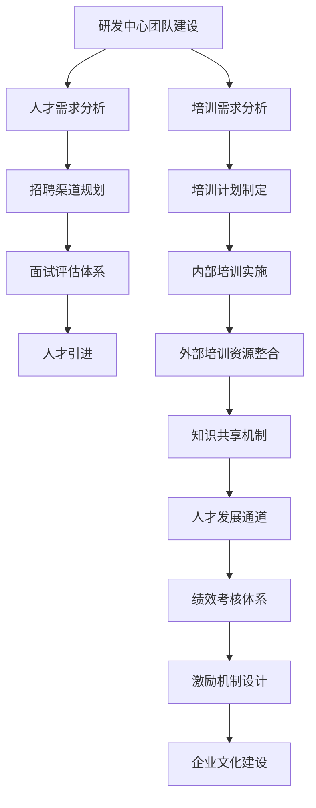

# 研发中心团队的建设和人才培养方案

## 1. 背景介绍

随着科技的快速发展和数字化转型的加速,构建一支高素质的研发团队对于企业的创新发展至关重要。研发中心作为企业技术创新的核心,承担着探索前沿技术、开发创新产品和解决方案的重任。因此,建设一支卓越的研发团队并制定有效的人才培养计划,将直接影响企业的技术实力和创新能力。

本文将探讨研发中心团队建设和人才培养的关键因素,包括团队架构、人才引进、培训发展、激励机制等,旨在为企业提供可行的解决方案,助力打造具有持续创新能力的研发团队。

## 2. 核心概念与联系

### 2.1 研发中心的作用

研发中心是企业技术创新的引擎,其主要职责包括:

1. 技术前瞻:持续关注行业前沿技术动态,洞察技术发展趋势,为企业制定技术战略提供决策依据。
2. 产品研发:根据市场需求和技术发展方向,开发创新产品和解决方案,推动企业产品升级迭代。
3. 技术支持:为企业内部各部门提供技术咨询和支持服务,解决技术难题,提高工作效率。
4. 知识管理:建立技术知识库,促进知识共享和传播,提升企业整体技术水平。

### 2.2 研发团队的构成

高效的研发团队通常由以下几个核心角色组成:

1. 产品经理:负责产品规划、需求管理和产品路线图制定。
2. 架构师:负责系统架构设计、技术选型和架构演进。
3. 研发工程师:负责产品开发、单元测试和代码质量保证。
4. 测试工程师:负责功能测试、性能测试和自动化测试。
5. 运维工程师:负责系统部署、监控和运维自动化。
6. 技术领导:负责技术决策、团队管理和人才培养。

### 2.3 人才培养的重要性

人才是研发中心最宝贵的资源,培养高素质的技术人才对于保持企业的技术竞争力至关重要。通过有效的人才培养计划,企业可以:

1. 提升员工的技术能力和创新意识,增强团队的整体实力。
2. 培养技术领导力,确保技术决策的高质量和前瞻性。
3. 激发员工的主人翁意识,提高工作积极性和归属感。
4. 吸引和留住优秀人才,为企业的可持续发展奠定基础。

## 3. 核心算法原理具体操作步骤

在研发中心团队建设和人才培养过程中,可以采用以下核心算法和具体操作步骤:



### 3.1 人才需求分析

首先需要对研发中心的人才需求进行全面分析,包括:

1. 岗位分析:明确各个岗位的职责和技能要求。
2. 团队规模评估:根据业务发展规划,确定所需的团队规模。
3. 技术栈分析:梳理现有和未来需要的技术栈,识别技术缺口。
4. 人才结构分析:评估现有人才的知识结构和经验水平,制定补充计划。

### 3.2 招聘渠道规划

基于人才需求分析,制定多渠道的招聘策略:

1. 校园招聘:与重点高校建立合作关系,吸纳优秀应届毕业生。
2. 社会招聘:利用招聘网站、猎头公司等渠道,吸引行业经验丰富的人才。
3. 内部培养:通过内部培训和发展机会,培养现有员工的技术能力。
4. 校企合作:与高校开展产学研合作项目,发掘潜力人才。

### 3.3 面试评估体系

建立科学的面试评估体系,全面考察应聘者的技术能力、创新思维和团队合作精神:

1. 笔试:通过编程题、算法题等考核基础理论知识和编码能力。
2. 技术面试:由技术专家针对实际项目场景进行深入面试,评估解决问题的能力。
3. 情景模拟:通过团队协作任务,考察沟通能力和团队合作精神。
4. 背景调查:了解应聘者的工作经历和职业素养,评估是否与企业文化相符。

### 3.4 人才引进

根据面试评估结果,引进符合要求的优秀人才,并制定入职培训计划:

1. 岗前培训:帮助新员工了解企业文化、业务流程和技术架构。
2. 导师制度:为新员工指定经验丰富的导师,提供技术指导和职业发展建议。
3. 试用期考核:在试用期内对新员工进行全面考核,确保其能够胜任工作。
4. 正式入职:通过试用期考核后,正式录用并安排具体工作岗位。

## 4. 数学模型和公式详细讲解举例说明

在研发中心团队建设和人才培养过程中,可以借助数学模型和公式进行量化分析和优化决策。以下是一些常见的数学模型和公式:

### 4.1 马尔可夫决策过程 (Markov Decision Process, MDP)

马尔可夫决策过程是一种强大的数学框架,可用于描述和解决顺序决策问题。在人才培养过程中,可以将员工的职业发展路径建模为一个马尔可夫决策过程,其中状态表示员工的当前技能水平和职位,行动表示培训和晋升决策。通过求解MDP,可以得到最优的培训和晋升策略,以最大化员工的长期职业发展潜力。

MDP的基本要素包括:

- 状态集合 $\mathcal{S}$
- 行动集合 $\mathcal{A}$
- 转移概率 $P(s' \mid s, a)$,表示在状态 $s$ 下采取行动 $a$ 后转移到状态 $s'$ 的概率
- 奖励函数 $R(s, a)$,表示在状态 $s$ 下采取行动 $a$ 所获得的即时奖励

目标是找到一个策略 $\pi: \mathcal{S} \rightarrow \mathcal{A}$,使得期望的累积奖励最大化:

$$
\max_\pi \mathbb{E}\left[\sum_{t=0}^\infty \gamma^t R(s_t, \pi(s_t))\right]
$$

其中 $\gamma \in [0, 1)$ 是折现因子,用于平衡即时奖励和长期奖励的权重。

### 4.2 线性规划 (Linear Programming)

线性规划是一种广泛应用的优化技术,可用于解决资源分配问题。在研发中心团队建设中,可以将人力资源分配建模为线性规划问题,以最小化成本或最大化产出。

假设有 $n$ 个项目,每个项目需要 $m$ 种不同技能的人员。令 $x_{ij}$ 表示分配给第 $i$ 个项目的第 $j$ 种技能人员数量,目标函数可以是:

$$
\begin{aligned}
\min \quad & \sum_{i=1}^n \sum_{j=1}^m c_{ij} x_{ij} \\
\text{s.t.} \quad & \sum_{i=1}^n a_{ij} x_{ij} \geq b_j, \quad j = 1, \ldots, m \\
& x_{ij} \geq 0, \quad i = 1, \ldots, n, \quad j = 1, \ldots, m
\end{aligned}
$$

其中 $c_{ij}$ 表示第 $j$ 种技能人员在第 $i$ 个项目中的成本, $a_{ij}$ 表示第 $i$ 个项目对第 $j$ 种技能的需求量, $b_j$ 表示第 $j$ 种技能的最低需求量。

通过求解线性规划问题,可以得到最优的人员分配方案,从而实现成本最小化或产出最大化。

### 4.3 聚类算法 (Clustering Algorithms)

聚类算法可用于根据员工的技能和经验对其进行分组,从而制定差异化的培训计划。常见的聚类算法包括 K-Means、层次聚类等。

以 K-Means 算法为例,假设有 $n$ 个员工,每个员工用 $m$ 维向量 $\boldsymbol{x}_i \in \mathbb{R}^m$ 表示其技能水平。算法的目标是将员工划分为 $K$ 个簇,使得簇内员工之间的相似度最大,簇间员工之间的相似度最小。

具体算法步骤如下:

1. 随机初始化 $K$ 个簇中心 $\boldsymbol{\mu}_1, \ldots, \boldsymbol{\mu}_K$
2. 对每个员工 $\boldsymbol{x}_i$,计算其与每个簇中心的距离 $d(\boldsymbol{x}_i, \boldsymbol{\mu}_j)$,将其分配到最近的簇中
3. 更新每个簇的中心为该簇内所有员工的均值
4. 重复步骤 2 和 3,直至簇分配不再发生变化

通过聚类算法,可以将员工划分为不同的技能组,从而制定针对性的培训计划,提高培训效率和效果。

## 5. 项目实践: 代码实例和详细解释说明

为了更好地理解和应用上述算法和模型,我们将通过一个具体的项目实践来进行说明。假设我们需要为一家软件公司的研发中心规划人员配置和培训计划。

### 5.1 数据准备

首先,我们需要收集相关数据,包括:

- 项目列表及其对各种技能的需求量
- 员工列表及其各项技能的熟练程度
- 各种技能的培训成本
- 项目的优先级和预期收益

为了简化示例,我们假设有 3 个项目和 5 种技能,共有 20 名员工。相关数据如下:

```python
# 项目列表及技能需求量
projects = [
    {'name': 'Project A', 'requirements': {'Python': 5, 'Java': 3, 'SQL': 2, 'DevOps': 1, 'UI/UX': 1}},
    {'name': 'Project B', 'requirements': {'Python': 2, 'Java': 4, 'SQL': 3, 'DevOps': 2, 'UI/UX': 1}},
    {'name': 'Project C', 'requirements': {'Python': 3, 'Java': 1, 'SQL': 2, 'DevOps': 3, 'UI/UX': 2}}
]

# 员工列表及技能熟练程度
employees = [
    {'name': 'Alice', 'skills': {'Python': 4, 'Java': 2, 'SQL': 3, 'DevOps': 1, 'UI/UX': 2}},
    {'name': 'Bob', 'skills': {'Python': 3, 'Java': 4, 'SQL': 2, 'DevOps': 3, 'UI/UX': 1}},
    # ... 其他员工数据
]

# 培训成本
training_costs = {'Python': 1000, 'Java': 1200, 'SQL': 800, 'DevOps': 1500, 'UI/UX': 1000}

# 项目优先级和预期收益
project_priorities = [('Project A', 5), ('Project B', 3), ('Project C', 4)]
expected_revenues = {'Project A': 100000, 'Project B': 80000, 'Project C': 120000}
```

### 5.2 人员分配优化

我们可以将人员分配问题建模为线性规划问题,以最小化培训成本。假设每个员工最多可以分配到一个项目,我们的目标是:

$$
\begin{aligned}
\min \quad & \sum_{i=1}^{20} \sum_{j=1}^5 c_j x_{ij} \\
\text{s.t.} \quad & \sum_{i=1}^{20} a_{ij} x_{ij} \geq r