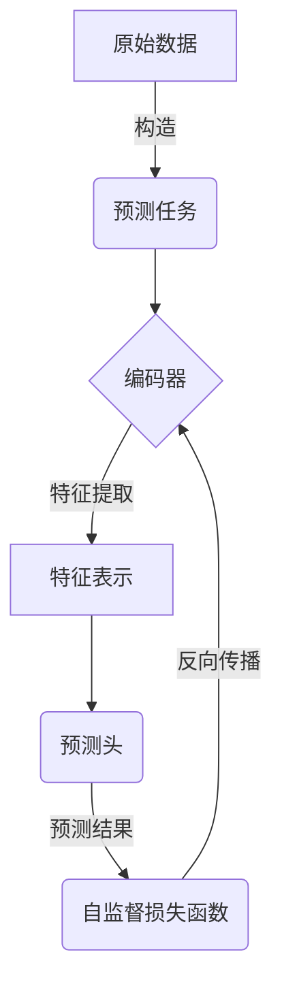

# 自监督学习 原理与代码实例讲解

## 1.背景介绍

在过去几年中,自监督学习(Self-Supervised Learning)作为一种无需人工标注数据的机器学习范式,在计算机视觉、自然语言处理等领域获得了广泛关注和应用。传统的监督学习方法需要大量高质量的人工标注数据,这是一个费时费力的过程。而自监督学习可以利用原始未标注的数据,通过设计合理的预测任务,使模型从数据中自动学习有用的表示,从而避免了人工标注的过程。

### 1.1 数据标注的挑战

大数据时代,训练高质量的机器学习模型需要大规模的标注数据。但是,人工标注数据存在以下几个挑战:

1. **标注成本高昂**: 人工标注需要大量的人力和时间,尤其是对于复杂任务,标注成本可能是天文数字。
2. **标注质量参差不齐**: 不同的人对同一个样本可能会给出不同的标注结果,人为主观因素影响标注质量。
3. **数据分布偏移**: 人工标注的数据可能无法很好地覆盖实际应用场景的数据分布,导致模型在实际应用中表现不佳。

### 1.2 自监督学习的优势

相比之下,自监督学习具有以下优势:

1. **无需人工标注**: 自监督学习可以直接利用原始未标注的数据进行训练,避免了人工标注的过程。
2. **数据可获取性强**: 未标注的数据通常可以从互联网、传感器等各种来源获取,数量巨大。
3. **泛化性能好**: 自监督学习可以从数据中学习通用的表示,有助于提高模型在下游任务上的泛化能力。

## 2.核心概念与联系

### 2.1 自监督学习的核心思想

自监督学习的核心思想是**从原始数据中构建出一个人工的监督信号**,使模型可以通过预测这个监督信号来学习数据的内在特征表示。具体来说,自监督学习包含以下三个关键要素:

1. **预测任务(Pretext Task)**: 设计一个可以从原始数据中构造出监督信号的任务,例如图像补全、句子连续性预测等。
2. **编码器(Encoder)**: 一个神经网络模型,用于从原始数据中提取特征表示,并基于这些特征表示完成预测任务。
3. **自监督损失函数(Self-Supervised Loss)**: 衡量模型在预测任务上的误差,用于优化编码器参数。

在自监督学习的训练过程中,编码器会努力学习能够最小化自监督损失函数的特征表示,从而获得对原始数据的深层次理解。训练完成后,可以将编码器作为预训练模型,应用于下游的监督学习任务。

### 2.2 自监督学习与监督学习的联系

自监督学习与传统的监督学习有着密切的联系:

1. **预训练 + 微调**: 自监督学习常被用于预训练阶段,学习通用的特征表示。之后,可以在有标注数据的下游任务上,对预训练模型进行微调(Fine-tuning),获得针对特定任务的模型。
2. **数据增广**: 自监督学习中设计的预测任务,实际上可以看作是一种数据增广的形式。通过构造不同的预测任务,可以增加模型所"看"到的数据样本,提高模型的泛化能力。
3. **正则化效果**: 自监督学习的预测任务可以起到一定的正则化作用,防止模型过拟合。

## 3.核心算法原理具体操作步骤

自监督学习的核心算法原理可以概括为以下几个步骤:

### 3.1 构建预测任务

第一步是设计一个合理的预测任务,使模型可以从原始数据中学习有用的表示。不同的数据模态(如图像、文本、视频等)需要设计不同的预测任务。一个好的预测任务应该满足以下条件:

1. **可从原始数据构造**: 预测任务的监督信号应该可以直接从原始数据中获取,而不需要人工标注。
2. **足够难度**: 预测任务不能太简单,否则模型无法学习到有意义的表示。
3. **与下游任务相关**: 预测任务应该能够促使模型学习到与下游任务相关的特征表示。

常见的预测任务包括:

- **图像领域**: 图像补全(Inpainting)、图像旋转预测、相对位置预测等。
- **自然语言处理**: 句子连续性预测(Next Sentence Prediction)、掩码语言模型(Masked Language Model)、替换检测(Replacement Token Detection)等。
- **视频领域**: 帧排序(Frame Order Prediction)、帧插值(Frame Interpolation)等。

### 3.2 设计编码器模型

第二步是设计一个编码器模型,用于从原始数据中提取特征表示,并基于这些特征表示完成预测任务。编码器通常是一个深度神经网络,例如卷积神经网络(CNN)、transformer等。

编码器的输入是原始数据,输出是该数据的特征表示。在自监督学习中,我们希望编码器能够学习到能够很好地完成预测任务的特征表示。

### 3.3 定义自监督损失函数

第三步是定义自监督损失函数,用于衡量模型在预测任务上的误差。自监督损失函数的选择取决于具体的预测任务,常见的损失函数包括交叉熵损失(Cross Entropy Loss)、均方误差(Mean Squared Error)等。

### 3.4 训练编码器模型

第四步是使用自监督损失函数训练编码器模型。训练过程中,编码器会不断调整其参数,努力学习能够最小化自监督损失函数的特征表示。

常见的训练策略包括:

1. **对比学习(Contrastive Learning)**: 通过最大化正样本与负样本的特征表示差异,促使编码器学习到更加discriminative的特征表示。
2. **自监督对抗训练(Self-Supervised Adversarial Training)**: 将预测任务建模为生成对抗网络(GAN),使编码器学习到更加robust的特征表示。
3. **自监督元学习(Self-Supervised Meta-Learning)**: 将预测任务建模为元学习问题,提高编码器在新任务上的快速适应能力。

### 3.5 迁移学习

训练完成后,我们可以将编码器作为预训练模型,应用于下游的监督学习任务。常见的做法是:

1. **特征提取**: 使用预训练编码器提取下游任务数据的特征表示,然后训练一个新的分类器/回归器等模型。
2. **微调(Fine-tuning)**: 在预训练编码器的基础上,添加一个新的输出层,针对下游任务进行端到端的微调训练。

通过这种迁移学习的方式,可以充分利用自监督学习从大量未标注数据中学习到的通用特征表示,提高下游任务的模型性能。

## 4.数学模型和公式详细讲解举例说明

在自监督学习中,常常涉及到一些数学模型和公式,下面我们将详细讲解其中的一些核心内容。

### 4.1 对比损失函数

对比损失函数(Contrastive Loss)是自监督学习中一种广泛使用的损失函数,旨在学习discriminative的特征表示。其基本思想是,对于一个锚点样本(Anchor),我们希望其与正样本(Positive Sample)的特征表示接近,与负样本(Negative Sample)的特征表示远离。

常见的对比损失函数包括NT-Xent Loss和InfoNCE Loss等。以NT-Xent Loss为例,其数学表达式如下:

$$\mathcal{L}_{i}=-\log \frac{\exp \left(\operatorname{sim}\left(\mathbf{z}_{i}, \mathbf{z}_{i^{+}}\right) / \tau\right)}{\sum_{j=1}^{2 N} \mathbb{1}_{[j \neq i]} \exp \left(\operatorname{sim}\left(\mathbf{z}_{i}, \mathbf{z}_{j}\right) / \tau\right)}$$

其中:

- $\mathbf{z}_{i}$和$\mathbf{z}_{i^{+}}$分别表示锚点样本和正样本的特征表示
- $\operatorname{sim}(\mathbf{u}, \mathbf{v})=\mathbf{u}^{\top} \mathbf{v} /\|\mathbf{u}\|\|\mathbf{v}\|$表示两个向量的余弦相似度
- $\tau$是一个温度超参数,用于控制相似度的尺度
- 分母项对所有负样本的相似度求和

对比损失函数的优化目标是最小化锚点样本与正样本的特征距离,同时最大化锚点样本与负样本的特征距离,从而学习到discriminative的特征表示。

### 4.2 掩码语言模型

掩码语言模型(Masked Language Model, MLM)是自然语言处理领域中一种常见的自监督预测任务。其基本思想是,在输入序列中随机掩码部分词元(Token),然后让模型基于上下文预测被掩码的词元。

具体来说,对于一个长度为$T$的输入序列$\mathbf{x}=\left(x_{1}, x_{2}, \ldots, x_{T}\right)$,我们随机采样一个掩码位置集合$\mathcal{M}=\left\{i_{1}, i_{2}, \ldots, i_{k}\right\}$,其中$k$是掩码的数量。然后,我们将这些位置的词元替换为特殊的掩码标记[MASK],得到掩码后的序列$\mathbf{\tilde{x}}$。

模型的目标是最大化被掩码词元的条件概率:

$$\mathcal{L}_{\mathrm{MLM}}=-\sum_{i \in \mathcal{M}} \log P\left(x_{i} | \mathbf{\tilde{x}}\right)$$

其中,条件概率$P\left(x_{i} | \mathbf{\tilde{x}}\right)$可以由模型(如Transformer等)计算得到。

通过优化掩码语言模型的目标函数,模型可以学习到对上下文语义的深层次理解,从而获得强大的语言表示能力。

### 4.3 对比学习中的数据增强

在对比学习中,数据增强(Data Augmentation)是一种常见的技术,旨在为同一个样本构造不同的视图(View),从而增加训练样本的多样性,提高模型的泛化能力。

常见的数据增强操作包括:

- **图像领域**: 随机裁剪(Random Cropping)、随机水平翻转(Random Horizontal Flipping)、颜色抖动(Color Jittering)、高斯噪声(Gaussian Noise)等。
- **文本领域**: 同义词替换(Synonym Replacement)、词元删除(Token Deletion)、词元掩码(Token Masking)等。

对于一个样本$\mathbf{x}$,我们可以通过不同的数据增强操作得到两个增强视图$\tilde{\mathbf{x}}_{1}$和$\tilde{\mathbf{x}}_{2}$。然后,我们希望这两个视图的特征表示$\mathbf{z}_{1}$和$\mathbf{z}_{2}$尽可能接近,即最大化它们的相似度:

$$\mathcal{L}_{\text {contrast }}=-\log \frac{\exp \left(\operatorname{sim}\left(\mathbf{z}_{1}, \mathbf{z}_{2}\right) / \tau\right)}{\sum_{j=1}^{2 N} \mathbb{1}_{[j \neq i]} \exp \left(\operatorname{sim}\left(\mathbf{z}_{1}, \mathbf{z}_{j}\right) / \tau\right)}$$

其中,$\operatorname{sim}(\mathbf{u}, \mathbf{v})$表示两个向量的相似度函数(如余弦相似度),分母项对所有负样本的相似度求和。

通过优化这个对比损失函数,模型可以学习到对数据的本质特征的鲁棒表示,提高模型的泛化能力。

## 5.项目实践:代码实例和详细解释说明

为了更好地理解自监督学习的原理和实现,我们将通过一个具体的