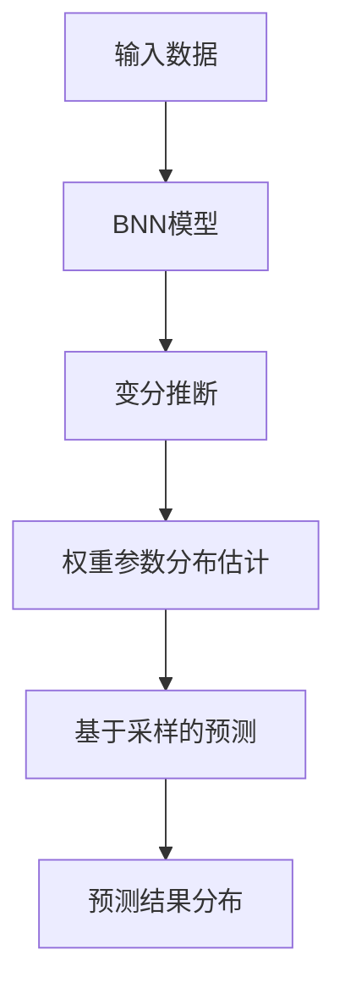

# 贝叶斯神经网络:概率与决策

## 1.背景介绍

在当今数据驱动的时代,机器学习和人工智能已经渗透到各个领域,成为推动科技创新和商业发展的核心动力。作为机器学习的一个重要分支,贝叶斯神经网络(Bayesian Neural Networks,BNNs)近年来受到了广泛关注。它将贝叶斯概率理论与神经网络模型相结合,为我们提供了一种全新的视角来理解和构建智能系统。

### 1.1 神经网络的局限性

传统的神经网络模型通常采用确定性的参数估计方法,例如最大似然估计或最小二乘法。这种方法虽然简单高效,但存在一些固有的局限性。首先,它假设了模型参数的真实值是固定的,而忽视了参数估计过程中的不确定性。其次,神经网络往往容易过拟合训练数据,从而导致在新的测试数据上表现不佳。此外,确定性模型难以量化预测的置信度,这在一些关键决策领域(如医疗诊断、自动驾驶等)是不可接受的。

### 1.2 贝叶斯方法的优势

相比之下,贝叶斯方法提供了一种更加合理和健壮的解决方案。它将模型参数视为随机变量,并根据观测数据和先验知识,推断出参数的后验概率分布。这种方法自然地融入了不确定性,并且通过贝叶斯公式,能够合理地平衡新旧证据。此外,贝叶斯方法还提供了一种principled的方式来解决过拟合问题,即通过对模型复杂度进行正则化。

### 1.3 贝叶斯神经网络的兴起

将贝叶斯理论与神经网络相结合,产生了贝叶斯神经网络(BNNs)这一新兴的机器学习模型。BNNs不仅继承了神经网络在处理复杂数据和建模任务方面的强大能力,同时也具备了贝叶斯方法所带来的不确定性量化、过拟合控制等优势。近年来,随着计算能力的提高和采样技术的进步,BNNs在理论和应用层面都取得了长足的发展,在计算机视觉、自然语言处理、强化学习等多个领域展现出巨大的潜力。

## 2.核心概念与联系

### 2.1 贝叶斯推断

贝叶斯推断是BNNs的核心所在,它建立在贝叶斯定理的基础之上。根据贝叶斯定理,我们可以将模型参数 $\theta$ 的后验概率 $p(\theta|D)$ 表示为:

$$p(\theta|D) = \frac{p(D|\theta)p(\theta)}{p(D)}$$

其中,

- $p(D|\theta)$ 是似然函数,描述了在给定参数 $\theta$ 的情况下,观测到数据 $D$ 的概率;
- $p(\theta)$ 是参数 $\theta$ 的先验分布,它反映了我们对参数的先验知识或假设;
- $p(D)$ 是证据(或边缘似然),是一个归一化常数,确保后验概率的总和为1。

通过对后验分布 $p(\theta|D)$ 进行推断和采样,我们可以获得参数的概率分布,而不是单一的点估计值。这种方法自然地融入了不确定性,并且能够更好地捕捉数据的内在变化和噪声。

### 2.2 变分推断

尽管贝叶斯推断提供了一种理论上优雅的解决方案,但是在实践中,由于后验分布 $p(\theta|D)$ 的复杂性,通常很难直接对其进行精确推断。为了解决这个问题,变分推断(Variational Inference)被广泛应用于BNNs中。

变分推断的核心思想是,使用一个更简单的概率分布 $q(\theta)$ (称为变分分布)来近似复杂的后验分布 $p(\theta|D)$。我们通过最小化两个分布之间的KL散度(Kullback-Leibler Divergence)来寻找最优的变分分布:

$$\min_{q(\theta)} \text{KL}(q(\theta)||p(\theta|D))$$

变分推断通常采用基于梯度的优化算法来迭代更新变分分布的参数,从而逼近真实的后验分布。虽然变分推断是一种近似方法,但它在计算效率和可扩展性方面具有显著优势,因此被广泛应用于大规模的BNNs模型中。

### 2.3 贝叶斯神经网络架构

在贝叶斯神经网络中,我们将神经网络的权重参数 $W$ 视为随机变量,并对其进行概率建模。一种常见的做法是假设权重参数服从高斯分布,即 $W \sim \mathcal{N}(\mu, \sigma^2)$,其中 $\mu$ 和 $\sigma^2$ 分别是均值和方差。在训练过程中,我们不仅需要学习均值参数 $\mu$,还需要推断出方差参数 $\sigma^2$ 的后验分布。

为了实现这一目标,BNNs通常采用变分推断技术,使用一个简单的高斯分布 $q(W|\phi)$ 来近似复杂的后验分布 $p(W|D)$,其中 $\phi$ 是变分分布的参数。通过最小化 KL 散度,我们可以找到最优的变分分布,从而获得权重参数的概率分布估计。

在预测阶段,BNNs可以通过对权重参数进行采样,然后在采样的权重下进行前向传播,从而获得预测结果的分布。这种基于采样的方法不仅可以提供预测的均值,还可以量化预测的不确定性,为我们提供了更加全面和可靠的决策支持。

## 3.核心算法原理具体操作步骤

实现贝叶斯神经网络涉及到多个核心步骤,包括定义模型、变分推断和基于采样的预测等。下面我们将详细介绍这些步骤的具体操作流程。

### 3.1 定义模型

第一步是定义贝叶斯神经网络模型的结构和参数分布。假设我们有一个简单的全连接神经网络,其中权重矩阵 $W$ 服从高斯分布,即 $W \sim \mathcal{N}(\mu, \sigma^2)$。我们需要为均值 $\mu$ 和方差 $\sigma^2$ 设置合理的初始值,例如从标准高斯分布中采样初始化均值,并设置一个较小的常数值作为初始方差。

### 3.2 变分推断

接下来,我们需要使用变分推断技术来近似权重参数的后验分布。常见的做法是使用均值场(Mean-Field)变分推断,假设权重参数之间是相互独立的,并使用一个对角高斯分布 $q(W|\phi)$ 来近似后验分布,其中 $\phi = \{\mu_q, \sigma_q\}$ 是变分分布的参数。

我们可以通过最小化 KL 散度来优化变分分布的参数:

$$\min_{\phi} \text{KL}(q(W|\phi)||p(W|D)) = \mathbb{E}_{q(W|\phi)}[\log q(W|\phi) - \log p(W, D)]$$

其中 $p(W, D)$ 是模型的证据下界(Evidence Lower Bound, ELBO),它是似然函数 $p(D|W)$ 和权重先验 $p(W)$ 的期望,减去 KL 散度项。

为了优化 ELBO,我们可以采用基于梯度的优化算法,如随机梯度下降(SGD)或自适应优化器(如 Adam)。在每个优化步骤中,我们需要计算 ELBO 的梯度,并更新变分分布参数 $\phi$。这个过程通常需要进行多次迭代,直到收敛为止。

### 3.3 基于采样的预测

在训练完成后,我们可以使用基于采样的方法进行预测。具体操作步骤如下:

1. 从变分分布 $q(W|\phi)$ 中采样一组权重参数 $W^{(1)}, W^{(2)}, \ldots, W^{(M)}$,其中 $M$ 是采样次数。
2. 对于每个采样的权重参数 $W^{(i)}$,通过前向传播计算输出 $\hat{y}^{(i)}$。
3. 将所有采样输出 $\{\hat{y}^{(1)}, \hat{y}^{(2)}, \ldots, \hat{y}^{(M)}\}$ 组合起来,计算预测结果的均值和方差等统计量。

通过这种基于采样的方法,我们不仅可以获得预测的均值,还可以量化预测的不确定性。这为我们提供了更加全面和可靠的决策支持,尤其在一些关键领域(如医疗诊断、自动驾驶等)具有重要意义。

## 4.数学模型和公式详细讲解举例说明

在前面的章节中,我们已经介绍了贝叶斯神经网络的基本概念和核心算法流程。现在,让我们深入探讨一些关键的数学模型和公式,并通过具体的例子来加深理解。

### 4.1 高斯过程

高斯过程(Gaussian Process, GP)是一种非参数的贝叶斯模型,它可以被视为无限维高斯分布的推广。在贝叶斯神经网络中,GP通常被用作权重参数的先验分布。

假设我们有一个输入 $x$ 和对应的输出 $y$,GP定义了一个概率分布 $p(y|x)$,使得对于任意有限的输入集合 $X = \{x_1, x_2, \ldots, x_n\}$,对应的输出 $\mathbf{y} = \{y_1, y_2, \ldots, y_n\}$ 服从多元高斯分布:

$$\mathbf{y} \sim \mathcal{N}(\mathbf{m}(X), K(X, X))$$

其中,

- $\mathbf{m}(X)$ 是均值函数,描述了输出的期望值;
- $K(X, X)$ 是协方差函数(或核函数),它定义了输出之间的相关性。

通过选择不同的核函数,我们可以编码不同的先验假设,例如平滑性、周期性等。一种常见的核函数是径向基函数(Radial Basis Function, RBF)核:

$$K(x, x') = \sigma^2 \exp\left(-\frac{1}{2\ell^2}||x - x'||^2\right)$$

其中 $\sigma^2$ 和 $\ell$ 分别控制了输出的方差和相关性范围。

在贝叶斯神经网络中,我们可以将神经网络的权重参数 $W$ 视为一个高斯过程的样本,即 $W \sim \mathcal{GP}(m, K)$。这种建模方式不仅提供了一种灵活的先验分布,还能自然地捕捉权重参数之间的相关性。

### 4.2 变分推断的Evidence Lower Bound (ELBO)

在变分推断过程中,我们需要优化 ELBO 目标函数,以最小化变分分布 $q(W|\phi)$ 与真实后验分布 $p(W|D)$ 之间的 KL 散度。ELBO 可以表示为:

$$\begin{aligned}
\mathcal{L}(\phi) &= \mathbb{E}_{q(W|\phi)}[\log p(D|W)] - \text{KL}(q(W|\phi)||p(W)) \\
&= \int q(W|\phi) \log \frac{p(D|W)p(W)}{q(W|\phi)} dW
\end{aligned}$$

其中,

- 第一项 $\mathbb{E}_{q(W|\phi)}[\log p(D|W)]$ 是似然函数的期望,它衡量了在当前变分分布下,模型对观测数据的拟合程度;
- 第二项 $\text{KL}(q(W|\phi)||p(W))$ 是 KL 散度项,它惩罚了变分分布与权重先验分布之间的差异,起到了正则化的作用。

通过最大化 ELBO,我们可以找到一个最优的变分分布 $q^*(W|\phi^*)$,使其尽可能逼近真实的后验分布 